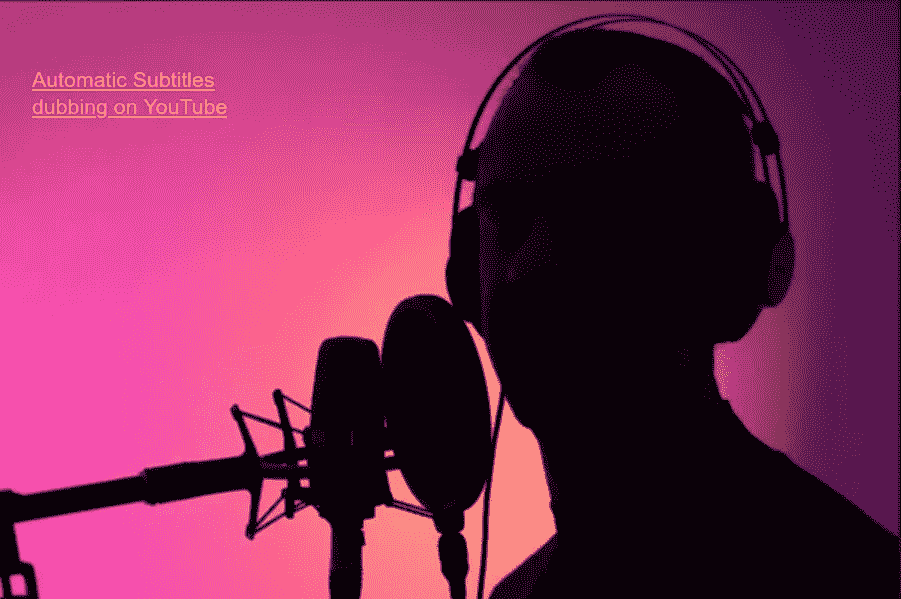
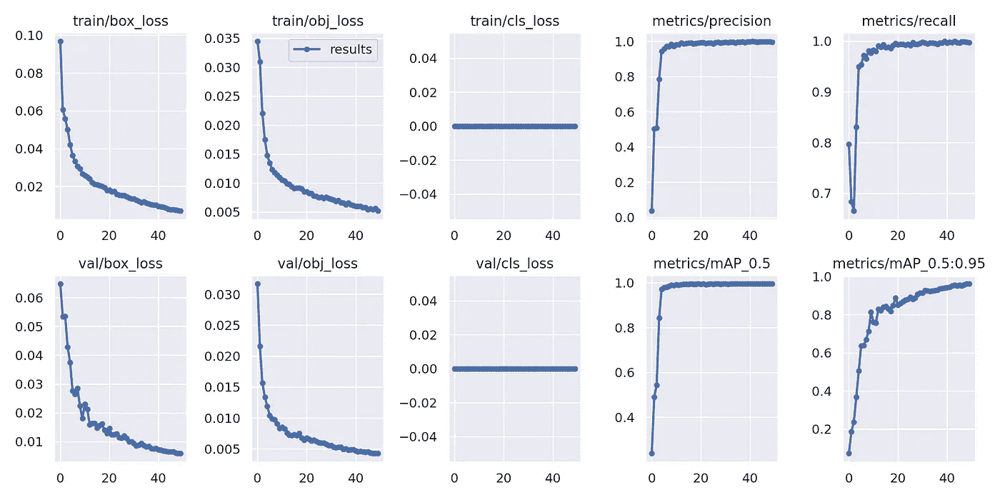
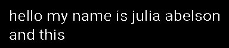
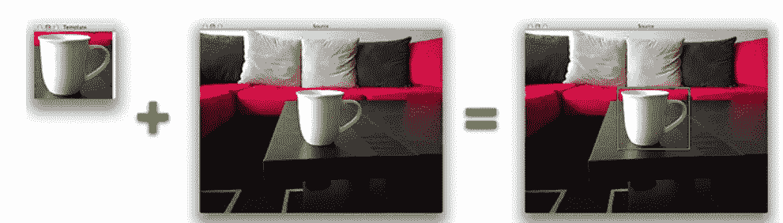
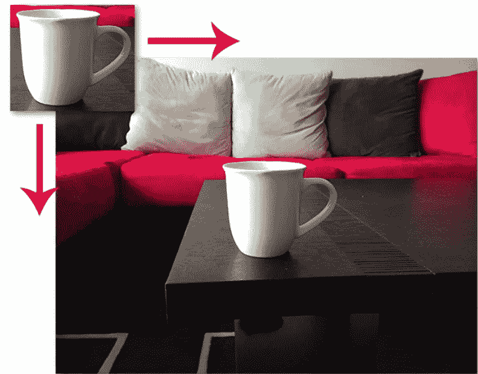
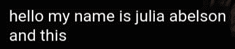
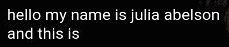
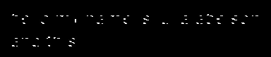
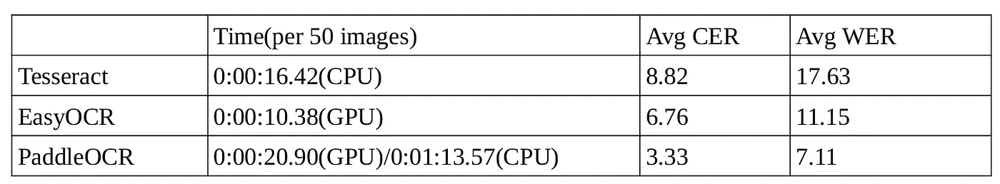

# 使用计算机视觉在 YouTube 上自动配音字幕

> 原文：<https://betterprogramming.pub/automatic-subtitles-dubbing-on-youtube-using-computer-vision-35ad776ffe18>

## 帮助您访问更多内容的循序渐进的 Python 指南



[图片来自 shutterstock](https://www.shutterstock.com/image-photo/voiceover-artist-actor-recording-voice-overs-2061833759)

大约半年前，我看到了一个[扩展](https://www.youtube.com/watch?v=apCfQt_f_Jo)，标题和我的文章差不多。我对这个想法很好奇，想做一些类似的事情，除了使用计算机视觉，这正是我得到的结果:

# 项目的总体架构

该项目基于三个服务，其中第一个服务负责检测字幕并将带有文本的图像转换为机器可读的文本格式，第二个服务用于翻译文本(目前仅从英语翻译为俄语)，最后一个服务负责可视化和文本配音。使用 [ZeroMQ 库](https://github.com/zeromq/pyzmq)实现服务之间的通信。

## 数据收集

几乎任何 ML 任务的解决方案都是从数据收集开始的——这次也不例外，所以有必要收集一个数据集，其中包括带有字幕的 YouTube 视频的截图，并突出显示字幕本身的边界框。以下是数据集的基本要求:

1)字幕必须使用不同的语言。

2)带有视频剪辑的图片应该具有不同的大小，这意味着视频剪辑可以是全屏的或者是屏幕的一部分。

3)字幕必须在屏幕的不同区域。

4)对字幕本身的要求:

*   可以是不同的尺寸
*   字体类型:正常和按比例无衬线
*   字体颜色:白色
*   背景颜色:黑色
*   背景的透明度:75%
*   窗口透明度:0

原始数据集可以在 [Kaggle](https://www.kaggle.com/datasets/wadzim/youtube-subtitles) 上找到。

## 字幕检测

在收集了数据集之后，需要训练模型来找到字幕，以便实时检测它们。我选了 [yolov5](https://github.com/ultralytics/yolov5) 。在对预训练模型进行 50 次训练后，我们得到了一些令人印象深刻的指标:



这就是实时检测的工作原理:

## 光学字符识别用图像的准备

对于大多数 OCR 库，我们将在下一节中介绍，最好是传递灰度图像，这就是为什么我做的第一件事是这样的:

```
kernel = cv2.getStructuringElement(cv2.MORPH_RECT, (1, 1))
gray = cv2.cvtColor(image, cv2.COLOR_BGR2GRAY)
_, thresh_img = cv2.threshold(gray, 200, 255,
                          cv2.THRESH_BINARY)
transformation_image = cv2.morphologyEx(thresh_img, cv2.MORPH_OPEN, 
                                        kernel, iterations=1)
```

它以某种形式出现:



当图像准备好时，人们可能会认为可以将其发送到 OCR 库，但事实并非如此。问题是 yolo 每秒发出大约 10 帧，因此我们会得到许多描绘相同文本的图像，但为什么我们需要多次翻译和配音相同的文本呢？

在 OpenCV 中，有一个很奇妙的函数叫做`matchTemplate()`。这个函数可以被看作是对象检测的一种非常简单的形式。使用模板匹配，我们可以使用包含我们想要检测的对象的“模板”来检测输入图像中的对象:



为了在原始图像中找到模板，我们在原始图像上从左到右和从上到下移动模板:



该函数返回两幅图像彼此相似程度的概率(从 0 到 1 ),作为其参数之一。使用这个数字，我们可以假设如果它大于 0.75，那么两个图像具有相同的文本。你可以在这里阅读关于这个功能[的更多信息。](https://pyimagesearch.com/2021/03/22/opencv-template-matching-cv2-matchtemplate/)

第二个问题是，下一帧中的文本被添加到前一帧中 1-2 个单词，即:



如你所见，第一张图片的文字与第二张图片的文字只有一个“是”我认为一次取出一个单词并把这一个单词传递给下一个步骤是不可取的，所以我建议以某种方式确定该行结束，并只把该行结束的图片传递给下一个步骤。我们将如何确定这一点将在下面进一步描述。

`[bitwise_and()](https://pyimagesearch.com/2021/01/19/opencv-bitwise-and-or-xor-and-not/)` [函数](https://pyimagesearch.com/2021/01/19/opencv-bitwise-and-or-xor-and-not/)将帮助我们解决这个问题。这种按位运算合并两个图像，以便在输出图像中只保留两个图像的相同部分。在理想情况下，如果我们将这个函数应用于上面的两幅图像，我们将得到如下结果:


但是我们实际得到的是:



事实是，检测并不总是以相同的方式工作，即，经常发生的情况是，具有相同文本但在不同帧上的图像在宽度和/或高度方面会有 2-3 个像素的差异。在这种情况下，您可以找到每个字母的边界框，并在这些坐标处裁剪图像，这样我们就可以移除文本周围的黑色背景。

结果，我们会得到一个类似于理想情况的图像。剩下的就很简单了:我们将图像和第一个图像(最后没有“是”这个词)一起传递给`matchTemplate()`函数，做和上面几段描述的一样的事情。就是这样。图像已准备好进行文本识别:)

## 光学字符识别

在我看来，在一次成功的检测之后，我想在 OCR 方面取得同样的成功，但却是一团糟。作为文本识别的库，我查了以下:[宇宙魔方](https://github.com/madmaze/pytesseract)、 [EasyOCR](https://github.com/JaidedAI/EasyOCR) 和 [PaddleOCR](https://github.com/PaddlePaddle/PaddleOCR) 。现在我们必须从建议中选择一个。我决定根据三个标准来研究和检查每个库对我的数据的处理情况:CER、WER 和算法运行时间。你可以在这里阅读前两个指标。我从数据集中提取了 50 张图片，并将它们放在一个单独的 [JSON 文件](https://github.com/wb-08/SubVision/blob/main/additional_data/check.json)中。我把数据经过每个解的推断，得到了以下结果:



老实说，我认为结果会更好，因为我已经准备了一个非常好的灰度图像:最小的背景噪声，直线文本，没有旋转或扭曲。

现在我们必须决定使用哪个库。使用 PaddleOCR 似乎几乎是显而易见的，但问题是我只有 2Gb 的显存，其中~1.5Gb 是检测模型消耗的。在 CPU 上，这种解决方案运行的时间足够长，对于实时来说，它不是很合适。同样的情况也发生在 EasyOCR 上，只不过在 CPU 上，我无法启动它，但是当我有一个像样的 GPU 时，我会把它记在心里:)只剩下宇宙魔方了，那就是我要用的。

## 文字处理和翻译

Tesseract 经常会拼错一个单词中的 1-2 个字母，之后，这个单词可能会被错误地翻译。所以我决定使用 [pyenchant](https://pypi.org/project/pyenchant/) 来检查单词的拼写，如果单词拼写错误，库将建议一个与当前单词相似的单词，并将结果文本传递给下一步——翻译。

翻译部分很简单——[Google 翻译 API](https://github.com/ssut/py-googletrans) 。翻译在某些情况下不太正确，但很快，我没有注意到对请求数量的任何限制。

## 配音和文本可视化

为了配音，我用了不那么复杂的 [pyttsx3](https://github.com/nateshmbhat/pyttsx3) 。俄语听起来没那么好，但随着时间的推移你会习惯的。文本可视化是用 [PySimpleGUI](https://github.com/PySimpleGUI/PySimpleGUI) 完成的。

# 结论

该项目不太可能被人们用来解决问题，至少在目前的实施中，因为仍然存在问题。一个这样的问题是速度(落后于现实五秒钟)，但我有改进这个项目的想法:)

源代码可以在 [GitHub](https://github.com/wb-08/SubVision) 上找到。

祝你今天开心！玩的开心！