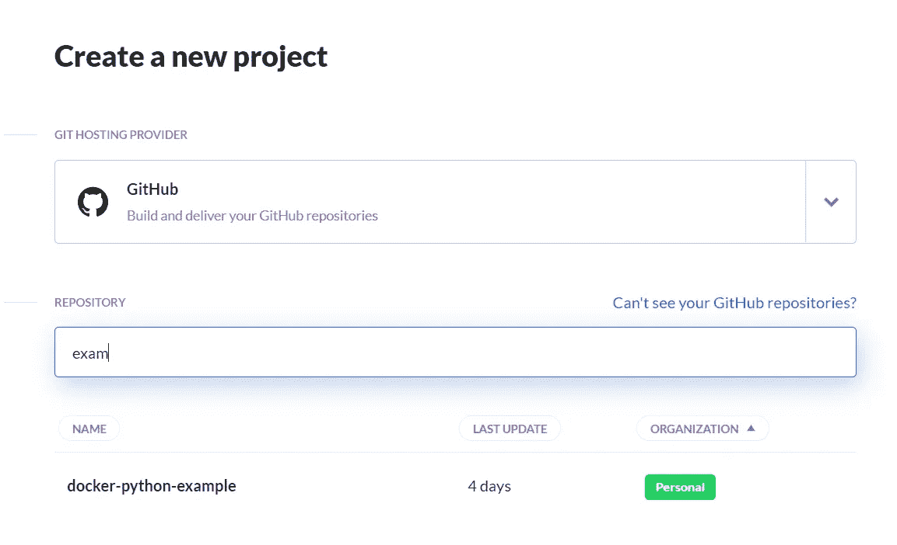
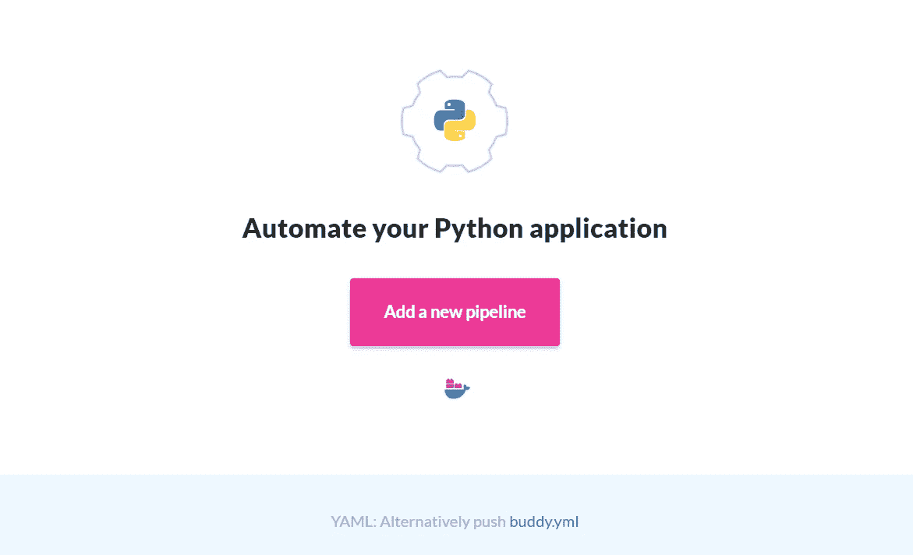
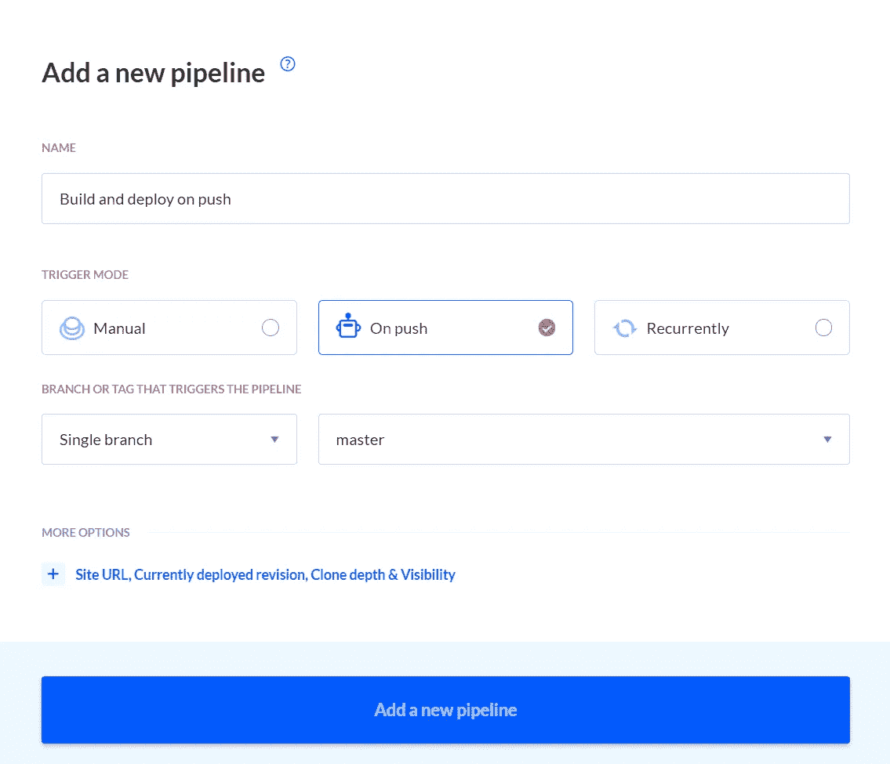
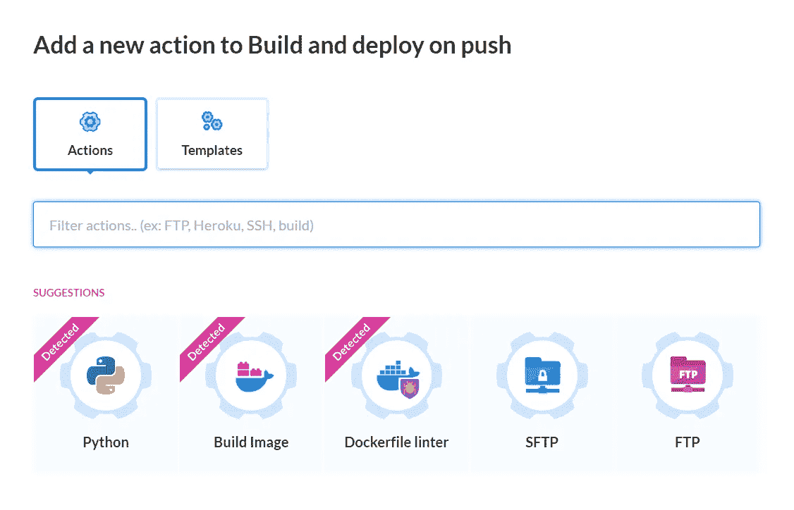
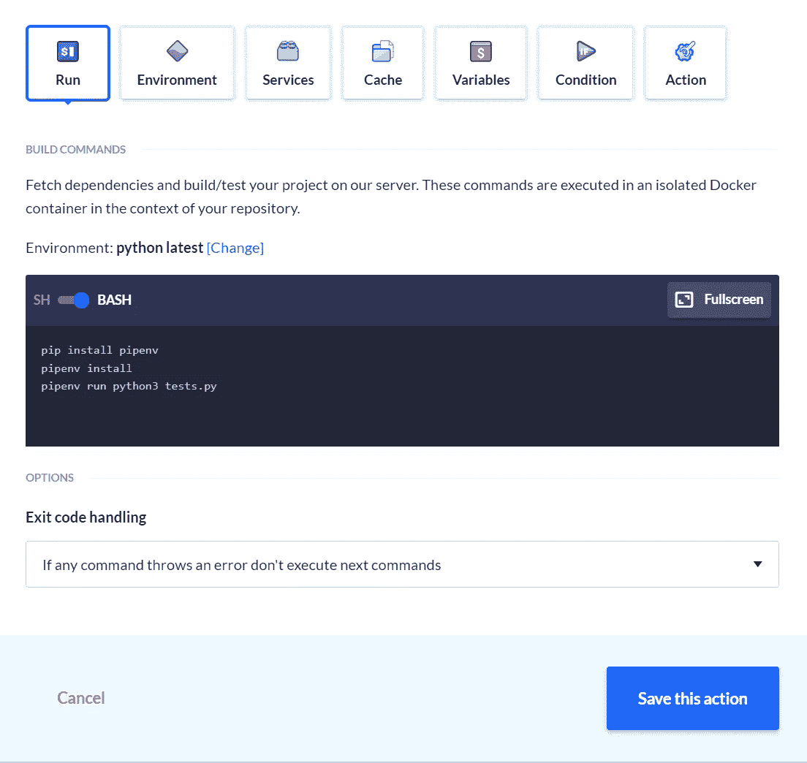
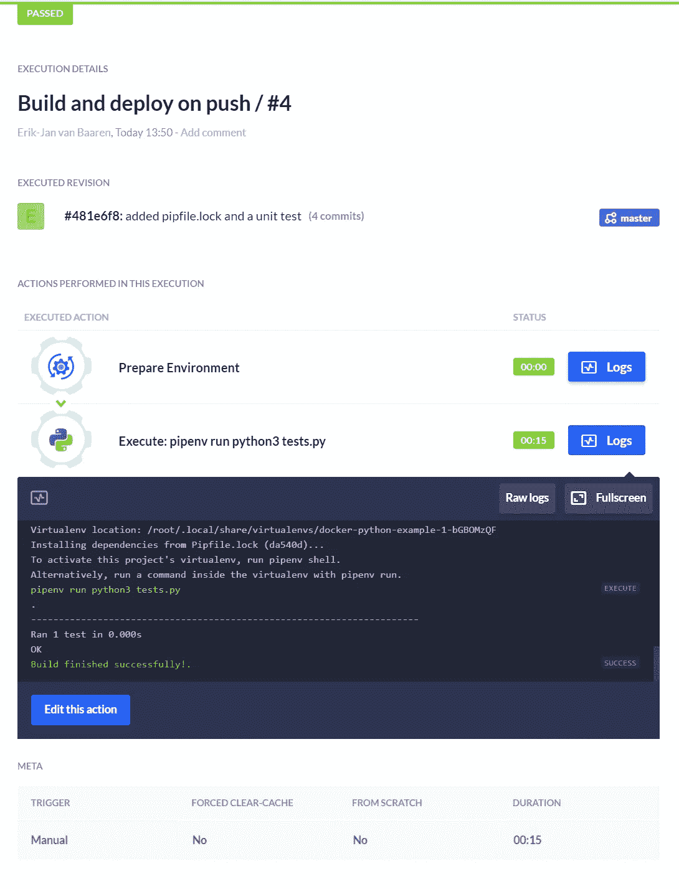
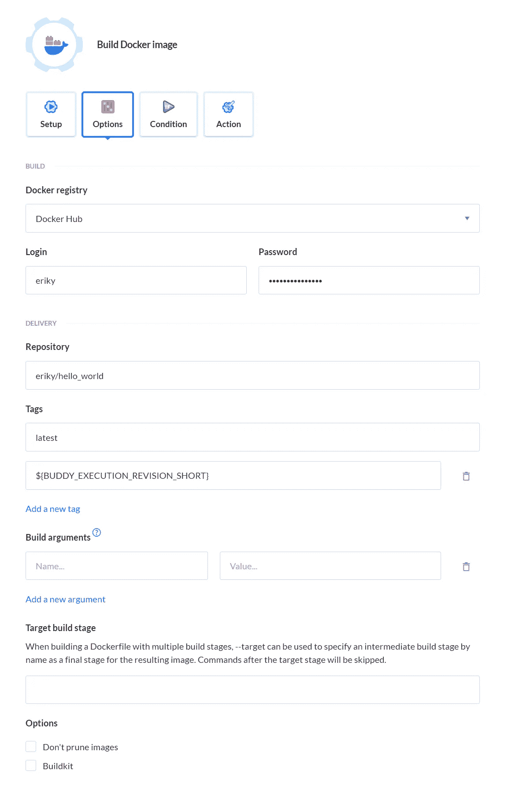
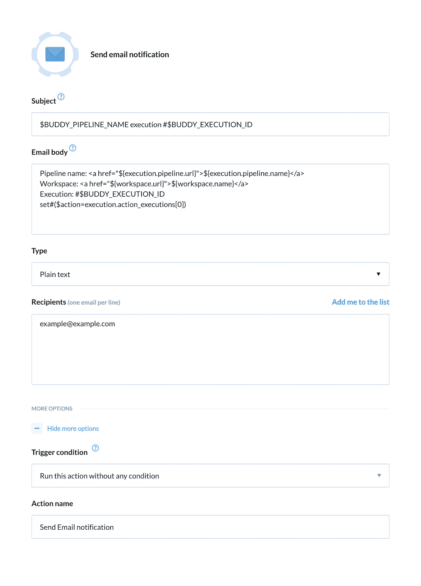
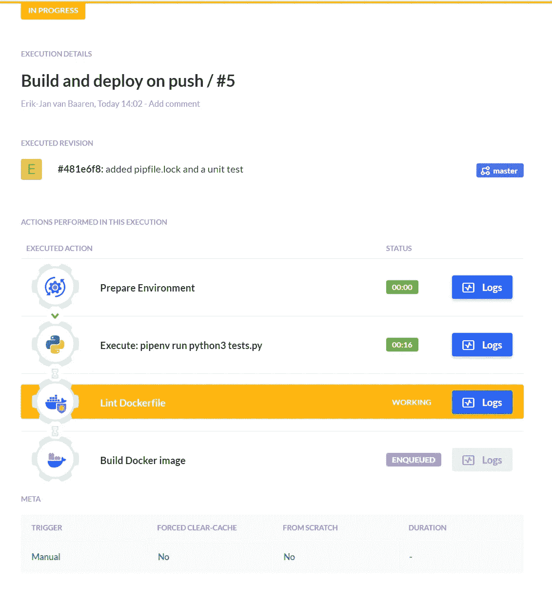
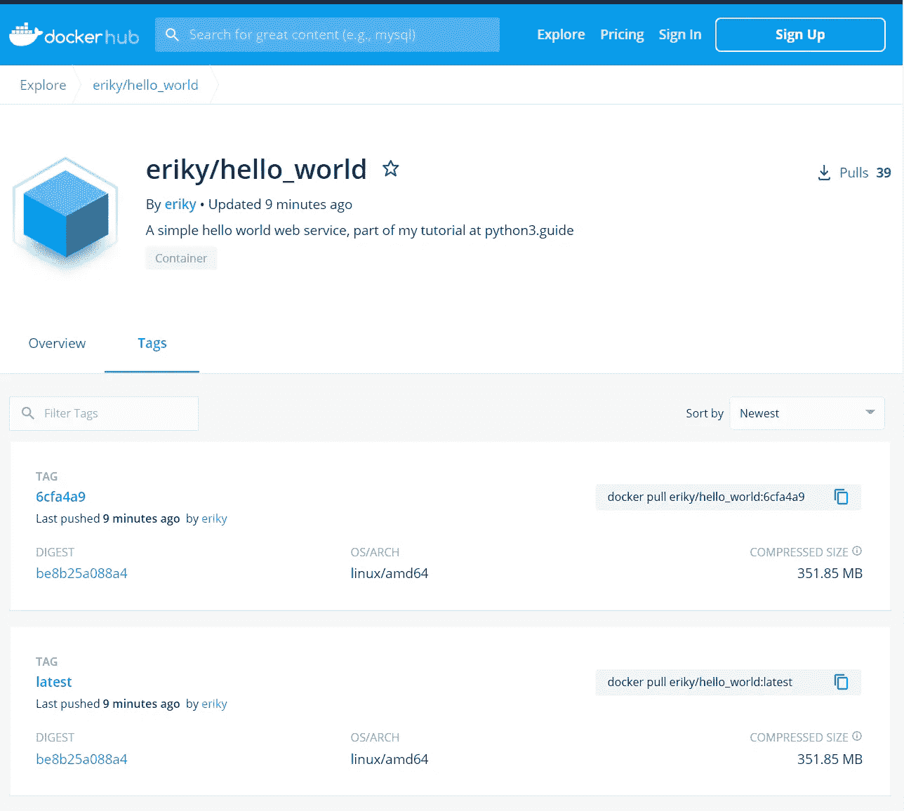

# 通过 4 个简单的步骤自动构建和部署您的 Python 应用程序

> 原文：<https://betterprogramming.pub/automatically-build-and-deploy-your-python-application-in-4-easy-steps-88084fc07d54>

## 将您的 Python 开发提升到一个新的水平，节省您自己的时间和 CI/CD 的麻烦


Ashkan Forouzani 在 [Unsplash](https://unsplash.com?utm_source=medium&utm_medium=referral) 上的照片。

当你完成一个新版本的 Python 应用程序时，你如何构建和部署它？您是否会更改版本号，将新文件上传到生产环境，然后就此结束？

有更好的方法！持续集成/持续交付(CI/CD)是良好软件工程实践的顶峰。这是所有其他良好实践汇集的地方。

CI/CD 在开发和操作之间架起了一座桥梁，因为它自动化并加强了构建和部署软件的重要步骤。它确保了质量，并排除了人为错误。

本文将采用一个现有的应用程序，并为它创建一个 CI/CD 管道。您将看到如何在 15 分钟内建立一个专业的 CI/CD 管道！

# 要求

要建立一个良好的 CI/CD 渠道，我们首先需要有一些其他的实践:

*   我们必须使用像 Git 这样的代码版本管理系统。
*   我们的应用程序应该有自动化测试(单元测试，集成测试)。
*   我们应该至少有一个软件的开发、测试和生产场所。
*   我们需要一个 CI/CD 系统。

设置 CI/CD 可能看起来像是一次令人生畏的冒险，但实际上并非如此。事实上，你可以在开始的时候给自己留一些捷径。在本文中:

*   我们的测试和开发地点将是我们自己的电脑。
*   我们将从一个单元测试开始。
*   我们将使用 GitHub 托管我们的代码，使用 Docker Hub 托管我们完成的应用程序。

这给我们留下了最后的选择:我们应该使用哪个 CI/CD 系统？

# 我们应该选择哪种 CI/CD 系统？

一些供应商提供 CI/CD 系统。我过去用过的一个著名的开源系统是 [Jenkins](https://www.jenkins.io/) 。它已经存在很长时间了。缺点:它需要知识和时间来设置和运行。我也曾在过去工作过的一家公司被迫使用 Atlassian，但我从未喜欢过该产品。

为了快速启动并运行，并向您展示这有多简单，我将在本文中使用 [Buddy](https://buddy.works/) 。它是以云服务的形式提供的，他们的免费层仍然允许你创建五个项目。他们的界面非常直观。它甚至在最初分析代码后向您建议合适的操作。

# 应用程序

对于这个管道，我将使用现有的“hello world”应用程序。你可以在我的 [GitHub](https://github.com/eriky/docker-python-example) 账号上查看源码。它具有以下特点:

*   它有基本的单元测试。
*   它包括一个`Dockerfile`来创建一个 Docker 图像，并发布到我的公共 [Docker Hub](https://hub.docker.com/r/eriky/hello_world) 账户。

# 1.创建帐户和项目

开始吧！如果您没有 GitHub 帐户，请先创建一个。然后用你的 GitHub 登录[创建一个好友账户](https://buddy.works/sign-up)。这样，Buddy 可以直接访问您的存储库。

# 2.添加源存储库

在 GitHub 中，您应该派生出我的" [docker-python-example](https://github.com/eriky/docker-python-example) "存储库，以便在下一步中它可以作为您自己的存储库之一。

完成后，点按 Buddy 中的“创建新项目”大按钮。您可以选择一个 GitHub 存储库。如果一切顺利，那么“docker-python-example”回购也应该存在:



选择“docker-python-example”项目—作者截图。

单击该项目。您应该会看到以下屏幕:



我们已经准备好让建筑或我们的应用实现自动化。

Buddy 检测到这是一个 Python 应用程序。太棒了。一旦完成了完整管道的设置，就可以下载一个`buddy.yml`文件来存储管道和代码。我强烈建议您为自己的项目这样做。

# 3.创建新管道并添加操作

我们准备建造一条新管道。点击“添加新管道”按钮，并填写如下表格:



创建新的管道。

每次有东西推送到主分支，我们都会运行这个管道。或者，您也可以循环或手动构建您的应用程序。

单击蓝色大按钮添加新管道。Buddy 已经看过了我们的代码，并将提出一些建议:



巴迪建议了几个动作。

选择 Python 操作并填写下一个表单。如果您想跟进，您可以复制/粘贴以下内容:

```
pip install pipenv
pipenv install
pipenv run python3 tests.py
```

这些操作安装 pipenv，安装所有的需求，最后在我们新创建的环境中运行单元测试。



创建 Python 操作。

您也可以在这里选择 Python 版本。Buddy 在 Docker 容器中运行每个步骤，因此如果需要，您甚至可以使用自己的自定义 Docker 容器。对我们来说，默认的 Python 容器就可以了。我选择了 3.8.6 版本，因为我知道这是这个项目可以使用的版本。

如果您愿意，现在就可以尝试构建步骤——只是为了确保在继续之前一切正常。正如你在下面看到的，我需要四次尝试，因为我忘了将一些文件签入 GitHub repo。那没问题。我们可以继续尝试，直到成功:



我们的构建步骤有效！

现在回到你的管道，点击你的第一个动作下面的小+号。它允许您添加更多的动作。默认情况下，只有在前一个操作没有错误地完成时，下一个操作才会运行。

下一个要添加的动作是另一个建议:Dockerfile linter。它检查我们的 docker 文件的错误。这是一个很好的额外。所有的默认设置都没问题，所以我们需要做的就是点击“添加这个动作”

现在是时候构建 Docker 映像并将其推送到 Docker Hub 了。添加另一个操作，并再次从建议的操作中选择。这次是那个叫“构建图像”(里面有 Docker 图标的那个)。

“设置”选项卡上的默认值就可以了。前往“选项”选项卡，填写您的 Docker Hub 详细信息。这也是您可以定义图像标签的地方。

我们将做一些简单的事情:我们总是将图像标记为`latest`。为了保持版本历史，我们添加了一个使用 Buddy 变量的附加标签。

一个什么？Buddy 会自动定义一个您可以在项目中使用的环境变量列表。完整的列表和更多细节可以在文档中找到[。其中之一是缩写的 Git 修订号，可以在`${BUDDY_EXECUTION_REVISION_SHORT}`下访问。我们可以用它给我们的图像一个唯一的 ID:](https://buddy.works/docs/pipelines/environment-variables)



设置 Docker 映像构建。

您想要添加的最后一个操作是通知，这样您就可以在构建成功时得到通知。我将用一封很好的旧电子邮件来演示，但还有许多其他选项:

*   松弛的
*   电报
*   MS 团队
*   不调和
*   短信

过程又简单了。单击最后一个操作下的小加号按钮，滚动浏览可用的操作，然后单击电子邮件。您将看到这样的屏幕:



添加电子邮件通知。

如您所见，您可以使用所有可用的环境变量来定制您喜欢的消息。

在更高级的设置中，您可能希望用版本号标记您的 Git repo，并创建一个在新标记上触发的构建触发器。这是将开发版本与发布版本分开的好方法，因为这个标签也可以用作标记 Docker 映像的变量。

# 4.运行完整的管道

你都准备好了。当你把一个东西推到主分支的时候，你的管道就开始运行了。或者，您也可以手动触发构建。让我们现在就开始吧:



我们的管道正在运行！

如果一切顺利，您应该会看到一个绿色条，上面写着“通过”

为了确保这一点，你可以访问你的 Docker Hub 账户，确认是否有新的图片可用。如您所见，我们的图像带有正确的标签:`latest`和一个基于上次 git 提交的简短散列:



我们的 Python 应用程序被构建并推送到 Docker Hub。

恭喜你，你建立了一个 CI/CD 管道。这并不太难，是吗？

# 结论

感谢您的阅读。如果有任何不清楚的地方或者你有什么有趣的事情要补充，请留下评论！

更多 Python 文章、技巧和窍门，请访问我的网站 [Python Land](https://python.land) 。