# 用几行 Python 代码自动创建 NBA 集锦

> 原文：<https://betterprogramming.pub/automatically-creating-nba-highlights-in-5-minutes-7f90bfedd775>

## **利用开源计算机视觉模型生成篮球集锦**

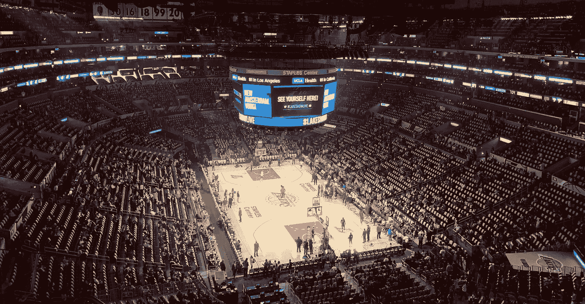

由[蒂姆·哈特](https://unsplash.com/@timhart0421?utm_source=unsplash&utm_medium=referral&utm_content=creditCopyText)在 [Unsplash](https://unsplash.com/s/photos/nba?utm_source=unsplash&utm_medium=referral&utm_content=creditCopyText) 上拍摄的照片

我们生活在一个由抖音、Snapchat、Instagram、Twitter、脸书、Youtube 等引领的内容快速消费的世界。

随着观看比赛直播的重要性越来越低，年轻球迷正在接受参与联赛的新方式。

根据综艺情报平台[的一项调查](https://link.axios.com/click/23308324.376732/aHR0cHM6Ly92YXJpZXR5LmNvbS92aXAvdGhlLWNoYW5naW5nLWZhY2Utb2Ytc3BvcnRzLWZhbmRvbS0xMjM0OTIwNTYxLz91dG1fc291cmNlPW5ld3NsZXR0ZXImdXRtX21lZGl1bT1lbWFpbCZ1dG1fY2FtcGFpZ249bmV3c2xldHRlcl9heGlvc3Nwb3J0cyZzdHJlYW09dG9w/6047896a8246974e431c2738Bcdfc138d)，在 18-34 岁的美国体育迷中，58%的 MLB 球迷、54%的 NBA 球迷和 48%的 NFL 球迷表示，他们更喜欢观看集锦而不是完整的比赛。

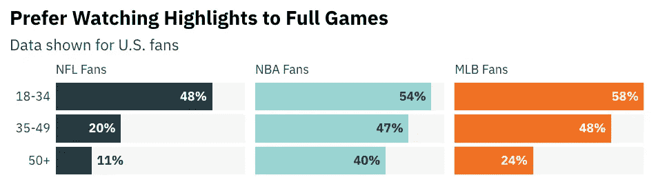

来源:综艺情报平台丸组

作为一个住在离美国半个地球之外的 NBA 铁杆球迷，没有比我更喜欢这些集锦的了。

不需要更多的动机，我开始创建一个自动化的过程来创建 NBA 比赛的亮点。

# **什么**

这个项目的目标是使用完全开源的技术来创建这些亮点，并尽可能保持简单。

# **如何**

有许多方法可以尝试并找到游戏中的兴趣点——声音分析、运动检测等。有些公司正是以此为业，使用复杂的模型来识别兴趣点并创建精彩片段。但是这些复杂的输入和模型不一定等于更精确的结果。相反，我决定依靠一个稳定而清晰的信号——一个与游戏时钟相匹配的带时间戳的游戏详细记录。如此简单——却又如此精确。虽然这种解决方案不一定适用于任何运动，但在 NBA(以及一般的篮球)中，时钟是神圣的…因此可靠性非常高，几乎不需要任何努力，并且计算水平非常低。

该解决方案有三个部分:

1.  建立一个简单的逐场比赛刮刀，以获取我们正在创建一个亮点的游戏数据。
2.  使用开源的 Tesseract OCR 模型来查找游戏影片中的当前游戏时钟和季度。
3.  将我们从帧中提取的时钟和季度与我们的播放数据进行比较。

…如果我们有匹配的，瞧！我们有一个亮点！

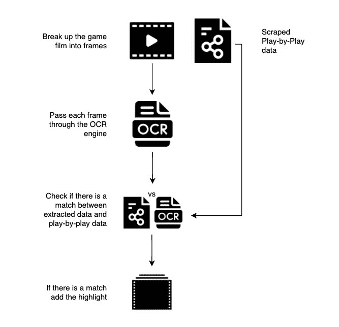

项目流程图。作者图片

现在让我们进入技术细节。

这个项目是用 python 写的，但是可以很容易地用任何语言复制。
在我们开始之前，这些是本项目中使用的库:

```
import pandas as pd
import pytesseract
import cv2
from moviepy.editor import *
import json
import requests
```

# **建造一架详细报道的铲运机**

逐场播放以个人事件的形式提供游戏的抄本。

可以在逐场播放数据中找到的一些数据示例:

*   控球时间(在游戏时钟上)
*   占有发生的季度
*   开始控球的球员(在抢断或防守篮板的情况下)
*   开始控球的对方球员(在投篮不中或失误的情况下),包括投篮的位置，以及我们用来对控球类型进行分类的其他一些唯一标识符。

我们搜集的数据来自 NBA 官方 API(data.nba.net 和 cdn.nba.com)。数据以 JSON 格式存储。要以更传统的格式获取数据，比如 dataframe，我们只需要运行几行代码。

第一部分提供了在给定日期玩的游戏:

```
jsn = f"https://data.nba.net/10s/prod/v1/{date}/scoreboard.json"
page = requests.get(jsn)
j = json.loads(page.content)
```

接下来，我们检查输入的球队确实在给定的日期比赛。如果有，我们获取游戏 id 并将其插入下一个 API。

我们提取数据并将其加载到熊猫`dataframe`:

```
raw_game = f'https://cdn.nba.com/static/json/liveData/playbyplay/playbyplay_{game_id}.json'
page = requests.get(raw_game)
j = json.loads(page.content)
df = pd.DataFrame(j['game']['actions'])
```

结果看起来像这样:

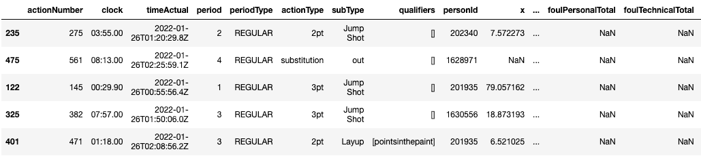

熊猫数据帧包含详细的比赛数据

从这里我们可以筛选出我们感兴趣的任何类型的打法(投篮、抢断、盖帽等……)。在我们的例子中，我只考虑投篮，不考虑罚球。

```
ndf = df[['clock', 'period', 'description', 'teamTricode', 'shotResult', 'actionType']]
ndf = ndf[ndf['shotResult'] == 'Made']
ndf = ndf[ndf['actionType'] != 'freethrow']
```

现在我们有了游戏中所有兴趣点的数据集，是时候在实际的游戏镜头中找到它们了。

# **处理游戏影片**

下一步是将游戏影片处理成帧，并使用 OpenCV 模块操纵它们。

```
cap = cv2.VideoCapture(video_path)
ret, frame = cap.read()
while cap.isOpened():
…
```

然后，每一帧都将经过一系列的处理(预处理)，为 OCR 做准备(更多 OCR 内容将在后面介绍)。

步骤:

1.  裁剪原始帧，只留下游戏时钟所在的底部三分之一(这是为了不浪费时间阅读整个帧)。
2.  将图像转换为灰度。
3.  将灰度图像转换为黑白图像。
4.  将[高斯模糊](https://en.wikipedia.org/wiki/Gaussian_blur#:~:text=In%20image%20processing%2C%20a%20Gaussian,image%20noise%20and%20reduce%20detail.)应用于黑色&白色图像。

```
height, width = frame.shape
crop_img = frame[height-(height/3):height, 0:width]
gray = cv2.cvtColor(crop_img, cv2.COLOR_BGR2GRAY)
bw = cv2.threshold(gray, 0, 255, cv2.THRESH_BINARY_INV + cv2.THRESH_OTSU)[1]
blurred = cv2.GaussianBlur(bw, (5, 5), 0)
```

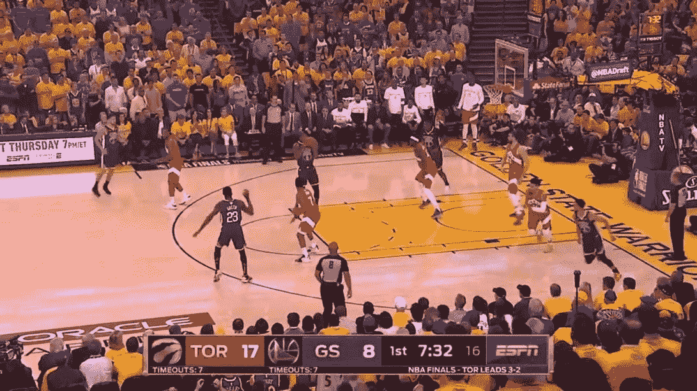

原始框架

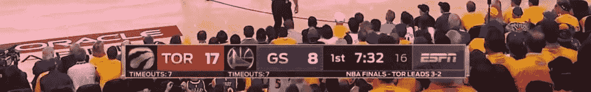

底部三分之一裁剪

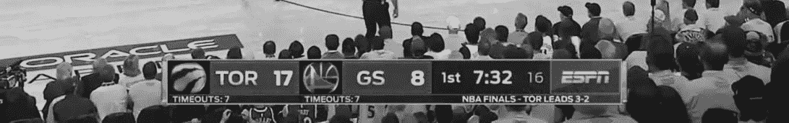

转换为灰度


转换为黑白

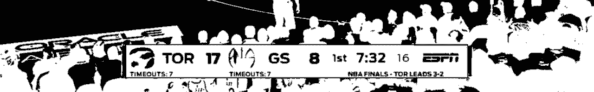

应用高斯模糊

# **宇宙魔方**

Tesseract —是一个开放源代码的光学字符识别引擎。这是最受欢迎和定性的 OCR 库。

OCR 使用人工智能在图像中进行文本搜索和识别。

Tesseract 在像素、字母、单词和句子中查找模板。

它具有开箱即可识别 100 多种语言的能力，并且可以通过训练识别其他语言。

所以基本上这个引擎从图像中搜索并提取文本。

在这个项目中，我们使用 python-tesseract ( `[pytesseract](https://pypi.org/project/pytesseract/)`)，它是 Google 的 Tesseract-OCR 引擎的 python 包装器。

有 13 种宇宙魔方[配置模式](https://ai-facets.org/tesseract-ocr-best-practices/)。我们将使用模式 11: *稀疏文本。不按特定顺序查找尽可能多的文本。*

## **宇宙魔方实现**

下一步是通过宇宙魔方引擎运行我们处理过的帧。

```
data = pytesseract.image_to_string(blurred, lang='eng', config=' - psm 11')
```

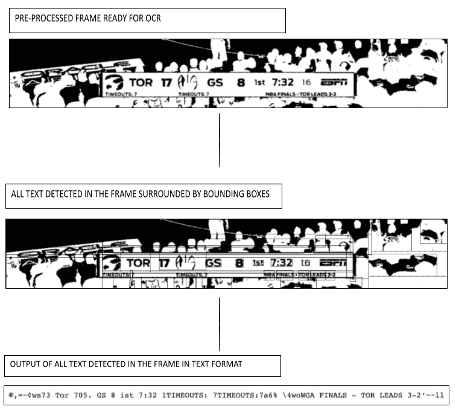

宇宙魔方文本检测输出

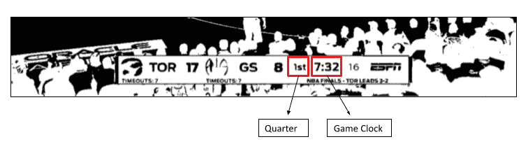

现在我们已经在框架中有了所有的文本，我们可以搜索我们想要的信息，即当前季度和游戏时钟。

继续上面的例子:

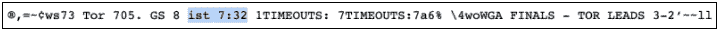

季度是“1 日”，游戏时钟是“7:32”。但是，在 Tesseract 输出中，检测是“ist”。数字“1”被误认为是字母“I”。

因此，下一步是为每个季度创建一个常见错误的映射。

```
firstQ  = ['1st', 'ist', 'ast']
secondQ = ['2nd', '2n', 'znd']
thirdQ  = ['3rd', '3r', '3r0', '3ro', '37d', '3fd', '31d']
fourth  = ['4th', '4t', '47h', '41h', '4h']
```

## **将比赛数据与比赛录像数据进行匹配**

让我们总结一下到目前为止我们所拥有的:我们构建了一个逐场播放的刮刀，操纵游戏镜头帧，并通过 Tesseract 引擎运行它们以从帧中提取文本。

现在是时候结合数据点，找到亮点了。

我们通过如上所述处理游戏镜头的每一帧并检查所提取的硬币和游戏时钟的组合是否与精彩部分的硬币和游戏时钟相匹配来做到这一点。

如果我们有一个匹配，然后我们保存帧号。

```
curr_frame = cap.get(cv2.CAP_PROP_POS_FRAMES)
frame_loc.append(curr_frame)
```

## **拼接框架**

一旦我们完成了游戏中的所有帧，并且我们有了一个所有出现高光的帧的列表，我们所要做的就是把它们拼凑起来。

我们将使用`[moviepy](https://zulko.github.io/moviepy/)`模块来完成。

`Moviepy`允许我们从完整视频中裁剪出子片段。为了看到高潮部分的整个过程，我们在高潮部分发生的前几秒和后几秒拍摄。

```
clips = []
for frame in highlight_frames:
clip_name = video.subclip(round(frame/fps) - 4, round(frame/fps)+ 2)
clips.append(clip_name)
final_clip = concatenate_videoclips(clips)
final_clip.write_videofile(output_path,
                           codec='libx264',
                           audio_codec='aac',
                           fps=fps)
```

# **输出高亮示例**

现在我们已经完成了高光的创建，让我们来看看结果…

所有标志和镜头都是 NBA 及其附属机构的财产

# **提高效率**

这是一个寻找兴趣点和创建精彩片段的基本脚本，但效率很低。

举几个例子，可以通过各种不同的方式轻松提高效率:

*   不检查每一帧——跳过一秒而不是检查每一帧会将 2 小时游戏(60 fps)中处理的帧数从 430，000 减少到 7，200。
*   定位游戏时钟的坐标并通过 OCR 引擎仅运行该区域将减少运行时间。
*   寻找分数的变化，而不是比赛时间(如果你只想得分)
*   使用多重处理并行工作并加速进程，以及使用 GPU。

# **总结一下**

这只是一个小例子，说明如何利用开源技术来创造令人难以置信的产品。

这就是现在——我希望你觉得有趣，如果你有任何问题或意见，请告诉我！