# 使用 Git 触发器将应用自动部署到 VPS 并进行冷却

> 原文：<https://betterprogramming.pub/automatically-deploy-apps-to-vps-with-git-triggers-and-coolify-880cc1a6a711>

## Coolify 介绍，这是一个可以基于 Git 事件部署定制应用程序的项目。这类似于自托管网络生活


[奥努尔·比奈](https://unsplash.com/@onurbinay?utm_source=medium&utm_medium=referral)在 [Unsplash](https://unsplash.com?utm_source=medium&utm_medium=referral) 上的照片

我做了很多愚蠢的项目，有一件事我已经想了很久，那就是使用 [Git](https://git-scm.com/) 来自动化部署过程。因此，在这篇文章中，我们将解决这个问题。

首先，让我们确定目标是什么。我想要的是一个具有以下功能的系统:

*   当一个新的提交到达我的 git repo 时自动部署。
*   免提系统。一旦设置好了就不想碰了。
*   轻松建立新项目，不需要太多的麻烦。

我研究这个问题已经有一段时间了，我遇到的许多解决方案通常可以归为几类:

*   设置 Git 接收后挂钩([像这样](https://www.cloudsigma.com/how-to-configure-automatic-deployment-with-git-with-a-vps/))
*   使用 GitHub 动作来推动部署([像这样](https://coderflex.com/blog/2-easy-steps-to-automate-a-deployment-in-a-vps-with-github-actions)
*   使用`[scp](https://www.man7.org/linux/man-pages/man1/scp.1.html)`或`[rsync](https://www.man7.org/linux/man-pages/man1/rsync.1.html)`
*   组合 cron 作业和 bash 脚本(像这样的)

这些在某种程度上会起作用，但它们在某种程度上都没有达到我的目标。它们要么需要我的手动关注，要么对实际的 git 事件没有响应，要么对新项目设置了太多的仪式。我构建了许多不同的项目，它们都有自己的构建步骤，所以我不能期望相同的简单脚本适用于每一个项目。

有一段时间，我认为我必须自己从一系列复杂的脚本中构建我的梦想项目，但是我最近发现了一个名为 [Coolify](https://coolify.io/) 的项目，看起来正是我想要的。

我没有证据证明它不是一系列复杂的脚本拼凑而成的，但它是开源的，包装得很好，所以它比我得到的任何东西都好。

你可以在[的 coolify.io](https://coolify.io/) 找到更多细节，你会看到它标榜自己是“自托管、简单易用”和“Heroku 和 Netlify 的替代产品”

听起来很棒！

# 设置和安装

我将在[节点](https://www.linode.com/)设置它。这是我的服务器的基本设置的截图。

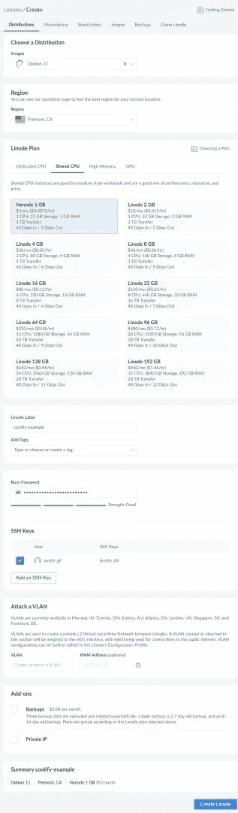

(没有必要，但如果你想跟进一个新的 Linode 账户，[使用这个链接获得 100 美元的信贷](https://bit.ly/austinode)。这是一个附属链接，我会得到一小笔佣金。)

一旦我们的服务器启动并运行，我就可以使用 IP 地址`ssh`进入服务器(你的可能会不同):

```
ssh root@66.175.223.11
```

然后我可以回到 Coolify 网站，将他们的安装脚本复制到终端中:

```
wget -q https://get.coollabs.io/coolify/install.sh -O install.sh; sudo bash ./install.sh
```

这部分需要一点时间，但是一旦完成，它会提示我们去服务器的 IP 地址和`port 3000`、`[http://66.175.223.11:3000](http://66.175.223.11:3000.)`T10。

当我们打开那个链接时，我们得到这个可爱的登录页面:


我不能登录，因为没有设置任何帐户，所以我要继续使用我的电子邮件和密码注册为新用户。一旦我做到了，我就加入！

所以，我想做的第一件事就是改域名。在我的 DNS 记录中，我可以向`66.175.223.11`添加一条指向 coolify.austingil.com 的新 A 记录。然后，我可以单击 Coolify 屏幕左下方的 cog 图标，进入设置页面。一旦我将网址改为[https://coolify.austingil.com](https://coolify.austingil.com)并点击保存，Coolify 将为我获得一个 SSL 证书。

一旦完成，我应该可以去 coolify.austingil.com，看到同样的登录屏幕，但在一个更容易记住的 HTTPS 连接域名。

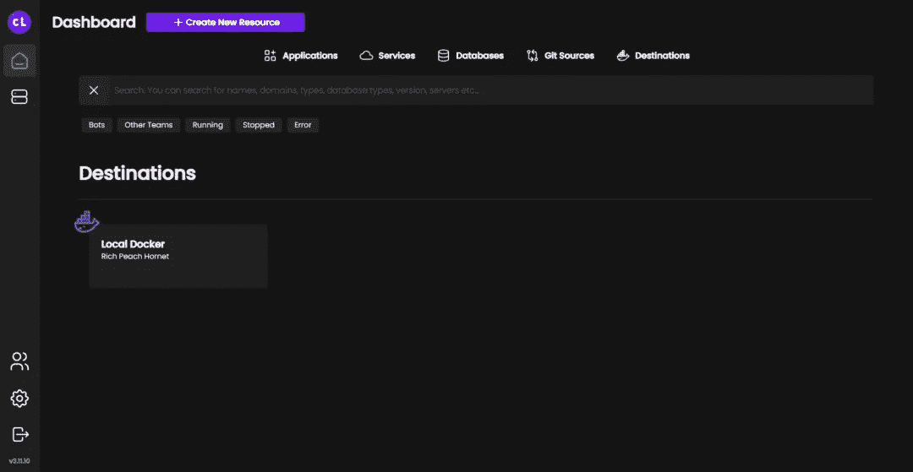

我真的不想低估这有多棒。太牛逼了。真的！

好的，重新登录。

# 连接 GitHub

接下来要做的是连接到我的 GitHub repo 来自动化部署。为此，我需要在“创建新资源”菜单下添加一个新的“Git 源”。

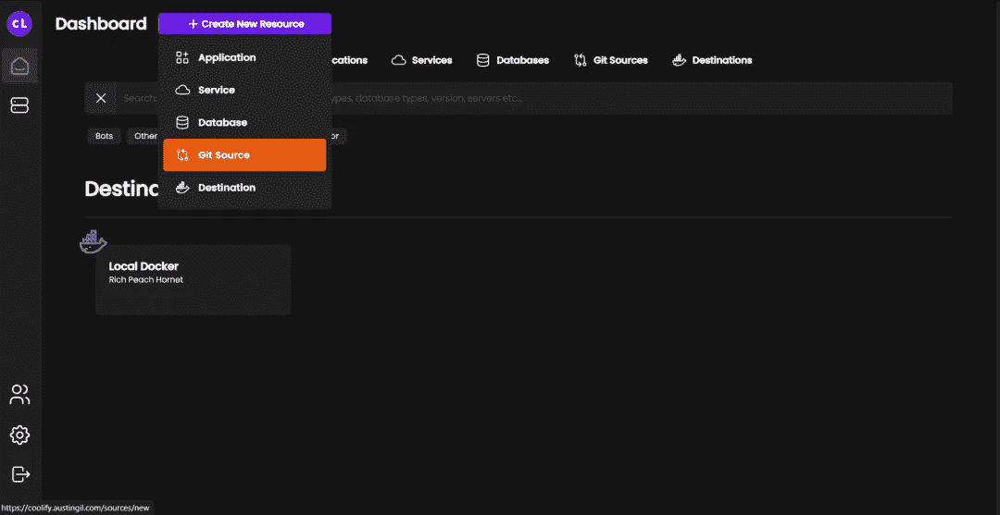

在这种情况下，我会告诉 Coolify 它来自 GitHub，所有默认设置对我来说都没问题。

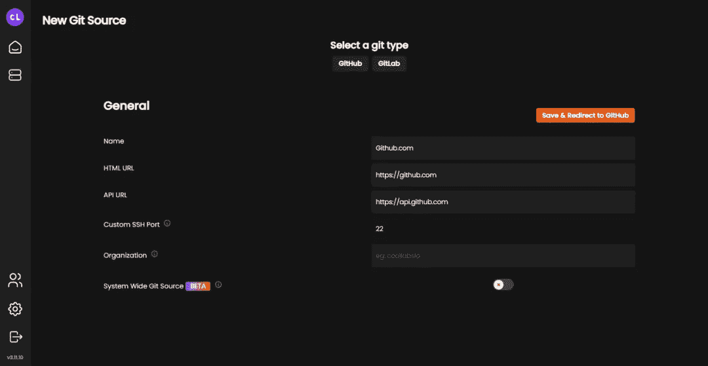

我想我还是可以离开。

保存后，它会将我重定向到 GitHub，并引导我创建一个新的 GitHub 应用程序。每当我的 GitHub repo 收到新的提交时，这个应用程序都会发出信号。这个信号最终会引发新的部署。

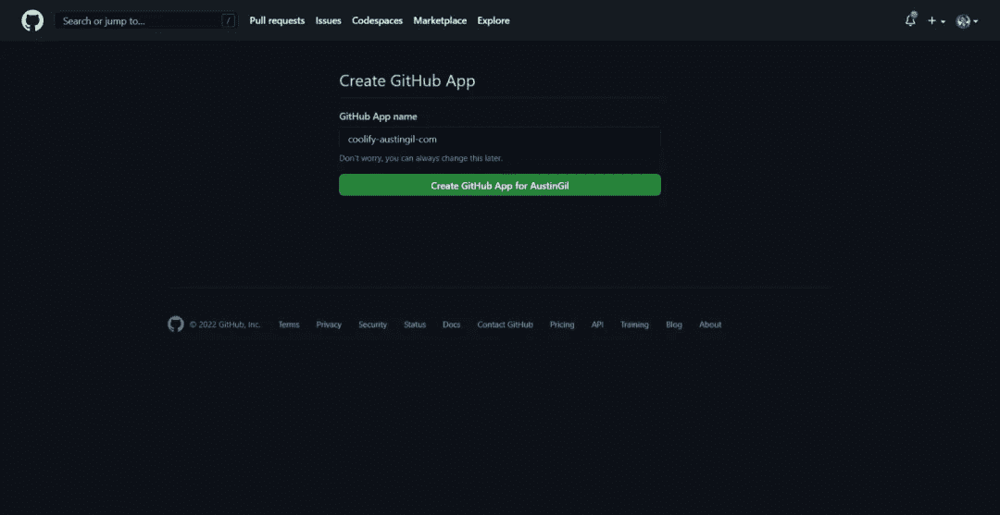

随着 GitHub 应用程序的创建，我再次被重定向回我的 Coolify 实例，但只是一会儿，然后我被提示安装我刚刚创建的应用程序，并选择它可以访问的 repos。


# 部署应用程序

好了，所有东西都连接好并配置好了，如果我回到我的 Coolify 仪表板，我已经创建了我的 Git 源代码，我应该能够为应用程序创建一个新的资源了。

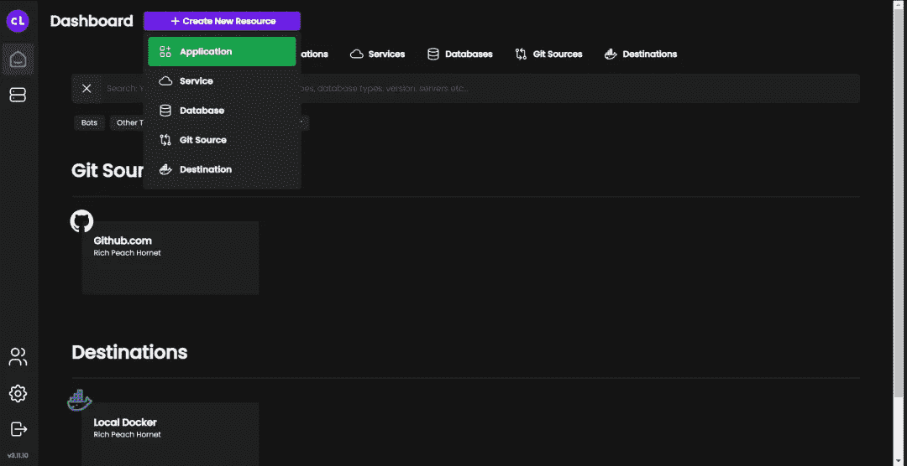

我现在可以选择 GitHub.com 作为加载我的存储库的源。我可以通过搜索“战斗”然后选择主分支来找到我要找的那个。

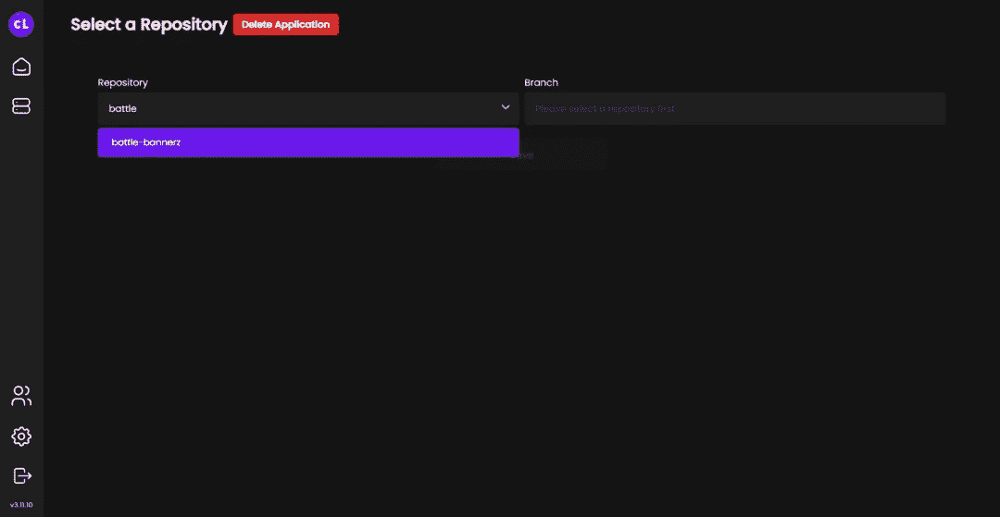

接下来，我看到了许多运行时选项。今天，它只是一个静态网站，但它很高兴有现成的选项。

选择静态选项后，它会询问我这个新项目的配置。总会有一些随机的名字，但我会叫我的“bannerz 之战”，因为为什么不呢？

我给它自定义一个域，`[https://bb.austingil.com](https://bb.austingil.com.)` [。](https://bb.austingil.com.)但是为了让它工作，我必须在我的 DNS 中创建另一个 A 记录，将 bb 指向`66.175.223.11`。同样，一旦配置了 DNS，Coolify 将负责 SSL 证书。

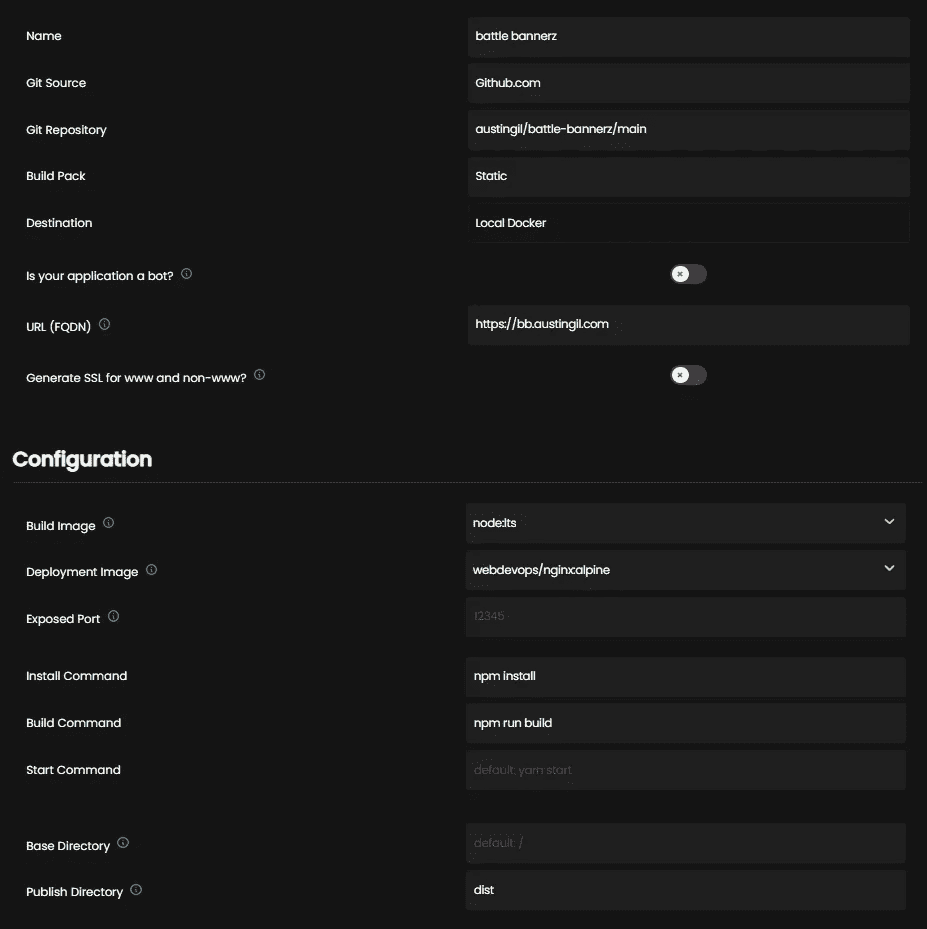

我的 repo 只包含源文件，所以我还需要配置 Coolify 来运行`npm install`来下载所有的开发依赖项，然后`npm run build`来构建生产资产。我的项目将构建命令中的所有生产资产放入`/dist`文件夹，所以我还需要告诉 Coolify 将它作为项目的根。

设置完成后，我点击保存，然后它问我是否要部署。是的，我知道，过了一小会儿，我们就到了关键时刻。

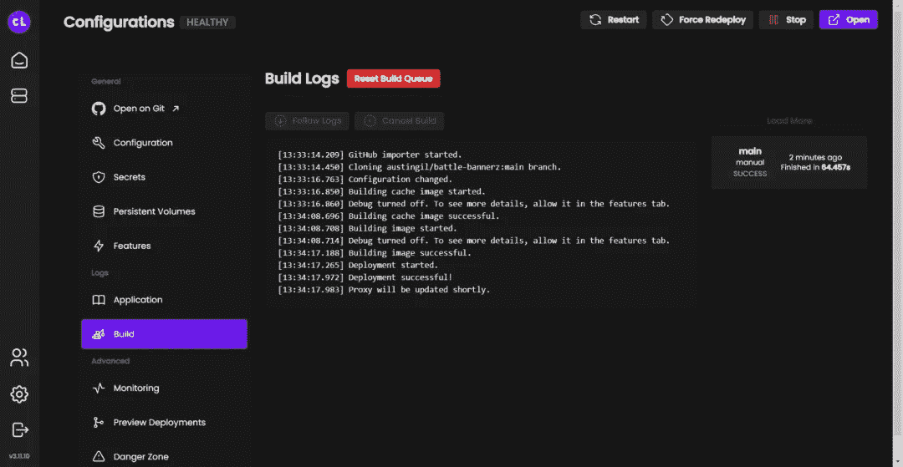

我看到紫色的“打开”按钮。我点击了它，然后…


天哪，这太酷了！我不敢相信这有用。太棒了。

好了，最后要测试的是新的提交是否会触发重新部署。一种快速的方法是通过 GitHub UI。我只是对`App.vue`做了一个小改动。

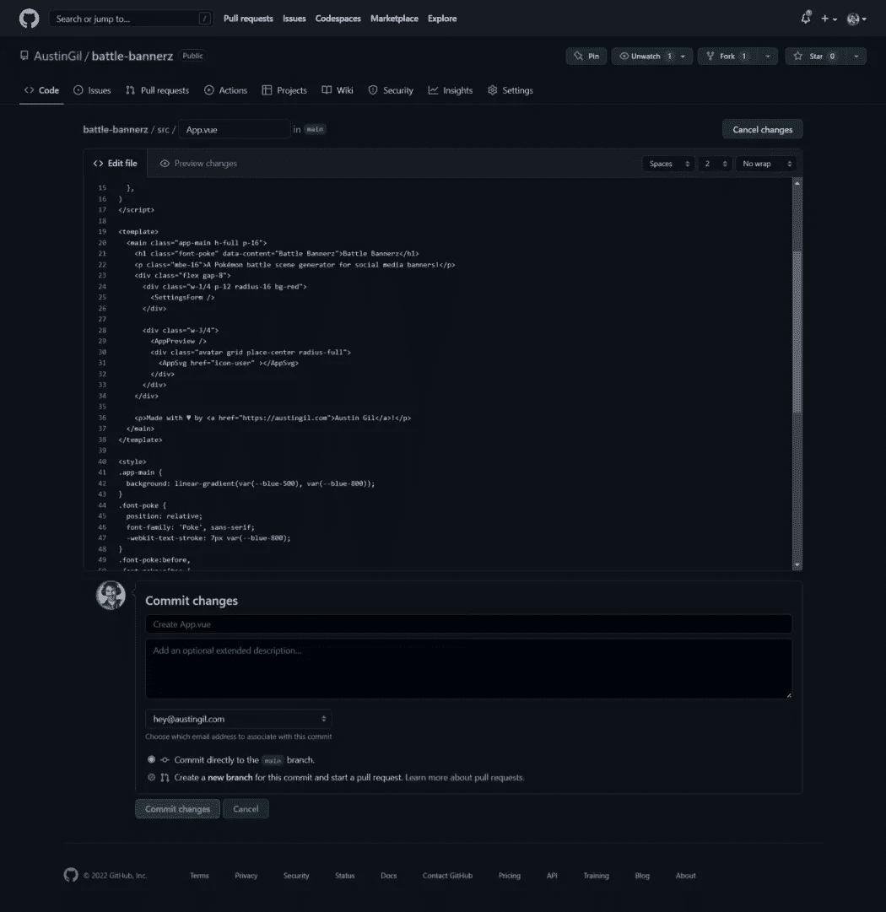

回到 Coolify，看起来它跟踪了那个`webhook_commit`并开始重建项目。

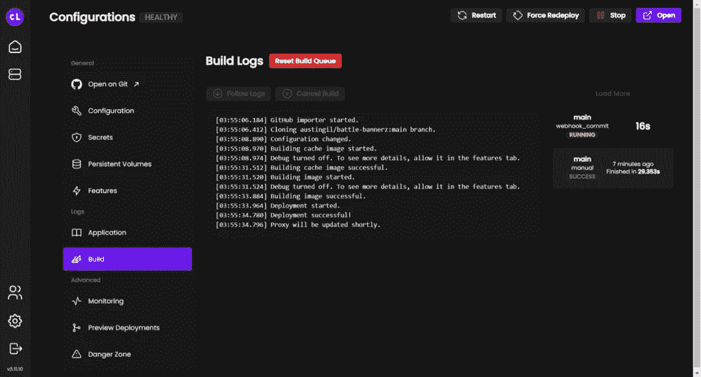

四十秒后，我看到了成功消息，并发现网站的更新版本已部署。

# 关闭

好了，今天的介绍到此为止。我们看到它像宣传的那样工作，但是还有更多我没有介绍的功能:

*   为开发分支部署预览
*   部署到远程 Docker 或 Kubernetes 实例
*   将它用于数据库
*   自定义 Docker 和 Docker 组成堆栈

必须指出这是一个开源的、自托管的解决方案。这意味着您可以完全控制系统中发生的事情，不依赖于其他人，并且您的所有数据都在您的控制之下。

因此，如果您想走自托管路线，但又想获得自动化 Git 部署的好处，那么一定要看看 Coolify。我不知道这是否会成为大多数读者，但这是一种祝福。

同样，如果你想在 Linode 上获得一些积分，[使用这个会员链接](https://bit.ly/austinode)。

非常感谢您的阅读。如果你喜欢这篇文章，请[分享](https://twitter.com/share?via=heyAustinGil)。这是支持我的最好方式之一。你也可以[注册我的时事通讯](https://austingil.com/newsletter/)或[在 Twitter 上关注我](https://twitter.com/heyAustinGil)以了解何时有新文章发表。

*原载于*[*austingil.com*](https://austingil.com/automatically-deploy-from-git/)*。*