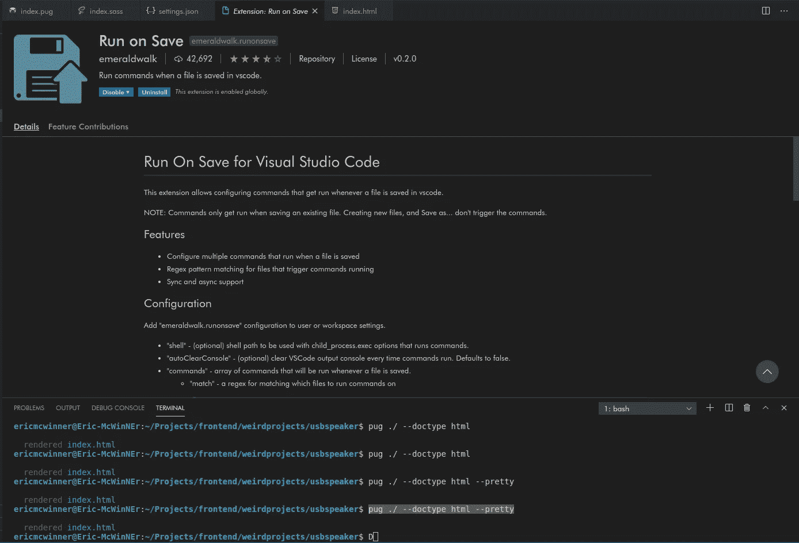
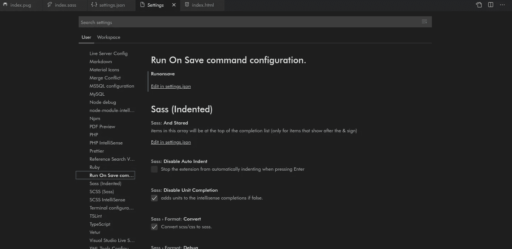

# 在 VS 代码中自动执行 Bash 命令

> 原文：<https://betterprogramming.pub/automatically-execute-bash-commands-on-save-in-vs-code-7a3100449f63>

## “如果每次保存文件时，我都可以针对不同类型的文件自动运行特定的终端命令，那会怎么样？”

由 [Freepik](https://freepik.com) 上的 [upklyak](https://www.freepik.com/free-vector/marketing-automation-2020-isometric-banner-seo_6993863.htm#query=automatic%20process&position=7) 拍摄的照片。

最近厌倦了写 HTML 代码。也许我只是觉得它太罗嗦，太重复，或者我只是太懒了。不管怎样，我开始寻找一个 HTML 预处理器，我将在我所有的项目中一致使用。我过去在 Codepen 上用过几个，像 HAML 和斯利姆，但是我爱上了[哈巴狗](https://github.com/pugjs/pug)，并决定在我的项目中使用它。

不过，问题是:pug 没有一个文件监视器扩展，可以像 SASS/SCSS 提供的无数扩展那样，在 VS 代码中保存时自动将 Pug 文件编译成 HTML。

当我使用 [EJS](https://ejs.co) 创建一个邮件模板，用于在用 [NestJS](https://nestjs.com/) 构建的 API 上发送电子邮件时，我也遇到了类似的问题。我无法轻松测试我的 EJS 模板。我必须安装 [ejs-cli npm 包](https://www.npmjs.com/package/ejs-cli)，并在每次保存代码时运行该命令。对于一个厌倦了简单地编写普通 HTML 代码的人来说，你可以想象每次我不得不运行命令来编译以便测试我的更改时，我有多么沮丧——这种情况发生了很多次。

在考虑解决方案时，我有一个想法:“如果我可以在每次保存文件时自动为不同类型的文件运行特定的终端命令，会怎么样？我再也不需要文件监视器扩展了。”在搜索了几秒钟在保存时运行终端命令的自动方法后，我偶然发现了 emeraldwalk 的[Run on Save](https://marketplace.visualstudio.com/items?itemName=emeraldwalk.RunOnSave)VS Code extension。在本文中，我将带您通过设置这个扩展来解决这些问题。

通过绿宝石行走运行**保存**扩展

# 转到 VS 代码上的 settings.json 文件

如果你还不知道怎么做，你可以进入文件>偏好设置>设置或者按 Ctrl +(如果你用的是 Mac，按 Cmd +)。然后单击左侧菜单中的 Extensions 选项卡，查找保存时运行的扩展，并在 settings.json 中单击 Edit。

在保存设置页面上运行。

# 设置要运行的命令

在`settings.json`文件中，有一个包含命令的对象，每当保存一个文件时，扩展就会自动运行这些命令。最好的部分是通过使用正则表达式，你可以设置它来匹配特定的文件扩展名。为了解决我前面提到的帕格和 EJS 问题，我们将编辑`settings.json`文件，如下所示:

有了这些设置，您的文件应该会在您保存时顺利地自动编译。

除了像这样的简单命令之外，扩展还提供了一些很酷的变量，用于生成更细粒度的命令，比如涉及文件名、包含目录等的命令。这些变量的完整列表可以在 VS 代码中的扩展登陆页面上找到，或者如果你懒得查看的话，可以在下面的链接中找到。

 [## 在保存时运行- Visual Studio 市场

### 此扩展允许配置每当文件保存在 vscode 中时运行的命令。注意:命令只能运行…

marketplace.visualstudio.com](https://marketplace.visualstudio.com/items?itemName=emeraldwalk.RunOnSave#:~:text=Run%20On%20Save%20for%20Visual,don%27t%20trigger%20the%20commands.) 

# 结论

找到使工作尽可能自动化并使我们的代码编辑器更有趣的方法是很重要的。在保存时发出这种命令的可能性是无穷无尽的，从这里介绍的小编译到保存时自动部署和推送到远程存储库。它是无限的。

我希望这篇文章对你有所帮助。