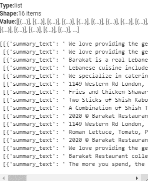

# 使用 Python + BART 为 PyTorch 自动生成站点范围的元描述

> 原文：<https://betterprogramming.pub/automatically-generate-site-wide-meta-descriptions-with-python-bart-for-pytorch-cd0e14dd40d3>

## 关于如何有效地为搜索引擎优化(SEO)创建高质量摘要内容的指南


穆罕默德·拉赫马尼在 [Unsplash](https://unsplash.com?utm_source=medium&utm_medium=referral) 上的照片

# 前言

在我以前的文章中，我探讨了数字营销和电子商务领域中自然语言处理(NLP)实现的几个应用程序。本文面向熟悉 Python、NLP 基础和简单数据挖掘的技术搜索引擎优化(SEO)专业人员。

本文的目的是为读者提供一个指南，告诉他们如何使用一个简单的 Python 脚本为整个网站快速生成 SEO 元描述。该脚本将分为四个主要部分:

1.  域名 URL 提取和清理
2.  每个域 URL 的数据挖掘
3.  应用于挖掘数据的 NLP 管道
4.  元描述的标准化

# 项目相关性

这个程序需要几个库才能运行。我们首先简要描述每个库及其各自的安装说明。

**数据组织依赖关系**

```
#Data organization dependenciesfrom os import remove
import pandas as pd
```

`pandas`是一个为 Python 编程语言编写的软件库，用于数据操作和分析。

**网页抓取依赖关系**

```
#Web scraping dependencies#!pip install beautifulsoup4
from bs4 import BeautifulSoupfrom urllib.request import Request, urlopen#!pip install requests
import requests#!pip install justext
import justextimport re
```

*   `[beautifulsoup4](https://pypi.org/project/beautifulsoup4/)`是一个库，可以很容易地从网页中抓取信息。它位于 HTML 或 XML 解析器之上，为迭代、搜索和修改解析树提供了 Pythonic 习惯用法。
*   `[urllib.request](https://docs.python.org/3/library/urllib.request.html#module-urllib.request)`模块定义了帮助打开 URL、基本和摘要认证、重定向、cookies 等等的函数和类。
*   `[requests](https://pypi.org/project/requests/)`是一个流行的开源 HTTP 库，它简化了 HTTP 请求的处理。
*   `[jusText](https://pypi.org/project/jusText/)`是一个从 HTML 页面中移除样板内容的工具，比如导航链接、页眉和页脚。它主要用于保存包含完整句子的文本，因此非常适合创建语言资源，如 Web 语料库。
*   `re`是一个提供正则表达式匹配操作的模块。

**NLP 依赖关系**

```
#NLP dependencies!pip install transformers
from transformers import pipeline#Summarize textual content using BART in pytorch
bart_summarizer = pipeline(“summarization”)
```

*   HuggingFace `transformers`是 JAX、PyTorch 和 TensorFlow 最先进的机器学习模块。Transformers 提供了数千个经过预先训练的模型，可以在文本、视觉和音频等不同形式上执行任务。
*   `transformers`将在这个程序中用来生成一个 pipeline()，允许从模型中心简单导入任何模型。
*   为了生成元描述，程序需要导入一个能够对文本数据任务进行推理的模型。有很多模型能够完成这个任务，有些是用 [Tensorflow](https://www.tensorflow.org/) (Google 的深度学习框架)或者 [Pytorch](https://pytorch.org/) (Meta 的框架)编写的。
*   在这个程序中，将使用 Pytorch 模型，命名为 [BART](https://huggingface.co/docs/transformers/v4.20.1/en/model_doc/bart#bart) 。BART 是用于自然语言生成、翻译和理解的去噪序列到序列预训练模型。BART 将被用来创建它所接收的文本数据的摘要——因此，摘要管道将被加载。
*   使用以下命令初始化 BART 和总结管道:

```
# Summarize textual content using BART in pytorchbart_summarizer = pipeline(“summarization”)
```

> **注意:**Python ide 在默认状态下不支持 Pytorch 或 Tensorflow。可以在本地机器上安装任何一个框架。也就是说， [Google Colab](https://research.google.com/colaboratory/) 默认安装了这两个框架，是不需要本地安装就可以进行深度学习的推荐平台。

所有必需依赖项的列表到此结束。

# 域名 URL 提取和清理

出于本文的目的，该程序将解析加拿大安大略省伦敦市一家名为[巴拉卡特](https://www.barakatrestaurant.com/)的沙瓦玛餐厅的网站。

为了生成关于一个网站的所有页面的元描述，需要一个完整的活动 URL 列表用于相应的域。为此，来自`urllib.request`模块的请求函数将请求一个 URL，而 urlopen 函数将打开指定的 URL。

```
#Obtain list of links on a domaindomain = "https://www.barakatrestaurant.com"req = Request(domain, headers={'User-Agent': 'Mozilla/5.0'})html_page = urlopen(req)
```

> **注意:**抓取站点内容时可能会抛出 403 错误。建议通过请求的 headers 参数中指定的用户代理绕过 HTML 响应错误。用户代理允许服务器和网络对等体识别请求用户代理的应用程序、操作系统、供应商和/或版本。

然后将执行 BeautifulSoup 模块来解析各自打开的 URL 的 HTML 页面。为了解析 HTML 文档，BeautifulSoup 构造函数将被配置为使用 lxml 的 HTML 解析器，命令如下:

```
soup = BeautifulSoup(html_page, “lxml”)
```

接下来，实例化一个空列表来存储域的活动链接。对于 BeautifulSoup 解析中的每一个链接，其中的标签定义了一个超链接，在空列表中添加一个相关的`href`属性来指示链接的目的地。

```
links = []for link in soup.findAll('a'):
links.append(urljoin(domain, link.get('href')))
```

一些附加的 URL 可能是一个`None`类型，它们可能是一个不一致的 URL 结构，或者它们可能是属于该域的其他 URL 的副本。

使用列表理解从链接列表中删除`None`类型对象:

```
#Links cleanup for None typeslinks = [link for link in links if link is not None]
```

删除列表中不符合标准 URL 结构的对象:

```
#Links cleanup for non-URL objectsfor link in links:
  if not link.startswith("http"):
    links.remove(link)
```

移除列表中的重复对象以创建唯一的集合:

```
#Links cleanup for duplicate URLslinks = [link for n, link in enumerate(links) if link not in links[:n]]
```

最后，删除任何潜在的社交链接，这些链接可能会导致车辆离开现场。这些数据很可能无法被正确解析，只能作为附加的噪声数据供摘要模块处理。随意添加任何可能驻留在受检查的域上的附加社交。

```
#Links cleanup for social URLssocials = [“instagram”, “facebook”, “twitter”, “linkedin”, “tiktok”, “google”, “maps”, “mealsy”]clean_links = []for link in links:
  if not any(social in link for social in socials):
    clean_links.append(link)
```

# 每个域 URL 的数据挖掘

给定先前创建的与一个域相关的 URL 列表，下一步是解析每个单独的 HTML 页面以获得文本内容，这些文本内容稍后可以抽象成元描述。

首先实例化一个新列表来存储所有文本内容。

```
# Extract and clean text from each linkcontent = []
```

下面是一个嵌套的条件 for 循环，将在单个代码块的上下文中解释。代码块的目的如下:

*   对于之前创建的链接列表中的每个链接，用`requests`模块请求每个链接的 URL，调用`request.get`函数(同样的警告适用于 HTML 错误处理，在这里也有效)。
*   对于每个链接，使用`justext`模块提取名为`paragraphs.`的变量中的文本内容

> **注意:**用于文本数据提取的 justext 模块的推荐实现通常如下所示:

```
paragraphs = justext.justext(response.content, justext.get_stoplist("English"))
for paragraph in paragraphs:
  if not paragraph.is_boilerplate:
    print paragraph.text
```

> **注意(续):**在某些情况下，justext 在删除错误分类的样板文件内容时可能过于激进。因此，在捕获更多文本信息的情况下，以样板文件的准确性为代价，使用以下替代方法:

```
paragraphs = justext.justext(response.content, justext.get_stoplist(“English”))
```

*   对于每个链接，一个名为`for_processing`的变量被初始化以存储处理过的段落数据。
*   对于每个链接，创建一组阻止字(`block_words`)来排除不感兴趣的 href 目的地。可以修改这些目的地，以满足您各自应用程序的需求。
*   对于每个链接，对于每个提取的段落，将提取的段落对象转换为文本。
*   对于每个链接，对于每个提取的段落，如果该段落的长度小于 50 个字符，则将其从处理中忽略。这种情况的存在是为了提供足够长度的摘要模型段落——非常短的段落更难以解释和进一步压缩。
*   对于每个链接，对于每个提取的段落，在给定第一个条件的情况下，省略包含任何上述块词的任何提取的段落。
*   最后，对于每个链接，对于每个提取的段落，最多将 5 个段落合并成一个条目，并将该条目添加到`contents`列表中。

> **注意:**为什么一个条目只有 5 个段落连接在一起？这样做是为了提高模型的摘要速度，减少每个摘要任务的计算时间。此外，这样做是为了确保在总结模型限制为 1024 个令牌的情况下，每个条目不超过 1024 个令牌。如果返回的段落文本数据不够丰富，可以随意将该参数更改为更高的值。

*   **可选**:将`links`和`content`数据组织成`pandas`数据帧，快速验证目前为止的结果。

概述每个域 URL 的数据挖掘的最终代码块。

# 将 NLP 管道应用于挖掘的数据

下一步是将 NLP 管道应用于从每个页面的文本内容中挖掘数据。回想一下，NLP 管道是用以下命令实例化的:

```
# Summarize textual content using BART in pytorch
bart_summarizer = pipeline(“summarization”)
```

继续为所有要存储的摘要内容创建一个新的空列表。

```
summarized_descriptions = []
```

回想一下，所有文本内容都存储在一个名为`contents`的变量中。我们将使用同一个变量并遍历`contents`列表中的每一项，这样每一项都由 NLP 管道处理。

可以选择打印初始项及其处理后的版本，以便在 IDE 中实时查看。

```
# Summarize content for meta descriptionssummarized_descriptions = []for item in content:
  print(item)
  print(bart_summarizer(item, min_length = 20, max_length = 50))
  summarized_descriptions.append(bart_summarizer(item, min_length = 20, max_length = 50))
```

> **注意:**三个参数传入 bart_summarizer 函数:待处理的`item`、`min_length`和`max_length`。
> 
> 请注意，要生成的序列的最小和最大长度都是用**记号**来测量的，而不是用字符。因为每个令牌的字符数经常是可变的，所以很难估计每个用例的正确值。
> 
> 元描述最佳实践表明字符范围为 120 到 60 个字符—相应地调整`min_length`和`max_length`参数以满足这些最佳实践。

# 元描述的标准化

目前，来自深度学习模型的汇总数据驻留在变量`summarized_descriptions`中。下一步是将数据标准化，以便于阅读和导出。

请注意，最终的摘要已经作为字典列表存储在`summarized_descriptions`中。



`The summarized_descriptions variable` 默认是字典列表。

从解包变量开始，只提取字典列表的值。将这些值存储在一个名为`meta_descriptions`的变量中。

```
#Retrieve values from list of dictionaries in summarized_descriptionsmeta_descriptions = [summary[0][“summary_text”] for summary in summarized_descriptions]
```

清理数据的过程将是迭代的。为了简化起见，完成每个任务所需的步骤已经被分配到同一个变量的迭代中。

通过将名为`meta_descriptions_clean1`的变量实例化为一个空列表，开始一般的数据清理。

```
#General data cleaningmeta_descriptions_clean1 = []
```

对于`meta_descriptions`中的每个描述:

```
for description in meta_descriptions:
```

*   清理前导和尾随空格

```
#Clean up leading and trailing spaces:description = description.strip()
```

*   清理多余的空间

```
#Clean up excessive spacesdescription = re.sub(‘ +’, ‘ ‘, description)
```

*   清理标点符号之间多余的空间

```
#Clean up punctuation spacesdescription = description.replace(‘ .’, ‘.’)
```

*   清理不完整的句子

```
#Clean up incomplete sentencesif “.” in description and not description.endswith(“.”):
  description = description.split(“.”)[:-1]
  description = description[0]
```

*   将清理后的描述附加到`meta_descriptions_clean1`

```
meta_descriptions_clean1.append(description)
```

## 手动和自动截断

这个脚本还应该将元描述与之前讨论的 SEO 最佳实践相结合。所有描述应约为 160 个字符，只有在无法生成其他摘要的情况下才超过该字符限制。

这个程序的目的是输出最佳的截断点供人工审查，以及尽可能自动截断元描述。

要启用此功能，需要在所有元描述中出现完整的句子。使用以下命令确保在每个描述的末尾找到一个句点，将相关值存储在一个名为`meta_descriptions_clean2`的列表中:

```
meta_descriptions_clean2 = []#Add a period to all sentences (if missing)for description in meta_descriptions_clean1:
  if not description.endswith(“.”):
    description = description + “.”
  meta_descriptions_clean2.append(description)
```

既然元描述的格式已经正确，那么就定义一个函数来标识所需标点符号的索引。在这种情况下，所需的标点是表示句子结束的句号。

```
#Find the index of the punctuation character desireddef find_all(string, character):
  index = string.find(character)
  while index != -1:
    yield index
    index = string.find(character, index + 1)
```

为了显示可行的截断点以供用户手动检查每个描述，将截断点值存储在一个名为`truncation_points`的列表中。该列表将存储相关描述的字符坐标，即描述可以拆分的位置，以便遵守最终的 160 个字符的限制。

```
# Store truncation pointstruncation_points = []character = “.”for description in meta_descriptions_clean2:
  indexes = list(find_all(description, character))
  truncation_points.append(indexes)
```

为了自动截断元描述，在`meta_descriptions_clean3`中为自动截断的值初始化一个新的列表。对于`meta_descriptions_clean2`中的每个描述，如果每个描述的长度大于 160 个字符，并且描述中存在 1 个以上的句点，则通过描述中的最后一句来缩短描述。如果截断导致描述不以句点结尾，请通过连接标点符号来正确地重新格式化。否则，描述的长度不超过 160 个字符，只需将其附加到`meta_descriptions_clean3`列表中。

```
# Auto truncatemeta_descriptions_clean3 = []character = “.”for description in meta_descriptions_clean2:
  if len(description) > 160 and description.count(character) > 1:
    split = description.split(character)[:-2]
    description = character.join(split)
    if not description.endswith(“.”):
      description = description + “.”
    meta_descriptions_clean3.append(description)
  else:
    meta_descriptions_clean3.append(description)
```

接下来，验证未截断和自动截断的元描述的字符数。

```
#Verify length adherence for non-truncated descriptionslen_meta_descriptions = []for description in meta_descriptions_clean2:
  len_meta_descriptions.append(len(description))#Verify length adherence for auto-truncated descriptionstruncated_len_meta_descriptions = []for description in meta_descriptions_clean3:
  truncated_len_meta_descriptions.append(len(description))
```

最后，将所有相关变量组织成一个 pandas 数据框架，以便于查看。

```
# Organize results into dataframedf = pd.DataFrame({‘link’: clean_links, ‘content’: content, ‘meta_descriptions’: meta_descriptions_clean2, ‘description_length’: len_meta_descriptions, ‘truncation_points’: truncation_points, ‘truncated_descriptions’: meta_descriptions_clean3, ‘truncated_length’: truncated_len_meta_descriptions})df
```

查看所有输出的最终熊猫数据帧。

恭喜你，你成功了！有了这个最终的数据框输出，你可以将数据导出到`.CSV`，或者用它来提供一个 API，该 API 将自动更新你的网站的元描述。

强烈建议对元描述进行审查，即使只是粗略地看一眼。即使对数据进行了大量的编程清理，仍然存在完全依赖于所挖掘的 URL 的潜在格式错误或截断。

和往常一样，您可以在两者中找到相关的项目文件。py 和。我的 [GitHub 库](https://github.com/rfinatan/Automatically-Generate-Site-Wide-Meta-Descriptions-with-Python-BART-for-PyTorch)中的 ipynb 格式。

```
If you enjoyed this content, feel free to connect on [LinkedIn](https://www.linkedin.com/in/rfinatan/).
```