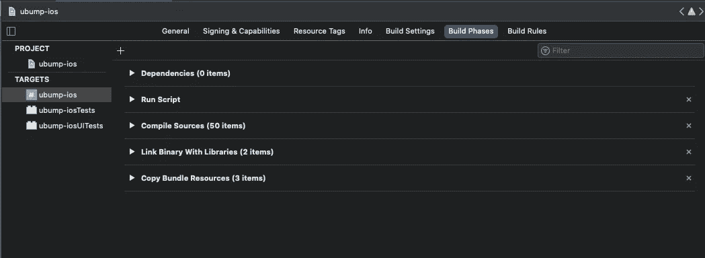
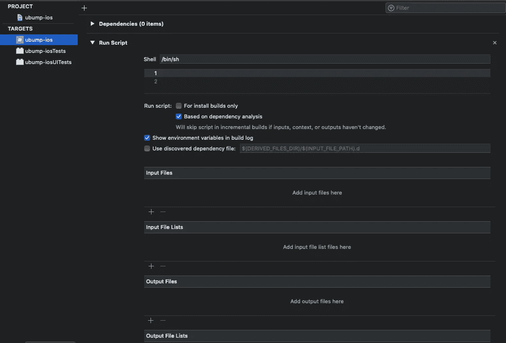

# 像专家一样自动处理您的 Swift 代码

> 原文：<https://betterprogramming.pub/automatically-lint-your-swift-code-like-a-pro-42455abcef79>

## 将自动林挺添加到 Xcode


[K8](https://unsplash.com/@k8_iv?utm_source=medium&utm_medium=referral) 在 [Unsplash](https://unsplash.com?utm_source=medium&utm_medium=referral) 上拍照。

在编写生产 Swift 代码时，确保遵循可读性和格式的最佳实践非常重要。

作为一个带着许多犹豫从 Objective-C 转到 Swift 的人(我可能是在 Swift 发布时仍然倾向于 Objective-C 而不是 Swift 的少数人之一)，我的一个主要担忧是与 Objective-C 相比，弱类型 Swift 有多弱。我不是弱类型语言的狂热爱好者，但随着 Swift 的发展，它比 Objective-C 更受欢迎，编写良好、可读的 Swift 代码是必要的。最简单的方法之一就是使用自动林挺。

如果你使用过 Android Studio 或者有 VS 代码的插件，你可能已经非常熟悉自动林挺了，但是它不是 Xcode 自带的。在本教程中，我将展示如何在构建时将自动林挺添加到 Xcode 项目中。

# 雨燕

Swift 最受欢迎的棉绒是 [SwiftLint](https://github.com/realm/SwiftLint) 。有两种安装方式:使用自制软件或使用 CocoaPods。在我看来，通过自制软件安装是正确的选择——你不必处理 CocoaPods 的麻烦。使用 Homebrew，它将被安装在你的系统上，这样你就可以在任何项目或任何 Swift 文件中使用它，而无需在任何地方运行`pod install`。

要通过 Homebrew 安装它，请运行以下命令:

```
brew install swiftlint
```

运行此命令后，SwiftLint 将安装在您的 Mac 上。从这里，您可以通过命令行在您的项目上运行 SwiftLint，但我使用它的方式是将其构建到 Xcode 中。

# 棉绒与正确

在开始 Xcode 集成之前，我认为最好花点时间回顾一下 SwiftLint 附带的两个命令:`swiftlint`和`swiftlint autocorrect`。

前者`swiftlint`，会在运行时为你产生错误和警告。它不会为你修改你的代码。你必须自己进去做出改变。这有明显的优点和缺点。如果您要采用开发团队认可的、SwiftLint 不喜欢的风格，它不会自动为您更改代码。缺点是，如果您只是将 SwiftLint 添加到一个现有的项目中，您可能需要筛选许多警告，以使您的项目进入合适的状态。

后者，`swiftlint autocorrect`，是我在 Xcode 集成中使用的。

# Xcode 集成

将 SwiftLint 集成到 Xcode 中是一个相当轻松的过程，尽管对于那些害怕接触 Xcode 设置的人来说(我们都知道构建一个项目是多么容易)，这似乎有点陌生。

要开始这个过程，导航到您的项目，然后导航到您的应用程序目标，然后导航到“构建阶段”，如下图所示:



ubump-ios 目标的构建阶段

在上面的截图中，您可以看到我导航到了目标`ubump-ios`的构建阶段，并且已经有了一个“运行脚本”阶段。

如果没有一个阶段的“运行脚本”已经为你准备好了，添加它是非常容易的。只需点击“依赖项”上方的加号按钮(如上图所示)，然后点击“新运行脚本阶段”

我建议您将这个阶段放在编译源代码之前，这样它会自动纠正您在编译项目之前可能出现的任何简单错误。

现在您已经有了一个“运行脚本”阶段，我们将希望在我们的 SwiftLint 脚本中添加。如果你想跑`swiftlint`或者`swiftlint autocorrect`，下面是一样的。首先，点击右边的胡萝卜，按如下方式披露您的阶段内容:



空的运行脚本阶段。

在这里，您会在指定的 shell 下看到一个文本框。在文本框中，键入以下脚本:

```
if which swiftlint >/dev/null; then
    swiftlint autocorrect
```

`if`语句不是必需的，但它只是确保安装了 SwiftLint。如果您想调试未安装 SwiftLint，您可以添加一个`else`和一个`echo`语句，如 SwiftLint 自述文件:

```
if which swiftlint >/dev/null; then
    swiftlint autocorrect
else
    echo "SwiftLint is not installed"
fi
```

如果您想运行`swiftlint`而不是`swiftlint autocorrect`，只需从上面的脚本中删除`autocorrect`这个词，就可以了！至此，您已经将 SwiftLint 集成到 Xcode 中并正常工作了！恭喜你。也就是说，如果您想了解 SwiftLint 提供的一些额外特性，可以继续关注另一部分。

# 额外功能

虽然我无论如何都不是 SwiftLint power 用户(我只是将它添加到我的 Xcode 构建阶段，然后就忘了它)，但是有一些额外的有用命令可能会对您的开发工作流有所帮助。

在命令行上运行`swiftlint help`来获得特性的完整列表。

其中一个特性是`autocorrect`，我们之前已经讨论过了。`lint`是在命令行上运行`swiftlint`时运行的默认命令。

如果您想获得 SwiftLint 中所有规则的 markdown 文件，以真正了解您的代码发生了什么，那么`generate-docs`是一个有用的功能。运行该命令只是在包含所有规则的`.md`文件的目录中创建一个文件夹。

在结束本文之前，我想提及的最后一个特性是在撰写本文时仍处于试验阶段的:`analyze`。根据[文件](https://github.com/realm/SwiftLint):

> “实验性的`swiftlint analyze`命令可以使用完整的类型检查 AST 来 lint Swift 文件。…分析器规则往往比 lint 规则慢得多。”

因此，如果您想要额外的功能集，这是要考虑的事情。但是，如果您只是想要高性能的基本林挺，这可能超出了您的需求范围。

我希望你喜欢这篇文章。编码快乐！