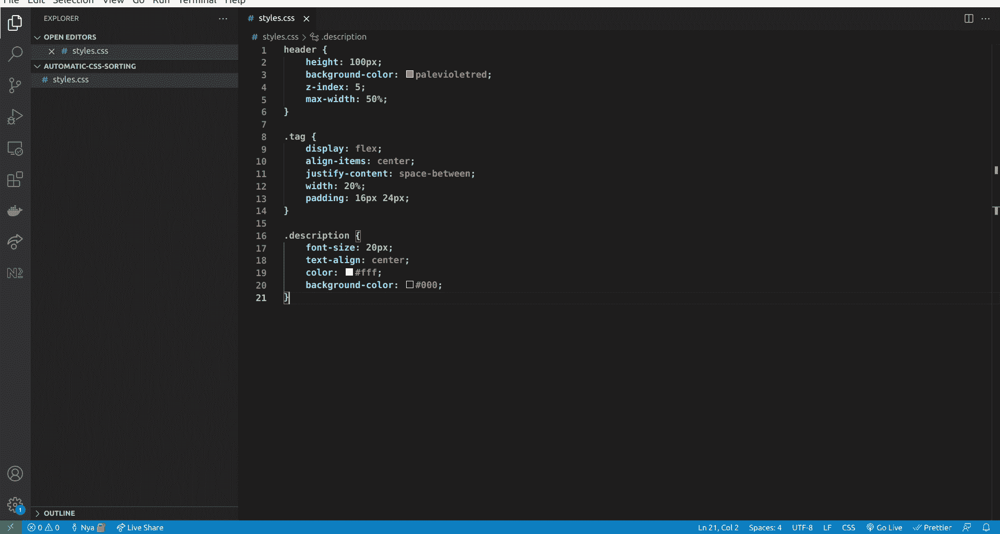
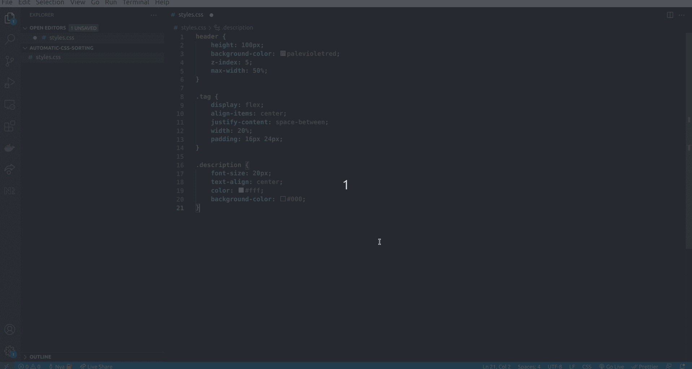
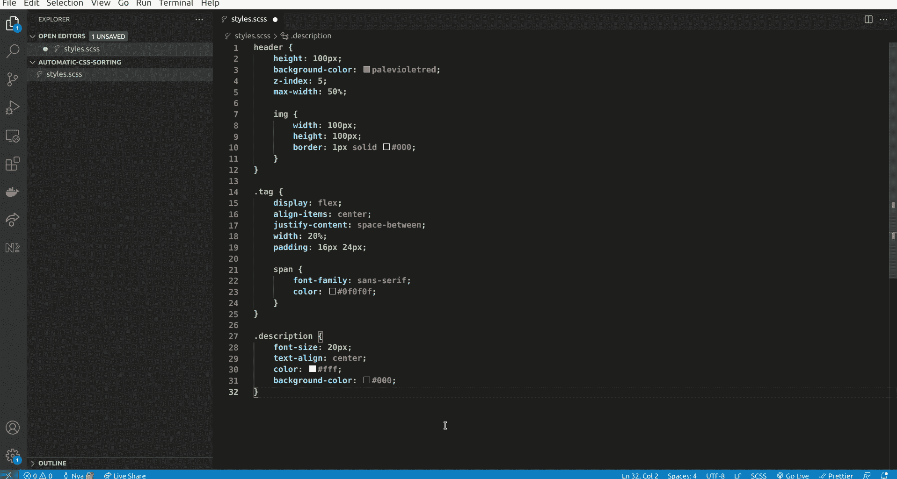

# 在 VS 代码中自动按字母顺序排列 CSS 属性

> 原文：<https://betterprogramming.pub/automatically-order-css-properties-alphabetically-in-vs-code-ec52392e5237>

## 让你的 CSS 规则井然有序


照片由[斯文·布兰德斯马](https://unsplash.com/@seffen99?utm_source=medium&utm_medium=referral)在 [Unsplash](https://unsplash.com?utm_source=medium&utm_medium=referral) 上拍摄

# 介绍

与开发团队合作时，最重要的事情之一是在整个项目中保持一致性。遵循惯例和应用最佳实践会让您更容易有效地作为一个团队工作。根据我的经验，在应用最佳实践时，样式表经常被忽略。

我见过很多 CSS 属性随机排序的项目。这看似无关紧要，但事实上却是如此。遵循特定的排序系统可以提高易读性、开发速度，最重要的是，可以避免荒谬、耗时的合并冲突。

然而，手工排序我们的 CSS 属性显然不是一个可维护的解决方案，它应该自动完成。这正是你将在本教程中学到的:如何在保存时自动排序 CSS，SCSS，LESS 和 PostCSS 属性。

## 索引

*   VS 代码 PostCSS 排序扩展
*   保存时格式化
*   支持多种语言
*   结论

# VS 代码 PostCSS 排序扩展

VS Code PostCSS 是一个 VS Code 插件，允许我们按照指定的顺序对 CSS 规则内容进行排序。它支持 CSS、PostCSS、Less 和 s CSS。

要设置它，请按照下列步骤操作:

1.  打开`settings.json`文件。

*提示:要在 VS 代码中快速打开文件，你可以按 F1 并搜索你想要的任何内容。在这种情况下，搜索设置，并选择“首选项:打开设置(JSON)”选项，以打开* `*settings.json*` *文件。*

2.将以下代码粘贴到文件中:

```
"postcssSorting.config": {
  "properties-order": "alphabetical",
}
```

瞧，我们完成了。为了测试它是否工作，我们可以打开一个包含无序属性的 CSS 文件，按 F1，然后运行`PostCSS Sorting: Run`命令，如下所示:



厉害！我们的 CSS 属性现在按字母顺序排序。然而…

# 保存时格式化

到目前为止，我们已经做得很好了，但是如果文件在保存时被自动格式化，那就更好了。遗憾的是，扩展不支持这个特性。

但我们是开发商，不是吗？我们总能找到解决办法！为了解决这个问题，我们可以使用 [ryuta46 的 VS Code 多命令扩展](https://github.com/ryuta46/vscode-multi-command)，它允许我们创建一个命令序列作为单个命令，并将其绑定到一个键。

要设置它:

1.  打开`keybindings.json`文件。

提示:按 F1，搜索键盘快捷键，并选择“首选项:打开键盘快捷键(JSON)”选项来打开`keybindings.json`文件。

2.将以下配置对象添加到现有数组中(不要忘记保存文件！):

keybindings.json 文件[https://gist . github . com/nya Garcia/e 82 FDE 47 a 697467d 76b 12240d 13078 c8](https://gist.github.com/NyaGarcia/e82fde47a697467d76b12240d13078c8)

我们完了！是时候测试一下了，看看有没有效果。让我们回到无序的 CSS 文件，并保存它:



保存时对 CSS 文件排序

厉害！我们现在可以在保存 CSS 文件时自动进行字母排序。但是如果我们有 SASS 或更少的不同项目，并且我们也想实现自动排序，该怎么办呢？

# 支持多种语言

简单的柠檬汽水！我们所要做的就是在 when 子句中添加一个`||`语句，并添加语言标识符。

你可以在这里找到所有 VS 代码语言标识符[的列表](https://code.visualstudio.com/docs/languages/identifiers)。因此，如果我们还想为 SCSS 文件启用自动排序，我们的文件应该如下所示:

key bindings . JSON[https://gist . github . com/nya Garcia/2d FB 71 ee 62 a 53 f 67258d 8 B1 E4 e 53 e](https://gist.github.com/NyaGarcia/2ddfb71eefe62a53f67258d8b1e4e53e)

让我们来测试一下:



保存时对 SCSS 文件进行排序

# 结论

那都是乡亲们！希望您的 VS 代码已经设置好自动按字母顺序排序任何类型的样式表文件，并且您的团队成员会非常感谢您提高了项目的一致性。

我希望你们都喜欢这个教程，并发现它很有用。感谢您的阅读。