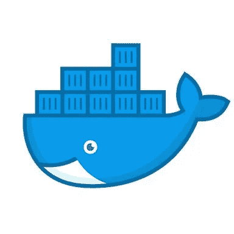
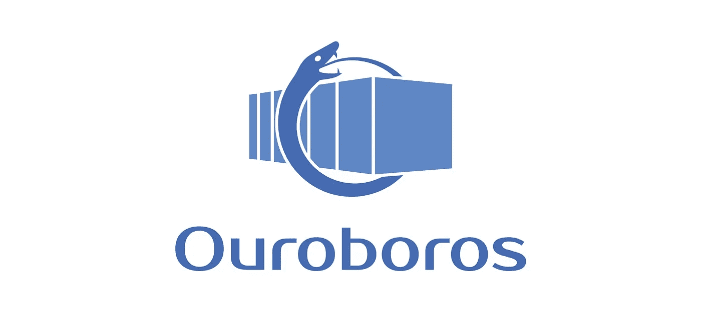

# 一种新的，更好的自动更新 Docker 容器的方法

> 原文：<https://betterprogramming.pub/automatically-update-docker-containers-f2ccc79f4313>

## 我是如何创建 [Ouroboros](https://github.com/circa10a/ouroboros) 的，这是一个基于 Python 的瞭望塔替代品，注重可读性。



# 它只是工作

码头工人现在很流行，对吗？用一个`Dockerfile`打包你的应用，构建，推送到一个注册中心，然后以某种方式让它到达你的云提供商。有一百万种方法可以剥这只猫的皮。🐱

事实是，有人在某个地方设置了一个“正常工作”的容器，但却经常忘记它。我看到一个集装箱连续运行了几个月。这会导致新版本的应用程序缺少功能，或者更糟的是，会导致潜在的安全漏洞，这一切都是因为有人懒得更新映像并在其本地服务器或云中重新创建容器。

# 容器编排

处理这种情况的正确方法是使用 Kubernetes 或 Docker Swarm 进行滚动更新，但对于大多数开发人员来说，这些是“只有运营人员知道如何使用”的黑盒。那么现在会发生什么呢？通常开发者会发布一个`docker run...`并说，“酷，我的应用已经部署好了，现在消费者可以不用再纠缠我了。”

这并不理想…但还是…现实。

# 更新容器

```
docker stop ...
docker rm ...
docker pull ...
docker run ...
```

是的，我们知道那是怎么回事。

# 自动化流程

有一个流行的开源项目叫做 W [atchtower](https://github.com/v2tec/watchtower) ，它能够“观察”在相同的本地或远程主机上运行的 Docker 容器，检查远程注册表中是否有更新的映像，然后使用与实例化容器时相同的配置选项用新映像更新容器。很酷吧？

绝对的。

这个应用程序确实引起了我的兴趣，所以很自然地我开始挖掘源代码，它是用 Go 编写的。问题是，由于缺乏可读性，我无法跟踪应用程序中发生的很多事情。我不是围棋专家，但大多数情况下还是能遵循逻辑的。这不是那种情况…

我认为这是很自然的，因为 Docker 是用 Go 写的。我知道在 Go 和 Python 中有[两个 Docker SDK 选项可用](https://docs.docker.com/develop/sdk/)，所以我心想:“好吧，瞭望塔是自动更新容器的 Go 版本，Python 版本呢？”嗯，你猜怎么着… **它不存在**。

# 重新发明轮子

## 为什么？

看到有人没有使用 D [ocker Python SDK](https://github.com/docker/docker-py) 做类似的事情，我有些震惊。思维过程也是如此，“嘿，我喜欢 Python。我要试一试。”毕竟这是[的啤酒节](https://hacktoberfest.digitalocean.com/)季节。

在玩了一个周末的 Docker Python SDK 之后，我看到了实现的可行性，并且做了一些简单的工作。

我非常兴奋。于是，[大毒蛇](https://github.com/circa10a/ouroboros)诞生了！



[Ouroboros](https://github.com/circa10a/ouroboros) 是一个瞭望塔的替代品，它专注于**可读性**，当然是用 Python 3 编写的。

## 有什么不同？

真的，没有那么多。Watchtower 还有一些额外的功能，但我希望开源社区喜欢 Python 的实现，并加入一些功能。

它仍然执行重新创建容器的必要操作，使用与它们被实例化时相同的选项，不会关闭容器，除非新的映像有不同的 hash，`docker-compose`兼容性，如果您选择这样做，Ouroboros 甚至可以更新自己！

# 你如何使用它？

[Ouroboros](https://github.com/circa10a/ouroboros) 本身作为 Docker 镜像运行，并使用本地套接字与 Docker API 交互。

默认情况下， [Ouroboros](https://github.com/circa10a/ouroboros) 会在轮询当前图像的标签之间等待 5 分钟，但如果你生活危险，你也可以提供一个标志直接进入`latest`。

所以现在你只需要设置你的容器和大毒蛇一次，然后只需等待。您的部署阶段现在只需要将一个更新的标签推送到注册表中，剩下的工作就交给 Ouroboros 去做。

# 安全性

应该提到的是，Ouroboros 只应该在测试环境中作为快速原型开发工具使用——在生产环境中公开 Docker API 是不好的，并且存在安全风险。

另外，你不会真的想要现在生产中的自动更新，是吗？或许你知道，你说了算。

# 这么多配置

Ouroboros 支持许多不同的[配置选项](https://github.com/pyouroboros/ouroboros/wiki/Usage)，例如:

*   监控和更新运行 Docker 的多个远程服务器上的容器
*   监控当前图像标签或直接进入`latest`
*   忽略特定容器
*   支持私有注册中心
*   自定义轮询间隔
*   按名称监控选择容器
*   更改调试/抑制的日志记录级别
*   只运行一次 ouroboros 来更新，然后自行终止
*   创建新容器时删除旧的 Docker 图像
*   导出普罗米修斯，流入指标去你的格拉夫纳仪表板！
*   当容器更新时，可以触发多个 webhooks。支持不一致、松弛、推倒和通用 webhooks
*   可以在容器更新时发送电子邮件

我能理解这并不适用于每个人。在某些情况下，包括我自己。不管怎样:

*   我玩得很开心。
*   它实际上变成了一个相当规模的开源项目。
*   学习更好的 Python 测试方法。
*   repo 的源代码可以作为一个很好的例子，说明如何与 Docker API 进行交互和自动化。
*   我把开源还给了 Hacktoberfest。

[源代码和详细使用文档](https://github.com/pyouroboros/ouroboros)

# 项目更新:

在受欢迎程度和需求快速增长之后，大毒蛇已经转移到了它自己的名为 [pyouroboros](https://github.com/pyouroboros/) 的组织下！该项目被完全重写为面向对象，增加了大量新功能！

多亏了一个新的维护者(DirtyCajunRice)，这个项目进展顺利！

请务必查看 [wiki](https://github.com/pyouroboros/ouroboros/wiki) ！

# 鳍状物