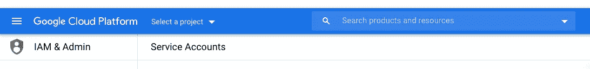
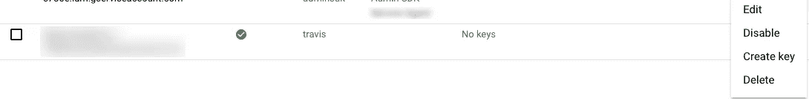
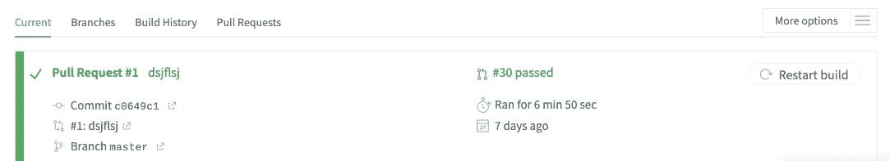
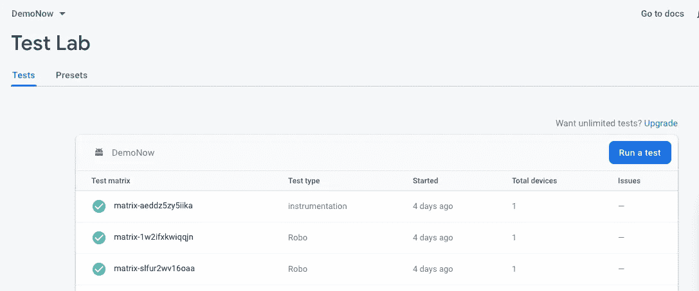

# 使用 Firebase Test Lab 和 Travis CI 自动化 Android UI 测试

> 原文：<https://betterprogramming.pub/automating-android-ui-tests-with-firebase-test-lab-and-travis-ci-51fcb997cbc1>

## 将 CI 添加到您的 Android 工作流程中


由 [Pathum Danthanarayana](https://unsplash.com/@pathum_danthanarayana?utm_source=medium&utm_medium=referral) 在 [Unsplash](https://unsplash.com?utm_source=medium&utm_medium=referral) 拍摄的照片

如果您的 CI 系统是 Travis，那么在其上运行 UI/插装测试用例不是一个有效的解决方案。在模拟器上运行测试用例需要一段时间，因为设置模拟器需要时间，而且如果在 45 秒内没有得到响应，一些测试用例可能会失败。此外，您将无法在多个设备上运行相同的测试来查找特定设备上的错误。

[Firebase 测试实验室](https://firebase.google.com/products/test-lab/?gclid=EAIaIQobChMIk_293Ii56wIVDa_ICh2F7wwfEAAYASAAEgIcffD_BwE)可以解决这些问题中的大部分。它在谷歌数据中心托管的设备(物理和虚拟)上运行测试。这是一个基于云的应用测试基础设施。您可以指定它应该在哪些设备上运行，因此您也可以找到特定设备/配置上的问题。与 Travis CI 上的模拟器设置和测试相比，在 Travis CI 中运行 Firebase Test Lab 的设置花费的时间要少得多。您还可以在 Firebase 控制台中看到结果，包括日志、视频和截图。

让我们从集成 Travis CI 工作流和 Firebase 测试实验室开始。

要求:GitHub 账户， [Travis CI](https://travis-ci.org/) 账户， [Firebase](https://firebase.google.com/) 账户

# 1.将 Travis CI 添加到 Android

*   使用 GitHub 注册/登录您的 Travis CI 帐户:[travis-ci.org](https://travis-ci.org/)
*   进入设置，你应该会看到你的 GitHub repos。使用切换按钮启用您尝试使用 Travis CI 的存储库。
*   将一个`.travis.yml`文件添加到项目的根文件夹中。


将. travis.yml 文件添加到项目目录的根目录下(图片来源:作者)

[维基百科](https://en.wikipedia.org/wiki/YAML)这样定义 [YAML](https://yaml.org/) :

> YAML 是一种人类可读的数据序列化语言。它通常用于配置文件和存储或传输数据的应用程序中。

正如 Travis CI 的[维基百科](https://en.wikipedia.org/wiki/Travis_CI)条目所说，

> 此文件指定使用的编程语言、所需的构建和测试环境(包括在构建和测试软件之前必须安装的依赖项)以及各种其他参数

# 2.在你的应用中集成 Firebase

遵循以下链接中的基本步骤:

【https://firebase.google.com/docs/android/setup 

# **3。用 Firebase 账号**设置 Gcloud

在将 Firebase Test Lab 与 Travis 集成之前，您需要完成以下步骤，如 [Firebase 站点](https://firebase.google.com/docs/test-lab/android/continuous)中所述。

## 1.设置 gcloud

根据 Firebase 网站，您需要从 gcloud 命令行使用 Firebase Test Lab 按照[的说明创建一个 Firebase 项目，并配置您的本地 Google Cloud SDK 环境。](https://firebase.google.com/docs/test-lab/android/command-line)

这里您需要在终端中添加 Google cloud CLI 命令:

我们希望 Google Cloud SDK 安装在 Travis CI 中。因此，我们将在 shell 脚本(`build_command.sh`文件)中编写命令来下载它们，同时在`.travis.yml`文件中调用脚本来执行。您可以稍后在脚本文件中添加该脚本。

**在终端中执行以下命令。**

确保您的安装是最新的:

```
gcloud components update
```

使用您的 Google 帐户登录 gcloud CLI:

```
gcloud auth login
```

这将打开浏览器，让您使用安装 Firebase 时使用的帐户登录。

## 2.创建服务帐户

根据 [firebase 站点](https://firebase.google.com/docs/test-lab/android/continuous)，服务帐户不受垃圾邮件检查或验证码提示的影响，否则会阻止您的 CI 构建。在[谷歌云平台控制台](https://console.cloud.google.com/iam-admin/serviceaccounts/)中创建一个具有编辑角色的服务账户。

按照以下步骤从 google 云平台控制台下载服务帐户 json 文件:

在 Google 云平台控制台中选择 firebase 项目，然后点击“创建服务帐户”。向其添加项目编辑角色。完成所有步骤后，您会发现 Create key 选项用于下载服务帐户 JSON 文件。



**图片鸣谢:作者。**选择 firebase 项目，将 firebase 测试实验室集成到 travis CI 中


**图片鸣谢:作者。**点击顶部的创建服务账户按钮



完成所有步骤后，选择 create key 下载 service-account.json 文件(图片来源:作者)

您应该使用以下命令加密服务帐户文件并将其添加到 Travis 的全局环境中。(关于文件加密的更多信息可以在 [Travis 文档](https://docs.travis-ci.com/user/environment-variables/)中找到。)

```
travis encrypt service-account.json --add env.global
```

上述命令的输出如下。一旦执行上述命令，它将自动添加到您的`.travis.yml`文件中。如果您不想将这个输出添加到 Travis 环境中，也可以手动将它添加到您的`.travis.yml`文件中。

```
- openssl aes-256-cbc -K $encrypted_XXXXXXXXXXXX_key -iv $encrypted_XXXXXXXXXXXX_iv
  -in service-account.json.enc -out service-account.json -d
```

## 3.启用必需的 API

根据[火灾现场](https://firebase.google.com/docs/test-lab/android/continuous)，

> 使用服务帐户登录后:在[谷歌开发者控制台 API 库页面](https://console.developers.google.com/apis/library)中，启用谷歌云测试 API 和云工具结果 API。要启用这些 API，请在控制台顶部的搜索框中键入这些 API 名称，然后在该 API 的概述页面上单击启用 API。


埃利斯·陈嘉炜在 [Unsplash](https://unsplash.com/?utm_source=medium&utm_medium=referral) 上拍摄的照片

恭喜你用你的 firebase 项目配置了 Gcloud。

# 4.最后的步骤:您的. travis.yml 文件应该如下所示

这个文件指定了我们正在使用的语言及其版本。在我们的例子中，我们使用 Android 和它需要安装的组件，以便应用程序在 CI 环境中运行，以及它需要接受的许可证，以便运行它们。接下来，我们添加脚本`build_command.sh`,一旦 Travis CI 收到您推送到 GitHub 的提交，我们就要执行该脚本。

```
**language**: android
**jdk**:
- oraclejdk8
**sudo**: required
**dist**: trusty
**env**:
  **global**:
  - BRANCH_NAME=master
  - ANDROID_BUILD_TOOLS=29.0.3
**android**:
  **components**:
  - android-29
  - build-tools-$ANDROID_BUILD_TOOLS
  - extra-google-google_play_services
  **licenses**:
  - **".+"
before_cache**:
- rm -f $HOME/.gradle/caches/modules-2/modules-2.lock
**cache**:
  **directories**:
  - **"$HOME/.gradle/caches/"** - **"$HOME/.gradle/wrapper/"
before_install**:
- openssl aes-256-cbc -K $encrypted_XXXXXXXXXXXX_key -iv $encrypted_XXXXXXXXXXXX_iv
  -in service-account.json.enc -out service-account.json -d
**before_script**:
- env
**script**:
- **"./build_command.sh"**#*Code credit : Author*
```

在您的 Android 项目的根目录中添加一个 Bash 脚本文件，用于在您的 CI 环境中下载 Google Cloud SDK，并激活 gcloud 凭据和命令来生成 Android APK 和测试 APK，并在 Firebase Test Lab 上运行它们。

## 构建命令文件

下面的 shell 脚本很大程度上是受[这篇文章](https://imnotyourson.com/android-instrumented-tests-on-firebase-test-lab-with-travis-ci/)的启发:

Firebase 测试实验室支持的 Android 测试类型:

*   Robo 测试:这是一种不需要编写任何预定义测试用例的测试，将在 APK 上自动运行，并将记录步骤并在测试实验室中显示结果。
*   仪器测试:这是您将在 Android Studio 上编写的测试用例，用于执行各种测试场景。测试实验室将运行在测试命令中提供的`androidTest.apk`文件中找到的所有测试用例。

如果您第一次集成了 Travis CI，那么进行一些更改，推送至 GitHub，并通过 Travis CI 网站查看构建运行情况。对于成功的构建，您应该会看到类似这样的内容:



Travis CI build(图片来源:作者)

对于在 Firebase 测试实验室上运行的测试，您将看到类似这样的结果。



Ui 测试用例的测试实验室结果(图片来源:作者)

# **有用链接**

[https://imnotyourson . com/Android-instrumented-tests-on-firebase-test-lab-with-Travis-ci/](https://imnotyourson.com/android-instrumented-tests-on-firebase-test-lab-with-travis-ci/)

[https://firebase . Google . com/docs/test-lab/Android/continuous](https://firebase.google.com/docs/test-lab/android/continuous)

[https://firebase . Google . com/docs/test-lab/Android/命令行](https://firebase.google.com/docs/test-lab/android/command-line)

[https://firebase.google.com/docs/test-lab/android/overview](https://firebase.google.com/docs/test-lab/android/overview)

目前就这些。快乐学习！