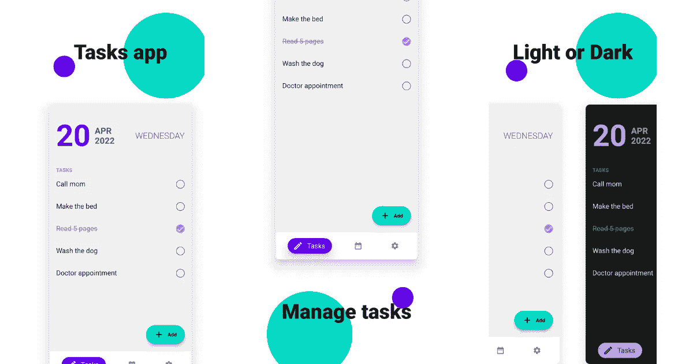
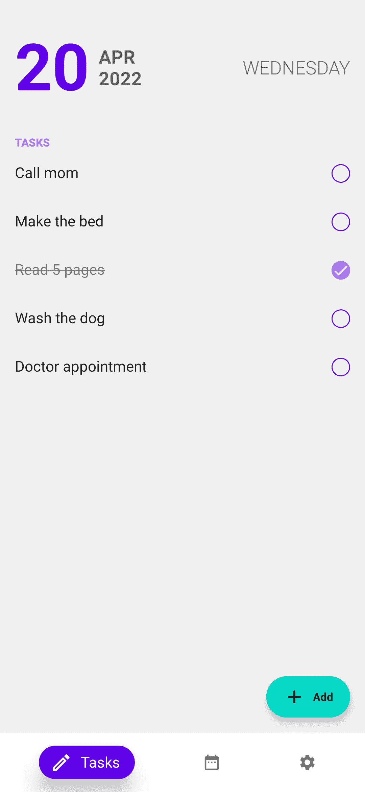
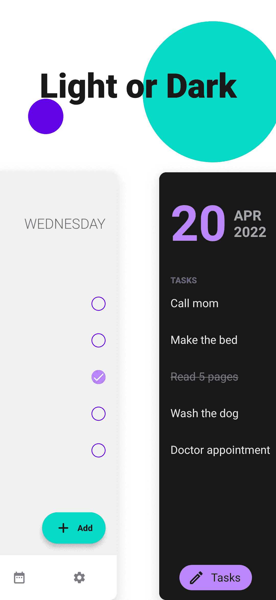
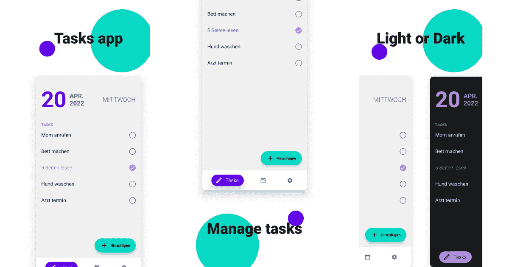

# 使用 Jetpack Compose 自动生成漂亮的屏幕截图

> 原文：<https://betterprogramming.pub/automating-beautiful-screenshots-using-jetpack-compose-44aa77c76d3f>

## 为您的 Android 应用程序创建灵活的设计



截图是用户对我们 app 的第一印象。因此，为了展示我们最好的一面，我们需要展示设计最好的截图。

但是图形化设计截图很费时间。在想出一个独特的设计后，你仍然需要将它应用到你的应用程序的所有变体上。这可以是电话或平板电脑、多个本地化版本等。当你的界面有更新时，你将不得不重做这个过程，或者至少对受影响的截图来说。

自动截图已经能够解决这些问题中的大部分。有像 fastlane 这样的工具，可以让我们以我们想要的各种不同方式自动截取应用程序的屏幕截图，所有这些只需一个人花费的一小部分时间。

这样做的不利之处在于，自动拍摄截图会让你失去帮助你脱颖而出的独特性。

在本文中，我们将使用 UI 测试和 Jetpack Compose 来设计我们的屏幕截图，并使用 fastlane 自动捕获它们。

# 开始之前

*   使用 compose [熟悉 UI 测试。](https://developer.android.com/jetpack/compose/testing)
*   设置[快车道](https://docs.fastlane.tools/getting-started/android/setup/)并浏览关于自动截图的[快车道文档](https://docs.fastlane.tools/getting-started/android/screenshots/)。(或者用这个[教程](https://medium.com/open-knowledge/fastlane-for-android-automate-everything-part-2-bb200076a697))

# 编排截图



下面是简单截图的方法。在测试本身之前，我们有一些设置 fastlane 截图工具的代码。但是最重要的部分在`composeTestRule.setContent`里面。在这里，当设计一个普通的应用程序时，我们可以使用任何可用的可组合组件。例如，我们可以为整个应用程序添加一些填充和阴影。

//卡片截图

从这里开始，你只受限于你的想象力(或者你的设计师的；).你可以添加一个解释截图的标题，添加一个背景，突出一个特征，等等。


在这个例子中，我在应用程序上方添加了一些文本，并将其向下偏移。我还用两个盒子添加了一个简单的背景。您还可以实例化应用程序的两个版本，以显示应用程序的多个版本。



在这里，我们有一个黑暗和光明版本的应用程序并排。因为`App`只是一个可组合的，我们可以很容易地创建它的两个并排版本。当在单个屏幕截图中显示应用程序的不同状态时，这很有用。

# 浪子

对于这个示例，我使用 fastlane 来自动运行 UI 测试，并获取和管理屏幕截图。如果您的应用程序已本地化，它可以用多种语言截图，并自动上传到 play store。对于这个例子，我只是有一个简单的车道，使一个干净的建设，并采取截图。

```
lane :screenshots do  
  gradle(task: "clean assembleDebug assembleAndroidTest")  
  screengrab  
end
```

我还有一个文件，它定义了 apk 在哪里，以及我想要截屏的语言。

```
locales ['en-US', 'de-DE']  
clear_previous_screenshots true  
tests_apk_path 'app/build/outputs/apk/androidTest/debug/app-debug-androidTest.apk'  
app_apk_path 'app/build/outputs/apk/debug/app-debug.apk'  
test_instrumentation_runner 'androidx.test.runner.AndroidJUnitRunner'
```

所以，我也可以自动生成相同设计和代码的德语截图。



如何设置自动化取决于您和您的工作流程。但是本文的要点是展示 Jetpack Compose 如何使我们能够灵活地设计我们的截图。我希望有了这个，你能够创造出令人敬畏的截图。示例项目的源代码是这里的[和](https://github.com/sinasamaki/Screenshots)。

感谢阅读，祝你好运！

*最初发表于*[T5【https://sinasamaki.com】](https://sinasamaki.com/post/2022-04-20-auto-screenshots/)*。*