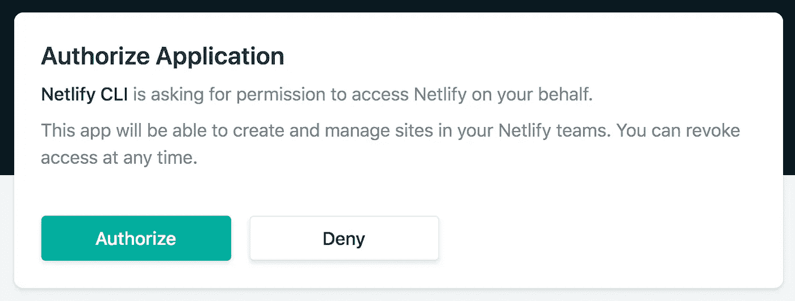
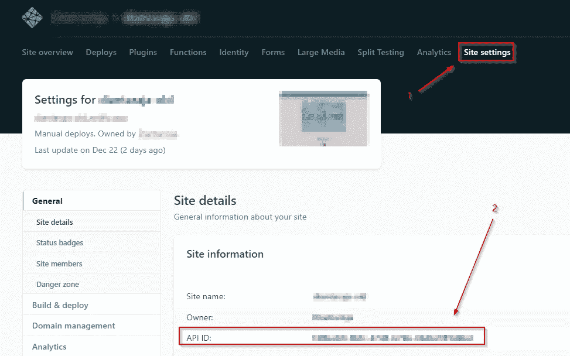
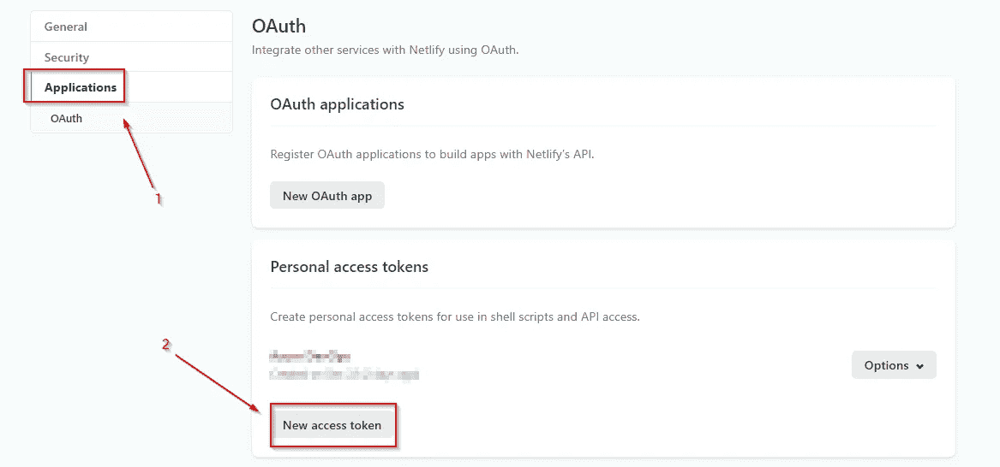
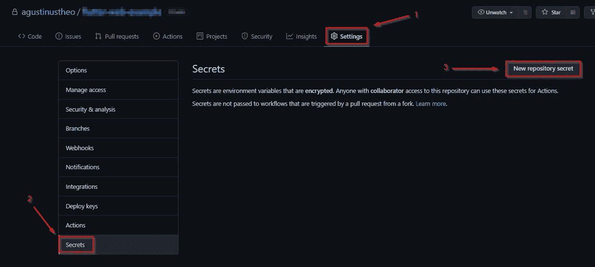
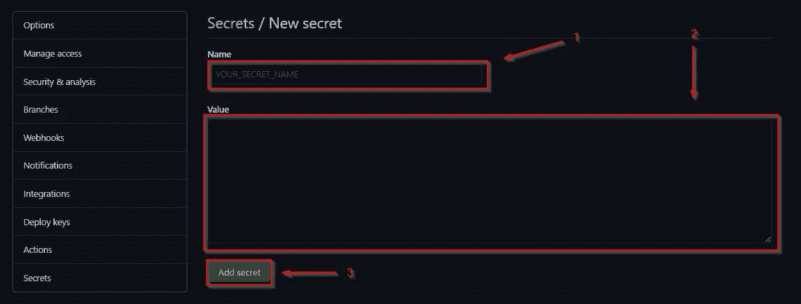
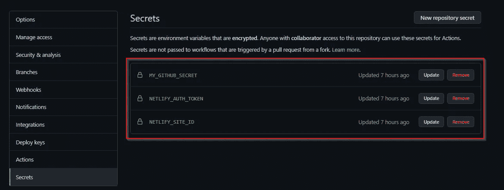
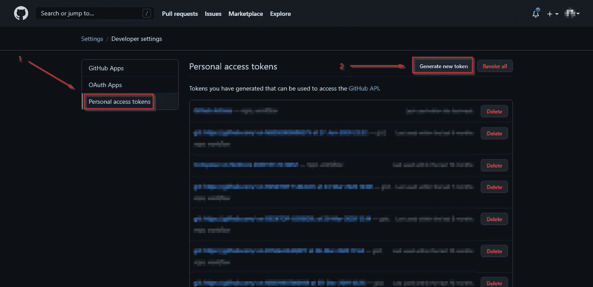
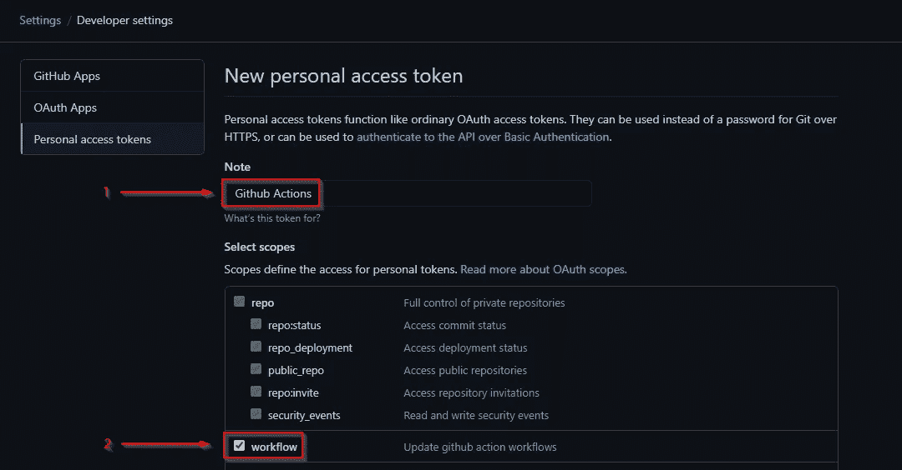
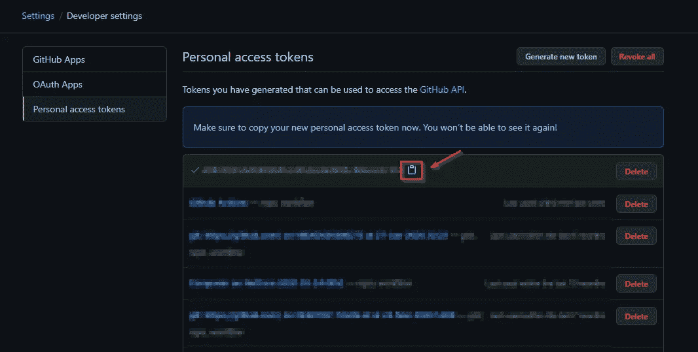

# 使用 GitHub 动作自动将 Flutter Web 部署到 Netlify

> 原文：<https://betterprogramming.pub/automating-flutter-web-deployments-to-netlify-using-github-actions-411a6b24d023>

## 如何使用 GitHub 操作将 Flutter 部署到 Netlify 的分步指南


弗兰克·麦肯纳在 [Unsplash](https://unsplash.com?utm_source=medium&utm_medium=referral) 上拍摄的照片

最近，有很多关于颤振的大惊小怪。有人称之为未来，有人说被高估了。但是我认为这仍然是一个很好的学习框架。使用 Flutter 可以做的事情之多令人难以置信，包括 Android、iOS、桌面和 web 编程。

在本教程中，我将分享如何使用 GitHub 动作实现你的 Flutter web 部署。另外，我们将使用 Netlify。为什么是 Netlify？因为，说实话，Netlify 非常好用。现在，事不宜迟，让我们开始吧。

# 创建您的网络生活网站

本节将讨论如何使用 Netlify CLI 创建空的 Netlify 站点。我们将使用 npm 为我们安装它。在我的例子中，我使用 Ubuntu 18.04 作为 npm 安装的主机操作系统。

## 1.安装 Netlify CLI

要安装 Netlify CLI，您只需运行:

```
npm install netlify-cli -g
```

安装完成后，通过运行以下命令检查安装是否正确:

```
netlify
```

## 2.从 CLI 登录 Netlify

在开始使用 CLI 之前，Netlify 需要您验证自己的身份。

```
netlify login
```

然后会打开一个浏览器窗口:



授权 CLI。图片来自[网络生活文档](https://docs.netlify.com/cli/get-started/#obtain-a-token-via-the-command-line)。

## 3.创建空白网站

完成登录后，使用以下命令创建一个空白站点:

```
netlify sites:create --name *<site name>*
```

## 4.检索您的站点 ID 和个人访问令牌

要远程运行 continuous development，您需要站点 ID 和个人访问令牌来帮助您。



在网站设置中检索网站 ID。图片由作者提供。

通过以下方式检索您的站点 ID:

1.  进入站点设置。
2.  复制 API ID 值。

下一步是检索个人访问令牌。


转到用户设置。图片由作者提供。

转到用户设置。



获取新的访问令牌。图片由作者提供。

要获得访问令牌，您必须创建一个新令牌:

1.  转到应用程序选项卡。
2.  点按“新访问令牌”

复制并保存下一个屏幕上显示的访问令牌，并保存它，因为您以后会需要它。

# 设置存储库机密

在我们获取了访问令牌和站点 ID 之后，我们将把它们保存在存储库 secret 中。

**注意:**为什么我们需要使用存储库机密？以防止敏感 id 或令牌被推送到存储库。



打开您的存储库设置。图片由作者提供。

要创建一个秘密:

1.  转到存储库设置。
2.  单击左侧选项卡上的机密。
3.  点按“新存储库密码”



创造一个新的秘密。图片由作者提供。

在“新密码”页面上输入密码名称和值。完成后，点击“添加密码”按钮。



整体而言，我们添加了三个秘密:GitHub 个人访问令牌、Netlify 个人访问令牌和 Netlify 站点 ID。

# 检索 GitHub 访问令牌

因为我们要使用 GitHub 动作来自动化部署，所以需要一个个人访问令牌。你需要在这里打开你的 [GitHub 开发者设置](https://github.com/settings/tokens)。



GitHub 开发者设置。图片由作者提供。

打开开发者设置页面后:

1.  打开“个人访问令牌”页面。
2.  为 GitHub 操作生成新的令牌。



生成新的个人访问令牌。图片由作者提供。

接下来的步骤是:

1.  输入令牌的名称。
2.  检查工作流程以访问 GitHub 操作。
3.  滚动到页面底部。
4.  单击“生成令牌”按钮。



令牌已成功生成。图片由作者提供。

复制访问令牌并将其保存在某个地方，因为稍后会用到它。

# 创建 CI/CD 工作流

使用 GitHub 动作的 CI/CD 相当简单。它要求我们制作一份 YAML 档案。这个 YAML 文件在 GitHub Actions 中被称为*工作流*，因为它定义了形成 CI/CD 所需的步骤。

GitHub Actions 工作流触发对主分支的推/拉请求。

要启动我们的工作流，我们必须在向主分支发送推/拉请求之后启动构建，假设所有部署都来自主分支。

构建 Flutter web 项目的工作流

对于颤振建设过程中，我使用了一个行动，由苏博西托。你可以在这里查看[颤振动作细节](https://github.com/marketplace/actions/flutter-action)。对于 Flutter web，我们首先必须初始化配置以启用 web 构建。因此，我们运行:

```
flutter config --enable-web
```

然后如果你想要添加测试到工作流中，你可以通过添加命令:

```
flutter test
```

最后，使用以下工具构建应用程序:

```
flutter build web
```

构建的结果将保存在`build/web`文件夹中。

将 Flutter web 构建推送到 Netlify 的工作流

成功构建后，手动将文件部署到 Netlify。下面是我用 nwtgck 的一个片段。我改变了一些变量，以便能够发布 Flutter 应用程序，但你可以在这里检查 [Netlify 操作](https://github.com/marketplace/actions/netlify-actions)。

在最后一个工作流中，您将访问我们之前存储在存储库设置中的秘密。整个工作流程可以从下面这个要点复制过来:

Flutter web 工作流的全部要点

您的 CI/CD 工作流应该已经完成。将工作流保存在`.github/workflows`中，并尝试自己运行它！你可以在这里查看我部署的虚拟站点。

# 摘要

我们已经使用 Github Actions 成功地为 Flutter web 创建了一个 CI/CD 管道。总结我们的步骤:

1.  创建一个空白网站。
2.  从 Netlify 和站点 ID 中检索个人访问令牌。
3.  从 GitHub 检索个人访问令牌。
4.  设置存储库设置中的秘密。
5.  在`.github/workflows`里面创建一个 GitHub 动作 YAML 文件。

瞧啊。我们已经完成了我们的教程。现在你有了一个开放的剧本，可以使用 GitHub Actions 部署你未来的 Flutter web 应用。