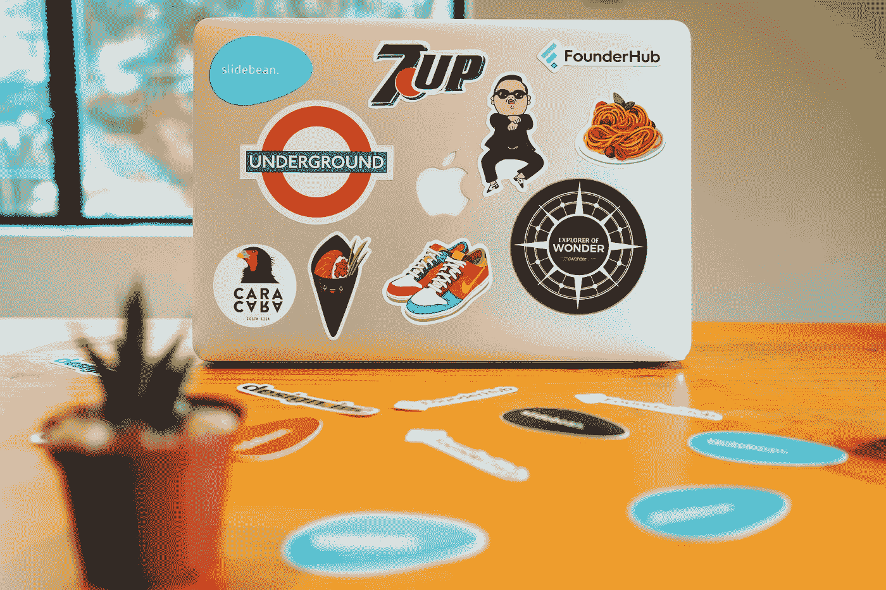
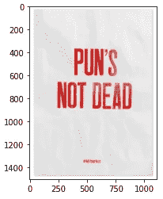
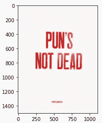
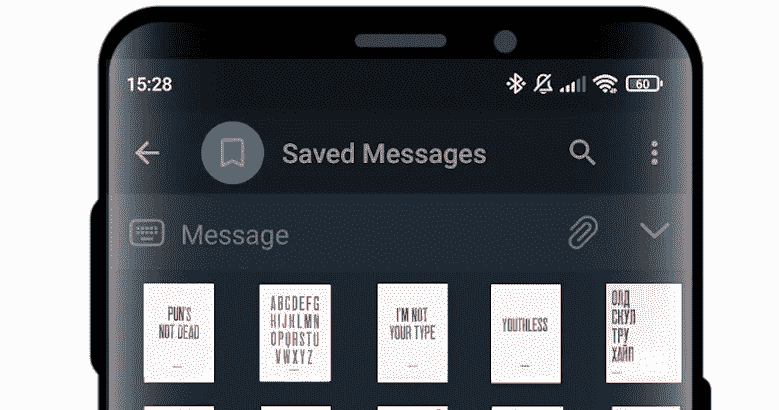

# 使用 Python 中的 Web 抓取和图像处理自动生成贴纸

> 原文：<https://betterprogramming.pub/automating-sticker-generation-with-web-scraping-and-image-processing-in-python-6eccdc39975c>

## 为消息平台快速生成贴纸

[Slidebean](https://unsplash.com/@slidebean?utm_source=medium&utm_medium=referral) 在 [Unsplash](https://unsplash.com?utm_source=medium&utm_medium=referral) 上拍照

在这篇文章中，我将告诉你我是如何从网上商店的海报图片中生成 42 个电报贴纸的。店里卖各种有搞笑双关语的海报，但是没有对应的贴纸。让我们创造它们吧！

唯一的问题是，要制作一张贴纸，你需要从网页上下载一张图片，在 photoshop 中将字母与背景分开，并以适合电报贴纸的分辨率保存。对于 42 幅图像来说，这将是非常耗时的，所以让我们尝试自动化这个过程。

所以计划是这样的:

1.  web scraping——解析网上商店的所有图片。
2.  自动从背景中分离字母，从背景中删除阴影，使图片看起来更像扫描。

# 下载图片

首先，让我们创建一个单个海报页面的所有链接的列表。这样，我们就可以下载高分辨率的图片了。主画廊里的照片分辨率太小了。

为此，让我们保存图库中图片的所有链接。

画廊分为四页，每一页包含 15 张海报。要进入下一页，加上`?offset=` 15 或 30 或 45 就足够了。这允许我们解析剩余的链接。

最后一部分就是按照所有的链接，从产品页面下载高分辨率的图片。

图片由海报上的文字命名，所以我们需要删除名称中的禁用字符，如“/”、“和“*”。

# 图像处理

不幸的是，网上商店包含海报的照片，而不是扫描件。所以我们不能照原样使用它们。下面是一个典型图片的示例:

图片上的 poser 是从侧面照亮的。这使得纸张的纹理清晰可见。在某些情况下，使用亮度阈值来区分字母很有挑战性，因为在某些情况下，字母可能比背景的某些部分更亮。这种方法在这种情况下并不通用。

为了实现一种适合所有可能的光线条件的方法，让我们利用所有海报都在白色或灰色背景上包含大红色字母的事实。数字图像的每个像素是三个数字的向量。一个灰色的像素，不管是亮还是暗，都是由三个相似的数字组成，而一个彩色的像素会包含彼此不同的数字。

因此，基于标准差阈值而不是亮度来分离背景更有效。经过几次尝试，我发现这样一个阈值的一个好的估计是 30。

在检测到一个像素是背景的一部分后，让我们将它的值设置为(245，245，245)。作为字母一部分的像素将被设置为更接近(200，17，11)。背景不会是完美的白色，但这样看起来更好，因为没有完美的白纸，贴纸需要模仿海报。

结果如下:

现在，最后一步是调整图像的大小，使最长的尺寸为 512。为了调整所有图像的大小并保存为 png 文件，我将使用 PIL 图书馆。

结果如下:

以及 GitHub 的[链接给感兴趣的人。](https://github.com/Megachell/sticker-generation)