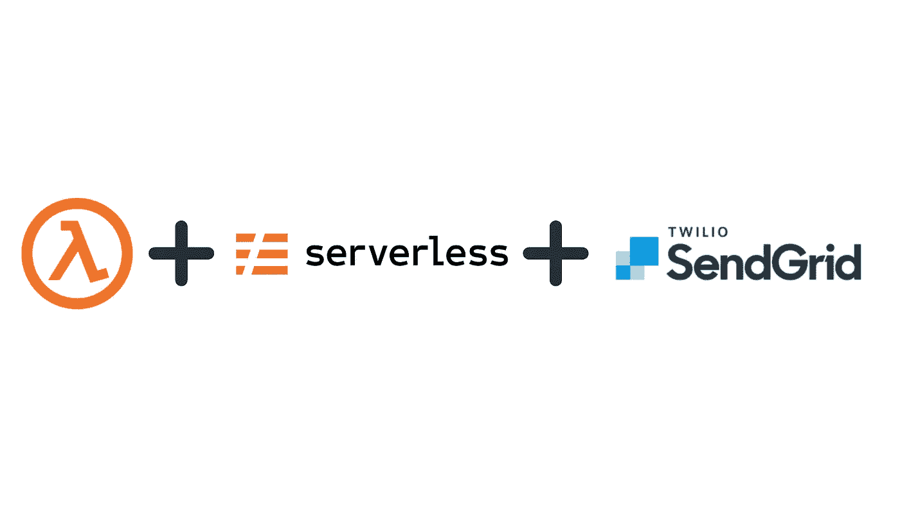

# 使用 SendGrid API 和 AWS Lambda 自动化事务性电子邮件

> 原文：<https://betterprogramming.pub/automating-transactional-emails-using-sendgrid-api-and-aws-lambda-58aaf781e09f>

## 争取回更多的时间



图片来源:作者

最近，我被要求使用 SendGrid API 自动处理事务性电子邮件，因为我们有一个无服务器后端，所以我选择创建一个 AWS Lambda，负责拍摄内部使用 SendGrid API 的确认电子邮件。我决定这样做。这是最简单的一篇文章，如果你打算自动发送电子邮件来生成收据等。

# 访问发送网格仪表板

一旦您使用 SendGrid API 凭证登录并访问[仪表板](https://app.sendgrid.com/)，您需要访问电子邮件 API 选项卡，在该选项卡下您需要单击“动态模板”。动态模板是可以用来拖放或使用 HTML 和手柄实际编码来创建电子邮件 UI 部分的模板。是一个简单的模板语言，你可以结合 HTML 模板来填充动态数据。继续选择任何适合你需求的模板，收集`template_id`供你参考，以便在我们的 Lambda 代码中使用这个 id。

# 创建消息对象

消息对象是 SendGrid API 在您调用它时所期望的输入对象。让我们从创建一个非常基本的`msg`对象开始，比如:

`to`:有两个密钥——电子邮件和姓名。email 保存收件人的电子邮件 id，name 保存收件人的姓名。

`from`:有两把钥匙——邮箱和名字。email 保存发件人的电子邮件 id，name 保存发件人的姓名。

`bcc`:邮件对象数组。所有你想包含在密件抄送中的电子邮件 id 都可以放在这里。

`templateId`:您为 SendGrid 仪表板上的 UI 部件最终确定的模板的模板 id。

`dynamic_template_data`:假设我正在构建一个预订确认模板，其中我想要几个变量作为我的动态数据值。例如像入住、退房、姓名、预订确认等值。将会是动态的。为了处理这样的动态数据点，我们将在 HTML 模板中使用 handlebars。要创建一个变量，你需要在 HTML 模板中使用三个花括号语法。

```
<p>
Here is your confirmation number : {{{confirmation_number}}}
</p><p>
Your check in date is : {{{check_in}}}
</p>
```

为了提供 confirmation_number 和其他变量，您需要创建一个 JSON 对象，其中包含模板中需要的所有变量值。你可以在这里探索更多关于车把[的信息。](https://docs.sendgrid.com/ui/sending-email/adding-dynamic-content-with-handlebars-in-marketing-campaigns)

```
{
   "confirmation_number": "123",
   "check_in": "2021-10-01"
}
```

然后这个 JSON 就被输入到`dynamic_template_data`中。

# 点击 SendGrid API

SendGrid API 提供了许多可以用于不同用例的方法。为了发送电子邮件，我们将使用一个简单的语法。

这里，`callback()`指的是 AWS Lambda 调用的回调，返回响应。

# 将代码包装在 Lambda 函数中

我是这样将代码包装在 Lambda 函数中的:

一个示例事件对象 JSON 看起来像这样:

您可以使用无服务器-离线来模拟运行这个 lambda 函数。如果事件对象配置正确，您应该会得到一个状态代码 200，并且您应该会在提到的地址收到一封电子邮件。

如果你计划使用一个无服务器的框架，这就是你的`serverless.yaml`文件的样子。

此外，当发送电子邮件时，您可以选择使用异步方式调用 lambda，因为这个操作可以异步处理。

# 结论

使用上述方法，您可以创建任何类型的交易电子邮件，并使用手柄保持您的数据动态。通过访问 [SendGrid 的模板](https://sendgrid.com/solutions/email-api/dynamic-email-templates/)，探索你想要的用户界面。

对我来说，让它与更复杂的动态数据变量一起工作是一个相当漫长的旅程。

感谢阅读。订阅我的[时事通讯](https://parulmalhotra.substack.com/?r=2cisn&utm_campaign=pub&utm_medium=web&utm_source=copy)获取更多关于我所学和所做的事情的更新。