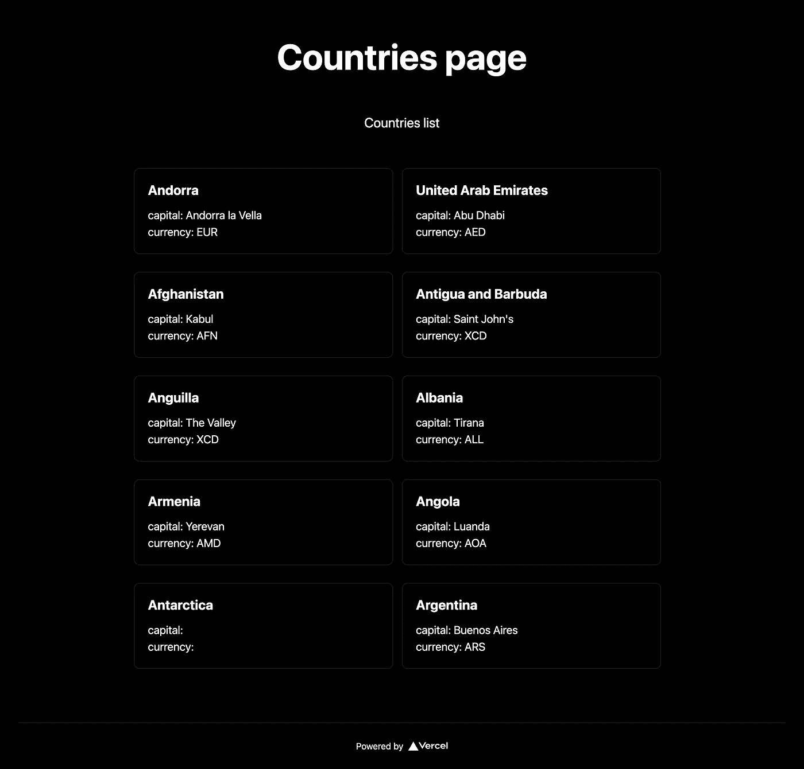
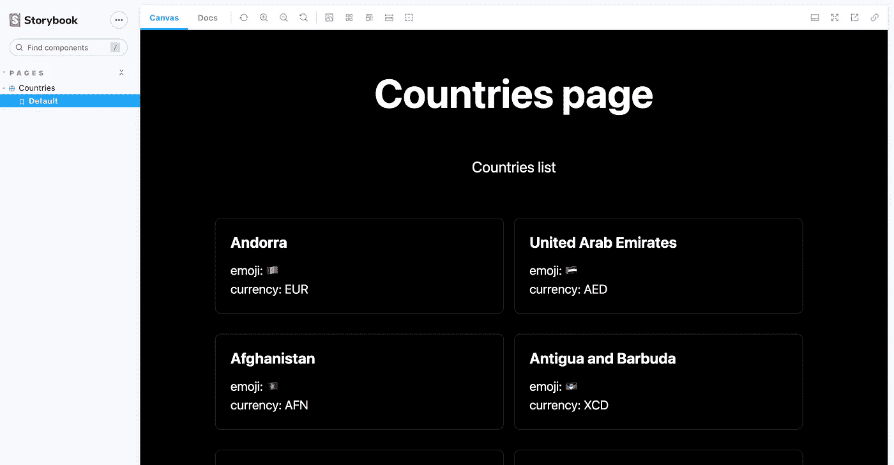
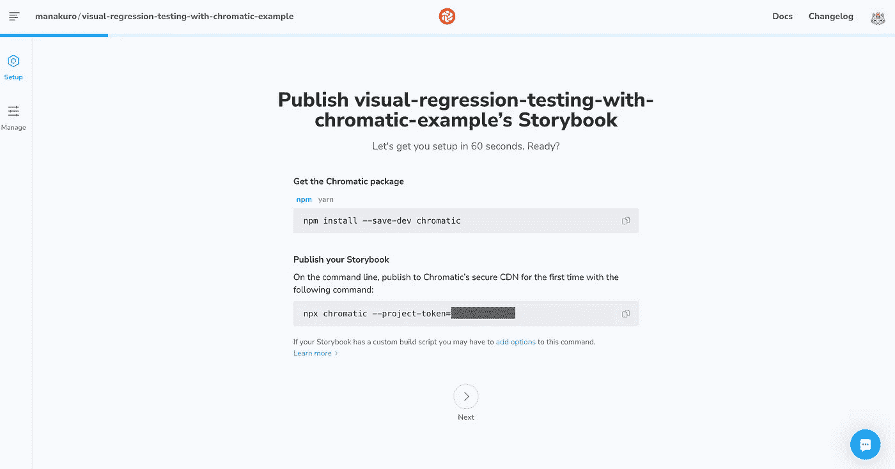
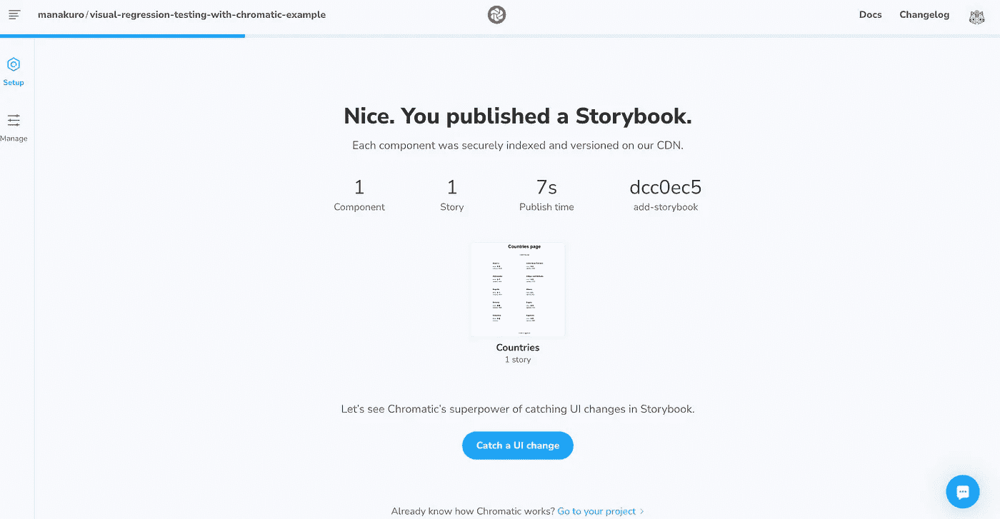
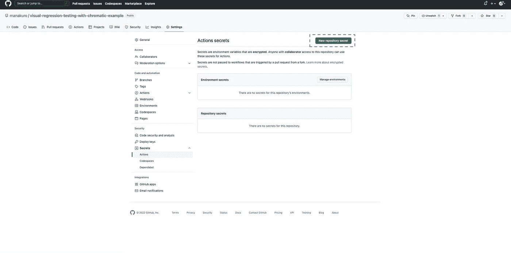
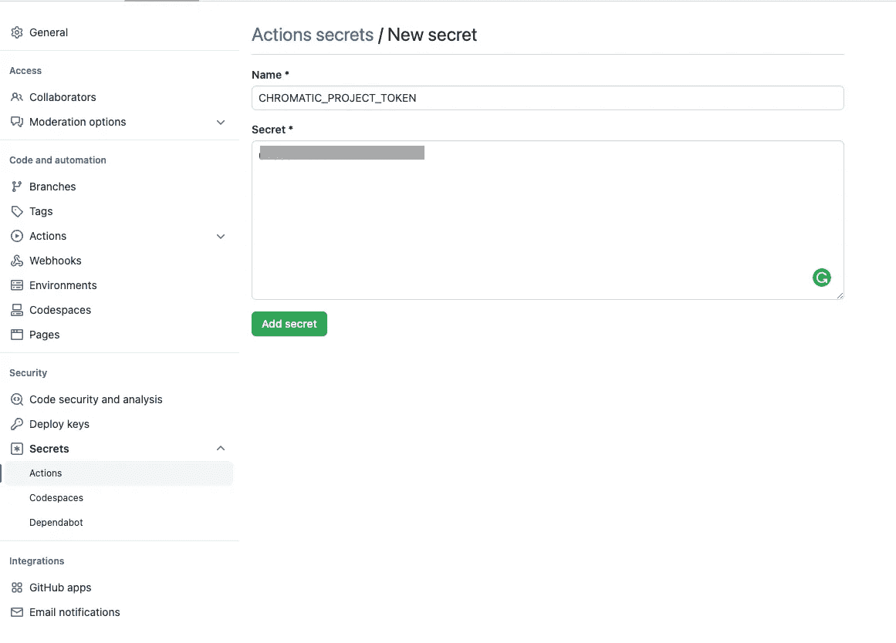
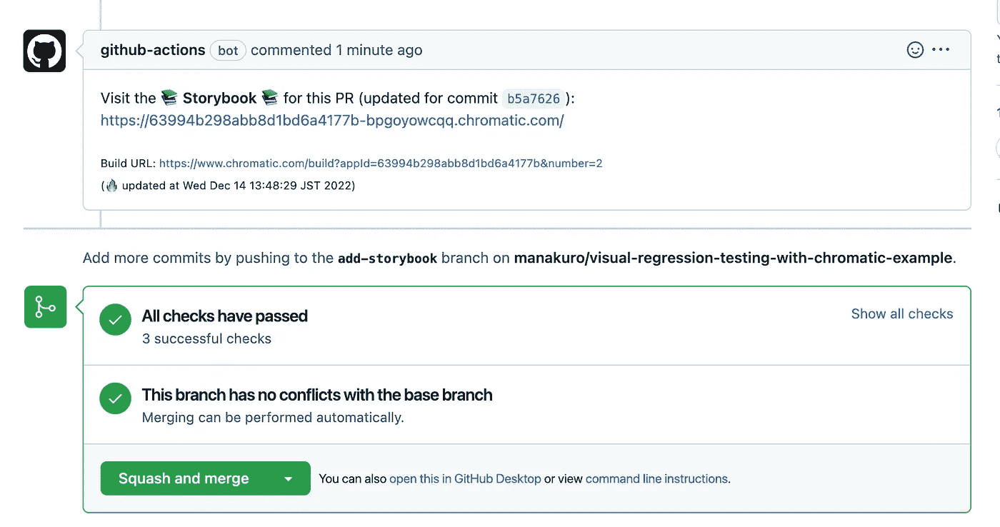
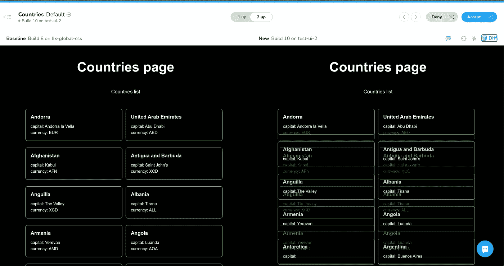
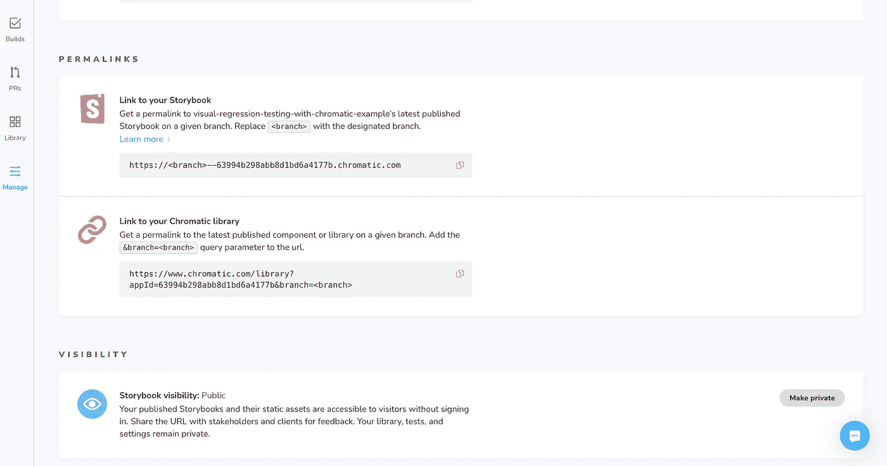

# Web 应用程序中 UI 反馈和可视化测试的自动化

> 原文：<https://betterprogramming.pub/automating-ui-feedback-and-visual-testing-in-web-applications-d91f687a2840>

## 使用彩色、故事书和模拟服务人员进行视觉回归测试


本杰明·沃罗斯在 [Unsplash](https://unsplash.com/?utm_source=medium&utm_medium=referral) 拍摄的照片。

本文将带你了解如何在你的应用中设置色度和建立视觉回归测试。这里是基于 [GitHub](https://github.com/manakuro/visual-regression-testing-with-chromatic-example) 的最终代码库。

*   [Chromatic](https://www.chromatic.com/docs/) 是一个基于云的故事书工具链，允许故事书出版、UI 测试和 UI 审查。我们将使用 Chromatic 和 GitHub 动作来自动化视觉回归测试。
*   [MSW](https://mswjs.io/) 是一个库，它通过在网络级拦截来模仿 API 请求。MSW 允许您的应用程序在不模仿代码库中特定代码的情况下工作。我们将使用 MSW 服务器进行故事书和单元测试。

# 属国

以下是要获取的依赖项:

*   下一个@13.0.6
*   反应@18.2.0
*   阿波罗/客户端@3.7.2
*   graphql-codegen/cli@2.16.1
*   msw@0.49.2
*   故事书@v6

# 概观

假设我们有一个由 Next.js 和 GraphQL API 服务器创建的 app。为了快速开始，我设置了安装 GraphQL、 [apollo-client](https://github.com/apollographql/apollo-client) 和 [graphql-codegen](https://the-guild.dev/graphql/codegen) 的应用程序。具体可以在这张 [PR](https://github.com/manakuro/visual-regression-testing-with-chromatic-example/pull/1/files) 里看到。

我们的应用程序在 countries.revorblades.com 服务器上发出一个 API 请求，然后得到一个国家列表，如下所示。我们将针对该页面实现一个可视化回归测试。



国家页面

下面是实现的概述。

*   设置 MSW
*   安装故事书
*   安装故事书插件下一个路由器插件
*   安装 MSW-故事书-插件
*   创作故事
*   设置色度
*   使用 GitHub 动作自动进行 UI 检查
*   单元测试

# 设置 MSW

让我们首先将`msw`包安装到我们的项目中。

```
yarn add -D msw
```

我们还将安装`deepmerge`和`utility-types`包来灵活扩展模拟数据。

```
yarn add -D deepmerge utility-types
```

为了将 API mocking 相关的模块保存在一个目录中，我们将使用以下命令创建`src/mocks`目录:

```
mkdir src/mocks
```

为了定义 GraphQL 查询的模拟，我们将创建`src/mocks/queries`目录:

```
mkdir src/mocks/queries
```

在我们的应用程序中，我们有这样的`Countries`查询:

```
query Countries($filer: CountryFilterInput) {
  countries(filter: $filer) {
    name
    native
    capital
    emoji
    currency
    languages {
      code
      name
    }
  }
}
```

为了处理 GraphQL 请求，我们需要一个解析器来返回模拟响应并创建模拟数据。为了将模块分组到一个文件夹中，我们将按如下方式组织文件:

```
src/mocks/
└── queries
    ├── countries
    │   ├── countriesQuery.ts
    │   ├── data.ts
    │   ├── index.ts
    │   └── type.ts
    └── handlers.ts
```

创建`src/mocks/queries/countries/countriesQuery.ts`:

```
import { graphql } from 'msw'
import { data } from './data'
import { Options, Query } from './type'

export const countriesQuery = (options?: Options) => {
  return graphql.query<Query>('Countries', (_, res, ctx) => {
    if (options?.networkError) {
      return res(
        ctx.errors([
          {
            message: 'Network request failed',
            graphQLErrors: [],
            networkError: new Error('error'),
            errorMessage: 'error',
            extraInfo: {},
          },
        ]),
      )
    }

    return res(ctx.data(data(options?.res, options?.deepMergeOptions)))
  })
}
```

对于通过`res`函数返回模拟数据的`Countries`查询，`countriesQuery`返回响应解析器。

创建`src/mocks/queries/countries/type.ts`:

```
import deepmerge from 'deepmerge'
import { CountriesQuery as Query } from 'src/graphql/types/index.mock'
import { DeepPartial } from 'utility-types'

export type Response = DeepPartial<Query>
export type { CountriesQuery as Query } from 'src/graphql/types/index.mock'

export type Options = {
  res?: Response
  networkError?: boolean
  deepMergeOptions?: deepmerge.Options
}
```

并创建`src/mocks/queries/countries/data.ts`:

```
import deepmerge from 'deepmerge'
import { Response, Query } from './type'

export const data = (
  options?: Response,
  deepMergeOptions?: deepmerge.Options,
): Query =>
  deepmerge<Query>(
    {
      __typename: 'Query',
      countries: [
        {
          name: 'Andorra',
          native: 'Andorra',
          capital: 'Andorra la Vella',
          emoji: '🇦🇩',
          currency: 'EUR',
          languages: [{ code: 'ca', name: 'Catalan', __typename: 'Language' }],
          __typename: 'Country',
        },
        {
          name: 'United Arab Emirates',
          native: 'دولة الإمارات العربية المتحدة',
          capital: 'Abu Dhabi',
          emoji: '🇦🇪',
          currency: 'AED',
          languages: [{ code: 'ar', name: 'Arabic', __typename: 'Language' }],
          __typename: 'Country',
        },
        {
          name: 'Afghanistan',
          native: 'افغانستان',
          capital: 'Kabul',
          emoji: '🇦🇫',
          currency: 'AFN',
          languages: [
            { code: 'ps', name: 'Pashto', __typename: 'Language' },
            { code: 'uz', name: 'Uzbek', __typename: 'Language' },
            { code: 'tk', name: 'Turkmen', __typename: 'Language' },
          ],
          __typename: 'Country',
        },
        {
          name: 'Antigua and Barbuda',
          native: 'Antigua and Barbuda',
          capital: "Saint John's",
          emoji: '🇦🇬',
          currency: 'XCD',
          languages: [{ code: 'en', name: 'English', __typename: 'Language' }],
          __typename: 'Country',
        },
        {
          name: 'Anguilla',
          native: 'Anguilla',
          capital: 'The Valley',
          emoji: '🇦🇮',
          currency: 'XCD',
          languages: [{ code: 'en', name: 'English', __typename: 'Language' }],
          __typename: 'Country',
        },
        {
          name: 'Albania',
          native: 'Shqipëria',
          capital: 'Tirana',
          emoji: '🇦🇱',
          currency: 'ALL',
          languages: [{ code: 'sq', name: 'Albanian', __typename: 'Language' }],
          __typename: 'Country',
        },
        {
          name: 'Armenia',
          native: 'Հայաստան',
          capital: 'Yerevan',
          emoji: '🇦🇲',
          currency: 'AMD',
          languages: [
            { code: 'hy', name: 'Armenian', __typename: 'Language' },
            { code: 'ru', name: 'Russian', __typename: 'Language' },
          ],
          __typename: 'Country',
        },
        {
          name: 'Angola',
          native: 'Angola',
          capital: 'Luanda',
          emoji: '🇦🇴',
          currency: 'AOA',
          languages: [
            { code: 'pt', name: 'Portuguese', __typename: 'Language' },
          ],
          __typename: 'Country',
        },
        {
          name: 'Antarctica',
          native: 'Antarctica',
          capital: null,
          emoji: '🇦🇶',
          currency: null,
          languages: [],
          __typename: 'Country',
        },
        {
          name: 'Argentina',
          native: 'Argentina',
          capital: 'Buenos Aires',
          emoji: '🇦🇷',
          currency: 'ARS',
          languages: [
            { code: 'es', name: 'Spanish', __typename: 'Language' },
            { code: 'gn', name: 'Guarani', __typename: 'Language' },
          ],
          __typename: 'Country',
        },
      ],
    },
    (options || {}) as Query,
    {
      arrayMerge(target: any[], source: any[]): any[] {
        if (!source.length) return source

        return [...target, ...source]
      },
      ...deepMergeOptions,
    },
  )
```

这是 MSW 服务器将响应`Countries`查询的模拟数据。我们希望将这些模拟数据用于故事书和单元测试，所以我们使用了`deepmerge`，这样我们就可以轻松地扩展数据。

最后，我们将创建`src/mocks/queries/handlers.ts`:

```
import { countriesQuery } from './countries'

export const handlers = [countriesQuery()]
```

# 安装故事书

接下来让我们安装故事书。

为了快速设置，我们将运行故事书 CLI:

```
npx storybook init
```

一旦它完成了`.storybook`目录，它应该像这样被创建:

```
.storybook/
├── main.js
└── preview.js
```

由于我们在应用程序中使用 TypeScript，我们需要添加与我们的`tsconfig.ts`中的`paths`相对应的`alias`条目来加载模块。为此，我们将安装[ts config-paths-web pack-plugin](https://www.npmjs.com/package/tsconfig-paths-webpack-plugin)插件:

```
yarn add -D tsconfig-paths-webpack-plugin
```

然后打开`.storybook`并更改 Webpack 配置:

```
const { TsconfigPathsPlugin } = require('tsconfig-paths-webpack-plugin');

module.exports = {
  "stories": [
    "../src/**/*.stories.mdx",
    "../src/**/*.stories.@(js|jsx|ts|tsx)"
  ],
  addons: [
    "@storybook/addon-links",
    "@storybook/addon-essentials",
    "@storybook/addon-interactions",
    "storybook-addon-next-router",
  ],
  framework: "@storybook/react",
  core: {
    "builder": "@storybook/builder-webpack5"
  },
  features: {
    emotionAlias: false,
  },
  webpackFinal: async (config, { configType }) => {
    // Add plugins
    config.resolve.plugins = [
      ...(config.resolve.plugins || []),
      new TsconfigPathsPlugin({
        configFile: './tsconfig.json'
      }),
    ];

    // Return the altered config
    return config;
  },
}
```

现在我们可以从故事书文件中的`src/**`加载模块了。

## 安装提供商

因为我们使用了 Apollo 客户端，所以我们需要在 stories 中配置提供者。

用以下代码创建`src/storybook/provider.ts`并定义提供者:

```
import 'src/styles/globals.css'
import { ApolloProvider as ApolloProviderLibs } from '@apollo/client'
import React, { useMemo } from 'react'
import { createApolloClient } from 'src/shared/apollo/client'

export const Provider: React.FCWithChildren = (props) => {
  return <ApolloProvider>{props.children}</ApolloProvider>
}

const ApolloProvider: React.FCWithChildren = (props) => {
  const client = useMemo(
    () => createApolloClient({ idToken: 'token' }),
    // eslint-disable-next-line react-hooks/exhaustive-deps
    [],
  )

  return (
    <ApolloProviderLibs client={client}>{props.children}</ApolloProviderLibs>
  )
}
```

该提供程序应该与在`pages/_app.tsx`中使用的相同:

```
import 'src/styles/globals.css'
import type { AppProps } from 'next/app'
import { ApolloProvider } from 'src/shared/apollo/ApolloProvider'

export default function App({ Component, pageProps }: AppProps) {
  return (
    <ApolloProvider>
      <Component {...pageProps} />
    </ApolloProvider>
  )
}
```

然后打开一个`.storybook/preview.js`，用提供者包装一个故事组件:

```
import {Provider} from "../src/storybook/Provider";

export const parameters = {
  actions: { argTypesRegex: "^on[A-Z].*" },
  controls: {
    matchers: {
      color: /(background|color)$/i,
      date: /Date$/,
    },
  },
}

export const decorators = [
  // Add provider here.
  (Story) => (
    <Provider>
      <Story />
    </Provider>
  ),
];
```

既然我们可以配置 apollo 提供程序，那么 story 组件就可以使用提供的数据。

# 安装故事书插件下一个路由器插件

因为我们使用 Next.js，所以我们需要在我们的故事书故事中配置 Next.js 路由器。

让我们安装`storybook-addon-next-router`插件。

```
yarn add -D storybook-addon-next-router
```

打开一个`.storybook/preview.js`并将`RouterContext.Provider`添加到参数中:

```
import { RouterContext } from "next/dist/shared/lib/router-context";

export const parameters = {
  actions: { argTypesRegex: "^on[A-Z].*" },
  controls: {
    matchers: {
      color: /(background|color)$/i,
      date: /Date$/,
    },
  },
  // Add here
  nextRouter: {
    Provider: RouterContext.Provider,
  },
}
```

这使我们可以像这样配置路由器路径:

```
export const Example = () => <MyComponentThatHasANextLink />;

Example.parameters = {
  nextRouter: {
    path: "/profile/[id]",
    asPath: "/profile/lifeiscontent",
    query: {
      id: "lifeiscontent",
    },
  },
};
```

# 安装 msw-storybook-addon 插件

为了在 Storybook 中模拟 GraphQL 请求，我们安装了 [msw-storybook-addon](https://storybook.js.org/addons/msw-storybook-addon) 插件。

使用以下命令安装 msw-storybook-addon:

```
yarn add -D msw-storybook-addon
```

要启动 stories 中的模拟服务器，我们需要在公共目录中生成一个服务工作者。下面是如何做到这一点:

```
npx msw init public/
```

它将在公共目录下创建`mockServiceWorker.js`，如下所示:

```
public/
├── favicon.ico
├── mockServiceWorker.js // Added
└── vercel.svg
```

打开一个`.storybook/main.js`，在 Webpack 配置中放入一个`staticDirs`和 fallback:

```
const { TsconfigPathsPlugin } = require('tsconfig-paths-webpack-plugin');

module.exports = {
  "stories": [
    "../src/**/*.stories.mdx",
    "../src/**/*.stories.@(js|jsx|ts|tsx)"
  ],
  staticDirs: ['../public'], // Add staticDirs here.
  addons: [
    "@storybook/addon-links",
    "@storybook/addon-essentials",
    "@storybook/addon-interactions",
    "storybook-addon-next-router",
  ],
  framework: "@storybook/react",
  core: {
    "builder": "@storybook/builder-webpack5"
  },
  features: {
    emotionAlias: false,
  },
  webpackFinal: async (config, { configType }) => {
    config.resolve.plugins = [
      ...(config.resolve.plugins || []),
      new TsconfigPathsPlugin({
        configFile: './tsconfig.json'
      }),
    ];

    // Add fallback here.
    config.resolve = {
      ...config.resolve,
      fallback: {
        timers: false,
        tty: false,
        os: false,
        http: false,
        https: false,
        zlib: false,
        util: false,
        stream: false,
        ...config.resolve.fallback,
      }
    }

    // Return the altered config
    return config;
  },
}
```

然后打开`.storybook/preview.js`启用 MSW:

```
import { RouterContext } from "next/dist/shared/lib/router-context";
import * as msw from 'msw-storybook-addon';
import {handlers as queryHandlers} from "../src/mocks/queries/handlers";

// Initialize the msw
msw.initialize()

export const parameters = {
  actions: { argTypesRegex: "^on[A-Z].*" },
  controls: {
    matchers: {
      color: /(background|color)$/i,
      date: /Date$/,
    },
  },
  nextRouter: {
    Provider: RouterContext.Provider,
  },
  // Add the MSW handlers.
  // This will be applied globally.
  msw: {
    handlers: [...queryHandlers]
  }
}

// Provide the MSW addon decorator globally
export const decorators = [
  msw.mswDecorator,
  (Story) => (
    <Provider>
      <Story />
    </Provider>
  ),
];
```

我们初始化 MSW 并提供我们在`src/mocks/queries/handlers.ts`中定义的处理程序，这样我们将能够模拟故事中的数据。

# 创作故事

现在我们已经设置了 Storybook 和 MSW 服务器，让我们创建一个故事，看看它是如何工作的。

创建`src/pages/Countries/Countries.stories.tsx`:

```
import { ComponentStory, ComponentMeta } from '@storybook/react'
import React from 'react'
import { Countries as Page } from './Countries'

export default {
  title: 'Pages/Countries',
  component: Page,
  parameters: {
    layout: 'fullscreen',
    nextRouter: {
      asPath: '/countries',
      path: '/countries',
    },
  },
} as ComponentMeta<typeof Page>

const Template: ComponentStory<typeof Page> = (args) => <Page {...args} />

export const Default = Template.bind({})
```

用下面的代码开始故事书:

```
yarn storybook
```

转到`[http://localhost:600](http://localhost:600)6`然后你可以看到国家页面成功获取模拟数据并呈现列表。



故事书

# 设置色度

在发布之前，注册 [Chromatic](https://www.chromatic.com/start?startWithSignup=true) 并创建一个项目，这样我们就可以获得一个唯一的项目令牌。

注册后，您将看到一个项目设置页面，如下所示:



项目设置页面

我们将按照指示行事。使用以下命令安装 chromatic 软件包:

```
yarn add -D chromatic
```

使用以下代码发布我们的故事书:

```
npx chromatic --project-token=<your token>
```

完成后，您将看到成功页面。看起来是这样的:



成功页面

# 使用 GitHub 动作自动进行 UI 检查

现在我们已经将 Storybook 发布到了 Chromatic，让我们看看如何自动化 UI 测试来捕捉 CI 的 bug。Chromatic 提供了一个 GitHub 动作来帮助您自动化可视化回归测试。

## 配置机密

为了保护我们的应用程序，我们将在 GitHub Secrets 中存储项目令牌。

转到`Settings` > `Secrets` > `actions`然后点击`New repository secret`:



设置

然后添加`CHROMATIC_PROJECT_TOKEN`并用上面生成的项目令牌替换该值:



新秘密

## 添加开发工作流

我们将创建一个工作流，将 Storybook 发布到 Chromatic，并创建一个链接到 Storybook 和 Chromatic 的注释。让我们看看它是如何工作的。

创建`.github/workflows/chromatic_dev.yml`:

```
name: Chromatic development
on:
  pull_request:
    branches: [main]

jobs:
  chromatic:
    name: chromatic development
    runs-on: ubuntu-latest
    steps:
      - uses: actions/checkout@v2
        with:
          fetch-depth: 0
      - uses: actions/setup-node@v2
        with:
          node-version: 16.18.1
      - name: Cache node_modules
        uses: actions/cache@v2
        id: node_modules_cache_id
        with:
          path: node_modules
          key: v1-yarn-${{ hashFiles(format('{0}{1}', github.workspace, '/yarn.lock')) }}
          restore-keys: |
            v1-yarn-
      - name: Run install
        if: steps.node_modules_cache_id.outputs.cache-hit != 'true'
        run: yarn install --frozen-lockfile --silent
      - name: Run codegen
        run: yarn codegen
      - name: Publish to Chromatic
        uses: chromaui/action@v1
        id: chromatic
        with:
          projectToken: ${{ secrets.CHROMATIC_PROJECT_TOKEN }}
          exitZeroOnChanges: true
      - name: Remove unnecessary path for Chromatic link
        id: storybook-url
        run: echo "::set-output name=value::${STORYBOOK_URL//\/iframe.html/}"
        env:
          STORYBOOK_URL: ${{ steps.chromatic.outputs.storybookUrl }}
      - name: Find Comment
        uses: peter-evans/find-comment@v2
        id: fc
        with:
          issue-number: ${{ github.event.pull_request.number }}
          comment-author: 'github-actions[bot]'
          body-includes: ':books: Storybook :books:'
      - name: Get datetime for now
        id: datetime
        run: echo "::set-output name=value::$(date)"
        env:
          TZ: Asia/Tokyo
      - name: Create or update comment
        uses: peter-evans/create-or-update-comment@v2
        with:
          comment-id: ${{ steps.fc.outputs.comment-id }}
          issue-number: ${{ github.event.pull_request.number }}
          body: |
            Visit the :books: **Storybook** :books: for this PR (updated for commit ${{ github.event.pull_request.head.sha }}):
            <${{ steps.storybook-url.outputs.value }}>

            <sub>Build URL: ${{ steps.chromatic.outputs.buildUrl }}</sub>
            <sub>(:fire: updated at ${{ steps.datetime.outputs.value }})</sub>
          edit-mode: replace
```

提交文件并推送，然后工作流将开始。

一旦工作流完成，您将得到一个注释，即[看起来像这样](https://github.com/manakuro/visual-regression-testing-with-chromatic-example/pull/2):



每次你推一个新的 commit，它都会发布 Storybook，评论也会随着新的改变而更新。

## UI 测试

让我们添加一些更改，看看 UI 测试是如何工作的。

打开`src/pages/Countries/Countries.tsx`并删除一些代码:

```
 >
              <h2>{c.name}</h2>
              <p>capital: {c.capital}</p>
-             <p>currency: {c.currency}</p>
            </a>
          ))}
        </div>
```

出版后，Chromatic 发现了这样的变化:



UI 测试

这里可以看到 PR [这里](https://github.com/manakuro/visual-regression-testing-with-chromatic-example/pull/7)。

## 添加主工作流

Chromatic 提供了与分支和提交相对应的永久链接。永久链接格式为:

`https://<branch> — <appid>.chromatic.com`

您可以在`Manage` > `Permalinks`获得永久链接:



永久链接

一旦将 PR 合并到主分支中，我们希望将其发布到 Chromatic，这样我们就可以链接到主分支的最新故事书。为此，我们将为主分支创建一个工作流。

创建`.github/workflows/chromatic_main.yml`:

```
name: Chromatic main
on:
  push:
    branches: [main]

jobs:
  chromatic:
    name: chromatic main
    runs-on: ubuntu-latest
    steps:
      - uses: actions/checkout@v2
        with:
          fetch-depth: 0
      - uses: actions/setup-node@v2
        with:
          node-version: 16.18.1
      - name: Cache node_modules
        uses: actions/cache@v2
        id: node_modules_cache_id
        with:
          path: node_modules
          key: v1-yarn-${{ hashFiles(format('{0}{1}', github.workspace, '/yarn.lock')) }}
          restore-keys: |
            v1-yarn-
      - name: Run install
        if: steps.node_modules_cache_id.outputs.cache-hit != 'true'
        run: yarn install --frozen-lockfile --silent
      - name: Run codegen
        run: yarn codegen
      - name: Publish to Chromatic
        uses: chromaui/action@v1
        id: chromatic
        with:
          projectToken: ${{ secrets.CHROMATIC_PROJECT_TOKEN }}
          autoAcceptChanges: true
```

`autoAcceptChanges`选项应该为真，因为我们已经检查了 PR 中的更改，所以发布它。

完成后，最新的故事书将在`https://main — <appid>.chromatic.com`发布。

# 单元测试

最后，我们将使用 MSW 服务器实现单元测试。

安装`@testing-library/react`包:

```
yarn add -D @testing-library/react @testing-library/jest-dom @testing-library/user-event
```

安装 jest 和其他软件包:

```
yarn add -D jest jest-environment-jsdom @swc/core @swc/jest @types/jest node-fetch@2.6.6 empty
```

创建`jest.config.js`:

```
module.exports = {
  testEnvironment: 'jsdom',
  globals: {
    __DEV__: true,
  },
  testMatch: ['**/src/**/?(*.)+(spec|test).[jt]s?(x)'],
  testPathIgnorePatterns: ['<rootDir>/.next/', '<rootDir>/node_modules/'],
  setupFilesAfterEnv: ['<rootDir>/setupTests.js'],
  transform: {
    '^.+\\.(js|jsx|ts|tsx)$': ['@swc/jest'],
  },
  moduleFileExtensions: ['ts', 'tsx', 'js', 'jsx', 'json', 'd.ts'],
  moduleNameMapper: {
    '\\.(jpg|jpeg|png|gif|eot|otf|webp|svg|ttf|woff|woff2|mp4|webm|wav|mp3|m4a|aac|oga|css)$':
      'empty/object',
    '^src/(.*)$': '<rootDir>/src/$1',
  },
}
```

创建`setupTests.js`:

```
import '@testing-library/jest-dom/extend-expect'

global.fetch = require('node-fetch')

jest.mock('src/config')
jest.retryTimes(3, { logErrorsBeforeRetry: true })

// @see https://jestjs.io/docs/manual-mocks#mocking-methods-which-are-not-implemented-in-jsdom
Object.defineProperty(window, 'matchMedia', {
  writable: true,
  value: jest.fn().mockImplementation((query) => ({
    matches: false,
    media: query,
    onchange: null,
    addListener: jest.fn(), // deprecated
    removeListener: jest.fn(), // deprecated
    addEventListener: jest.fn(),
    removeEventListener: jest.fn(),
    dispatchEvent: jest.fn(),
  })),
})
```

创建`.swcrc`:

```
{
  "jsc": {
    "target": "es2015",
    "parser": {
      "syntax": "typescript",
      "tsx": true
    },
    "transform": {
      "react": {
        "runtime": "automatic",
        "pragma": "React.createElement",
        "pragmaFrag": "React.Fragment",
        "throwIfNamespace": true,
        "useBuiltins": true
      }
    }
  },
  "sourceMaps": true
}
```

创建`src/mocks/server.ts`:

```
import { setupServer } from 'msw/node'
import { handlers as queryHandlers } from './queries/handlers'

export const server = setupServer(...[...queryHandlers])

export const removeAllListeners = () => {
  server.events.removeAllListeners()
}
```

我们将创建`src/testUtils`，结构如下:

```
src/testUtils/
├── Provider.tsx
├── index.ts
└── mock
    └── setup.ts
```

创建`src/testUtils/Provider.tsx`:

```
import React, { useMemo } from 'react'
import { createApolloClient } from 'src/shared/apollo/client'
import { ApolloProvider as ApolloProviderLibs } from '@apollo/client'

export const Provider: React.FCWithChildren = (props) => {
  return <ApolloProvider>{props.children}</ApolloProvider>
}

const ApolloProvider: React.FCWithChildren = (props) => {
  const client = useMemo(() => createApolloClient({ idToken: 'token' }), [])

  return (
    <ApolloProviderLibs client={client}>{props.children}</ApolloProviderLibs>
  )
}
```

创建`src/testUtils/mock/setup.ts`:

```
import { server } from 'src/mocks/server'

type Callback = () => void

export const startServer = (callback?: Callback) => {
  beforeAll(async () => {
    if (callback) await callback()
    server.listen()
  })
}

export const resetServer = (callback?: Callback) => {
  afterAll(async () => {
    if (callback) await callback()
    server.resetHandlers()
  })
}

export const resetHandlers = (callback?: Callback) => {
  afterEach(async () => {
    if (callback) await callback()
    server.resetHandlers()
  })
}

export const closeServer = (callback?: Callback) => {
  afterAll(async () => {
    if (callback) await callback()
    server.close()
  })
}
```

我们将在测试中使用这些函数来模拟 GraphQL 请求。

让我们创建`src/pages/Countries/Countries.test.tsx`:

```
import { render, screen } from '@testing-library/react'
import React from 'react'
import { removeAllListeners } from 'src/mocks/server'
import { Provider } from 'src/testUtils'
import {
  closeServer,
  resetHandlers,
  resetServer,
  startServer,
} from 'src/testUtils/mock/setup'
import { Countries as Component } from '../Countries'

type Props = {}
const propsData = (options?: Partial<Props>): Props => ({
  ...options,
})

describe('pages/Countries', () => {
  startServer()
  closeServer()
  resetServer()
  resetHandlers()

  beforeEach(async () => {
    removeAllListeners()
  })

  describe('Countries', () => {
    test('renders countries list', async () => {
      render(
        <Provider>
          <Component {...propsData()} />
        </Provider>,
      )

      expect(await screen.findByText('Argentina')).toBeInTheDocument()
    })
  })
})
```

那么它应该能通过测试。看起来是这样的:

```
 PASS  src/pages/Countries/__tests__/Countries.test.tsx
  pages/Countries
    Countries
      ✓ renders countries list (67 ms)

Test Suites: 1 passed, 1 total
Tests:       1 passed, 1 total
Snapshots:   0 total
Time:        1.247 s, estimated 5 s
Ran all test suites.
✨  Done in 2.48s.
```

当我们想要改变响应时，我们将使用`[server.use](https://mswjs.io/docs/api/setup-server/use)`在测试中模拟它:

```
//...
import { removeAllListeners, server } from 'src/mocks/server'
import { countriesQuery } from 'src/mocks/queries/countries'

test('renders Japan', async () => {
  // Change a reponse against Countries query.
  // Countries list will be deeply merged with the new value.
  server.use(
    countriesQuery({
      res: {
        countries: [
          {
            name: 'Japan',
            native: '日本',
            capital: 'Tokyo',
            emoji: '🇯🇵',
            currency: 'JPY',
            languages: [
              {
                code: 'ja',
                name: 'Japanese',
              },
            ],
          },
        ],
      },
    }),
  )

  render(
    <Provider>
      <Component {...propsData()} />
    </Provider>,
  )

  expect(await screen.findByText('Japan')).toBeInTheDocument()
})
```

# 结论

我们已经介绍了如何将可视化回归测试引入到我们的应用程序中。在前端测试中，我们应该测试应用程序和用户界面的实际行为。

Chromatic 会自动检测 UI 的变化，允许您重构代码库，而不用担心 UI 错误。MSW 使您能够在不模仿应用程序代码的情况下，准确地测试您的应用程序与用户的交互方式。