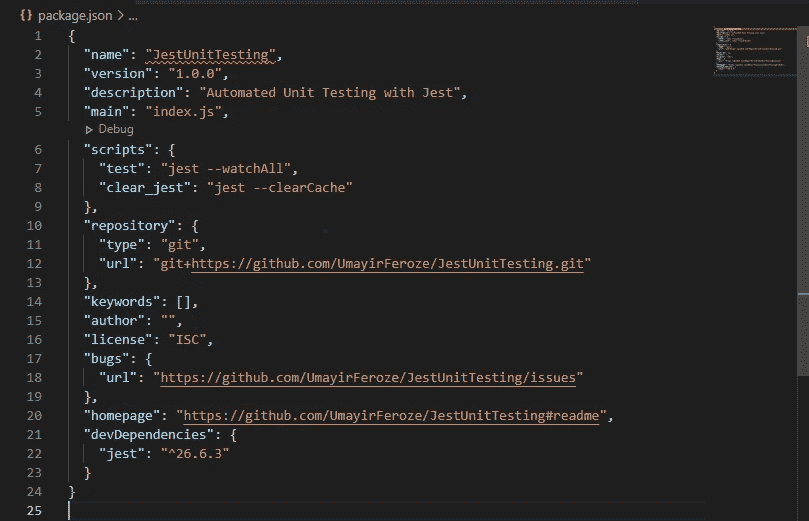
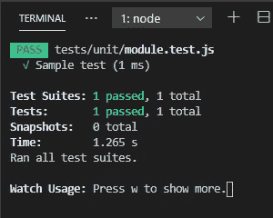
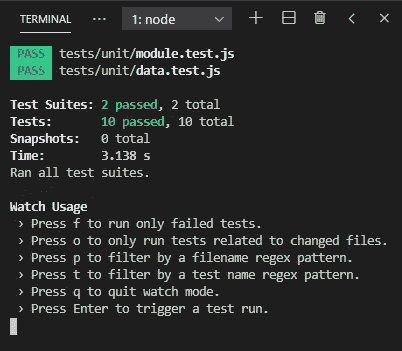
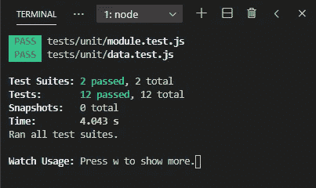
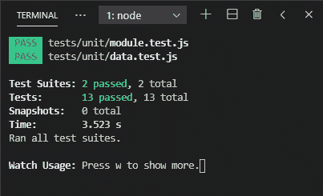
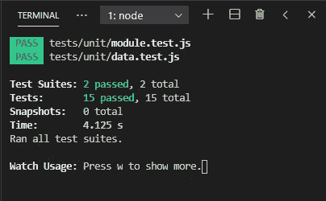
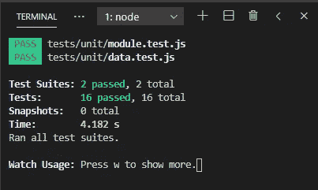
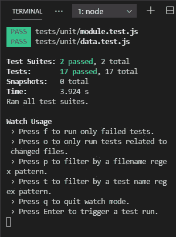
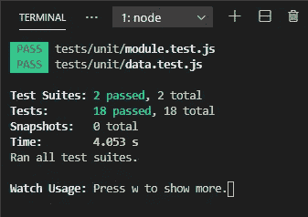

# 用 Jest 自动化单元测试

> 原文：<https://betterprogramming.pub/automating-unit-tests-with-jest-b6ba7be8675b>

## Jest 单元测试自动化完全初学者指南


[张家瑜](https://unsplash.com/@danielkcheung?utm_source=medium&utm_medium=referral)在 [Unsplash](https://unsplash.com?utm_source=medium&utm_medium=referral) 上拍照

自动化测试是对程序自动执行测试的过程。为此，我们需要编写测试脚本，按照测试用例执行测试过程。自动化测试用例的一些好处是:

*   用更少的时间测试更多的代码
*   在部署应用程序之前捕获 bug
*   放心部署
*   毫不费力地重构
*   关注代码质量

没有没有漏洞的软件。测试的主要目的是让代码失败，并找出至少一个 bug。

单元测试用于测试应用程序的单个功能组件，不需要或只需要很少的外部依赖。单元测试编写起来更便宜，执行起来更快。然而，就应用程序的可靠性而言，他们不太确定。

# 玩笑

Jest 是最新的测试框架，是使用 Babel、TypeScript、Node、React、Angular、Vue 等测试项目的热门选择。Jest 是一个成熟的框架，它提供了一个库和一个测试运行器。

*   **库:**提供了一组实用函数来编写测试
*   **测试运行器:**在命令行上执行测试，指出已经通过或者失败的测试

Jest 被像脸书这样的公司用来测试他们在 React 等 JavaScript 库上运行的应用程序。

# 设置笑话

## 项目文件夹设置

创建项目文件夹。出于演示的目的，我将我的项目文件夹命名为`JestUnitTesting.`我将使用 Visual Studio 代码，但是您可以在任何您喜欢的代码编辑器中打开这个项目。进入终端窗口，编写以下命令创建一个[默认](https://docs.npmjs.com/creating-a-package-json-file#default-values-extracted-from-the-current-directory)文件:

```
npm init --yes
```

该文件的内容如下:



照片由[作者](https://umayir10.medium.com/)

## 安装 Jest

在终端中，运行以下行来安装 Jest:

```
npm i jest --save-dev
```

通过使用`--save-dev`标志，我们能够将 Jest 安装并保存为开发依赖项。我们这样做是因为我们希望在开发环境中执行测试，并且在部署应用程序时，我们不希望将 Jest 部署到生产环境中而不使其成为生产捆绑包的一部分。

您可以通过查看`package.json`文件来确认`devDependencies`下的安装，如下图所示:

```
"devDependencies": {
    "jest": "^22.2.2"
},
```

## 配置 Jest

为了运行测试，在`package.json`文件中，我们需要配置`“scripts”`属性，如下所示:

```
"scripts": {
    "tests": "jest --watchAll"
}.
```

属性`scripts`包含可以在命令行上执行的命令。例如，为了用 Jest 执行测试，我们运行`npm test`。

标志确保 Jest 在运行测试脚本后不会终止。相反，它一直在观察变化。因此，产品代码或测试脚本中的任何更改都会被更改。然后 Jest 重新运行这些测试，这些变化会被通知，并且可以在终端上看到。

## 创建测试文件夹

测试是项目生命周期中一个独立但连续的阶段。因此，测试独立于项目的其他代码行是一个最佳实践。

```
project-folder
|
|- tests
    |- unit
    |- integration
```

在`project`目录下创建一个名为`tests`的文件夹。这是所有测试文件将被保存和执行的地方。

将单元测试和集成测试分开也是一个很好的实践——在接下来的路中，您可能想要单独执行单元测试或集成测试。因此，在`tests`目录中创建一个名为`unit`的子目录。

# 让自己熟悉笑话

让我们创建我们的第一个单元测试文件。在`unit` 子目录下的`tests`文件夹中，创建一个如下格式的文件:

`module.test.js`

上述格式用于在特定模块上执行单元测试。如上图所示:

*   `module`是您要测试的模块或套件的名称
*   `test`可以命名为`test`或`spec`，表示是测试文件
*   `js`是 JavaScript 文件的扩展名，因此它可以被读取

## 理解测试语法

```
// Familiarizing with the Jest syntaxtest('Sample test', () => {} );
```

为了编写一个测试，我们调用`test()`函数，它有两个参数:

*   测试的名称—在控制台上看到
*   一个函数——我们实现测试的地方。Jest 将在我们运行测试时调用这个函数。

在运行`npm test`命令时，我们将收到以下输出:



照片由[作者](https://umayir10.medium.com/)

## 分组测试

测试时我们必须测试函数中的每一条路径。假设一个测试有三条路径(如下面的程序所示)。在这种情况下，我们必须为每一个都编写一个测试用例。

```
function absolute(number){
    if (number > 0) return number;           // path 1
    if (number < 0) return -number;          // path 2
    return 0;                                // path 3
}
```

如果我们使用`test()`函数编写测试脚本，它们看起来会像:

```
test('absolute - should result path 1', () => {} );
test('absolute - should result path 2', () => {} );
test('absolute - should result path 3', () => {} );
```

这使得测试脚本拥挤不堪，难以阅读，如下所示。因此，我们遵循最佳实践并使用以下技术:

```
describe('absolute', () => {
    it ('should result path 1', ()=> {});
    it ('should result path 2', ()=> {});
    it ('should result path 3', ()=> {})
});
```

`describe()`函数将相关的测试组合在一起，如上所示。它由两个参数组成:

*   测试组的名称
*   对覆盖模块每条路径的所有函数进行分组的函数，确保正确的路径覆盖。

`it()`负责覆盖被测模块的每个路径。它还包含两个参数:

*   测试路径的名称
*   测试给定测试路径的函数

# 写作测试

## 测试数字

在项目文件夹中，创建一个名为`data.js`的文件，并插入以下代码行。

```
module.exports.absolute = function(number){
    if (number > 0) return number;
    if (number < 0) return -number;
    return 0;
}
```

上面的函数返回传递给函数的任何数字的正值，如果`0`作为参数传递，则返回`0`。

在`unit`子目录中创建一个名为`data.test.js`的文件。在这里，我们将提取以下代码:

```
const data = require('../../data');describe('absolute', () => {
    it ('should return positive number if positive', ()=> {
        const result = data.absolute(1);
        expect(result).toBe(1);
    });
    it ('should return positive number if negative', ()=> {
        const result = data.absolute(-1);
        expect(result).toBe(1);
    });
    it ('should return zero number if zero', ()=> {
        const result = data.absolute(0);
        expect(result).toBe(0);
    });
});
```

我们需要`data.js`模块，并将它的内容保存在一个名为`data`的常量中。在上面的`describe()`函数中，我们测试了来自`data.js`文件的`absolute` 函数。让我们来分解一下:

*   `const result = data.absolute(1)`
    从数据模块调用绝对函数，测试参数`1`通过。具有给定参数的绝对函数的结果存储在常量`result`中。
*   `expect(result).toBe(1)`
    Jest 有一个包含`result`参数的`expect()`函数。`toBe()`函数，正如它自己所说，将是预期的结果。

测试结果如下:



照片由[作者](https://umayir10.medium.com/)

## 测试字符串

在`data.js`文件中，我们创建以下模块:

```
module.exports.welcome = function(name){
    return 'Hello' + name;
}
```

当用户名作为函数的参数传递时，该函数将显示一条欢迎消息。

在`data.test.js`文件中，让我们编写以下代码来测试字符串:

```
describe('welcome', () => {
    it('should return welcome message', () => {
        const result = data.welcome('Adam');
        // expect(result).toBe('Hello Adam');   // not recommended
        expect(result).toMatch(/Adam/);      // using regex
        expect(result).toContain('Adam');    // using contains
    })
})
```

**注意:**这里我们不推荐使用`toBe()`功能。这是因为如果我们要对`welcome`函数进行修改——比如`return 'Hello there' + name;`——那么我们需要重写测试脚本，这可能会很麻烦。因此，在测试字符串时，测试不应该太具体。所以这里有两个选择:

*   使用正则表达式
    `toMatch()`允许传递一个正则表达式。有了它，我们将只检查测试数据，`Adam`，*，*是否在结果中。
*   使用`Contain`
    避免时间构造正则表达式，一个更快的替代方法是使用`toContain()`函数，它接受一个字符串参数。我们可以通过测试数据本身。

你采取的方法完全取决于你自己，但关键是在正确的场景中选择正确的方法。测试结果如下:


照片由[作者](https://umayir10.medium.com/)

## 测试阵列

在`data.js`文件中，创建以下模块:

```
module.exports.sizes = function() {
    return ['S','M','L'];
}
```

该函数返回一个大小数组。在`data.test.js`文件中，让我们测试一下数组:

```
describe('sizes', () => {
    it('should return available sizes', () => {
      const result = ['S','M','L'];
      expect(result).toEqual(expect.arrayContaining(['S','M','L']));
    })
})
```

Jest 使用`toEqual()`，这是检查结果是否与传递给它的参数相似的理想方式。`arrayContaining()`以数组为参数。我们可以将值传递到这个数组中，这将根据结果中数组值的存在返回`pass`或`fail`。结果如下:



照片由[作者](https://umayir10.medium.com/)

## 测试对象

在`data.js`文件中，创建以下模块:

```
module.exports.getUser = function(userId) {
    return {id: userId, age: 20 };
}
```

当输入用户 ID 时，上面的函数返回一个对象。

```
describe('getUser', () => {
    it('should return user of userId', () => {
      const result = data.getUser(1)
      // expect(result).toBe({id:1, age:20});           // test fail
      expect(result).toMatchObject({id:1, age:20});  // pass test
      expect(result).toHaveProperty('id', 1);        // pass test
    })
})toBe() will result in an error, as it compares the references of the object in memory with the object passed as the parameter. Therefore, we’re left with the following alternatives: 
```

*   **匹配对象**
    `toMatchObject()`允许一个对象作为参数传递。我们可以传递对象的必要属性并验证它的存在。
*   **拥有属性**
    `toHaveProperty()`通过接受键值对参数在对象中寻找特定的属性。但是，它对数据类型的敏感性要求我们输入正确的数据类型。在这里，我们不必考虑其他属性，只需考虑我们正在寻找的属性。

同样，您采取的方法完全取决于您，但关键是在正确的场景中选择正确的方法。测试结果如下:



照片由[作者](https://umayir10.medium.com/)

## 测试异常

在`data.js`文件中，创建以下模块:

```
module.exports.registerUser = function(email) {
    if (!email) throw new exception('Email required!');
    return {id: 1, email: email};
}
```

`registerUser()`将邮件作为参数，如果邮件是`false`则抛出异常。这就带来了两条需要测试的路径。因此，我们必须运行两个单元测试，如下所示:

```
describe('regsiterUser', () => {
    it ('should throw error if email is falsy', ()=> {
        const args = [null, undefined, NaN, 0, '', false]; 
        args.forEach(a => {
            expect(()=>{data.registerUser(a)}).toThrow();
        });
    });
    it ('should return user if valid email', ()=> {
        const result = data.registerUser('adam@email.com');
        expect(result).toMatchObject({email: 'adam@email.com'});
    });
});
```

在上面的测试中，我们执行了两个单元测试——每个路径一个。至于`regsiterUser`模块的逻辑，`const args = [null, undefined, NaN, 0, ‘’, false];`包含了所有可能抛出异常的错误值。因此，我们采用了一种简洁的方法，遍历`args`数组中的每一项。有些人可能不喜欢这种技术，但是为了简单起见，因为逻辑是相同的，所以我们使用了这种方法。测试结果如下:



图片作者[作者](https://umayir10.medium.com/)

# 模拟功能

到目前为止，我们已经测试了不依赖任何外部资源的独立功能。然而，在现实世界的应用程序中，我们可能必须对直接或间接与外部资源对话的函数执行单元测试。

## 创建简单的模拟函数

以下功能为在服装店积分超过 10 分的忠诚顾客提供 20%的折扣。在`data.js`文件中，创建以下模块:

```
const db = require('./fakeDb');module.exports.discount = function(order){
    const customer = db.getUser(order.userId);
    if (customer.points > 10) 
        order.totalAmount *= 20;
}
```

在这个例子中，我们试图从数据库中获取用户的详细信息。但是，既然建立测试数据库不在我们的讨论范围之内，我们就假装一下吧。

在`project`目录下创建一个与`data.js`文件平行的`fakeDb.js`文件。它将包含以下功能:

```
module.exports.getUser = function(userId){
    console.log('Retreiving user from database...');
    return {id: userId, points:11};
}
```

在这个场景中需要创建简单的模拟函数来执行单元测试，因为函数`discount()`包含了接触外部资源的方法`getUser()`(`fakeDB.js`文件)。

单元测试必须独立于外部依赖。

单元测试的主要目的是将代码从外部依赖中分离出来，因为在运行测试时它可能不可用。

假设真正的数据库由于某种原因无法运行。单元测试将会失败。这将误导我们认为有一个错误，而实际上并没有。之所以会遇到这个问题，是因为我们依赖这些外部资源。

因此，我们需要用一个没有任何外部依赖的假/模拟实现替换真实实现，这意味着在`data.test.js`文件中没有实际的数据库连接，如下所示:

```
const db = require('../../fakeDb');describe('discount', () => {
  it('should apply 20% discount if points greater than 10', () => {
    db.getUser = function(userId) {
      return {id: userId, points:11};
    } const order = {userId:1, total:80};
    data.discount(order);
    expect(order.total).toBe(80)  })
})
```

在上面的测试中，`db`常量中需要`fakeDb.js`。然后，`db.getUser()`被替换为一个模拟函数，该函数返回一个用户对象，如`getUser()`中的用户对象。

然后，我们像前面在主题测试对象中所做的那样执行测试。测试结果如下:



照片由[作者](https://umayir10.medium.com/)

## 交互测试

现在让我们测试一个对象与另一个对象的交互。

将下面的代码复制到`data.js`文件中。下面的函数在下订单时通知客户。

```
const db = require('./fakeDb');
const notification = require('./notifications')module.exports.notifyUser = function(order){
   const customer = db.getUserEmail(order.userId);
   notification.send(customer.email, 'Order placed.');
}
```

该函数有两个依赖项:

*   `fakeData.js`

```
module.exports.getUserEmail = function(userId){
    console.log('Retreiving user from database...');
    return {email: 'a'};
}
```

*   `notificaitons.js`

```
// Notification.js does not have any code to save us some time. We will mock this functionality using a mock function.
```

让我们对上述功能进行测试:

```
const data = require('../../data');
const db = require('../../fakeDb');
const notification = require('../../notifications');describe('notifyUser', () => {
  it('should notify to customer', ()=> {
    db.getUserEmail = function(userId){
      return {email: 'a'};
    } 

    let notified = false;
    notification.send = function(email, message) { 
      notified= true;
    } data.notifyUser({userId:1}); 
    expect(notified).toBe(true);  
  })
})
```

测试结果是:



照片由[作者](https://umayir10.medium.com/)

## Jest 模拟函数

您可以使用 Jest 轻松创建模拟函数，并对它们进行编程，使它们以特定的方式运行。在每个测试中，我们可以有一个行为不同的模拟函数。这有助于简化上述模拟函数的实现。

简而言之，我们使用以下代码行创建简单的模拟函数:

```
const mockFunction = jest.fn()
```

mock 函数是一个空函数，可以简单地用`mockFunction()`调用。通过使用 mock 函数，我们可以访问其他方法来完成以下任务:

*   返回值:

```
mockFunction.mockReturnValue(1); //returns value 1
const value = mockFunction(); 
```

*   退回已解决的承诺:

```
mockFunction.mockResolvedValue(1);  
const value  = await mockFunction();//after awaiting promise return 1
```

*   退回未兑现的承诺:

```
mockFunction.mockRejectedValue(new Error('Error...!'));  
const value  = await mockFunction();
```

让我们使用 Jest mock 函数执行发送通知测试。下面，我对之前的测试进行了评论，并为您更换了新的测试。

```
const data = require('../../data');
const db = require('../../fakeDb');
const notification = require('../../notifications');describe('notifyUser', () => {
  it('should notify to customer', ()=> {
    db.getUserEmail = jest.fn().mockReturnValue({email: 'a'}); // db.getUserEmail = function(userId){
    //  return {email: 'a'};
    //}    notification.send = jest.fn(); // let notified = false;
    // notification.send = function(email, message) { 
    //   notified= true;
    // } data.notifyUser({userId:1});    // expect(notified).toBe(true);  
    expect(notification.send).toHaveBeenCalled();
  })
})
```

使用 Jest mock 函数，我们可以简单地减少代码行数，提高代码质量，使其更具可读性和可写性。

`toHaveBeenCalled()`是一个匹配器，检查`mail.send`模拟函数是否被调用。当手动创建模拟函数时，正如我们之前所做的，这是不可能的。

但是，当您想要检查传递给该方法的参数时，这个函数的缺点就出现了。在这个场景中，我们使用`toHaveBeenCalledWith('a', 'message')`。

然而，正如我上面提到的，当测试字符串时，我们不应该是特定的。建议使用这种方法来测试数字、布尔值等。因此，测试参数的最佳方法是:

```
expect(notification.send).toHaveBeenCalled();
expect(mail.send.mock.calls[0][0]).toBe('a');
expect(mail.send.mock.calls[0][1]).toMatch(/Order/);
```

`mail.send`是模拟函数，它有一个属性`mock`，这个属性又有一个属性`calls`，它跟踪对这个函数的所有调用。测试结果如下:



图片[作者](https://umayir10.medium.com/)

使用 Jest mock 函数简化了测试，因为它允许我们以一种简单方便的方式测试函数以及传入和传出函数的参数。

# 了解单位 Tst 的内容

在真实的应用程序中，当测试路由处理器和认证中间件功能时，我们会遇到对数据库的 HTTP 请求和响应。在这样的场景中，我们需要模拟请求和响应。因此，我们必须编写的模拟函数的数量增加了。因此，这是我们必须执行集成测试的时候。

测试时，用零依赖或最小依赖的算法测试函数，这样更容易模仿。如果有太多的嘲笑，那么你最好执行集成测试。

# 结论

Jest 使得自动化单元测试变得更加简单、划算和令人兴奋，因为它处理了大量的麻烦。这确保了一个更强大、更自信、更可靠的自动化测试解决方案。

您可以从我的 [GitHub](https://github.com/UmayirFeroze) 档案中访问[完整代码](https://github.com/UmayirFeroze/JestUnitTesting.git)。

我希望这个故事已经教会了你自动化测试的基础知识，以及如何使用 Jest 自动化单元测试。享受学习和编码的乐趣！