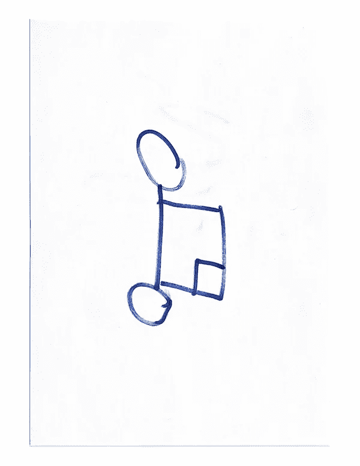
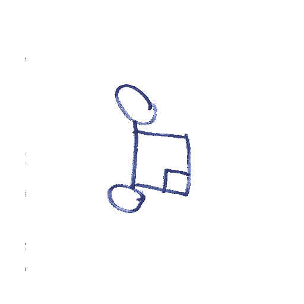

# 用 Python 和 OpenCV 自动去除背景色

> 原文：<https://betterprogramming.pub/automating-white-or-any-other-color-background-removal-with-python-and-opencv-4be4addb6c99>

## 图像处理基础


绝对是最好的组合

几天前，我面临一个项目，当草图被放入某个文件夹时，需要去掉它们的白色背景。这一切都发生在硬件扫描仪中。

这里有一个草图的例子:



示例图

第一步是安装这个项目的依赖项，如下所列。我们也将使用 **Python 3.7。**

```
opencv_python==4.1.0.25pip install opencv-pythonnumpy==1.16.4pip install numpy
```

之后，我们将开始导入项目所需的所有模块:

```
*import* cv2*import* os*import* string*import* random*from* os *import* listdir*from* os.path *import* isfile, join, splitext*import* time*import* sys*import* numpy *as* np*import* argparse
```

然后，我们创建三个不同的变量:要监视的文件夹的名称、图像处理后将存放的文件夹的名称，以及监视文件夹时的轮询时间(即，检查文件夹中的更改的频率——在我们的例子中是一秒钟)

```
watch_folder = ‘toprocess’processed_folder = ‘processed’poll_time = 1
```

现在，文件夹“toprocess”和“processed”将位于 python 脚本的同一个目录中。

然后，我们将转到我们的主函数，它将监视我们的“toprocess”目录，如果发生任何变化，将处理放入该文件夹的图像。

```
before = dict([(f, None) *for* f in os.listdir(watch_folder)])*while* 1: time.sleep(poll_time) after = dict([(f, None) *for* f in os.listdir(watch_folder)]) added = [f *for* f in after *if* not f in before] removed = [f *for* f in before *if* not f in after] *if* added: print(“Added “, “, “.join(added)) *if* added[0] is not None: processImage(added[0]) *if* removed: print(“Removed “, “, “.join(removed)) before = after
```

这段代码无限循环运行，直到脚本被终止。启动时，它将文件存储在名为“before”的字典内的目录中。接下来，无限循环中的步骤用伪代码分解如下:

*   休眠指定的轮询时间(1 秒)。
*   将目录中的文件信息存储在名为 after 的字典中。
*   通过比较后的**和**前的**存储已添加的内容(如果前的*不是 f，则*后的*是 f)。***
*   通过比较之前中的**和之后**中的**来存储已经移除的内容。**
*   检查最后添加的元素(added[0])，如果它在那里，那么调用一个函数，我们将在文件上的 **processImage** 中讨论这个函数。
*   如果删除，只需打印一些信息让用户知道。
*   最后，将目录中的最新文件从之前更新到之后。

现在是`processImage`函数，它是程序的核心。这就是 OpenCV 背景去除魔术发生的地方。代码解释如下(需要基本的 OpenCV 知识):

```
def processImage(*fileName*): *# Load in the image using the typical imread function using our watch_folder path, and the fileName passed in, then set the final output image to our current image for now* image = cv2.imread(watch_folder + ‘/’ + fileName) output = image *# Set thresholds. Here, we are using the Hue, Saturation, Value color space model. We will be using these values to decide what values to show in the ranges using a minimum and maximum value.* ***THESE VALUES CAN BE PLAYED AROUND FOR DIFFERENT COLORS*** hMin = 29  # Hue minimum sMin = 30  # Saturation minimum vMin = 0   # Value minimum (Also referred to as brightness) hMax = 179 # Hue maximum sMax = 255 # Saturation maximum vMax = 255 # Value maximum *# Set the minimum and max HSV values to display in the output image using numpys' array function. We need the numpy array since OpenCVs' inRange function will use those.* lower = np.array([hMin, sMin, vMin]) upper = np.array([hMax, sMax, vMax]) *# Create HSV Image and threshold it into the proper range.* hsv = cv2.cvtColor(image, cv2.COLOR_BGR2HSV) # Converting color space from BGR to HSV mask = cv2.inRange(hsv, lower, upper) # Create a mask based on the lower and upper range, using the new HSV image # Create the output image, using the mask created above. This will perform the removal of all unneeded colors, but will keep a black background. output = cv2.bitwise_and(image, image, *mask*=mask) # Add an alpha channel, and update the output image variable *_, alpha = cv2.split(output) dst = cv2.merge((output, alpha)) output = dst # Resize the image to 512, 512 (This can be put into a variable for more flexibility), and update the output image variable. dim = (512, 512) output = cv2.resize(output, dim) # Generate a random file name using a mini helper function called **randomString** to write the image data to, and then save it in the processed_folder path, using the generated filename. file_name = randomString(5) + ‘.png’ cv2.imwrite(processed_folder + ‘/’ + file_name, output)
```

这是一个非常简单的函数，它可以很好地完成工作。同样，调整阈值可以得到更好的结果。我们需要讨论的最后一件事是为文件名生成随机字符串的迷你助手函数。

```
def randomString(*length*): letters = string.ascii_lowercase *return* ‘’.join(random.choice(letters) *for* i *in* range(length))
```

这是一个简单的函数。它使用“字符串”库获取字母，然后根据您传入的长度加入随机选择的字符。传入长度为 5 的将生成一个包含 5 个字符的字符串。

处理的结果如下所示。



移除背景

当然，这个结果可以通过调整数值和更好的扫描质量来改善。

谢谢你坚持到这篇文章的结尾。我希望它对你即将到来的项目有所帮助。