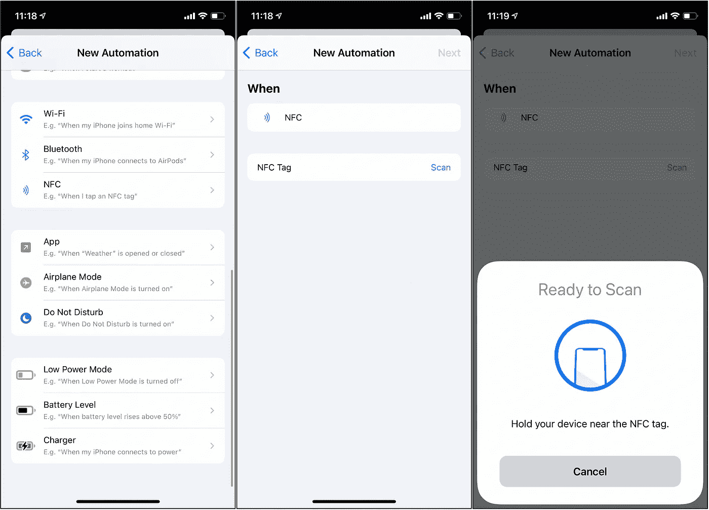
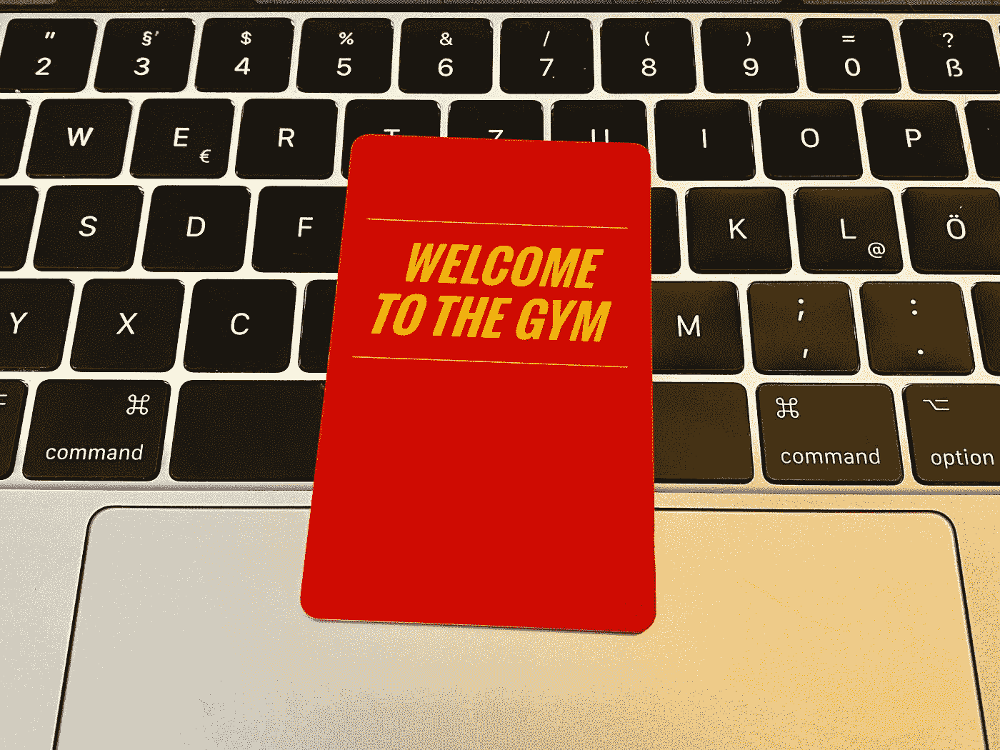
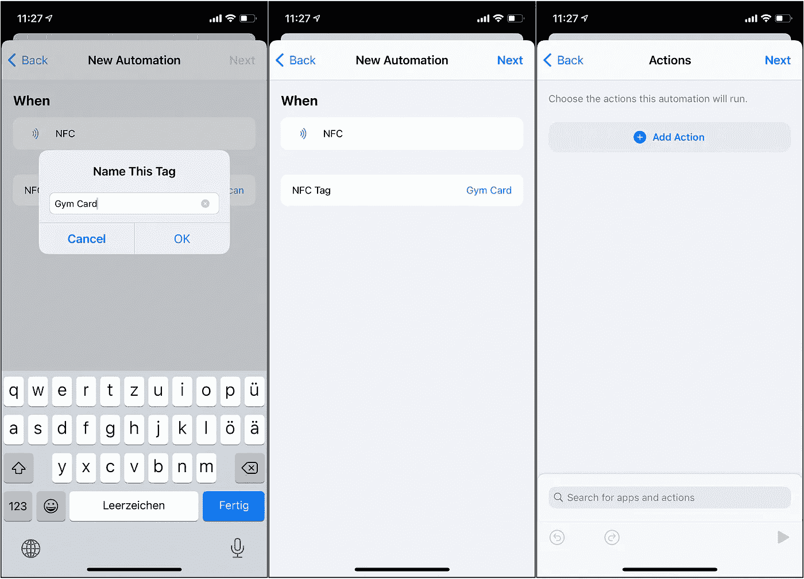
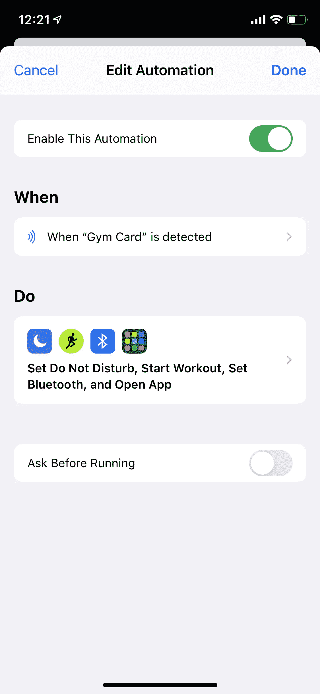

# 使用 NFC 标签自动化您的 iPhone

> 原文：<https://betterprogramming.pub/automating-your-iphone-using-nfc-tags-dba61538be09>

## 让我们让你的 iPhone 和你的家更智能

照片由来自 [Pexels](https://www.pexels.com/photo/shallow-focus-photo-of-r2-d2-figure-2085832/?utm_content=attributionCopyText&utm_medium=referral&utm_source=pexels) 的 [Luis J.](https://www.pexels.com/@onewayupdesigns?utm_content=attributionCopyText&utm_medium=referral&utm_source=pexels) 拍摄。

1.  从 App Store 下载快捷方式(如果尚未安装)。
2.  打开快捷方式，点击底部的“自动化”，然后点击右上角的加号(+)。
3.  点按“创建个人自动化”这打开了一长串可能的触发器。向下滚动直到看到“NFC”并选择它。

创造个人自动化

4.现在是时候扫描你的 NFC 标签、会员卡或任何 NFC 兼容的东西了。对于本教程，我将使用我的健身房会员卡。

5.扫描卡片后，您可以指定一个名称并点击“下一步”

6.现在是时候添加动作了。当你把你的 iPhone 放在扫描的 NFC 标签附近时，这些功能(还没有自动)就会运行。在此添加任何操作。对我来说，我会:

*   "在我离开之前，请不要打扰我."
*   “以开放式目标开始功能性力量训练”——开
*   “打开蓝牙”——连接到我的 AirPods
*   “打开 Spotify”——这样我就可以开始播放锻炼音乐了。

点击“下一个”现在到了我们激活自动运行的部分。在底部，您会在新的自动化屏幕中看到“运行前询问”项目。我们取消激活它，因为我们想在不确认的情况下运行自动化。只有当你认为它会意外触发时，这种确认才有意义，但由于我把手机和健身卡分开，这种情况不会发生。

您现在已经创建了您的第一个 NFC 自动化系统！祝贺您进入智能家居乐趣的全新世界！运行和测试您的自动化，只需用解锁的手机点击 NFC 卡，看看奇迹发生。