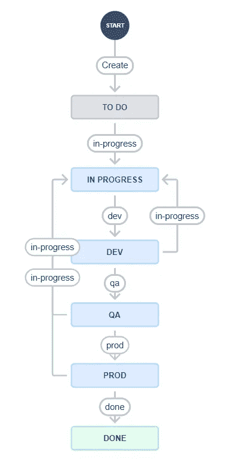
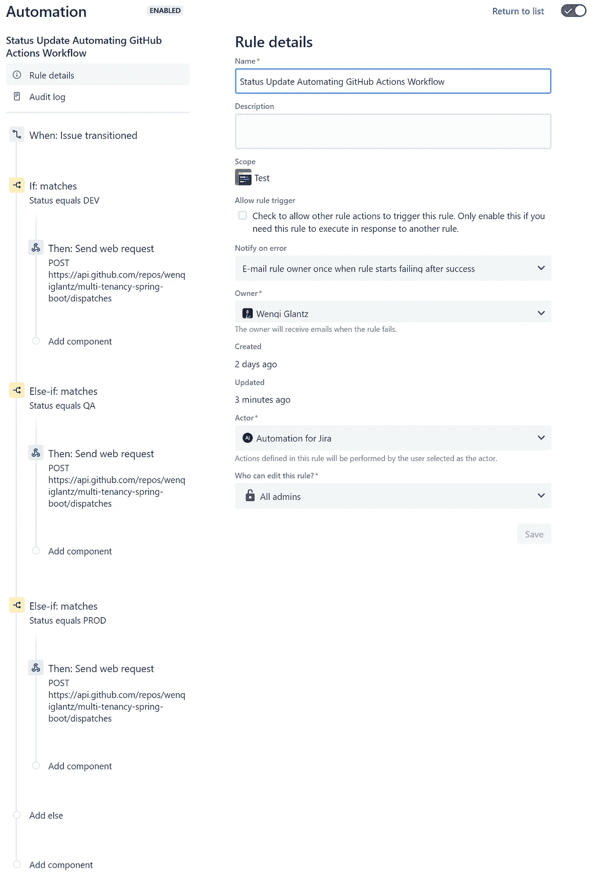
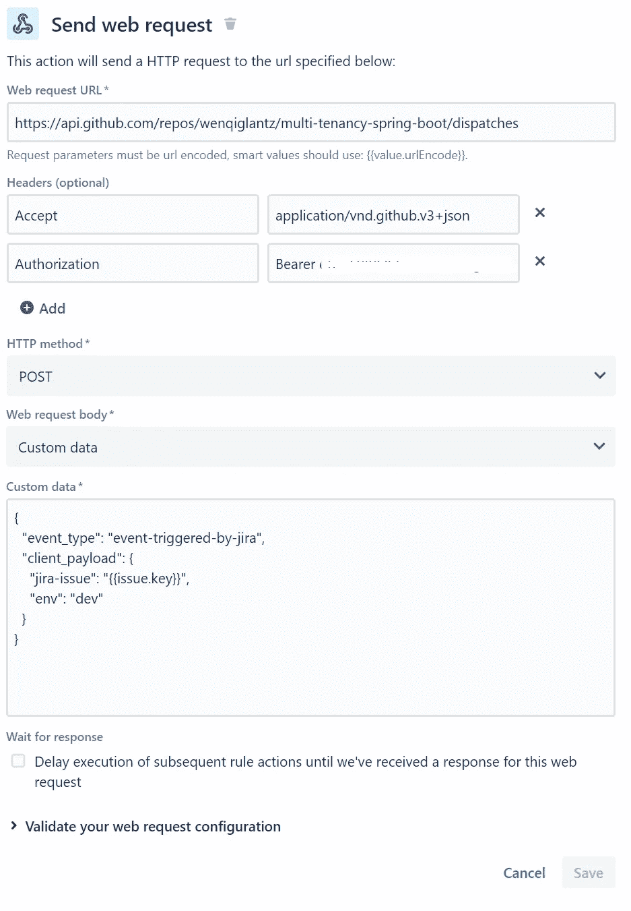
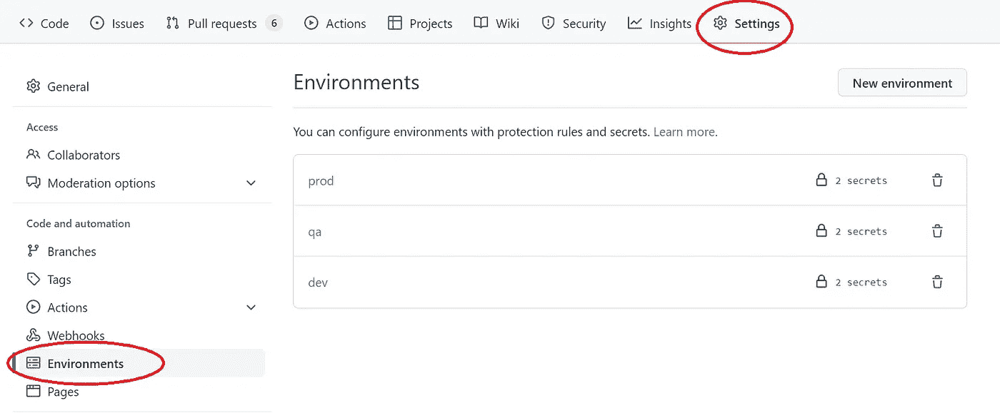
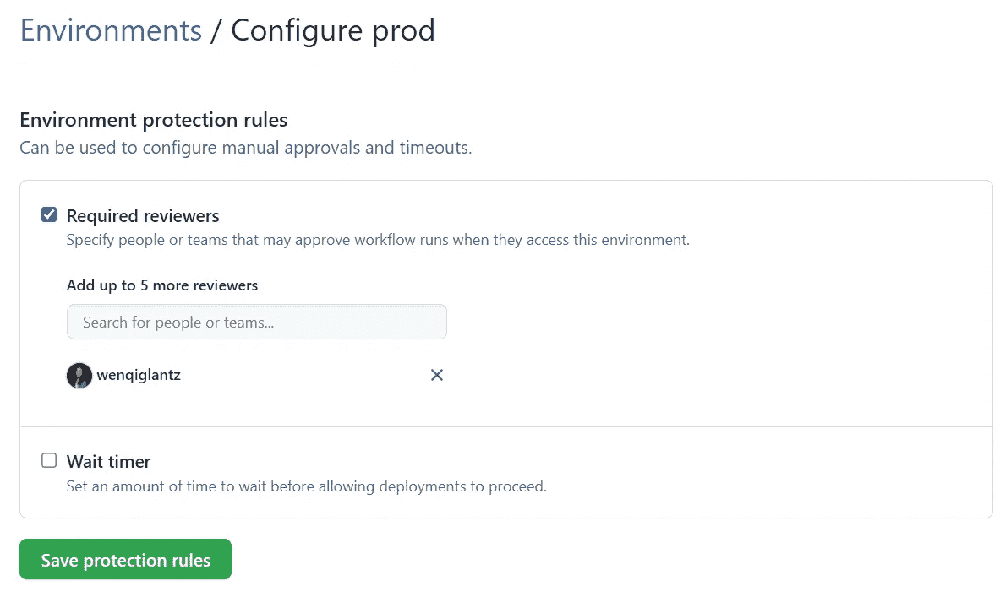

# JIRA Webhook 和 GitHub 操作流程的自动化

> 原文：<https://betterprogramming.pub/automation-with-jira-webhook-and-github-actions-workflow-fcd7efbf6688>

## 一步一步的指南，介绍如何使用存储库调度从 JIRA 自动化 GitHub actions 工作流

由[Filip baoti](https://unsplash.com/@filipbaotic?utm_source=unsplash&utm_medium=referral&utm_content=creditCopyText)在 [Unsplash](https://unsplash.com/?utm_source=unsplash&utm_medium=referral&utm_content=creditCopyText) 上拍摄的图像背景

自动化使我们能够专注于重要的工作，通过允许我们自动化我们的流程和工作流，消除了执行手动重复任务的需要。JIRA 提供了一个简单而强大的规则生成器，我们可以配置自动化规则来处理最复杂的场景。

在本案例中，我们将探讨如何自动更新 JIRA 问题状态，以触发 GitHub actions 工作流，从而为不同环境将 Spring Boot 微服务工件部署到 ECS Fargate。我们的目标:

*   用户将 JIRA 问题的状态更新为`DEV`；工件通过 GitHub actions 工作流部署到`DEV`环境中。
*   用户将 JIRA 问题的状态更新为`QA`；工件然后相应地被部署到`QA`环境中。
*   Prod 部署遵循同样的方式。

让我们在 JIRA 定义一个自动化规则来处理我们用例中的工作流。见下面截图:

有几点需要提及:

*   由于用例以 JIRA 问题中的`status`字段为中心，我们从`When: Issue transitioned`开始我们的规则。
*   我们使用`if/else`条件来阐明规则细节。
*   如果 status 等于`DEV`，我们触发一个 webhook 调用，向 GitHub actions 工作流发送一个存储库分派事件，以将工件部署到`DEV`环境中。
*   如果 status 等于`QA`，我们触发一个 webhook 调用，向 GitHub actions 工作流发送一个存储库分派事件，以将工件部署到`QA`环境中。
*   如果 status 等于`PROD`，我们将触发一个 webhook 调用，向 GitHub actions 工作流发送一个存储库分派事件，以将工件部署到`PROD`环境中。

*假设:该规则只能由对 JIRA 的特定项目具有管理员权限的用户创建。*

# Webhook 配置

让我们仔细看看如何在规则中定义 webhook。见下面截图。这个 webhook 本质上是对 [GitHub 的仓库调度 API](https://docs.github.com/en/rest/repos/repos#create-a-repository-dispatch-event) 的 REST API 调用。存储库调度只是对我们的存储库的 HTTP 请求，要求 GitHub 启动任何操作或 webhook。

利用这个特性，我们既可以使用存储库调度来手动触发 GitHub 动作，也可以设置一个像 JIRA 这样的应用程序，通过发送 web 请求来触发动作。

需要指出几件事:

*   此端点需要对存储库的写访问权限。标题部分的`Authorization`需要有值为`Bearer <github token>`。否则，调用将失败。
*   自定义数据部分。设计如下:
*   `event_type`:我们可以将事件类型定义为`event-triggered-by-jira`。稍后，在 GitHub Actions 工作流中，我们根据这个特定的事件类型进行过滤以进行处理。只要这里定义的事件类型与 GitHub actions 工作流中的事件类型相匹配，我们就可以随意命名。
*   `client_payload`参数可用于我们的工作流可能需要的任何额外信息。该参数是一个 JSON 负载，将在调度 webhook 事件时传递。在我们的例子中，我们定义了两个参数:
*   `jira-issue`:这是 JIRA 发行号，以 JIRA smart value `{{issue.key}}`的形式。我们可以在 GitHub 操作工作流的提交注释中使用这个 JIRA 问题编号。
*   `env`:这是我们想要传递给 GitHub actions workflow 的环境，因此工件可以部署在这里定义的特定环境中。

规则定义方面就是这样。现在，让我们转到 GitHub。

# GitHub 环境

GitHub 环境用于描述一般的部署目标，如`DEV`、`QA`或`PROD`。我们可以用特定于环境的秘密来配置环境。存储库机密充当默认/备份机密。环境机密会覆盖存储库机密。

我们还可以为更高的环境设置环境保护规则，比如`PROD`。我们可以配置多达六个审核者，以确保部署到`PROD`确实是有意的并得到批准。

# GitHub 操作工作流程

这是实际的工件部署发生的地方。完整`workflow.yml`见下面截图。这个 yml 文件中添加了注释来解释每个操作的目的。请注意，没有硬编码的环境或其他变量，因此我们可以使用相同的工作流 yml 部署到基于 JIRA `status`触发器的其他环境中。

几件需要注意的事情:

*   第 34–36 行:这是我们通过 JIRA 自动化规则中的 webhook 定义的触发器。确保事件类型的值与 webhook 自定义数据中定义的值完全相同。否则，将不会触发此工作流。
*   第 58 行:这就是 GitHub 环境施展魔法的地方。我们以`${{ github.event.client_payload.env }}`的形式传入 webhook 自定义数据中定义的`env`值。这告诉 GitHub 提取该特定环境的秘密，并根据其保护规则进行验证，以将工件部署到该特定环境。
*   第 188–193 行:在上述步骤之后添加了一条注释，以便观看此回购的用户通过电子邮件得到通知，特定的 JIRA 问题已被部署到在 JIRA 选择的环境中。

# 决赛成绩

以下是由 JIRA 问题引发的简化部署流程概述:

1.  一个开发人员被分配到一个 JIRA 票证上工作，该开发人员从主分支中创建一个特性分支，用 JIRA 发行号命名该分支，推送代码，提出 PR，并在批准后合并 PR。
2.  用户(开发人员或产品所有者？)将 JIRA 机票状态更改为`DEV`，JIRA 自动化触发 GitHub actions 工作流将工件部署到`DEV`环境。
3.  对于任何 bug 修复，开发者修复代码，推送代码，提出 PR，审批后合并 PR。
4.  在错误修复的情况下，JIRA 状态可以被更改为不同的值，比如`IN PROGRESS`，然后被更改回`DEV`，这将再次触发对`DEV`环境的最新工件部署。
5.  一旦`DEV`测试完成，用户将 JIRA 状态更改为`QA`，按照上述相同的流程继续到更高的环境，如`PROD`。
6.  可以随时为所有打开的票证调出 JIRA 报告，其状态字段反映其部署状态的各个阶段。
7.  在 GitHub 端，所有工件都驻留在主分支中。一个工作流使用从 JIRA 自动化规则传入的环境变量和 JIRA 问题编号来处理所有环境的 CI 和 CD。
8.  鼓励在 GitHub 中配置环境保护规则，至少对于较高的环境是如此，因此每个部署都需要由一个或多个指定人员批准。这也是为了避免肥手指在 JIRA 的状态更新。

# 摘要

在本文中，我们探讨了 JIRA 自动化规则、webhook 配置细节、GitHub 环境和 GitHub 操作工作流。展现 JIRA 和 GitHub 之间的自动化魔力很有趣。

真正令人兴奋的是，这仅仅是一个用例，我们可以在 JIRA 和 GitHub 之间自动化更多的流程。探索愉快！

# **参考文献**

[吉拉软件自动化:基础|亚特兰大](https://www.atlassian.com/software/jira/guides/expand-jira/automation)

[仓库— GitHub 文档](https://docs.github.com/en/rest/repos/repos#create-a-repository-dispatch-event)

[使用部署环境— GitHub 文档](https://docs.github.com/en/actions/deployment/targeting-different-environments/using-environments-for-deployment)