# 使用 Kubernetes 针对意外流量自动调整您的应用

> 原文：<https://betterprogramming.pub/autoscale-your-application-for-unexpected-traffic-using-kubernetes-ff5ee7d9f22>

## 关于可伸缩性的实用分步指南，包含有趣的故事。


来自 [Pexels](https://www.pexels.com/photo/man-performing-on-stage-2102568/?utm_content=attributionCopyText&utm_medium=referral&utm_source=pexels) 的[加布里埃尔·桑托斯·福托格拉菲亚](https://www.pexels.com/@gabrielsantosfotografia?utm_content=attributionCopyText&utm_medium=referral&utm_source=pexels)的照片

我们如何在睡觉时处理来自黑色星期五或 11.11 等营销活动的意外流量？对于不可预测的数据大小，我们如何在生产环境中提供可伸缩的 API？

在本系列教程结束时，我们将实现如下可扩展设计:

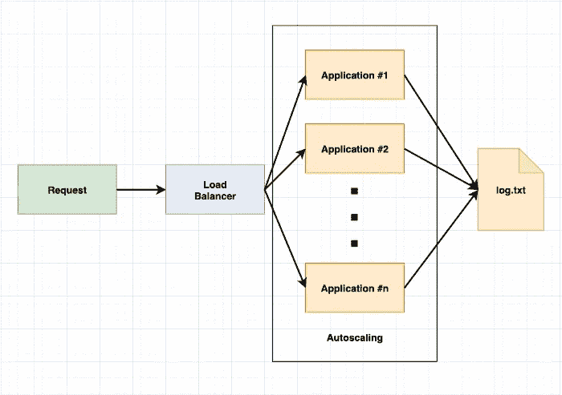

作者图片

# 1.背景

容器化的应用程序代码为我们提供了扩展的基础。要横向扩展应用程序，应用程序必须是可横向扩展的。

我们建议您阅读[How To contained And Scale Your Application For Unexpected Traffic 或 Model Training](/how-to-scale-your-application-for-unexpected-traffic-or-model-training-a8b0a0c44d80) ，如果您尚未了解我们如何从头构建一个应用程序并将其容器化，作为我们未来扩展的构建模块。

在上一篇文章中，我们手动修改了代码，以启动另一个监听不同连接端口的容器。但是，该方法有一些限制:

*   我们修改了应用程序代码，使每个应用程序都有单独的端口。
*   我们用不同的容器名构建容器，并且必须维护它们。
*   `request`需要确切地知道调用哪个端点、`localhost:3000`和`localhost:3001`，最终是同一个服务。我们期望调用者知道同一服务的端点吗？
*   我们如何用一个命令来缩放容器呢？
*   我们如何自动缩放容器？

Kubernetes 解决了所有这些限制/问题，它是最流行的容器编排平台，基本上是容器音乐会的指挥。

# 2.履行

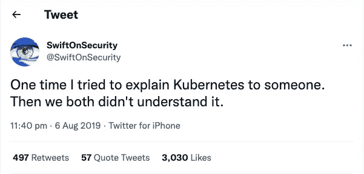

在我们看到魔法之前，一切都没有意义，稍后会有解释。

我们在 [LAB1](/how-to-scale-your-application-for-unexpected-traffic-or-model-training-a8b0a0c44d80) 中下载了 Docker Desktop(lab 1 是来自[如何为意外流量或模型训练](/how-to-scale-your-application-for-unexpected-traffic-or-model-training-a8b0a0c44d80)封装和扩展您的应用程序的实验部分)，我们只需要在上面启用 Kubernetes。

## 在 Kubernetes 上运行 LAB2.1

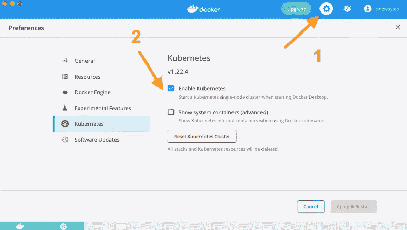

Docker 桌面

1.  打开 **Docker 桌面**点击设置。
2.  转到 **Kubernetes** 并勾选“启用 Kubernetes”复选框。

在`~/medium-scalability`中新建一个名为`scalability-deployment.yaml`的 YAML 文件，文件夹结构如下:

```
medium-scalibility
├── .dockerignore               #Created in LAB1.2
├── Dockerfile                  #Created in LAB1.2
├── log
│   └── log.txt                 #Created in LAB1.1
├── package.json                #Created in LAB1.1
├── **scalability-deployment.yaml #Created in LAB2.1**
└── server.js                   #Created in LAB1.1
```

`scalability-deployment.yaml`如下图所示:

执行命令:

```
$kubectl apply -f scalability-deployment.yaml
$docker ps
```

我们应该看到一个名称从`k8s_scalability-deployment_scalability-deployment-*hex*`开始的容器

让我们发送一个`request`到`localhost:30007`并检查输出。

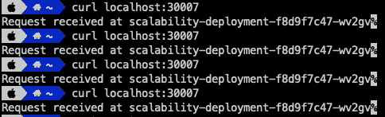

我们可以看到它是由一个单独的容器`scalability-deployment-f8d9f7c47-wv2gv`接收的。

执行呢

```
$kubectl scale deployment/scalability-deployment --replicas=3
$docker ps
```

现在单子上有多少集装箱？**三个**。

瞧啊。Kubernetes 为我们节省了很多麻烦，让我们测试一下这个请求是否平衡。

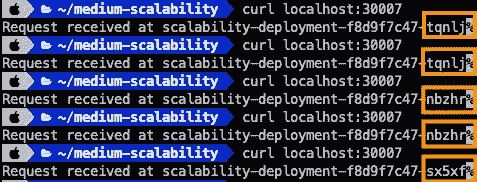

我们注意到 3 个不同的容器收到了相同的`address:port`请求。

与第 1 部分中的[旋转一个额外的容器相比，这是多么容易。使用 Kubernetes 只需要一个命令就可以改变副本的数量。](/how-to-scale-your-application-for-unexpected-traffic-or-model-training-a8b0a0c44d80)

# 3.魔术揭秘

是什么让只需一个命令就能轻松扩展应用程序？答案是 Kubernetes。

确切地说，我们使用 Kubernetes **部署**和**服务**来实现这种扩展和负载平衡。

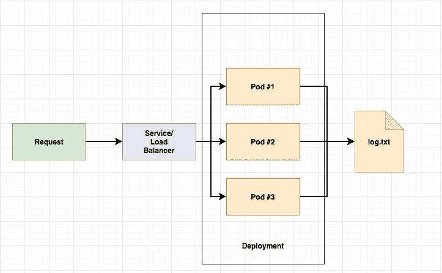

部署和服务。图片作者。

1.  部署是容器的管理者，或者为了简单起见，我们在 Kubernetes 空间中将容器称为 pod。但是，集装箱和豆荚在技术上不是一回事。部署为 [Pods](https://kubernetes.io/docs/concepts/workloads/pods/) 提供声明性更新，或者在我们的示例中，我们想要 1 个副本，后来将其更改为 3 个。
2.  服务是将运行在一组 [pods](https://kubernetes.io/docs/concepts/workloads/pods/) 上的应用程序公开为网络服务的抽象方式，或者是跨 Pods 进行负载平衡并公开部署在一组 Pods 上的应用程序的抽象方式。

我们使用 Kubernetes 服务作为负载平衡器，在所有容器之间路由客户端请求，以便它们能够在速度、可用性和容量利用率方面以最高效率满足所有传入请求。此外，该服务还可以确保没有单个容器超负荷工作，这可能会降低性能。

## 故事时间—部署和服务

我们可以将服务视为面向客户的角色，或者将客户支持和部署视为工程经理。


照片由 [PNW 制作](https://www.pexels.com/@pnw-prod?utm_content=attributionCopyText&utm_medium=referral&utm_source=pexels)来自 [Pexels](https://www.pexels.com/photo/person-holding-silver-and-black-laptop-computer-9218657/?utm_content=attributionCopyText&utm_medium=referral&utm_source=pexels)

假设我们在预订机票时出错。在不知道确切问题的情况下，我们联系客户支持，客户支持将根据他们的能力将问题转发给适当的工程经理。

在我们声明了期望的状态之后，工程经理将处理底层问题，而无需我们担心实现步骤。

无论是支付系统还是订单管理系统的问题，作为客户，我们只需联系客户支持(Kubernetes 服务)。此外，工程经理(Kubernetes 部署)将在管理层批准后负责招聘流程。

为了验证管理人员的能力，我们尝试手动关闭 3 个正在运行的容器中的一个。

```
$docker ps #Select one container's ID
$docker kill CONTAINER_ID
$docker ps #The container killed is absent from the list
```

几秒钟后，当我们运行`$docker ps`时，我们将看到`medium-scalability`的数量再次回到 3。Kubernetes 部署执行并监控我们声明的内容，将副本设为 3。

我们宣布了什么？让我们回顾一下我们之前创建的 YAML 文件。

我们**使用 YAML 文件`scalability-deployment.yaml`声明了**Kubernetes 的理想状态，我们将讨论 YAML 文件中的属性。请特别注意 YAML 的档案。

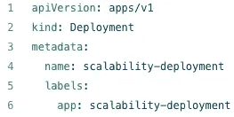

来自`scalability-deployment.yaml (line 1-6)`的部分片段

*   第 2 行表明我们正在使用 Kubernetes 部署。
*   第 4 行命名这个 Kubernetes 对象。
*   第 6 行标记这个 Kubernetes 对象。

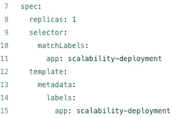

来自`scalability-deployment.yaml (line 7-15)`的部分片段

*   第 8 行表示容器/箱的复制品的数量。
*   第 9 行选择要复制的基本容器

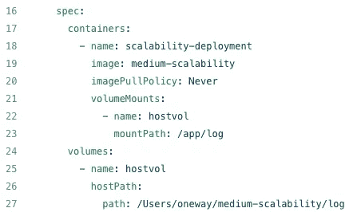

来自`scalability-deployment.yaml (line 16-27)`的部分片段

*   第 19 行显示了构建容器的图像。
*   第 20 行告诉 Kubernetes 从 local 获取图像，而不是从 DockerHub 获取。
*   第 21–23 行为本地主机挂载容器的目录。

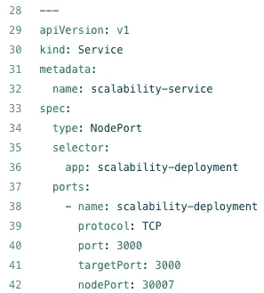

来自`scalability-deployment.yaml (28-42)`的部分片段

从第 29 行开始，我们使用 Kubernetes **服务**，它通常在部署文件中被**声明**并被`---`分隔，因为用`deployment`声明网络层是有意义的。

*   第 30 行表示我们正在使用 Kubernetes 服务。
*   第 34 行选择类型为`NodePort`。我们有 Kubernetes 支持的`ClusterIP`、`LoadBalancer`和`ExternalName`。
*   第 40 和 41 行用于端口转发。(`targetPort`:容器接受流量的端口，`port`:抽象服务端口，可以是其他 pod 用来访问服务的任何端口)
*   第 42 行声明`nodePort`为 30007，没有标记的默认端口在 30000-32767 范围内。

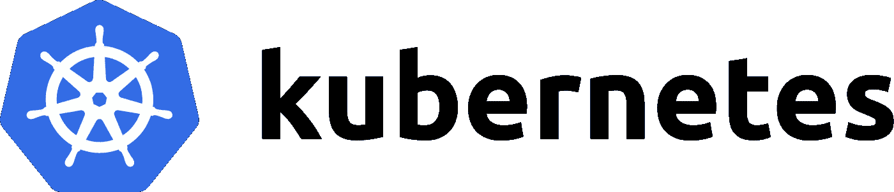

Kubernetes 徽标来自 [kubernetes.io](https://kubernetes.io/)

Kubernetes，也称为 K8s，是一个自动化容器操作的开源平台。它消除了部署、扩展和管理容器化应用程序所涉及的许多手动流程。

它最初是由谷歌设计的，现在由云原生计算基金会维护。

**有趣的事实。**你可能看到的是 K8s，它是把“ubernete”的八个字母换成数字 8 得来的。同样适用于著名的风险投资 A16Z，它是 Andreessen Horowitz 的缩写。

除此之外,“Kubernetes”这个名字来自一个希腊词，意思是领航员或舵手。

到目前为止，我们应该已经对 Kubernetes 有了一些基本的了解，是时候学习一些基本的命令了:

```
kubectl get pods       *# List all pods in the namespace*
kubectl get deployments *# List all deployments in the namespace*
kubectl get services   *# List all services in the namespace*kubectl describe pods my-pod *# To show the verbose output of the pod*kubectl delete pod POD_NAME               *# Delete a pod using the pod name*
kubectl delete deployment DEPLOYMENT_NAME *# Delete a deployment using the pod name*
kubectl delete service SERVICE_NAME       *# Delete a service using the service name*kubectl logs my-pod                       *# Dump pod logs (stdout)*kubectl apply -f CONFIGURATION_FILE_NAME *# Apply a configuration to a resource by file name*
```

我们可以从 kubectl cheat sheet 中了解更多信息。

[](https://kubernetes.io/docs/reference/kubectl/cheatsheet/) [## kubectl 备忘单

### 这个页面包含一个常用 kubectl 命令和标志的列表。Kubectl 自动完成 BASH 源代码> ~/。bashrc #…

kubernetes.io](https://kubernetes.io/docs/reference/kubectl/cheatsheet/) 

更新 Kubernetes 对象的两种方法:

*   **声明性 *:*** 使用 JSON 或 YAML(好的做法)。
*   **命令式:**使用命令行界面(CLI)进行更新。

您可能注意到在本文中多次突出显示了“declare”这个词。

声明式编程是一种编程范式，我们编写的代码描述了我们想要什么，但不一定是如何得到它(**声明**我们想要的结果，但不是一步一步来)。

另一方面，命令式编程一步一步地告诉编译器我们想要实现什么。

# 奖金—自动缩放

我们如何在睡觉时处理来自黑色星期五或 11.11 等营销活动的意外流量？

kubernetes**HorizontalPodAutoscaler(HPA)**是值得信赖的飞行员/魔术师，当我们玩得开心时，它会支持我们。

它自动更新工作负载资源(例如[部署](https://kubernetes.io/docs/concepts/workloads/controllers/deployment/))，目的是自动扩展工作负载以满足需求。

让我们开始魔术表演。

## 实验室 2.2 自动缩放

仅通过添加第 22–25 行来修改`scalability-deployment.yaml`。

Kubernetes 至少为该容器专门保留请求数量的系统资源。

如果运行 Pod 的节点有足够的可用资源，容器就有可能(也允许)使用比它的`request`指定的更多的资源。然而，一个容器不允许使用超过它的资源`limit`。

在这种情况下，我们需要 200 个毫核来运行每个 pod。

执行以下命令以应用新的更改，并覆盖我们之前将副本更改为 3 的事实:

```
$kubectl apply -f scalability-deployment.yaml
```

副本应该回到 1，运行`$kubectl get pods`进行验证，我们应该只看到 1 个 pod 在运行。

招募负责监控工作负载和自动扩展的 HPA 试点/魔术师:

```
$kubectl autoscale deployment scalability-deployment --cpu-percent=50 --min=1 --max=10
```

该命令创建一个 HorizontalPodAutoscaler，它维护由我们创建的`scalability-deployment`部署控制的 pod 的 1 到 10 个副本。

HPA 将增加和减少副本的数量(通过更新部署),以保持所有单元的平均 CPU 利用率为 50%,即 100 毫核。

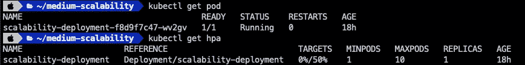

创建一个无限的 while 循环，每 10 毫秒请求一次`localhost:30007`。

```
$while sleep 0.01; do curl localhost:30007; done
```

在一分钟左右的时间内，我们应该会看到目标发生变化。

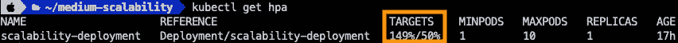

它创建了 3 个副本，运行`kubectl get pod`显示根据年龄新创建了 2 个 pod。

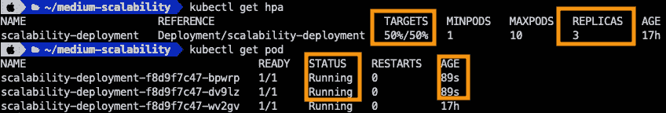

副本的数量由以下公式确定:

```
desiredReplicas = ceil[currentReplicas * ( currentMetricValue / desiredMetricValue )]
```

在我们的例子中，我们看到 149% / 50%和`desiredReplicas`在撞击我们的头部后将是 3。

通过检查第 32 行定义的日志`path: /Users/oneway/medium-scalability/log`，验证 3 个 pod 收到请求。

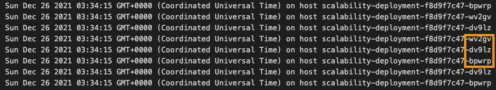

它显示在容器的主机名`wv2gv`、`dv9lz`和`bpwrp`接收到的请求。

我们实现了如下可扩展设计:


图片作者。

我们可以参考 Kubernetes 官网的另一个自动缩放演练:

[](https://kubernetes.io/docs/tasks/run-application/horizontal-pod-autoscale-walkthrough/) [## HorizontalPodAutoscaler 漫游

### HorizontalPodAutoscaler(简称 HPA)自动更新工作负载资源(例如部署或…

kubernetes.io](https://kubernetes.io/docs/tasks/run-application/horizontal-pod-autoscale-walkthrough/) 

# 关键要点

我们已经在第 1 部分中学习了开发可伸缩应用程序和容器化应用程序，Kubernetes 编排了容器，并消除了部署、伸缩和管理容器化应用程序所涉及的许多手动过程。

您能否解决本文第一部分提出的限制，即我们在第 1 部分中仅使用 Docker 进行伸缩？

*   我们修改了应用程序代码，使每个应用程序都有单独的端口。
*   我们用不同的容器名构建容器，并且必须维护它们。
*   `request`需要确切地知道调用哪个端点，`localhost:3000`和`localhost:3001`，最终是同一个服务。我们期望调用者知道同一服务的端点吗？
*   我们如何用一个命令来缩放容器呢？
*   我们如何自动缩放容器？

我们只需在 YAML 文件中声明期望的状态:

1.  部署是容器的管理者，或者为了简单起见，我们在 Kubernetes 空间中将容器称为 pod，但它们不是一回事。部署为[pod](https://kubernetes.io/docs/concepts/workloads/pods/)提供声明性更新。
2.  服务是将运行在一组 [pods](https://kubernetes.io/docs/concepts/workloads/pods/) 上的应用程序公开为网络服务的抽象方式，或者是跨 Pods 进行负载平衡并公开部署在一组 Pods 上的应用程序的抽象方式。
3.  `HorizontalPodAutoscaler` (HPA)自动更新工作负载资源，目的是自动扩展工作负载以满足需求。

> "船长，这篇文章应该能让你掌握环球航行的技能."

这篇文章的目的是给你更多的信心，帮助你开始使用 Kubernetes。更多信息，请参见 [Kubernetes 文档](https://kubernetes.io/docs/home/)。

# 放弃

这不是一篇供您深化技能集的科学论文或深入的技术文章，而是一个有趣而实用的系列，供您构建您的第一个可扩展应用程序，并为您提供另一个角度来理解。

# 参考

1.  [https://kubernetes . io/docs/tasks/run-application/horizontal-pod-auto scale/](https://kubernetes.io/docs/tasks/run-application/horizontal-pod-autoscale/)
2.  [https://kubernetes . io/docs/concepts/configuration/manage-resources-containers/](https://kubernetes.io/docs/concepts/configuration/manage-resources-containers/)
3.  [https://kubernetes . io/docs/concepts/services-networking/service/](https://kubernetes.io/docs/concepts/services-networking/service/)
4.  [https://kubernetes . io/docs/concepts/workloads/controllers/deployment/](https://kubernetes.io/docs/concepts/workloads/controllers/deployment/)
5.  [https://stack overflow . com/questions/1784664/声明式和命令式编程范式的区别是什么](https://stackoverflow.com/questions/1784664/what-is-the-difference-between-declarative-and-imperative-paradigm-in-programmin)
6.  [https://kubernetes . io/docs/concepts/services-networking/connect-applications-service/](https://kubernetes.io/docs/concepts/services-networking/connect-applications-service/)

```
**Want to Connect With Author?**Love connecting with friends all around the world on [Linkedin](https://www.linkedin.com/in/teowangwei/).
```