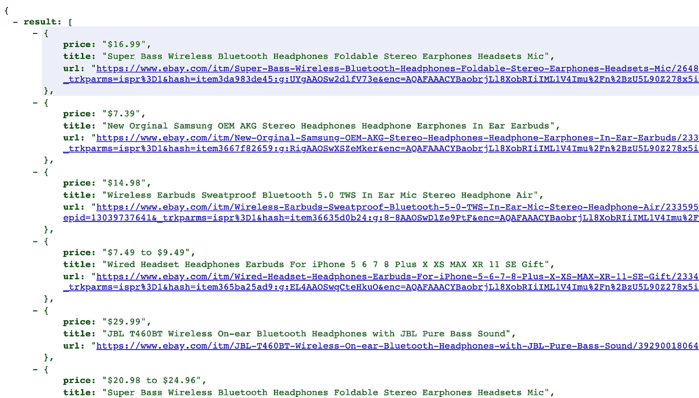
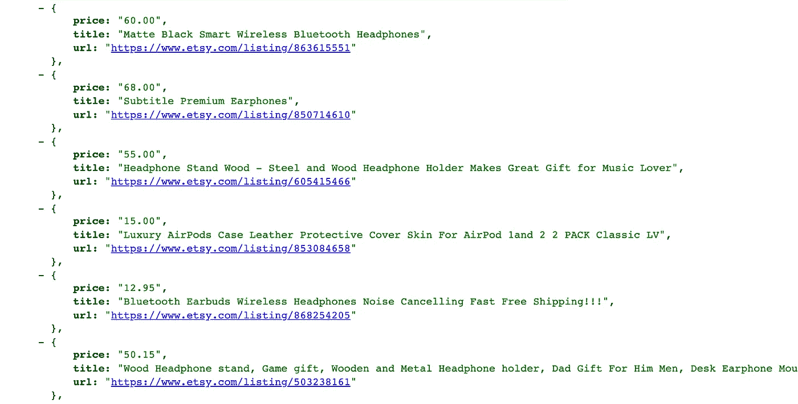

# AutoScraper 和 Flask:在不到 5 分钟的时间内从任何网站创建一个 API

> 原文：<https://betterprogramming.pub/autoscraper-and-flask-create-an-api-from-any-website-in-less-than-5-minutes-3f0f176fc4a3>

## 用不到 20 行 Python 代码


照片由 [Vipul Jha](https://unsplash.com/@lordarcadius?utm_source=unsplash&utm_medium=referral&utm_content=creditCopyText) 在 [Unsplash](https://unsplash.com/s/photos/python-code?utm_source=unsplash&utm_medium=referral&utm_content=creditCopyText) 上拍摄。

在本教程中，我们将创建自己的电子商务搜索 API，支持易贝和 Etsy，而不使用任何外部 API。借助 [AutoScraper](https://github.com/alirezamika/autoscraper/) 和 [Flask](https://flask.palletsprojects.com/) 的强大功能，我们能够在每个站点不到 20 行的 Python 代码中实现这个目标。如果你还没有这样做，我推荐你阅读我上一篇关于 AutoScraper 的文章。

# 要求

使用 pip 安装所需的库:

```
pip install -U autoscraper flask
```

# 让我们开始吧

首先，我们将创建一个智能刮刀，从易贝的搜索结果页面获取数据。假设我们想要获得每个项目的`title`、`price`和`product link`。使用 AutoScraper，只需提供一些示例数据就可以轻松完成:

注意，如果您想要复制并运行这段代码，您可能需要更新`wanted_list`。

现在，让我们按照刮擦规则对结果进行分组:

```
scraper.get_result_similar(url, grouped=True)
```

从输出中，我们将知道哪个规则对应于哪个数据，因此我们可以相应地使用它。让我们根据输出设置一些别名，删除多余的规则，并保存模型，以便以后使用:

请注意，如果您运行代码，规则 id 会有所不同。

好的，我们已经覆盖了易贝。让我们添加对 Etsy 搜索结果的支持。我们将从制造它的刮刀开始。这次，我们将使用`wanted_dict`而不是`wanted_list`。它会自动为我们设置别名:

由于 Etsy 上的链接每次都是用一个唯一的 ID 生成的，所以我们向`wanted_dict`添加了一个示例产品 ID，这样我们就可以从中创建链接。此外，我们提供了两个标题和价格示例，因为 Etsy 搜索结果页面上的项目结构是不同的，我们希望 scraper 了解它们。

在分析了输出之后，让我们保留我们想要的规则，删除其余的，并保存我们的模型:

现在我们已经准备好了我们的刮刀，我们可以用不到 40 行代码为这两个站点创建功能完整的 API:

这里，我们用参数`q`定义一个 API 作为我们的搜索查询。我们将获得并加入易贝和 Etsy 的搜索结果，并将它们作为响应返回。注意，我们将`group_by_alias=True`传递给 scraper，以获得按我们定义的别名分组的结果。

通过运行这段代码，API 服务器将监听端口 8080。所以让我们通过在浏览器中打开`[http://localhost:8080/?q=headphone](http://localhost:8080/?q=headphone)`来测试我们的 API:



来自易贝的一些结果



Etsy 的一些结果

瞧啊。我们已经准备好了电子商务 API。只需将 URL 中的`headphone`替换为您想要的查询，就可以获得搜索结果。

# 最终注释

本教程的最终代码可在 GitHub 的[上获得。](https://github.com/alirezamika/tutorials/tree/master/api_server)

这是一个适合开发和测试的开发设置。Flask 的内置服务器不适合生产。关于生产用途，请检查[烧瓶的展开选项](https://flask.palletsprojects.com/en/1.1.x/deploying/)。

本教程旨在个人和教育用途。如果你想抓取网站，你可以查看他们关于抓取机器人的政策。

我希望这篇文章是有用的，有助于将您的想法更快地转化为代码。编码快乐！