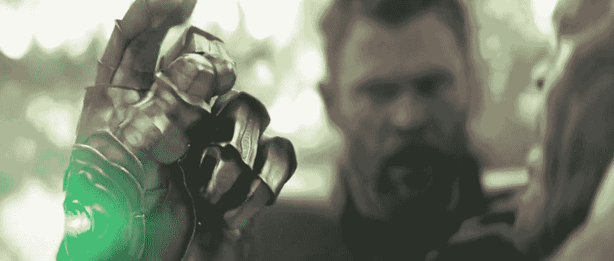
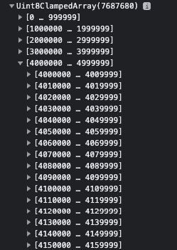
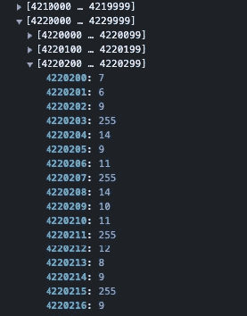

# 用画布创建复仇者联盟快照效果并做出反应

> 原文：<https://betterprogramming.pub/avengers-snap-effect-with-canvas-and-react-ab698de17bc>

## 让我们让另一个漫威角色消失吧！



[图片来自复仇者联盟 3：无限战争](https://www.marvel.com/movies/avengers-infinity-war)

最近我在迪士尼+上狂看复仇者联盟电影(又一次！)，当我看到灭霸打响指，把几乎所有人都变成了尘土时，我想起了多年前用 Adobe Flash 制作的一部老动画。这是一个与电影惊人相似的图像的溶解效果。

这篇文章将教我们如何用图像像素制作粒子，并分别制作它们的动画。

所以，这是我们要做的效果:

酷，我们开始吧！

> **快速提示:**尽管标题写的是 React，但是动画代码是用裸 JavaScript 写的，所以你可以很容易地用 document.querySelector 或者等效的东西改变 React 部分。

# 准备我们的画布

我们这个项目的受害者，正如你在视频中看到的，将是旺达·马克西莫夫，又名斯嘉丽女巫。当然，你可以选择任何你想要的 MCU 字符。只是要注意，图像应该有一个透明的背景，不要因为性能原因而太大。600x400 之类的应该可以。

让我们首先添加一个画布，并在其中加载我们的图像。代码如下:

这里的代码非常简单。首先，我们为画布创建`ref`，然后在`useEffect`中检查画布是否被加载。如果是这样，我们访问上下文并将画布的宽度和高度设置为窗口的内部尺寸。这使得我们的画布占据了整个屏幕(画布大小应该以单位来定义，CSS 单位本身是不够的)。

这些样式的宽度和高度都是 100%，所以我们将在完整的视口中工作。

然后，我们加载图像元素，并通过 context 的`drawImage`方法将它绘制到画布中。第二个和第三个参数是图像的位置，所以通过简单的计算，我们可以将图像放在页面的中央。

目前为止，没什么特别的。我们只是在屏幕中间展示我们的旺达。我们现在将为这些粒子生成粒子和一个发生器(或者说，如果你想的话，控制器)。

# 粒子类别

为了创建粒子，我们将从 OOP 语言中编写你可能熟悉的类。这将使我们的代码变得干净，并允许我们更容易地进行修改。

首先，我们从这样一个`Particle`类开始。您可以将这段代码放在 React 函数之外的任何地方。

```
class Particle {
  constructor(x, y, color) {
    this.color = color;
    this.x = x;
    this.y = y;
    this.size = 5;
   }

  draw(context) {
    context.fillStyle = this.color;
    context.fillRect(this.x, this.y, this.size, this.size);
  }
  update() {

  }
}
```

我们的粒子将是一个在`5px`中的小矩形，它采用`x`和`y`参数来确定它在画布中的位置，以及哪些`color`参数需要用哪种颜色填充。`draw`方法使我们的矩形以指定的大小和颜色出现。此外，我们添加了一个更新方法，我们将很快实现它。

继续我们的`Generator`，在`Particle`类之后添加这段代码:

```
class Generator {
  constructor(width, height) {
    this.width = width;
    this.height = height;
    this.particlesArray = [];
  }

  init(context) {
    this.particlesArray.push(new Particle(10, 10, 'red'));
  }

  draw(context) {
    this.particlesArray.forEach((particle) => particle.draw(context));
  }

  update() {
    this.particlesArray.forEach((particle) => particle.update());
  }
}
```

`generator`类也非常简单。它的行为就像一个控制器和一个容器，具有与`Particle`类相同的方法，允许我们生成、绘制和更新屏幕上的所有粒子。我们通过创建一个空数组并将每个生成的粒子推入其中，然后循环遍历该数组并调用粒子自己的 draw 和 update 方法来实现这一点。它画了一个红色的粒子，但是稍后我们会把它变成我们的图像像素。

不错！到目前为止，我希望没有什么是不清楚的，因为我们将潜入更具挑战性的东西。

# 从图像中获取像素信息

如前所述，我们将根据图像的像素生成粒子，并通过这些粒子重建图像。为此，`Canvas`元素具有`getImageData`方法，该方法返回指定画布区域的所有像素的颜色数据(更多信息请访问:[https://developer . Mozilla . org/en-US/docs/Web/API/canvasrenderingcontext 2d/getImageData](https://developer.mozilla.org/en-US/docs/Web/API/CanvasRenderingContext2D/getImageData))。

现在，在`Generator`的`init`方法中，用下面的一行替换我们生成粒子的那一行:

```
init(context) {
    const pixels = context.getImageData(0, 0, this.width, this.height).data;
}
```

如果我们`console.log(pixels)`在这一点上，并检查开发人员的工具，我们会看到像这样的嵌套数组吨:



什么 da！？？

这是因为`getImageData`在`Uint8ClampedArray`中返回原始数据(此处钳位表示其值在 0 到 255 之间)而不是格式化数据。现在，如果您检查该数组的值，您会注意到大多数值都是`0`。但是，如果您在列表中间选择一个数组系列，您可能会看到如下一些值:



现在我们有进展了！

我认为这很明显。这些值是像素的颜色数据。`255`是 alpha 值，在它们之前的每三个值分别是红色、绿色和蓝色。因为我们的图像位于屏幕的中间，所以我们遇到中间行的值也就不足为奇了。

好，那么我们如何处理这些数组呢？因为它们是嵌套的，所以我们需要一个嵌套结构来解析它们。修改`init`如下:

```
init(context) {
    const pixels = context.getImageData(0, 0, this.width, this.height).data;
     for (let y = 0; y < this.height; y++) {
      for (let x = 0; x < this.width; x++) {
        const index = (y * this.width + x) * 4;
        const red = pixels[index];
        const green = pixels[index + 1];
        const blue = pixels[index + 2];
        const alpha = pixels[index + 3];
        const color = `rgb(${red}, ${green}, ${blue})`;

        if (alpha > 0) {
          this.particlesArray.push(new Particle(x, y, color));
        }
      }
    }
}
```

该死的代码！嗯，我能说的是，你不需要理解它，但我们做的是他们所说的图像算法中的“扫描线”。我们遍历画布的每一个像素，每四个值得到一个锚。然后我们选择它们之间的值，并将它们连续分配给 RGBA 变量。最后，我们用 alpha 值为每个像素生成一个粒子——意味着不为空。

当你运行代码时，你会看到我们的图像的副本显示在我们的原始图像之上，但是这次，它是由我们的粒子组成的。在动画开始时，我们将删除原始图像，这样我们将只看到我们的粒子。

现在，让我们回到我们的`useEffect`并添加以下几行:

```
useEffect(() => {
    const canvas = canvasRef.current;

    if (canvas) {
      const ctx = canvas.getContext("2d");
      ctx.imageSmoothingEnabled = false;

      canvas.width = window.innerWidth;
      canvas.height = window.innerHeight;

      const generator = new Generator(canvas.width, canvas.height);

      const image = new Image();

      image.onload = function () {
        ctx.drawImage(
          image,
          canvas.width / 2 - image.width / 2,
          canvas.height / 2 - image.height / 2
        );

        generator.init(ctx);

        startAnimation(
          generator,
          ctx,
          canvas.width,
          canvas.height,
        );
      };
      image.src = "/images/wanda.png";
    }
  }, []);
```

在这里，我们初始化我们的`Generator`，在`init`中传递我们的画布大小和上下文。此外，我们单独定义我们的动画功能。我们可能会将它保存在`useEffect`中，但是我们需要确保它运行一次。所以，我们用`useCallback`把这个部分包起来，放在`useEffect`上面。

```
const startAnimation = useCallback((generator, ctx, w, h, count) => {
     function animate() {
      ctx.clearRect(0, 0, w, h);
      generator.draw(ctx);
      generator.update();
      requestAnimationFrame(animate);
    }
    setTimeout(() => animate(), 2000);
  }, []);
```

这是动画发生的地方。首先，我们从`setTimeout`开始，给观众一小段时间看原始图像，这样他们就能明白动画是如何开始的。稍后，我们的`animate()`函数运行并首先清除我们的画布(我们的原始图像以这种方式消失)，然后调用`Generator`的 draw 和 update 方法，这实际上是调用`Particle`的 draw 和 update 方法来使用更新的粒子绘制整个画布。用`window.requestAnimationFrame`或简单地说，`requestAnimationFrame`我们冲洗并重复这个过程。

好，所以在运行我们的代码之前，我们需要更新我们的`Particle`类，否则什么都不会发生:

```
lass Particle {
  constructor(x, y, color) {
    this.color = color;
    this.x = x;
    this.y = y;
    this.size = 5;
    this.vx = -Math.random() * 2;
    this.vy = -Math.random() * 2;
    this.vFactor = 1.01;
  }

  draw(context) {
    context.fillStyle = this.color;
    context.fillRect(this.x, this.y, this.size, this.size);
  }
  update() {
    this.x += this.vx;
    this.y += this.vy;
    this.vx *= this.vFactor;
    this.vy *= this.vFactor;
  }
}
```

这里，我们将速度值添加为`vx`和`vy`，并让它们具有在`0`和`2`之间的随机值。还要注意，它们是负值，允许粒子在屏幕的左边向上移动。这将产生一些微风从右边吹来的效果。我还添加了一个速度倍增器`vFactor`，让粒子随着时间加速。

好了，让我们来看看目前我们有什么:

很好！现在，如果我们运行代码，我们短暂地看到旺达的图像，然后它会完全爆发成粒子而不是溶解。这不是我们想要的，而且它也很慢。

这是因为我们添加了比我们需要的更多的粒子。粒子大小是`5`，但是我们为每个像素生成粒子。为了解决这个问题，引入一个`gap`变量，这样我们可以生成更少的粒子:

```
class Generator {
  constructor(width, height) {
    this.width = width;
    this.height = height;
    this.particlesArray = [];
    this.gap = 5;
  }

  init(context) {
    const pixels = context.getImageData(0, 0, this.width, this.height).data;
    for (let y = 0; y < this.height; y += this.gap) {
      for (let x = 0; x < this.width; x += this.gap) {
        const index = (y * this.width + x) * 4;
        const red = pixels[index];
        const green = pixels[index + 1];
        const blue = pixels[index + 2];
        const alpha = pixels[index + 3];
        const color = `rgb(${red}, ${green}, ${blue})`;

        if (alpha > 0) {
          this.particlesArray.push(new Particle(x, y, color));
        }
      }
    }

   ...
}
```

间隙值等于像素大小。这样，我们可以获得图像中每五个像素的颜色值，而不是更多，并相应地生成粒子。

如果您现在运行它，您会看到动画已被修复，但它仍然是错误的。我们更希望看到一种始于头部，止于脚趾的瓦解效果，就像电影里那样。让我们进入下一章，就这样做吧。

# 丰富

好的，那么动画从顶部开始，在底部结束的方式是什么？我们应该告诉上面的像素立即动画，其他人等待他们的线。JavaScript 中延迟事情的方法是用`setTimeout`函数包装它们，在这里使用会非常冒险。这是因为我们只有`requestAnimationFrame`，它以毫秒为单位运行。那么，我们为什么不用这个函数呢？让我们修改一些部分:

首先让我们得到`Generator`中粒子的长度:

```
init(context) {
    const pixels = context.getImageData(0, 0, this.width, this.height).data;
    for (let y = 0; y < this.height; y += this.gap) {
      for (let x = 0; x < this.width; x += this.gap) {
       ....
      }
    }

    return this.particlesArray.length;
}
```

然后得到这个总数，并将其传递给`useEffect`上的`startAnimation`。

```
...  
const particlesCount = generator.init(ctx);
   startAnimation(
      generator,
      ctx,
      canvas.width,
      canvas.height,
      particlesCount
   );
... 
```

现在，给我们的`startAnimation`函数添加一个计数器变量。因为我们知道有多少个粒子，所以当我们到达总粒子长度时，我们可以停止计数。

```
const startAnimation = useCallback((generator, ctx, w, h, count) => {
    let d = 0;
    function animate() {
      ctx.clearRect(0, 0, w, h);
      generator.draw(ctx);
      generator.update(d);
      if (d <= count) d++;
      requestAnimationFrame(animate);
    }
    setTimeout(() => animate(), 2000);
  }, []);
```

最后，根据计数器值编辑`Generator`的更新函数，如下所示:

```
update(counter) {
    this.particlesArray.forEach((particle, index) => {
      if (index < counter) particle.update();
    });
  }
```

在这段代码中，我们说，“如果粒子的位置低于计数器值，什么也不做，因为还没轮到这个粒子。否则开始更新，只要计数器值超过位置，就一直更新。”

好了，如果我们现在运行代码，我们可以看到动画按照我们想要的方式从上到下进行。尽管如此，像素开始动画在严格的顺序，这感觉不自然。整体效果看起来有点像散开的布料。

现在，让我们解决这个问题，给我们的代码增加一些随机性。我们首先从修改像素的顺序开始。我的解决方案是复制`particlesArray`并把它们分成一些包含 50 个左右元素的小数组，把它们单独洗牌并展平成一个数组。对于这种操作，lodash 库中有超级有用的函数，我们来安装一下:

```
npm install lodash --save
```

然后在`Generator`的`init`函数的底部添加这些行。

```
import {chunk, shuffle} from 'lodash';

...

init(context) {
    ...

    let chunks = chunk(this.particlesArray, 50);
    this.particlesArray = [];
    chunks.forEach((chunk) => {
      this.particlesArray.push(...shuffle(chunk));
    });

    return this.particlesArray.length;

  } 
```

我们不希望整个数组被打乱，因为我们不希望底部的像素一开始也是动态的。所以这样，我们同时保持了随机性和有序性。

最后但并非最不重要的，你可能想加速粒子接近尾声。这样，我们的动画可能看起来更真实。改变`startAnimation`中的计数器值，使其随时间增加一个以上。

```
const startAnimation = useCallback((generator, ctx, w, h, count) => {
    let d = 0;
    function animate() {
     ...
      if (d <= count) d += 1 + d /100;
      requestAnimationFrame(animate);
    }
    ...
  }, []);
```

你可以用不同于 100 的值来试验这个速度。

这就是了！最终的代码应该是这样的。我还添加了一个按钮来重新加载页面并轻松地重新运行效果。

# 结论

用画布和动画工作是纯粹的乐趣。在这里，我们学习了如何在像素的基础上通过获取图像数据来制作溶解效果。一旦你用自己的粒子重建了图像，你就可以通过添加一些简单的算法和值来尝试不同的效果。

别为旺达难过。MCU 总是复活人物！

下次见！