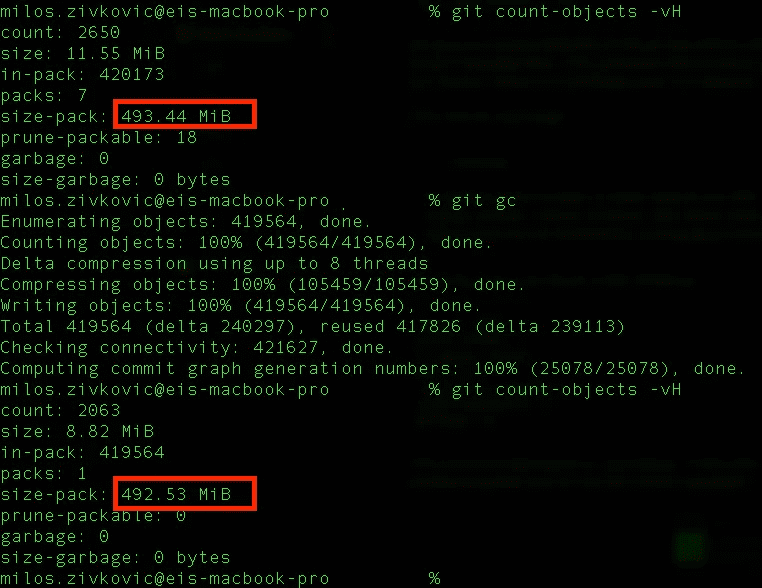

# 避免肮脏的 Git 回购

> 原文：<https://betterprogramming.pub/avoid-a-dirty-git-repo-4e9518d7914c>

## 如何清理你的 Git 回购

照片由 [Unsplash](https://unsplash.com?utm_source=medium&utm_medium=referral) 上的 [Yancy Min](https://unsplash.com/@yancymin?utm_source=medium&utm_medium=referral) 拍摄

# 为什么 Git 会随着时间变慢？

每次与 repo 交互时，都会创建 Git 对象。每次更改都会创建未打包的松散 Git 对象。未使用的 Git 对象和未使用的 reflog 路径只会在您的 Git repo 中制造混乱。

在大多数情况下，松散的物体会导致减速。默认情况下，Git 会为您所做的每个更改创建新的对象。考虑将被复制的大文件，它们之间的变化很小。为了解决这个问题，Git 将这些文件打包到`packfiles`中以减小文件大小。[关于这个话题的更多信息可以在这里找到](https://git-scm.com/book/en/v2/Git-Internals-Packfiles)。

我将向您展示两种清理 Git repo 的方法。

# 1.Git 垃圾收集

目前最简单的方法是 [Git 垃圾收集](https://git-scm.com/docs/git-gc)。它围绕回购做一些日常工作，并重新打包松散的对象。

您可以通过`git count-objects -vH`查看您回购的文件状态。[更多详情可点击此处](https://git-scm.com/docs/git-count-objects)。计数将显示所有未包装、松散的物体和实际尺寸。

为什么这个命令不是每次提交都运行？如果出现异常数量的松散对象，一些瓷瓶高级命令会运行此命令。

# 2.Git 清洁和垃圾

我要做的另一件事是[清理和删除](https://git-scm.com/docs/git-clean):清理以删除被忽略的文件和垃圾，以便以后查看文件。

运行此命令清除忽略的文件:

`git clean -f -n -X`

请务必键入`-n`来查看您的文件发生了什么。

`git trash`会将所有未暂存的文件移动到`.trash`子目录中。你可以以后再看，想做什么就做什么。你可以在这里找到更多关于这个话题的信息。

## 今天就加入 Medium！

*为什么要* [*订阅*](https://zivce.medium.com/membership) *？*率先抛弃微服 Chrome 模式。其次，你会接触到很多精彩的故事。你可以从[务实程序员的书架](https://medium.com/pragmatic-programmers/directory-of-pragmatic-programmer-books-on-medium-6a5cbadbd4b4)上读到 100 本左右的书。你可以看到来自 Pinterest 团队的障碍、非常有用的提示和伟大的建议。你可以阅读[谷歌云的](https://medium.com/google-cloud)最新进展。

这就是你每月花 5 美元(两杯咖啡)所得到的。你花 5 美元就可以阅读整个实用程序员图书馆。

*免责声明:5 美元中的 2 美元将直接支持我，并为您提供精彩话题。*