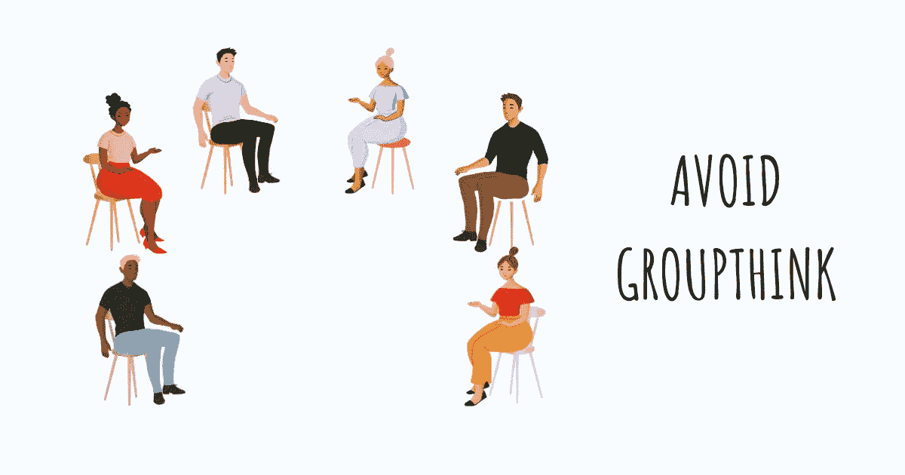
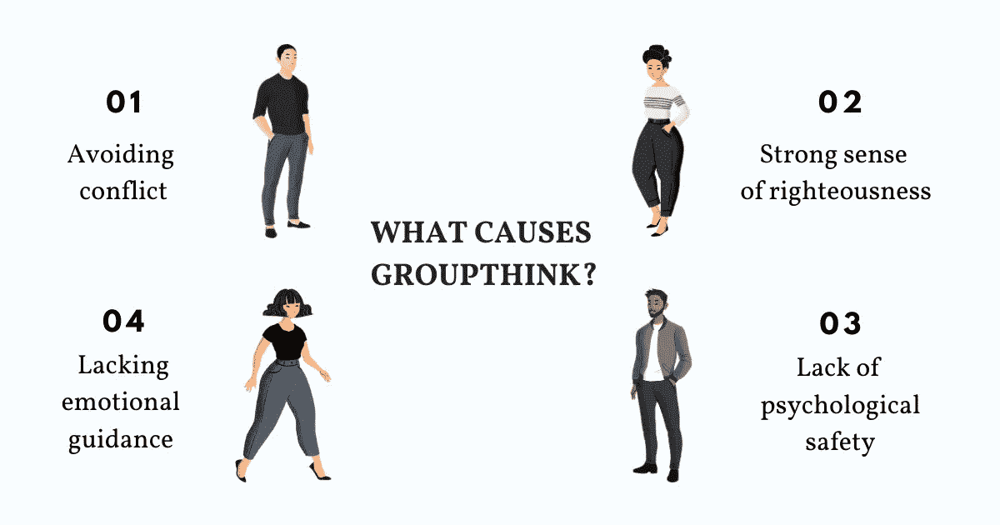
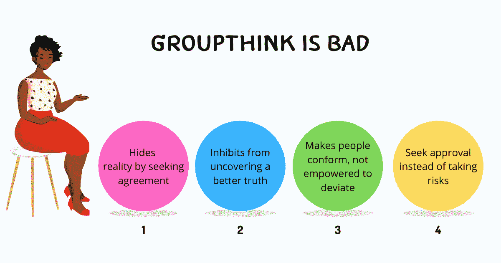
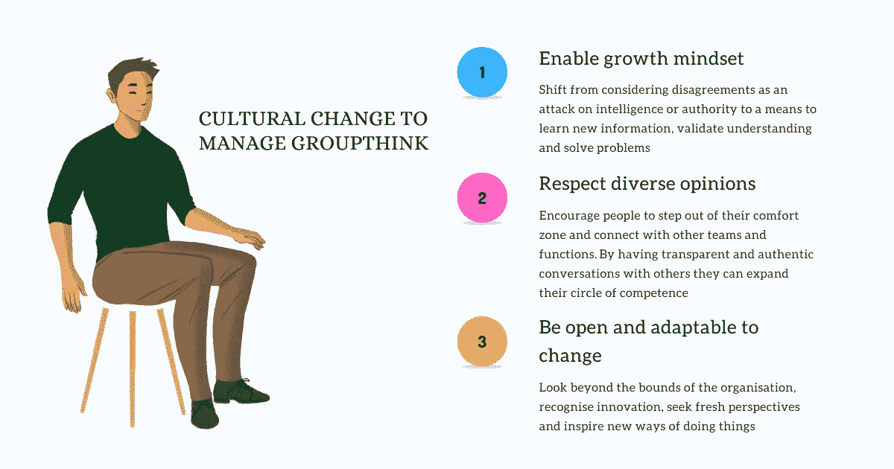
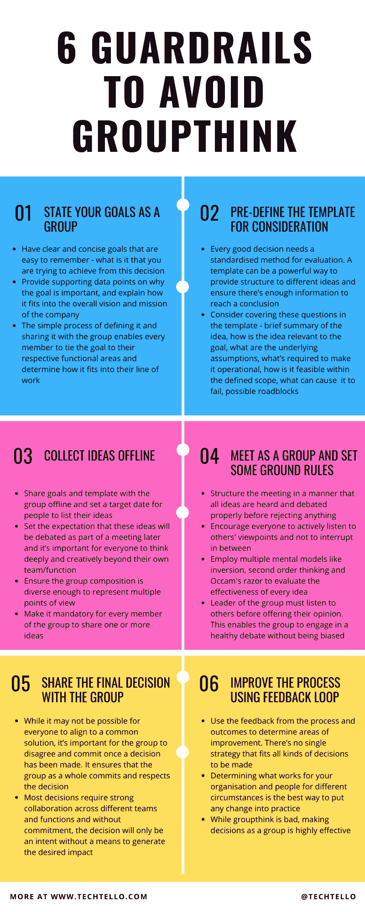

# 如何避免群体思维

> 原文：<https://betterprogramming.pub/avoid-groupthink-862dbb3a2877>

## 6 个有效的护栏，帮助塑造决策

当你是团队的一员时，你会大声说出自己的观点吗？还是回避批评，选择冲突少的道路？

当声望优先于个人责任时，人们倾向于遵从现有的想法和信仰，导致保守的思维。人们可能会开始忽略潜在的失败迹象，并根据不完整和有偏见的信息做出决策。这就是所谓的群体思维。

当这种行为成为组织文化的一部分时，它会导致对不道德行为的集体视而不见。它会导致倒退的思维，忽视你的业务的未来需求。它鼓励人们忽视真相，尤其是当真相要求人们采取强硬立场的时候。

如果没有一个鼓励新观点的环境——没有建设性的[冲突](https://www.techtello.com/handle-difficult-conversations/),没有学习新信息的渴望，没有清晰的决策过程——人们很容易屈服于群体思维，从众心理推动决策，而不是利用群体智慧的集体力量。

无论集体思维是整个组织文化的一部分，还是只存在于特定的地方，研究产生这种思维模式的工作环境是很重要的。理解群体思维的特征将使你能够识别你的团队或组织中导致这种现象的具体行为。

让我们深入探讨群体思维的四个关键症状。

# 是什么导致了群体思维？

群体思维是一种心理范式，反映了一个群体的思维，反过来又指导他们的行动和信念。当一致性抑制了个人主义，当一致比分歧更重要，当受欢迎被认为比需要验证更重要，当熟悉抑制了理性思考和探索替代方案的欲望时，它就显示出来了。

这里有四种引起群体思维的常见行为。

## 1.避免冲突

有固定思维模式的人认为他们的想法定义了他们的身份。他们不敢说出来，因为害怕不同意见等同于有人质疑他们的智力。为了避免批评和证明自己的聪明，他们点头同意别人的判断，即使他们可能不相信。

对于处于权力位置的领导者和管理者来说，固定的思维模式会让他们忽略任何削弱他们权威的信息，从而导致[盲点](https://www.techtello.com/leadership-blind-spots/)。当人们注意到这种行为时，他们会学着顺从他人的想法，觉得任何不同意见都会让他们不安。

当避免冲突成为常态时，做出有效决策所需的信息仍然是隐藏的。这群人对最受欢迎、最令人满意的解决方案默默点头，从未鼓起勇气说出自己的想法。

正如彼得·德鲁克在他的著作《有效的管理者》中所写的:

> 有效的决定并不像许多关于决策的文本所宣称的那样，产生于对事实的共识。作为正确决策基础的理解产生于不同意见的碰撞和冲突，产生于对竞争方案的认真考虑

## 2.强烈的正义感

我们的偏见对我们的行为和决策有着至高无上的控制。尽管在任何时候都有许多偏见支配着我们的行为，但让位于群体思维的两个最深刻的偏见是确认偏见和共识偏见。

当我们选择性地选择数据或听到与我们的信念系统一致的论点，忽略任何反驳我们信念的证据时，我们的确认偏见就在起作用。大多数人没有意识到这种偏见的力量以及它如何影响他们的决策。在团队环境中，团队的领导者可能会不知不觉地支持与他们自己的解决方案一致的论点和数据点，而忽视任何挑战它的东西。

共识偏差的根源在于一个错误的共识假设。它让人们相信他们的决定是在当前情况下最好的，并且这个团体已经和他们的决定一致了。没有争论和探索替代方案的机会，每个人都同意这个想法，认为其他人都已经同意了。

这些偏见源于一种潜在的信念，即我们所说和所做的一切都是正确的。如果没有认识这些偏见的开放心态，没有学习不同观点的自觉努力，用这种狭隘的观点做出的任何决定都影响有限。

当正义成为决策的基础，而不是面对现实的勇气时，创造性思维就会退居二线，整个团队就会屈服于有偏见的决策。

## 3.缺乏心理安全感

在一个错误受到惩罚、脆弱被视为弱点的环境中，人们倾向于[指责](https://www.techtello.com/how-to-opt-out-of-the-drama-triangle/)。失败被视为缺乏能力，而不是学习和成长的手段，人们不再说出自己的想法，开始谨慎行事。

他们不寻求新的机会和新的做事方式，而是诉诸旧的方法。当决策根植于恐惧时，人们会忽略失败的迹象。

如果没有心理安全，人们可以放心地发表意见，不担心自己行为的后果，那么从长远来看，组织采用的任何战略和战术都不会让他们成功。

在人们觉得保持沉默比分享想法更安全的环境中，群体思维是显而易见的。

## 4.扼杀情感引导的极端逻辑思维

当人们将逻辑思维与智力和情感联系起来作为弱点的标志时，他们往往会被有数据支持的故事所吸引，而忽略试图告诉他们不同故事的微妙线索。

研究表明，情绪在决策中起着至关重要的作用。如果使用得当，它们可以成为引导行为和理解我们对决策的感受的有效工具。这并不意味着走极端和忽视理性数据或完全被我们的情绪所引导。它需要一个综合的模型，在这个模型中，理性的选择和情感的投入被综合起来。

当小组讨论倾向于数据，而不考虑情绪时，那些对主题有不好感觉的人会保持沉默。这种对数据不假思索的考虑，如果没有情感上的引导，可能会导致失败。

你可能认为集体思维不是你的会议或组织的一部分，但验证它可能会很有趣。下次在讨论中，观察并问自己这些问题:

*   有多少人站出来说话？
*   这是同一批总是提出自己观点的人吗？他们是否同意领导或最受欢迎的观点，而不是提出反对的重要观点？
*   每个人对挑战最有可能的决策的信息是如何反应的？
*   团队的领导者对反驳他们观点的信息有什么反应？
*   人们看起来真的对探索不同的道路感到好奇吗？他们是否非常积极地将最佳解决方案带到桌面上？
*   自我或权威如何改变小组讨论的动力？
*   最后，大家如何就解决方案进行讨论？是否期望每个人都同意一个共同的解决方案？或者他们可以不同意，并承诺向前迈进？

# 为什么 Groupthink 不好？

当我问人们如何看待在团队环境中做决定时，我得到了一些常见的回答:

*   采纳最受欢迎的意见是团队合作的标志。
*   有些人不说话。那很好。这是他们的问题。
*   我们必须作为一个团体达成共识，这意味着每个人都必须同意。
*   与专家或组织中德高望重的人意见相左是错误和不尊重的。
*   只有当你可以用数据点来支持一个论点时，才提出质疑。
*   如果每个人都同意一个决定，那它一定是正确的。

你注意到这里的模式了吗？大多数人认为决策是一种趋同的手段，是一种结盟，而没有注意到是什么使它真正有效。

当数据点验证了我们最初的结论并且每个人都同意时，没有冲突地走出会议可能感觉很棒。但是你真的相信，如果没有机会听到不同的观点，鼓励他人质疑我们的假设，分享他们的观点，并澄清为什么他们同意我们的观点，我们就能做出明智的决定吗？

集体思维是不好的，因为它隐藏了现实，阻止我们发现更好的真相。它让人们随大流，而不是觉得自己有能力偏离常规思维并承担风险。

如果不改变这种庆祝、认可和鼓励建设性分歧的方式，利用团队的集体智慧做出更好的决策，你如何期望进行[团队发展](https://www.techtello.com/navigating-friction-for-team-development/)、战略规划并寻求正确的发展机会？

要实现这种改变，重要的是要认识到群体思维是一个组织中更大文化问题的标志。除非通过在日常工作中应用某些实践来解决其核心问题，否则实际问题可能永远不会消失。

# 管理群体思维的文化变革

一个组织的任何文化变革都需要巨大的努力。它始于组织中的领导者和管理者如何与他们的员工互动、行动和沟通。

为了从群体思维转变到利用群体的集体知识，鼓励个人主义、建设性分歧、创造性思维和冒险，遵循以下关键策略:

## 1.实现成长心态

在成长心态中，人们不认为分歧是对他们智力或权威的攻击。他们认为这是一种学习新信息、验证他们的理解以及通过考虑关键输入来解决问题的手段。

一旦他们不再害怕，他们就可以分享信息，听取不同的观点，而不必担心遭到报复。

为了实现这种心态，让你的员工了解从固定心态转变为增长心态的巨大好处。

卡罗尔·德韦克在她的书《心态》中谈到了固定心态是如何创造群体思维的:

> 固定的思维模式有很多方式创造集体思维。领导者被视为从不犯错的神。一个团体赋予自己特殊的才能和力量。领导者为了增强自我意识，压制异议。或者，寻求领导认可的员工会跟在领导后面排队。这就是为什么在做出重要决定时，保持增长的心态是至关重要的。通过解除人们的幻想或固定能力的负担——导致对信息的充分和公开的讨论，并加强决策

## 2.尊重不同的意见

鼓励人们走出舒适区，与其他团队和职能部门建立联系。这将使他们寻求不同的意见，并考虑他们能力范围之外的想法。

通过与来自不同背景的人进行透明和真实的对话，他们将扩展他们的思维，并开始欣赏寻求不同观点的价值。

实现这种改变的一个重要方法是提出问题，而不是急于寻找答案。

*   我们试图解决什么问题？
*   我如何知道我的信念和假设是正确的？
*   别人对此有什么看法？
*   我问的问题对吗？
*   我如何寻找我还不知道的信息

当领导者表现出通过提问学习的好奇心时，其他人也可能在日常工作中采用这种做法。

雷伊·达里奥在他的书《原则》中谈到了寻求不同意见的重要性

> 知道我可能会痛苦地错了，以及对为什么其他聪明人看待事物的方式不同的好奇，促使我用自己的眼光和别人的眼光看待事物。这让我看到了比我仅仅通过自己的眼睛看到的更多的维度。学习如何衡量人们的意见，以便我选择最好的意见——换句话说，这样我就可以用可信度来衡量我的决策——这增加了我正确的机会，令人兴奋

## 3.接受改变

避免群体思维的一个重要方面是超越组织的边界。随着市场的变化和多种技术的进步，公司必须一直寻找变得更好的方法——更好的客户服务、更好的招聘策略、更好的流程和改进的产品。

当一个组织的文化认可创新，寻求新的视角，并激发新的做事方式时，人们就不会陷入集体思维的陷阱，因为他们被鼓励以不同的方式思考。

一个庆祝改变的环境给了人们希望和自由，让他们坚持正确的东西，而不是流行的东西。

# 6 个护栏，帮助您避免群体思维，做出更好的决策

当作为一个团队做出决策时，重要的是要有一个清晰的决策过程，使其成员能够避免偏见，创造性地思考，贡献他们的思考过程，并相互学习。

实施这 6 个护栏，以避免群体思维，并在群体中做出更好的决策:

## 1.以小组为单位陈述你的目标

要有清晰、简洁且容易记住的目标。你想从这个决定中获得什么？提供支持数据点，说明目标的重要性，并解释它如何符合公司的整体愿景和使命。

定义目标并与团队分享的简单过程使每个成员能够将目标与他们各自的职能领域联系起来，并确定它如何适应他们的工作。

陈述问题的范围并建立清晰的界限也很重要。虽然一开始看起来有些限制，但它实际上非常强大，因为它使人们能够想到可以付诸行动的创造性解决方案。没有范围和明确的界限，你可能会得到一些伟大的想法，而这些想法在公司的资源范围内可能无法执行。

## 2.预定义模板以供考虑

每一个好的决策都需要一个标准化的评估方法。模板是一种强大的方式，可以为不同的想法提供结构，并确保有足够的信息来得出结论。考虑在模板中涵盖以下部分或全部问题:

*   想法的简要总结。
*   想法与目标的相关性。
*   这个想法的潜在假设是什么。
*   使其可操作需要什么—在定义的范围内如何可行。
*   什么可能导致这个想法失败——可能的障碍。
*   如果我们不实施这个想法会发生什么。
*   你对这个想法的看法。
*   任何支持数据点，使这个想法有效。
*   它的[二阶效应](https://www.techtello.com/second-order-thinking/)——它如何在未来提供复合的积极结果。

## 3.离线收集想法

现在，您已经有了明确的目标和预定义的模板，请离线与小组成员分享，并为人们列出他们的想法设定一个目标日期。设定预期，这些想法将在以后的会议上讨论，因此每个人都要超越自己的团队/职能进行深入和创造性的思考，这一点很重要。这符合公司及其员工的更大利益。

确保小组成员足够多样化，能够代表多种观点。包含将直接受该决策影响的功能始终是一个好主意。

让团队中的每个成员都必须分享一个或多个想法。此外，保持信息匿名，以避免讨论中的偏见。

## 4.作为一个小组见面，并制定一些基本规则

重要的是要组织好会议，这样在任何事情被否决之前，所有的想法都能被听到和讨论。

鼓励每个人[积极倾听](https://www.techtello.com/active-listening/)他人的观点，不要打断。辩论很重要，但应该以建设性的方式进行，不攻击任何人。讨论应该是关于想法而不是人。预先设定这种期望会改变人们进行对话的方式。

运用多种心智模式来评估每个想法的有效性。使用[反演](https://www.techtello.com/inversion-mental-model/)心智模型来识别故障模式，[二阶思维](https://www.techtello.com/second-order-thinking/)来确定该决策的未来后果，[奥卡姆剃刀](https://www.techtello.com/occams-razor/)来识别假设较少的解决方案。

这些心智模型将使小组能够获得简单和可预测的答案，以进行更深思熟虑的、需要有意识努力的二系统思考。

另一个有效的策略是，团队的领导者在发表意见之前先听取他人的意见。这使得小组能够进行健康的辩论，而不受领导者意见的影响。

如果每个人都同意这个决定，并且没有足够的争论，考虑另找时间开会，并建议每个人在下一次会议上考虑更多的数据点。沉默的点头或缺乏积极的参与是集体思维的标志。

## 5.与团队分享最终决定

虽然不可能让每个人都认同一个共同的解决方案，但一旦做出决定，团队成员有不同意见并做出承诺是很重要的。

它确保团队作为一个整体提交并尊重决策。大多数决策需要不同团队和职能部门之间的密切合作，如果没有承诺，决策将只是一种意图，而没有产生预期影响的手段。

## 6.使用反馈回路改进流程

利用来自过程和结果的反馈来确定需要改进的地方。没有一个单一的策略适合所有的决策。

确定在不同情况下什么适合你的组织和员工，是将任何改变付诸实践的最佳方式。

虽然群体思维不好，但作为一个群体做决定是非常有效的。在你的工作场所，什么样的集体行为是可以接受的？

