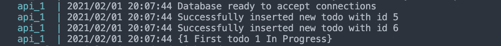

# 在 Go 中避免 ORM 使用纯 SQL 代替

> 原文：<https://betterprogramming.pub/avoid-orm-in-go-use-pure-sql-instead-3ae7f0485b37>

## 停止**学习每种语言的新 ORM 语法**


罗伯特·阿纳施在 [Unsplash](https://unsplash.com?utm_source=medium&utm_medium=referral) 上的照片。

如果您是一名喜欢尝试许多不同语言和框架的软件工程师，您可能已经体验过为每种语言学习新 ORM 语法的痛苦。这是一个巨大的缺点，它会降低你最初的生产力或者耗尽你的动力。

另一方面，如果您已经了解 SQL，那么您可以使用这些知识，并通过遵循一些提示或像本文这样的简单教程将其转换为许多不同的语言。

首先，我们将设置我们的环境。为了遵循教程，您可以安装 Postgres 并让它在您的机器上运行。或者，您可以使用 Docker。下面的 docker-compose 文件将使一切正常运行，而不必担心其他任何事情:

如果您将该文件放在项目的根目录下，您只需运行以下命令来设置所有内容:

```
**docker-compose** up
```

如您所见，我们在`db`服务中定义了一个卷，它共享一个将在 docker-compose 启动时运行的 SQL 脚本。注意，您必须将它映射到`docker-entrypoint-initdb.d` 目录，以便 Postgres 容器在启动时运行它。`init.sql` 包括我们将在本教程中使用的数据库和表的定义，这只是 todos 数据库的一个示例:

数据库和表定义

当`db`容器启动时，它将运行上面的脚本并创建数据库和 todos 表(如果它们还没有被创建的话)。

一旦我们准备好了环境，我们将进入编码部分。

首先，我们将定义 Go 应用程序如何配置对数据库的访问。我们唯一需要导入的包是 postgres 驱动程序。

我们要遵循的第一个好的实践是从环境变量中获取我们所有的数据库凭证，因为我们不希望它们包含在我们的代码中，这样我们可能会向公众公开。

虽然这不是绝对必要的，但我们将定义以下常量，以避免在代码的某些部分出现硬编码的字符串。请注意，环境变量的名称在现实场景中更具描述性。

然后，我们将使用这些常量来获取环境变量:

一旦我们有了所有这些，我们将在`init()`函数中包含其余的代码。在 Go 中，第一次使用一个包时会调用`init`函数，即使该包在不同的包中使用，也不会再次调用。在这个函数中，我们将打开到数据库的连接，然后通过调用`Ping()`方法检查数据库是否正常工作。

建立数据库连接

现在我们将继续我们的模型。我们将使用道和 DTO 模式来定义我们的模型。

首先，我们将在`model/todos` 目录下创建`todos_dto.go`文件。DTO 模式用于在应用程序的不同模块之间传输数据。本质上，它是一种抽象，信息通过它在 DAO 和业务服务之间传递。在 Go 中，您可以通过创建一个结构并定义如何在 JSON 中编码每个字段来实现它。注意，这个文件不应该包含您的应用程序可能包含的任何业务逻辑。

托多斯 DTO

另一方面，DAO 模式将业务逻辑与数据访问逻辑分离开来。它提供了创建、检索、更新和删除数据库中的数据的方法。

托多斯岛

在本教程中，我们将使用预先准备好的语句直接调用`Exec()` 或`Query()` 方法。尽管对于为什么使用一种方法而不是另一种方法存在争议，但是有一些基准表明，预处理语句在 Go 中更有性能。

一旦我们用想要执行的查询调用了`Prepare()` 方法，我们就检查返回的错误，然后推迟关闭准备好的语句。如果我们忘记这样做，它将永远与我们的联系捆绑在一起。因此，在准备好一条语句后，一定要推迟`stmt.Close()` 方法调用，这一点很重要。

一旦我们拥有了所有这些，在`Save()`方法中，我们将执行`QueryRow` 方法和`Scan()` 返回的 id。由于 ID 是由数据库自动生成的，所以在我们执行的`INSERT`查询中将会缺少它。为了从数据库中检索它，一些数据库如 MySQL 提供了从查询结果中调用`LastInsertId()` 方法的可能性。然而，由于我们使用 Postgres，我们可以显式地声明我们的查询，我们希望返回生成的 ID。

```
INSERT INTO todos(description, priority, status) VALUES($1, $2, $3) **RETURNING id;**
```

在检查没有出现错误之后，我们将获得的 ID 分配给我们的`Todo`结构，这样就完成了插入。

由于我们遵循了在插入查询中返回 todo ID 的方法，`Get()` 方法过程将类似于但更简单**。**

为了测试一切是否按预期工作，我们将使用下面的`main.go` 文件:

这是一个简单的 main，它插入两个 todo，然后检索 ID 为 1 的 todo。考虑到我们已经添加到我们的 DAO 中的日志记录，这个 main 的输出应该类似于下面这样(注意，我得到的是 id5 和 6，因为我之前已经执行过几次):



main.go 输出

如果您得到这样的输出，那么一切都工作正常，并且您已经成功地在不使用 ORM 的情况下与数据库进行了交互。你可以在这个 [GitHub 库](https://github.com/UxioAndrade/tutorials/tree/main/go-sql-tutorial)中找到本教程的代码。