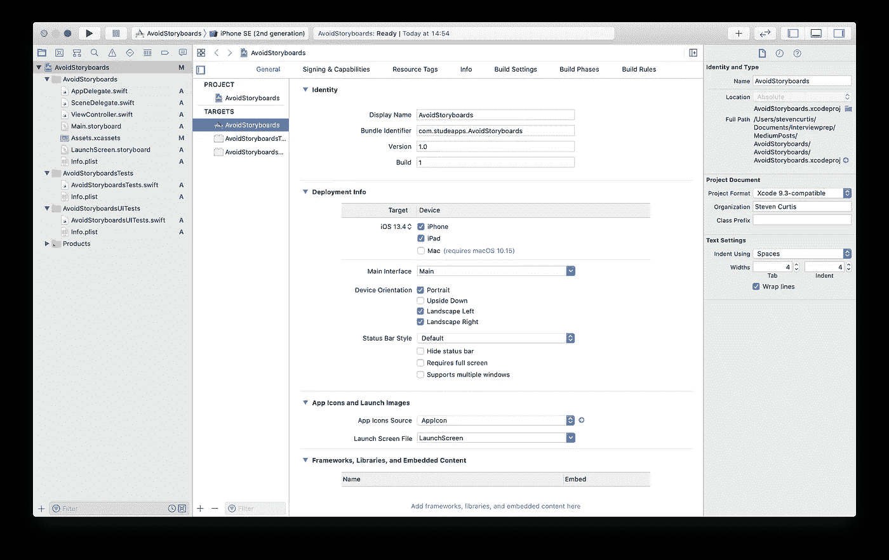
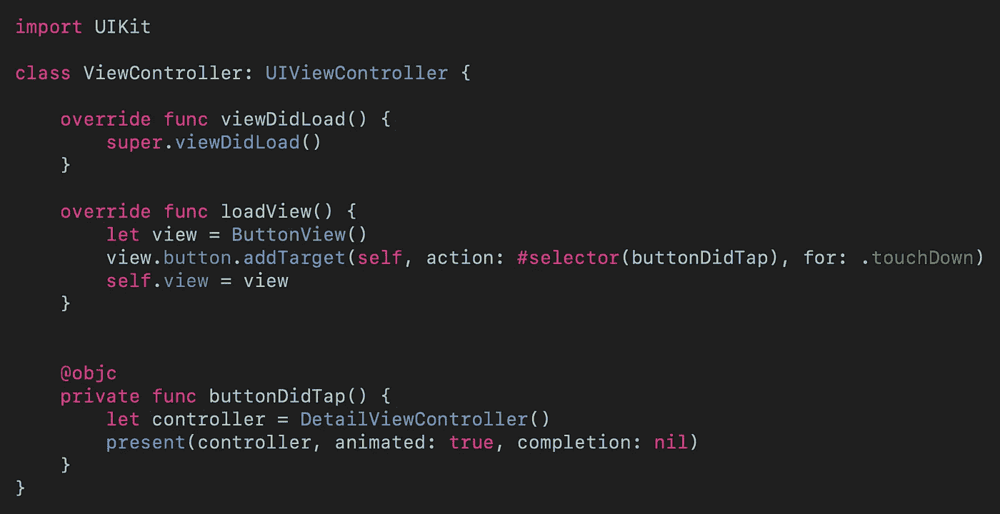
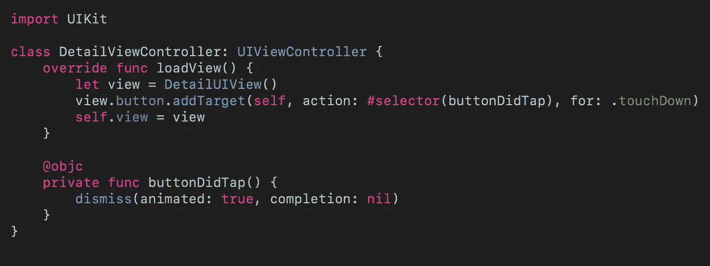
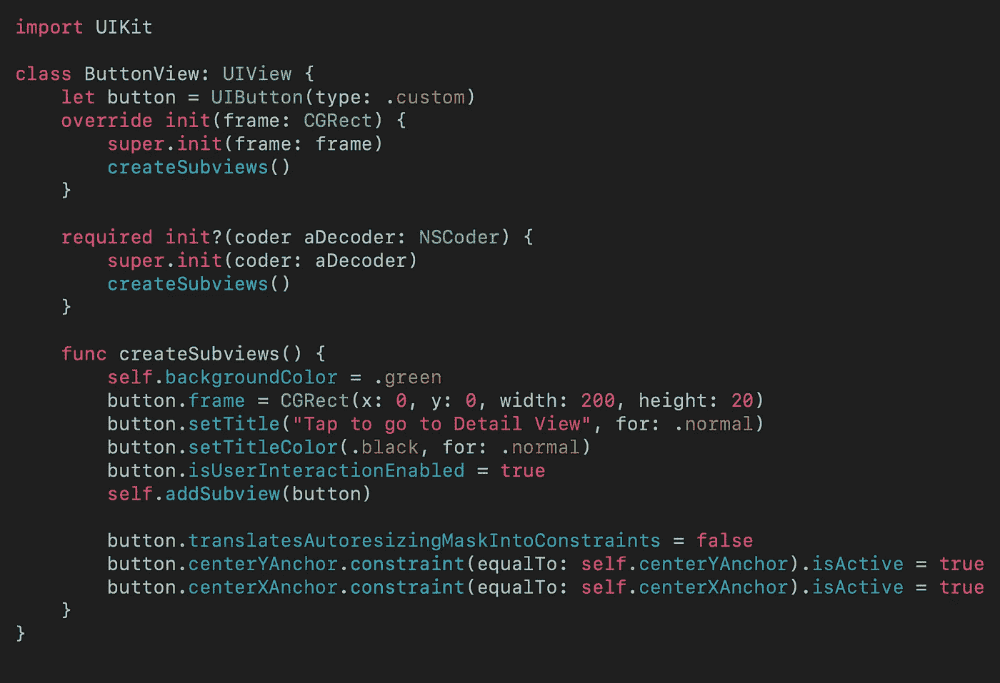
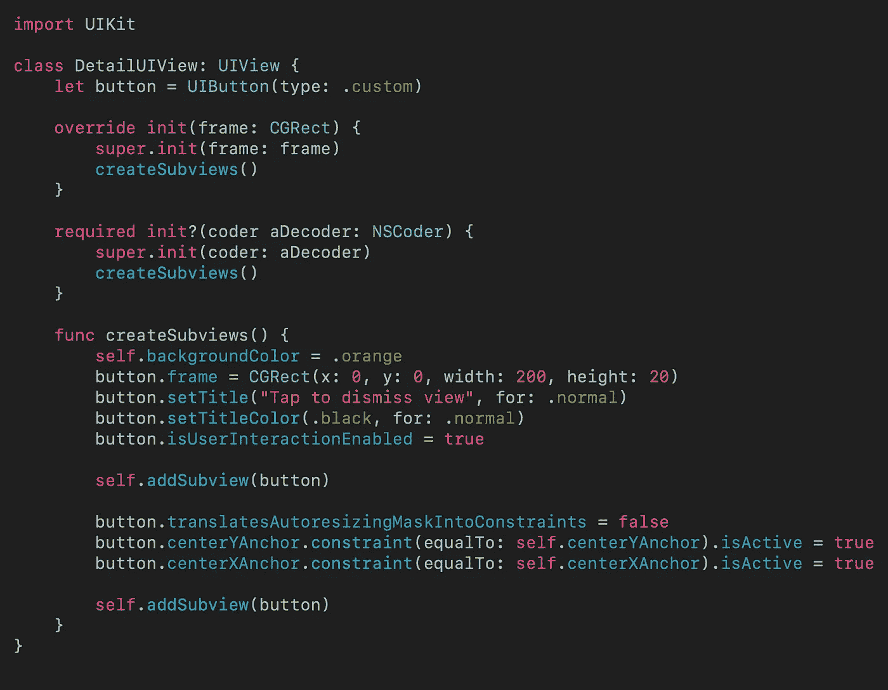
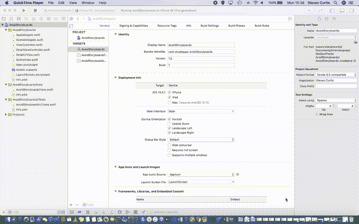
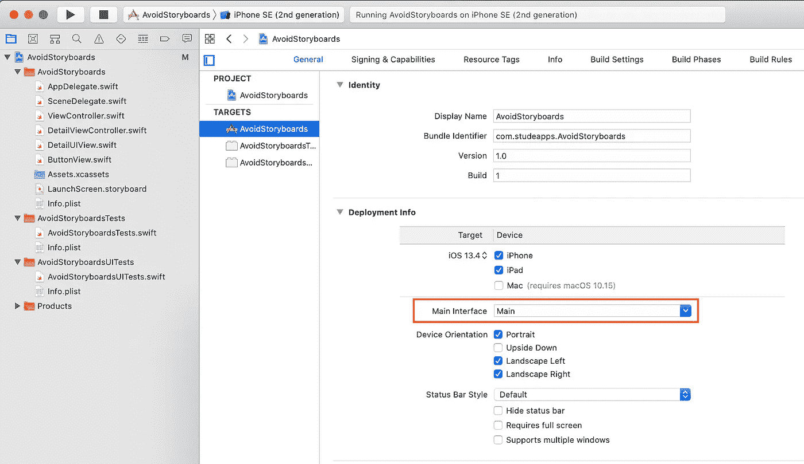
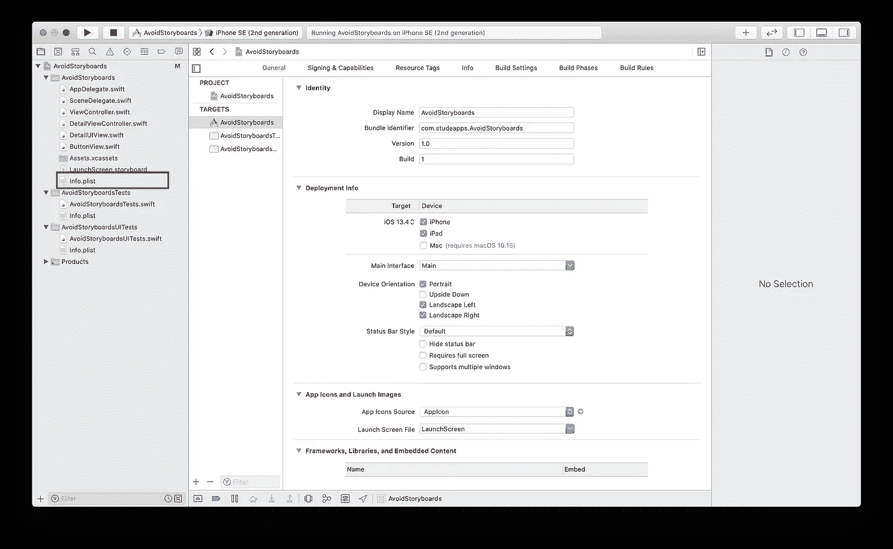
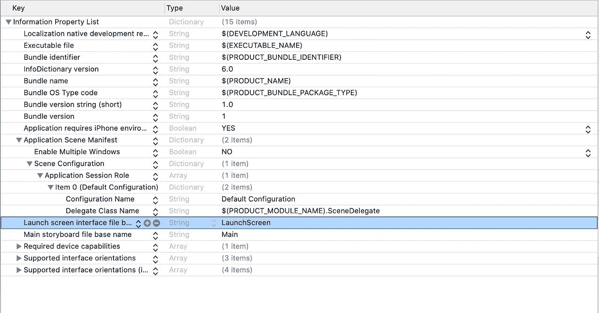
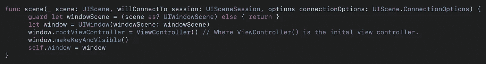

# 为什么你应该避免在你的应用程序中使用故事板

> 原文：<https://betterprogramming.pub/avoid-storyboards-in-your-apps-8e726df43d2e>

## 去掉 Xcode 的样板文件

由[拍摄的杰米街](https://unsplash.com/@jamie452?utm_source=medium&utm_medium=referral)上[的 Unsplash](https://unsplash.com?utm_source=medium&utm_medium=referral)

我已经写了一篇[文章](https://medium.com/@stevenpcurtis.sc/write-clean-code-by-overriding-loadview-ac4f172163d0)详细说明了使用`loadView()`而不是使用故事板的优势。人们欣赏这篇文章。

问题？这篇文章使用操场和单一视图应用程序。Xcode 假设您要使用故事板，删除它会出现错误。真是个错误。

为了摆脱那些烦人的故事板，继续读下去。

难度:初学者| **简单** |普通|挑战

本文是使用 Xcode 11.4.1 和 Swift 5.2.2 开发的。

## 先决条件

*   这篇文章允许你使用`loadView()`编写代码，就像我的[文章](https://medium.com/@stevenpcurtis.sc/write-clean-code-by-overriding-loadview-ac4f172163d0)中的操场一样。您应该知道如何在 Swift 中制作一个[单视图应用程序](https://medium.com/swlh/your-first-ios-application-using-xcode-9983cf6efb71)。

## 术语

**故事板:**应用程序用户界面的可视化表示。

# 挑战

一旦您创建了一个[单视图应用程序](https://medium.com/swlh/your-first-ios-application-using-xcode-9983cf6efb71)，您会看到类似下图的东西:

有什么问题？你能看见左手边吗？除了你的项目？我们有一个故事板——关键是我们不会使用它。如果我们删除它，我们只会在模拟器上看到一个空白屏幕，后面跟着一个`**NSInvalidArgumentException**`。

那一点也不好。

# 逐步地

我将安排我的课程，就像我在`[loadView()](https://medium.com/@stevenpcurtis.sc/write-clean-code-by-overriding-loadview-ac4f172163d0)` [文章](https://medium.com/@stevenpcurtis.sc/write-clean-code-by-overriding-loadview-ac4f172163d0)中做的那样

## 上层社会

我可以列出这些类的代码(现在我更喜欢从 [repo](https://github.com/stevencurtis/AvoidStoryboardsBlog) 下载这些代码，但是你可以这样做)，但是我将把解释留在原始文章中，因为这些基本上只是为了给我们一些代码在这个过程中进行测试而创建的。换句话说，不要慌！

`**ViewController**`

[点击查看要点](https://gist.github.com/stevencurtis/8bcfa19e24abd3ef82326f8044a205e0)

`**DetailViewController**`

[点击查看要点](https://gist.github.com/stevencurtis/e25bae3b3fcb7568ea9bbe12d63411aa)

`**ButtonView**`

[点击查看要点](https://gist.github.com/stevencurtis/a33b43d72d3c9ca852980cf0f5028e93)

`**DetailUIView**`

[点击查看要点](https://gist.github.com/stevencurtis/2f77ab62167cf80ac5d7cac0d2e70307)

# 摆脱故事板

为了做到这一点，我们可以用键盘上友好的退格键删除`Main.storyboard`文件。只需选择文件，然后按 delete 键。我知道你能做到。去吧！

# 删除对情节提要的引用

在 PLIST 文件和部署信息中有一个到故事板的链接。这两个我们都不想要，所以我们要用“删除我”按钮来删除它们。

## 删除部署信息引用

当您选择项目检查器左侧的目标时，您会看到一个下拉菜单，上面写着“Main”摆脱它。再删除一次就会去掉链接。没问题(对吧？).

## Info.plist 参考

在项目检查器中，有一个相当可爱的`info.plist`文件。选择它，我会在图像后看到你。不要删除它，我们会修改它。

要删除的部分隐藏在一组相当烦人的下拉列表中。我们正在寻找创造性地命名为`Storyboard Name`，我们可以完全删除这一行。这将删除整个键和值。你会得到这样的东西:

是的，我确实发现选择一个被删除的行很棘手，所以我对此无能为力(抱歉)

## 将代码指向“rootViewController”

`scene(_:willConnectTo:options:)`需要调整。当然，我所说的调整是指我们需要改变整个机构的职能。该函数位于`SceneDelegate.swift`文件中，也可以从项目左侧的文件中选择。

当你选择了它，我们的目标函数将会在文件的顶部——用下面的替换它:

[点击查看要点](https://gist.github.com/stevencurtis/c2f73d154c3c9b425c93440c61b58ff3)

我们完事了。你还在这里？寻找[回购？我想你已经明白了。谢了。](https://github.com/stevencurtis/AvoidStoryboardsBlog)

# 结论

唷。要清除那个(相当烦人的)文件，需要经过相当多的步骤。你可能想离开它——但那将是一个错误。您不会发布不应该包含在您的包中的额外代码，对吗？

不管怎样，至少从现在开始你有了避免这种情况的工具。万事如意！