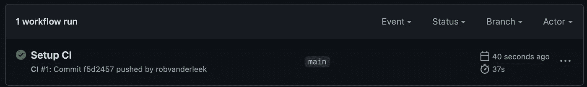

# 用诗意避开 Python 包管理的蛇坑

> 原文：<https://betterprogramming.pub/avoid-the-snake-pit-of-python-package-management-with-poetry-54ab186cf2a4>

## 使用诗歌构建私有和公共 Python 库


由[思想目录](https://unsplash.com/@thoughtcatalog?utm_source=medium&utm_medium=referral)在 [Unsplash](https://unsplash.com?utm_source=medium&utm_medium=referral) 上拍摄的照片

Python 是一种给很多开发者带来快乐的编程语言。不幸的是，在 Python 中构建和使用库一直是一个难题。有多种工具试图提供帮助(仅举几个例子:`setuptools`、`pip`、`virtualenv`、`pipenv`、`tox`和`conda`)，但每种工具都有自己的怪癖和局限性。

在本文中，我们看一下`Poetry`，这是一个相对较新的包管理工具，它试图把用 Python 编程的乐趣带给构建和使用 Python 库。

# 实践中的诗歌

下面的步骤向您展示了如何用诗歌构建一个库，如何从另一个 Python 项目中使用这个库，以及如何在 [PyPi](https://pypi.org/) 上分发这个库以供公共重用。

## 第一步。装置诗歌

诗歌网站包含大量关于如何在不同操作系统上安装的文档。

我已经通过自制软件在我的 MacBook 上安装了诗歌:

```
$ brew install poetry
$ poetry --version
Poetry version 1.1.11
```

## 第二步。从头开始创建一个小型 Python 库

让我们用诗歌写一个小小的图书馆。这个库将被称为`PyInitials`，它的唯一目的是返回给定全名的首字母，例如，“吉多·范·罗苏姆”=>“GvR”。

首先，用诗歌初始化一个新的库项目:

```
$ **poetry new pyinitials**
Created package pyinitials in pyinitials
```

接下来，创建一个新的虚拟环境，并安装初始的依赖项集:

```
$ **cd pyinitials**
[pyinitials] $ **poetry install**
Creating virtualenv pyinitials-Q6tcgwA_-py3.9 in /Users/rob/Library/Caches/pypoetry/virtualenvs
Updating dependencies
Resolving dependencies... (1.0s)Writing lock filePackage operations: 8 installs, 0 updates, 0 removals• Installing pyparsing (2.4.7)
  • Installing attrs (21.2.0)
  • Installing more-itertools (8.10.0)
  • Installing packaging (21.0)
  • Installing pluggy (0.13.1)
  • Installing py (1.10.0)
  • Installing wcwidth (0.2.5)
  • Installing pytest (5.4.3)Installing the current project: pyinitials (0.1.0)
```

之后，初始化 Git 并提交所有生成的文件:

```
[pyinitials] $ **git init**
[pyinitials] $ **git checkout -b main**
[pyinitials] $ **git add ***
[pyinitials] $ **git commit -m "Initial commit"**
```

最后，在 [GitHub](https://docs.github.com/en/get-started/quickstart/create-a-repo) 上创建一个名为`pyinitials`的新存储库，将这个存储库作为远程存储库添加到您的本地 Git 存储库中，并推送所有更改:

```
[pyinitials] $ **git remote add origin git@github.com:<YOUR_GITHUB_USERNAME>/pyinitials.git** [pyinitials] $ **git branch -M main**
[pyinitials] $ **git push -u origin main**
```

## 第三步。添加一些代码和测试

打开生成的文件`test/test_pyinitials.py`并添加第一个单元测试:

```
def test_initials():
    from pyinitials.initials import initials
    assert initials('Guide van Rossum') == 'GvR'
```

接下来，运行单元测试(使用诗歌):

```
[pyinitials] $ **poetry run pytest**
===================== test session starts ======================
platform darwin -- Python 3.9.7, pytest-5.4.3, py-1.10.0, pluggy-0.13.1
rootdir: /Users/rob/Desktop/pyinitials
collected 2 itemstests/test_pyinitials.py .F                               [100%]
================= 1 failed, 1 passed in 0.06s ==================
```

由于导入了一个名为`initials`的缺失函数，这将会失败(这并不奇怪)。

要修复测试，请将以下代码添加到一个新文件中:`pyinitials/initials.py`:

```
def initials(fullname: str) -> str:
    return 'GvR'
```

接下来，再次运行单元测试，检查它们是否都通过了:

```
poetry run pytest
===================== test session starts ======================
platform darwin -- Python 3.9.7, pytest-5.4.3, py-1.10.0, pluggy-0.13.1
rootdir: /Users/rob/Desktop/pyinitials
collected 2 itemstests/test_pyinitials.py ..                               [100%]
====================== 2 passed in 0.02s =======================
```

## 第四步。设置持续集成

要让单元测试在每次代码推送时运行，你可以在 GitHub Actions 中设置一个简单的工作流(你可以使用针对诗歌的特定操作。)

在目录`.github/workflows`中创建一个名为`ci.yml`的新文件，包含以下内容:

```
name: 'CI'on: [push, pull_request]jobs:
  ci:
    runs-on: ubuntu-latest
    steps:
    - name: 'Checkout'
      uses: actions/checkout@v2
    - name: 'Set up Python'
      uses: actions/setup-python@v2
      with:
        python-version: 3.9
    - name: 'Set up Poetry'
      uses: snok/install-poetry@v1
    - name: 'Install dependencies'
      run: poetry install --no-interaction --no-root
    - name: 'Run unit-tests'
      run: poetry run pytest
```

将所有新文件添加到 Git，并将您的更改推送到 GitHub。在 GitHub 中的“Actions”选项卡上，您应该可以看到 CI 管道的第一次运行:



CI 管道首次成功运行

## 第五步。在私人组织中使用图书馆

要在私有组织(或您自己的公共 python 项目)中使用 PyInitials 库，您可以将其作为 Git 依赖项添加。对于私有库来说，使用 GitHub 是建立一个完整的包存储库的一个很好的选择。

为了演示这是如何工作的，您首先需要创建一个新的 Python 项目，当然也是用诗歌:

```
$ **poetry new mycoolproject** $ **cd mycoolproject** [mycoolproject] $ **poetry install**
```

然后，将依赖项添加到 GitHub `pyinitials` 库的主分支:

```
[mycoolproject] $ **poetry add git+**[**https://github.com/**](https://github.com/robvanderleek/pyinitials.git#main)**<YOUR_GITHUB_USERNAME>**[**/pyinitials.git#main**](https://github.com/robvanderleek/pyinitials.git#main)
```

`#`后缀可用于选择分支、标签甚至特定的提交散列，在这种情况下，选择主分支。
如果你的存储库是私有的，使用`git+ssh://`链接，确保团队中的每个人(和你的 CI/CD 管道)都可以使用私有密匙访问存储库。

要检查库是否被成功包含，请在您的诗歌虚拟环境中启动一个 shell 并调用它:

```
[mycoolproject] $ **poetry shell**
Spawning shell within /../mycoolproject-2UmXNoUn-py3.9
$ **python**
Python 3.9.7 (default, Sep  3 2021, 12:37:55)
>>> **from pyinitials import initials**
>>> **initials('Guido van Rossum')**
'GvR'
```

## 第六步。发布到 PyPi

poem 有两个命令，使得发布到中央 Python 包存储库变得轻而易举:`build`和`publish`

(在向开源社区发布库之前，确保您的代码和文档遵循了来自 [Python 打包用户指南](https://packaging.python.org/) ✨的最佳实践)

首先，您需要构建发行版本:

```
[pyinitials] $ **poetry build** Building pyinitials (1.0.0)
  - Building sdist
  - Built pyinitials-1.0.0.tar.gz
  - Building wheel
  - Built pyinitials-1.0.0-py3-none-any.whl
```

目录`dist`现在包含一个名为`pyinitials-1.0.0.tar.gz`的源发行版(sdist)文件和一个名为`pyinitials-1.0.0-py3-none-any.whl`的预构建发行版(wheel)文件。

接下来，您可以将两个发行版本发布到 Python 包存储库:

```
[pyinitials] **poetry publish**
Publishing pyinitials (1.0.0) to PyPI
 - Uploading pyinitials-1.0.0-py3-none-any.whl 100%
 - Uploading pyinitials-1.0.0.tar.gz 100%
```

瞧，就这样，发货了！🚀

# 结论

诗歌是一种工具，它无疑将 Python 包管理的乐趣带了回来。使用简洁一致的诗歌命令集，创建私有和公共库变得很容易。

上面显示的命令正是我在 PyPi 上发布和维护 [PyInitials 包的方式(它也可以为吉多·范·罗苏姆以外的名字生成首字母)。](https://pypi.org/project/pyinitials/)

给[诗歌一个尝试](https://python-poetry.org/)在你的下一个 Python 项目中，它有一个平缓的学习曲线。

编码快乐！

[](https://github.com/robvanderleek/pyinitials) [## GitHub-robvanderleek/py initials

### 这个项目是 JavaScript initials 包的 Python 克隆。从 PyPi 安装，例如用诗歌…

github.com](https://github.com/robvanderleek/pyinitials)