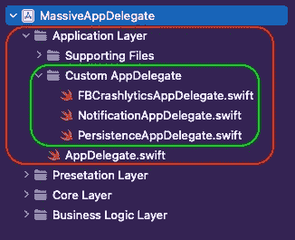
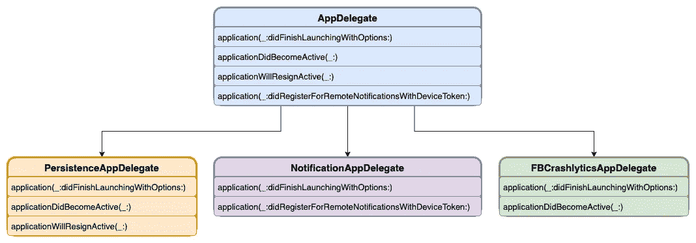
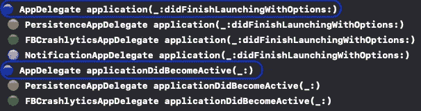
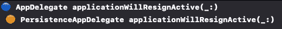

# 避免 iOS 中的“大量 AppDelegates”

> 原文：<https://betterprogramming.pub/avoiding-massive-appdelegates-df59dd9b8a2d>

## 如何在 AppDelegate 中下单


塞萨尔·卡里瓦里诺·阿拉贡在 [Unsplash](https://unsplash.com?utm_source=medium&utm_medium=referral) 上的照片

# 介绍

我写的是如何组织你的 iOS 项目。并且得到了很多问题来阐述如何避免出现“海量 AppDelegate”。

如果您已经参与了几个项目，那么您很有可能遇到了“大规模视图控制器”问题。

为了解决这个问题，你可以使用`extension`来提取一些逻辑，使用子视图控制器，或者使用一些架构模式，比如 MVP、MVVM、VIPER、CleanVIP 等等。

相反，很多有组织的项目仍然有巨大的`AppDelegates`。在这篇文章中，我将尝试提出我最喜欢的解决这个问题的方法。

# 问题是

几乎所有的在线第三方 SDK 集成教程都展示了它们的基本实现以及如何初始化它们——比如 Firebase、Realm、AppFlyer、Alamofire 等。你在`AppDelegate`中集成并初始化它们。

然后*产品所有者*基于推送通知、位置、核心数据等要求新的特性。

你把他们也加到`AppDelegate`里。此时`AppDelegate` `application(_:didFinishLaunchingWithOptions:)`已经有了一堆代码，逻辑上应该有一些分离。这只是一种方法。甚至不会走得更远。我们称之为“大规模 AppDelegate”。

不过不用担心[复合设计图案](https://en.wikipedia.org/wiki/Composite_pattern) 能够救驾。

# 设计自定义 AppDelegate

在我们开始使用`AppDelegate`之前。我想介绍一个不错的组织/文件夹结构。



分层架构中的应用层和自定义 AppDelegate

正如你所看到的，所有属于应用层的东西都被分开了，包括`AppDelegate`和`Custom AppDelegates`以及*支持文件*(如 Info.plist、Assets、Configs 等。).
对于每个逻辑组件，如通知或 Firebase Crashlytics，我们将创建一个`Custom AppDelegate`。



基于逻辑的复合设计模式在 AppDelegate 和 Group 中的应用

正如你从上图中看到的，只需要整合使用过的方法。

`NotificationAppDelegate`有`application(_:didFinishLaunchingWithOptions:)`和`application(_:didRegisterForRemoteNotificationsWithDeviceToken:).`

如果你仔细看看，`AppDelegate`类符合`UIApplicationDelegate`协议。这给了我们类似于 `application(_:didFinishLaunchingWithOptions:)`的可选方法。

# 准备应用程序委托

让我们一步一步地解释下面的代码。

*   **第一步。** **—** 我们需要创建类型为`UIApplicationDelegate` *(第 10 行)*的`CustomAppDelegates` 列表
*   **第二步。—** 将每个新创建的`CustomAppDelegates` 添加到列表中，例如:like `NotificationAppDelegate` *(第 16 行)*
*   **步骤三。—** 在中，每一个`AppDelegate`方法都添加类似(*例如:第 33 行*)的东西

```
appDelegates.forEach { _ = $0.application?(application, didFinishLaunchingWithOptions: launchOptions) }
```

这将确保每个`CustomAppDelegate` 方法都会被调用。

仅此而已。未来的`AppDelegate`，大多不需要有大的改动。如果遗留代码有问题，这也是重构现有`AppDelegate`的一种便捷方式。

干净整洁的 AppDelegate 代码示例

# CustomAppDelegate 实现

如果您已经正确设置了`AppDelegate`，这里您几乎没有什么工作要做。

*   第一步。—确保您的`CustomAppDelegate`符合`UIApplicationDelegate`。
*   第二步。—开始键入您需要的方法，自动完成应该会建议与常规`AppDelegate`相同的方法。
*   第三步。—基于第三方 SDK 方法的文档集成这些方法。

仅此而已。你有逻辑分离的组件。

CustomAppDelegate 的示例

如果我们开始代码，那么我们可以看到所有实现的方法将被一个接一个地触发。



CustomAppDelegates 应用程序启动中的生命周期

如果应用程序在后台**，** `PersistenceAppDelegate`想要监听`applicationWillResignActive(_:)`事件以进行最后的保存。



应用程序中的 CustomAppDelegates 生命周期将转到后台

我们可以看到只有`PersistenceAppDelegate`事件被触发。其余的 *CustomAppDelegates* 没有兴趣听这个事件。

在这个 [GitHub 库](https://github.com/skyspirit86/MassiveAppDelegate)上可以获得整个代码库。

# 概述

如果你开始这个项目，马上组织起来并不难。

如果你有一个正在进行的项目，这是一个快速、轻松重构的简单方法。

如果你有`SceneDelegate`，这个逻辑也可以很容易地应用。

如果你到了这一步，感谢你的阅读。你应该得到一杯咖啡☕️.🙂如果你喜欢的内容，请👏，分享，还有[跟着](https://varga-zolt.medium.com/)，对我来说就是 a 的意思。如果您有一些建议或问题，请随时发表评论。

**想连线？**
你可以在 [LinkedIn](https://www.linkedin.com/in/varga-zolt/) 、 [Twitter](https://twitter.com/skyspirit86) 或[https://skyspiritlabs.com/](https://skyspiritlabs.com/)与我联系。还有更多文章和教程。