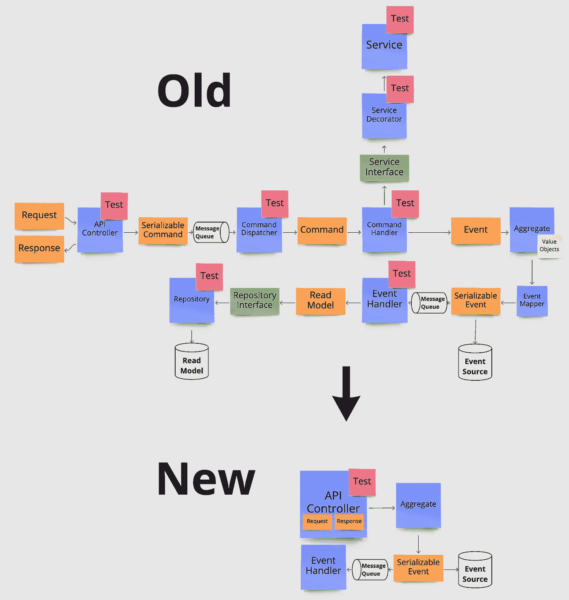
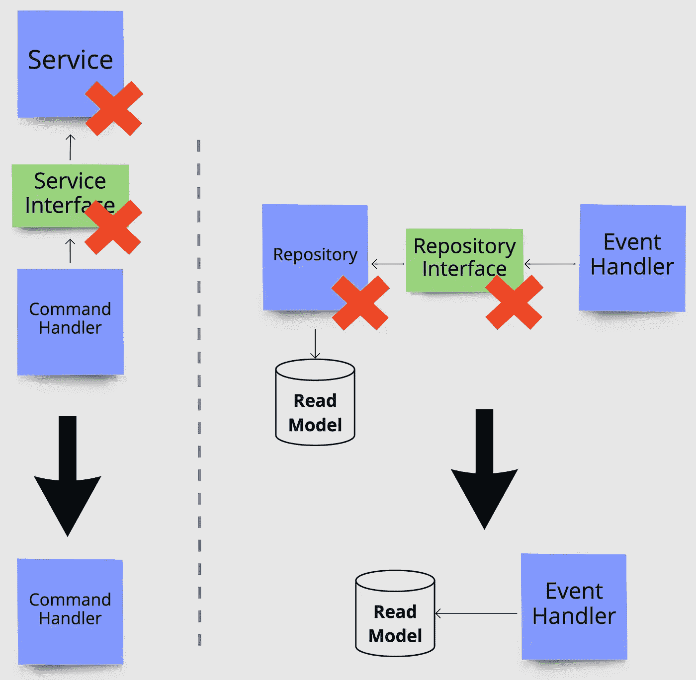
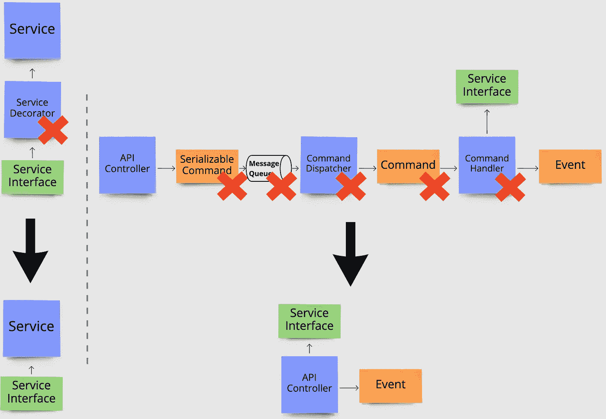
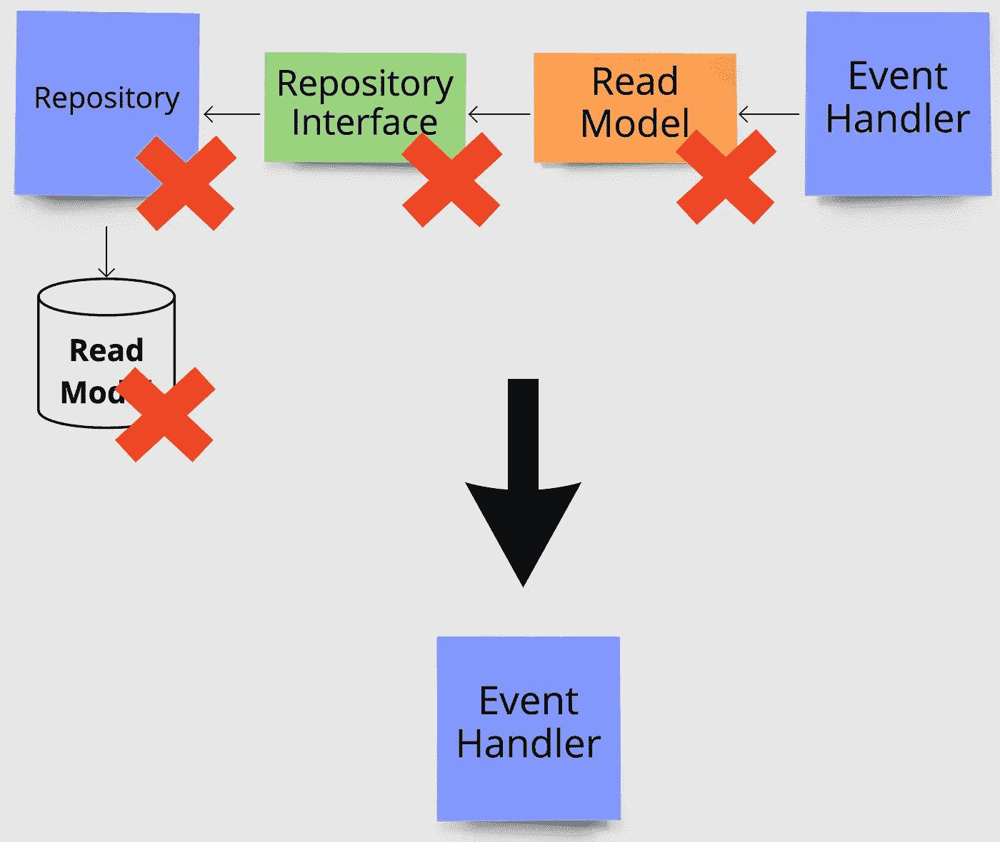
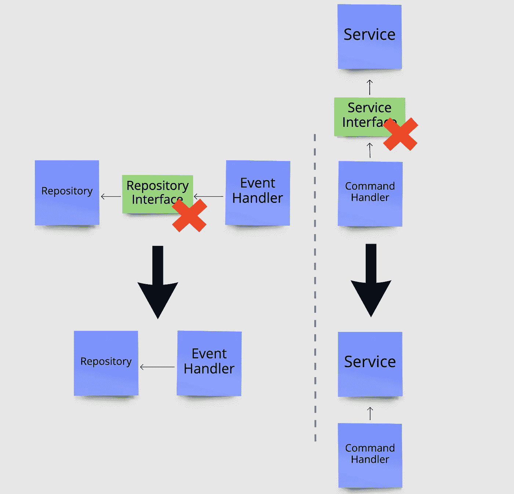
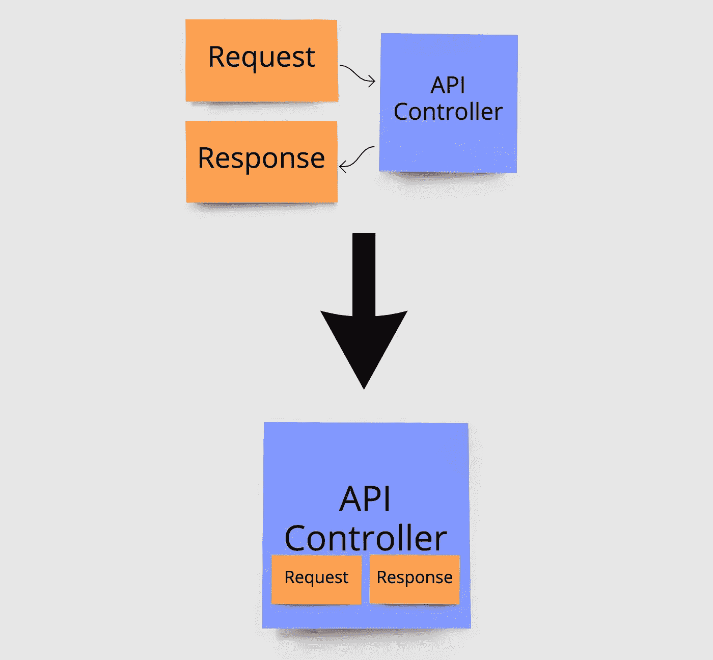
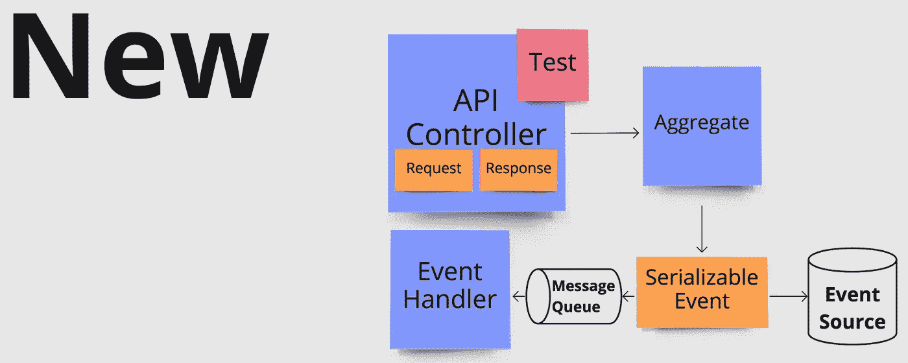

# 避免过早的软件抽象

> 原文：<https://betterprogramming.pub/avoiding-premature-software-abstractions-8ba2e990930a>

## 我们如何删除 80%的代码——提高开发速度并减少错误

移除过早抽象前后所需的文件。基于一个真实的端点更新数据的例子。每个便利贴代表一个文件。图片鸣谢:作者。

软件开发人员喜欢抽象。抽象是高效开发的重要且绝对的关键。毕竟，只使用 1 和 0 来编写软件是相当麻烦的。当抽象过早地被引入时，问题就来了，也就是说，在它们解决一个真正的非理论问题之前。增加抽象总是以复杂性为代价的，如果做得过多，会降低开发速度和人们理解代码库的能力。

> 计算机科学中的所有问题都可以通过另一层抽象来解决……除了抽象层太多的问题。—巴特勒·兰普森

这篇文章展示了避免常见的抽象是如何产生一个更干净的代码库，同时大大降低了复杂性，增加了可读性和可维护性。这篇文章是基于与以前相比，我和我们团队的其他人现在构建微服务的方式的转变。对我们来说，这已经减少了常规功能的大小，例如用于更新或读取数据的新微服务端点，从总共大约 **25 个文件**减少到**T5 仅仅 **5 个，**减少了**80%**大部分代码已经被删除，同时提高了代码的可读性。**

讨论的要点基于这样的原则，如[保持简单，愚蠢](https://en.wikipedia.org/wiki/KISS_principle) (KISS)和[你不需要它](https://en.wikipedia.org/wiki/You_aren%27t_gonna_need_it) (YAGNI)，这意味着我们希望将抽象保持在最低限度，只有当它提供重大和真正的好处时才引入复杂性。这些要点适用于大多数类型的软件工程。

# 常见的过早抽象

让我们看一些实践中经常出现的不成熟抽象的具体案例。这些都是基于在我们自己的代码库中找到的真实例子。

1.  职责抽象得太细了
2.  设计模式的使用没有真正的好处
3.  性能过早优化
4.  低耦合无处不在

让我们仔细看看每一个单独的。

## 1.职责抽象得太细了

复杂代码库的一个根本原因是责任划分得太细了。这可能是将数据库查询抽象成一个专用的存储库类，将 HTTP 调用抽象成一个服务类，或者将一些完全内部的逻辑移到一个单独的组件中。

这通常是为了满足非常流行的单一责任原则— *每个类应该只有一个改变的理由，或者，他们应该只有一个工作。如果我们将每一个微小的逻辑片段分成一个单独的类，那么所有的东西都有非常明确的责任，只做一件事，因此只有一个改变的理由。很棒吧？问题是，所有这些小部分通常仍然紧密耦合，并且高度依赖于彼此。如果各部分之间的任何交流发生变化，通常会产生级联效应，需要对许多部分进行更改。所以他们可能每个人都只有一个改变的理由，但是如果一个单独的改变经常需要对许多部分进行改变，使得改变代码变得很痛苦，那就没有什么好处了。*

此外，仅仅因为一个原因而改变的类通常没有真正的实际优势。事实上，在做不止一件事的类中进行更改通常会为开发人员提供更多的上下文，这使得理解更改及其对周围代码的影响更加容易。

那么我们应该在什么时候分担责任呢？一个常见且非常有效的情况是需要在多个地方使用逻辑。如果在代码中的多个位置需要完全相同的 HTTP 调用或数据库查询，复制逻辑通常会降低可维护性。在这种情况下，将它转移到一个共享的、可重用的组件中可能是一个好主意。关键是在需要之前不要这样做。另一种有效的情况是当逻辑非常复杂并且对周围代码的可读性产生负面影响时。如果一段逻辑占用了 300 行代码，可能就是这种情况，而只占用几行代码可能会损害可读性，使代码导航更加困难。请记住，划分职责总是会增加代码的结构复杂性。

下面你可以看到改变我们对职业职责的看法是如何影响文章顶部显示的原始架构的。在左边，我们将服务类的逻辑直接放入需要服务逻辑的命令处理程序中。在右边，我们将存储库类中的数据库查询直接移动到需要它的事件处理程序中。

在左边，我们将来自服务类的逻辑直接放入需要它的命令处理程序中。在右边，我们将数据库查询直接移到需要它的事件处理程序中。图片鸣谢:作者。

## 2.设计模式的使用没有真正的好处

在真正需要各种编程设计模式的好处之前引入它们是另一个常见的陷阱。设计模式非常擅长解决代码库中的特定问题，并且在某些情况下可以降低整体复杂性。也就是说，几乎所有的方法都有增加结构复杂性和降低代码一致性的缺点。

一个很好的例子就是[装饰模式](https://en.wikipedia.org/wiki/Decorator_pattern)。装饰模式通常用于在现有组件的基础上添加额外的功能。这可能是一个发出 HTTP 请求的组件，我们希望在其中添加一个重试机制。在不改变原始组件的情况下，我们可以添加一个新组件来包装原始组件，并在其上添加重试逻辑。通过实现相同的接口，它可以直接在代码中或通过依赖注入来替代原始组件。

起初，这似乎是个好主意。我们不需要改变任何现有的代码，我们可以单独测试每一个代码，每一部分在单独看的时候都很容易理解。巨大的负面影响来自于我们再次失去连贯性的事实。当开发人员稍后查看原始组件或使用该组件的代码时，不会立即清楚代码执行时会发生什么，因为在“幕后”添加了更多的逻辑。我看到过将重试直接添加到一个类中的真实案例，后来才发现它已经用重试逻辑进行了修饰，最终导致部署时重试次数成倍增加。像这样的情况只有在不清楚代码的行为时才会发生。

另一种广泛使用的模式是[命令](https://en.wikipedia.org/wiki/Command_pattern)和[发布-订阅模式](https://en.wikipedia.org/wiki/Publish%E2%80%93subscribe_pattern)。这里，一个类不是直接处理一个请求，而是将它抽象成一个命令，在其他地方处理。一个例子可以是 API 控制器将 HTTP 请求映射成命令，并发布它们以由订阅该特定命令的适当处理程序来处理。这在接收和解释请求的代码部分和知道如何处理请求的代码部分之间提供了松散耦合和清晰的隔离。这种模式存在合理的使用案例，但是最好问问自己，在实践中，它是否只是一个无用的映射层。一个映射层，它进一步使得跟踪程序的执行路径变得更加困难，因为根据发布-订阅定义，发布者不知道命令最终在哪里被处理。

这些只是经常过早使用的设计模式的几个例子。几乎所有的模式都是如此。它们都有不利的一面，所以只有当好处大于坏处时，才使用一种模式。下面，您再次看到了移除不必要的设计模式对我们原始架构的影响。在左边，我们删除了装饰模式，在右边，删除了包括发布/订阅机制在内的整个命令流。

移除过早引入的设计模式。移除左侧的装饰图案。右侧的命令和发布/订阅模式已删除。图片鸣谢:作者。

## 3.性能过早优化

构建性能良好的软件是至关重要的，通常最有效的问题解决方案也是最干净、最简单的。然而，在其他时候，情况并非如此。在这里，优化的成本必须与我们期望获得的实际利益相权衡。要考虑的成本是分析、实现和维护优化所花费的时间，以及使用更复杂的方法来实现效率所带来的代码可读性的潜在降低。不要为了不必要的效率而牺牲代码的可读性，记住开发人员的时间成本通常远远超过通过微优化代码节省计算资源的潜在收益。

> *过早优化是万恶之源—* 唐纳德·克努特

优化也可以在架构级别完成。一个例子是[命令查询责任分离(CQRS)](https://martinfowler.com/bliki/CQRS.html) 模式。CQRS 本质上意味着您有两个独立的数据模型，一个用于更新数据，另一个用于读取数据，将您的应用程序分为读写端。这允许优化一端以实现高效读取，优化另一端以实现高效写入，并且在应用程序的读负载或写负载特别大的情况下，一端比另一端的伸缩性更大。

这种模式的巨大缺点是需要构建和维护一个完全独立的数据模型，这导致了巨大的开发开销。如果需要性能，这种折衷可能就很好，但是即使对于数百万人使用的应用程序，我也很少看到读写效率的提高带来任何可衡量的好处。更明智的方法是对读取和写入使用单一模型，并且只为少数个别情况创建优化的读取模型，在这些情况下，已知简单的方法不能充分执行。

下面您会看到一个从我们的示例流程中删除了读取端的图示。后续查询不是从专用的读取模型表中读取，而是直接从事件源中读取，在我们的示例中，事件源是数据最初被写入的地方。

移除应用程序的整个专用读取端，改为使用相同的模式进行读取和写入。图片鸣谢:作者。

## 4.到处都引入了低耦合

低耦合的代码库是每个部分尽可能独立于其他部分的代码库。低耦合使得对一个部分的更改对其他部分的影响最小，并且使得交换代码的一部分更容易，因为它们只以最小的方式相互依赖。多个不同代码库使用的外部库或模块就是一个很好的例子。我们不希望库的功能变化对使用它的代码库的影响超过绝对需要的程度，如果需要的话，用不同的库替换这个库是有益的。

实现低耦合的一种典型方式是遵循*依赖倒置*和*开放/封闭*的坚实原则，即实体应该依赖于抽象而不是具体的实现，同时对扩展开放，对修改关闭。在实践中，这通常是通过抽象接口后的类并让其他类依赖于这些接口而不是具体的类来实现的。

当对这些原则的解释导致低耦合无处不在时，问题就来了，甚至在同一个隔离特性中的单个类之间，比如微服务的 API 端点或前端的屏幕。这通常可以通过为每个类广泛引入的接口来看到，这些接口公开了给定特性中其他类使用的任何类型的逻辑。

隔离功能不需要内部元件之间的低耦合和接口。原因是这种低耦合是有代价的。低耦合性，尤其是接口，使得代码不那么连贯，并且更难导航，因为您不直接知道将执行什么具体的代码。相反，您首先需要检查该接口存在哪些实现，然后找出在运行时实际使用的是哪个实现。此外，接口是另一个需要添加到项目中的文件，并且在具体实现的签名发生变化时保持最新。

接口解决了大量的问题，在需要解决实际问题的时候引入它们，而不是为了实现不必要的低耦合。通常，当您需要能够交换实现时，或者当创建其他人使用的外部库而无法修改库代码库时，就会出现这种情况。此外，如果您仅仅是使用接口来允许测试中的模仿，认真考虑切换到允许模仿具体类的模仿库，以避免开销。

下面通过移除两个接口来可视化，让事件处理程序和命令处理程序分别直接引用存储库和服务类的具体实现。

删除不需要的接口。左边是存储库的接口，右边是服务类的接口。图片鸣谢:作者。

## 给喜欢冒险的人的额外建议

如果你特别喜欢冒险，你可以更进一步，把不同的类放到同一个文件中。如果这些类是紧密相关的，相互依赖的，并且经常一起更改，那么这可以提高可维护性，并且在进行更改时可以方便地使用上下文。也就是说，如果类的大小显著增加，要准备好将类移动到它自己的文件中——我们不想最终损害可读性。

这里重要的一点是，一起更改的代码尽可能放在一起，以使这些更改无缝。更常见的情况是，一个变更会影响多个类，因为它们在同一个特性中，而不是因为它们属于特定的类型。这在本质上有利于[垂直切片架构](https://jimmybogard.com/vertical-slice-architecture/)而不是更经典的洋葱架构，因为典型的变化本质上是垂直的，而不是水平的。在这里，基于与类相关的特性而不是类的类型对文件夹中的类进行分组很有帮助。

在我们的示例体系结构中，这可以通过将请求和响应的类直接放在与控制器相同的文件中来看到，控制器将请求作为输入，将响应作为输出。这是一个非常密切相关的类经常一起变化的很好的例子。当放在同一个文件中时，您无需在文件之间跳转，就可以立即获得该功能的完整概述。这里需要注意的一点是，每个控制器只有一个端点。因此，每个文件只关心那个单一的特性，其他什么都不关心。

合并密切相关的类，如请求、响应和控制器。该文件将处理单个端点的所有事情。换句话说，每个控制器类只有一个端点。图片鸣谢:作者。

## 当需要的时候重构

既然我们不再做不成熟的抽象，重要的是将重构视为做出改变的自然部分。如果一个逻辑突然在多个地方被需要，那么现在是时候把它抽象成一个单独的可重用组件了。如果我们突然需要交换实现，那么现在是添加接口的时候了。避免过早的抽象并不意味着永远不会引入抽象，只是我们会在真正需要的时候引入它们。这绝不是编写草率的意大利面条式代码的借口。

尽管有了这些改进，进行重构和移动部件应该变得轻而易举。重构时仍然存在的一个痛点是，对每个类都有专门的单元测试，所有的依赖都被模仿。这种类型的自动化测试锁定了每个类的行为，并以一种非常特定的方式与其他类进行通信，因为您本质上是在测试代码库的实现，而不是行为。这意味着每当一个类改变了它的单元测试，通常还有模仿这个类的其他测试，都需要更新。当变更是纯粹的结构性重构时，这就不好了，比如将一些逻辑移动到一个可重用的组件，而您的代码库的外部行为并没有改变。

出于这个原因，我们已经完全放弃了这种单元测试，并选择了一种完全不同的自动化测试方法。这允许我们快速地进行各种内部重构，而不必更新一个测试。但这是另一个单独帖子的另一个主题，[你可以在这里找到](/quit-unit-testing-classes-and-use-a-behavior-oriented-approach-306a667f9a31)。

将上述原则应用到我们的原始架构中，会产生如下所示的改进设计——所有这一切都是通过消除过早的抽象实现的。

由于去除了不成熟的抽象，改进了体系结构。图片鸣谢:作者。

# 结论

我们已经看了 4 种常见类型的过早抽象，它们经常出现在导致不必要的复杂性的代码库中。所有这些都有被使用的正当理由，但是当它们被过早地引入并且在实践中没有提供真正的好处时，问题就出现了。还有很多类似的例子在这篇文章中列出。关键的一点是改变你的心态，总是严厉地看待你代码的每一部分。每当你考虑引入另一个抽象时，问问你自己和你的同事，它是否真的能提供你正在寻找的价值，或者它是否可以被简单地省去而没有任何问题。仅仅因为理论上的原因增加复杂性，比如“分离关注点”和“不依赖于具体的实现”，是不够好的。每当增加新的复杂性时，总会有具体的、实际的、真实世界的好处。

**现在，看看你的代码库。**他们是否也有你可以移除的过早抽象？一个好的代码库使得简单的修改和重构变得非常快速和容易。检查您最近的拉取请求，并将更改的大小与它们所实现的进行比较。

如果这些想法和原则改变了你构建软件的方式和你的体验，我会很高兴听到。

# [加入我的电子邮件列表，获得更多关于简化软件的有用见解！](https://jonastulstrup.medium.com/subscribe)