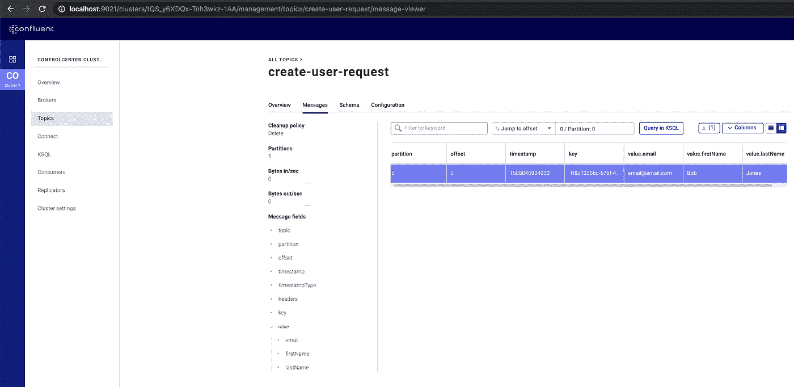

# 用 Python 和融合的 Kafka 库创建 Avro 生产者

> 原文：<https://betterprogramming.pub/avro-producer-with-python-and-confluent-kafka-library-4a1a2ed91a24>

## 将 Avro 记录发送到 Kafka 主题的命令行可执行 Python 脚本


Susan Yin 在 [Unsplash](https://unsplash.com?utm_source=medium&utm_medium=referral) 上拍摄的照片。

# 概观

在本教程中，我们将学习如何使用 Confluent 的 Kafka Python 客户端[库](https://github.com/confluentinc/confluent-kafka-python)编写 Avro 生成器。

我们将编写的脚本可以从命令行执行，并接受一些参数作为输入。将它编写为命令行可执行文件使我们可以灵活地从任何地方调用它。

本教程的代码可以在这个 GitHub [repo](https://github.com/billydh/python-avro-producer/) 中找到。

# 属国

首先，让我们创建`requirements.txt`文件并编写这个项目所需的包。实际上我们只需要一个包:

requirements.txt

然后，让我们设置并激活我们的虚拟环境，这样我们将要安装的包将被隔离，只用于我们的项目。对于本教程，使用`virtualenv`。

假设您已经安装了`virtualenv`，让我们从终端执行以下命令:

```
~ ❯ mkdir python-avro-producer~ ❯ cd python-avro-producer~/python-avro-producer ❯~/python-avro-producer ❯ virtualenv ./venv~/python-avro-producer ❯ source ./venv/bin/activate~/python-avro-producer (venv) ❯
```

现在，让我们继续安装我们需要的依赖项:

```
~/python-avro-producer (venv) ❯ pip install -r requirements.txt
```


[公园巡警](https://unsplash.com/@parktroopers?utm_source=medium&utm_medium=referral)在 [Unsplash](https://unsplash.com?utm_source=medium&utm_medium=referral) 上拍照。

# Avro 生产商

好了，现在有趣的部分开始了！

为了使本教程易于理解，我们将把它分成几个部分，每个部分将讨论脚本的一个部分。

## 函数来解析命令行参数

如前所述，这个脚本将是可执行的，并接受命令行参数。所以，首先要做的是写一个函数来处理这个问题。

我们将创建一个名为`utils`的文件夹和一个名为`parse_command_line_args.py`的新 Python 文件。Python 文件的内容如下:

parse _ 命令行 _args.py

我们为引导服务器和模式注册中心定义默认值以指向`localhost`。当我们想在本地测试时，这很有用。还要注意，这两个 *x* 值是 Kafka 的引导服务器和模式注册表的标准地址和 URL。

还有一个`--schema-file`论点。这将告诉我们的脚本在将记录值发布到 Kafka 主题时使用哪个 Avro 模式来序列化记录值。

对于记录键，如果不提供，我们将生成一个随机的 UUID，以最大限度地利用卡夫卡的分区。我们稍后将讨论 UUID 一代。

记录值将作为 JSON 字符串传入(例如`{"name": "Owen", "task": "Build Avro Producer"}`)。

## 创建 Avro 模式并添加到项目中

Avro 生产者需要一个 Avro 模式来序列化将发布到 Kafka 主题的记录值。因此，让我们创建一个简单的 Avro 模式，并将其添加到我们的项目中。

这个 Avro 模式包含一个新的用户创建请求(假设我们有一个拥有用户订阅的应用程序)。它有三个 *x* 字段，分别是`email`、`firstName`和`lastName`。

创建用户请求

酷毙了。现在，在我们的项目中创建一个名为`avro`的文件夹，并将`create-user-request.avsc`放在那里。

我们还将编写另一个`util`函数来将这个模式文件加载到我们的主脚本中。让我们在`utils`文件夹中创建一个新文件，命名为`load_avro_schema_from_file.py`。

`load_avro_schema_from_file.py`

注意，我们的记录键的模式是类型`string`。如果您的键模式不是类型`string`，您需要调整这一部分。

## 向 Kafka 主题发送记录的功能

这是我们需要编写的最后一个函数，也是最重要的一个，因为它会将记录发送到 Kafka 主题。

现在，继续创建一个名为`send_record.py`的新 Python 文件。

发送 _ 记录. py

让我们一起来看一下代码:

*   第 15–20 行。这是我们配置 Avro 生成器的地方。我们首先在`producer_config`对象中定义生产者配置。这里没什么特别的。我们基本上只是设置要使用的引导服务器和模式注册表 URL。
*   接下来，我们创建一个`AvroProducer`的实例，它是一个 Kafka producer 客户端，能够将消息序列化到 Avro 记录中，并将模式注册到模式注册中心。我们传入生产者配置以及键和值的模式。
*   第 22 行。我们的脚本检查是否传递了`--record-key`参数，如果没有，它将生成一个随机的 UUID 版本 4。
*   第 25–30 行。在这里，我们调用我们的`AvroProducer`的`produce()`方法，它将把记录发送到我们使用前面定义的模式指定的 Kafka 主题。如果有一个`Exception`，它会把它打印到控制台，这样我们就知道哪里出错了。在一切正常的情况下，它会打印一条成功消息。
*   第 32 行。我们调用我们的`AvroProducer`的`flush()`方法，这基本上意味着它将等待直到所有的消息被发送。
*   现在，`produce()`方法就是`asynchronous`。你可能会想，如果我们调用`flush()`方法，它就会变成`synchronous`。答案是肯定的。然而，在我们的例子中，这很好，因为我们的脚本被设计成一次只发送一条消息。

有关这方面的更多信息，您可以访问`flush()`上的[官方文档](https://docs.confluent.io/current/clients/confluent-kafka-python/index.html#confluent_kafka.Producer.flush)。

太棒了，伙计们。我们实际上已经完成了代码的编写。在下一节中，我们将测试刚刚编写的代码。


阿尔文·列宁的照片。

# 测试 Avro 生成器

为了测试我们的脚本，我们需要建立一个环境，在这个环境中有融合的 Kafka 和 Schema Registry。我们还希望有一个汇合控制中心，这样我们就可以在一个漂亮的 UI 上观察消息是否被实际传递。

为此，我们可以遵循[我前段时间写的教程](https://medium.com/better-programming/your-local-event-driven-environment-using-dockerised-kafka-cluster-6e84af09cd95)。到第二篇教程结束时，您将能够启动本地 Docker 容器，这些容器运行所有融合的 Kafka 和 Schema Registry 组件。

不管怎样，让我们继续测试我们的代码。

因此，让我们从您的终端执行以下命令:

```
~/python-avro-producer ❯ python send_record.py --topic create-user-request --schema-file create-user-request.avsc --record-value '{"email": "[email@email.com](mailto:email@email.com)", "firstName": "Bob", "lastName": "Jones"}'Successfully producing record value - {'email': '[email@email.com](mailto:email@email.com)', 'firstName': 'Bob', 'lastName': 'Jones'} to topic - create-user-request
```

耶！我们收到了成功消息，这意味着一切都按预期进行。

现在，打开浏览器，进入 [http://localhost:9021](http://localhost:9021,) ，这是合流控制中心的地址。然后，导航到主题`create-user-request`并转到偏移`0`。这是你应该看到的:



合流控制中心

完美！干得好，各位。

# 包扎

祝贺您完成本教程。至此，我们已经学会了如何编写一个能够将消息序列化为 Avro 记录的 Kafka 生成器。现在，我鼓励您在现有的应用程序中实现这一点，以便您的应用程序成为事件驱动的应用程序。

如果你想学习如何在 Kotlin 中做到这一点，你可以遵循下面的综合教程。它有一个完整的端到端指南来构建一个与 DynamoDB 和 Kafka 交互的 Kotlin 应用程序。

[](https://medium.com/better-programming/a-comprehensive-guide-to-build-an-event-driven-application-with-kotlin-kafka-and-dynamodb-a8d9bfb19e42) [## 用 Kotlin、Kafka 和 DynamoDB 构建事件驱动应用程序的综合指南

### 构建您自己的事件驱动应用程序

medium.com](https://medium.com/better-programming/a-comprehensive-guide-to-build-an-event-driven-application-with-kotlin-kafka-and-dynamodb-a8d9bfb19e42)