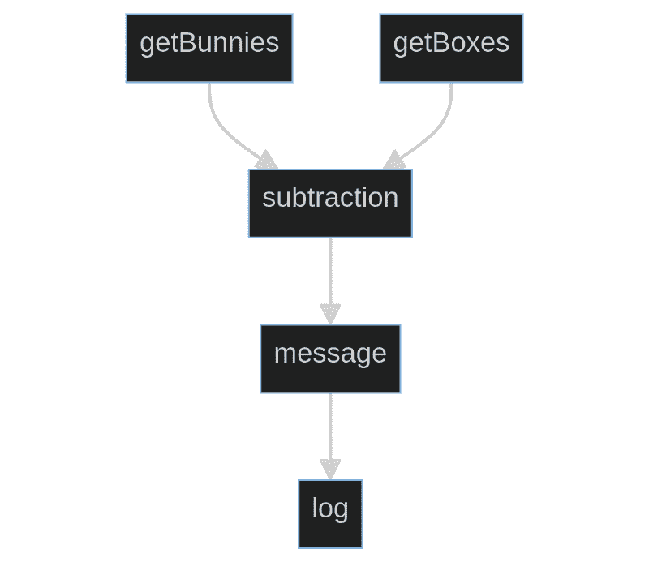

# 等待一个更好的未来

> 原文：<https://betterprogramming.pub/await-ing-a-better-future-fb58167b3b3d>

## 代码抽象的例子


[drmakete 实验室](https://unsplash.com/@drmakete?utm_source=medium&utm_medium=referral)在 [Unsplash](https://unsplash.com?utm_source=medium&utm_medium=referral) 上拍摄的照片

尽管我最初对 JavaScript 中的关键字`await`的引入感到满意，但我已经开始认为编程语言可以完全抽象这个概念，而不需要任何特殊的语法。从短期来看，我们应该更喜欢自己的代码抽象来帮助我们忘记异步。

提醒一下，异步允许程序员“差不多同时”做很多事情，也就是说，在执行过程中停下来做别的事情。如果一个程序有许多 IO 阻塞的操作(例如，调用远程服务、访问磁盘、等待用户输入等等)，这就变得特别重要。

async/await 语法是主流编程语言中相对较新的内容。它允许编写不会线性执行的线性代码。

典型用法如下所示:

```
// Execution will possibly go elsewhere here
const nBoxes = await getNumberOfBoxes();
// Here too.
const nBunnies = await getNumberOfBunnies();
const message = nBoxes - nBunnies > 0
 ? 'we have enough boxes'
 : 'we don\'t have enough boxes';
console.log(message);
```

这两个异步调用是按顺序进行的，但是由于它们没有副作用(它们是只读的)，它们可以同时发生，这样会快得多:

```
const [nBoxes, nBunnies] = await Promise.all([
 getNumberOfBoxes(),
 getNumberOfBunnies()
]);
const message = nBoxes - nBunnies > 0
 ? 'we have enough boxes'
 : 'we don\'t have enough boxes';
console.log(message);
```

这种低效是常见的，并且经常在代码审查中被发现。

另一个问题是命令式编码是线性完成的:代码行按照编写的顺序一行一行地执行。有时候，就像这个例子，我们不关心先运行哪一行。然而，我们必须做出选择，这就引入了任意的变化——噪声。

我们能做得更好吗？我们能减少噪音并确保代码以最佳方式运行吗？

如果我们看一下程序的图形表示，那么这个图中节点之间的依赖关系暗示了什么可以并行完成(直观地说，同一“层”中的任何东西)。



在这种表示中，非语义的自由度被拿走了；我们不能再对代码应用“行置换”变换。

但是有时候管理`await`是语义上的。以这个案例为例:

```
await createUser(data)
const users = await getUsers()
return users
```

这不等同于以下内容:

```
const [_, users] = await Promise.all([createUser(data), getUsers()])
return users
```

异步调用有副作用，这意味着`await`的顺序很重要，即使依赖关系没有明确暗示出来。

但是大多数时候，让程序同时管理`await`和执行顺序会带来麻烦，或者至少，有些需要更多的努力。只是抽象层次不对。我们将添加这些语句以使代码“正常工作”

在某种意义上，异步类似于指针操作。我们过去常常手动管理内存使用。现在，我们大多数人，大部分时间，都不再需要了。它被巧妙的语法抽象化了。

因此，我们更希望让异步为我们管理，而不是由我们来管理。为此，我们可以使用更好的抽象来执行:异步感知的组合器(参见下面的实现)。使用它们，上面的例子可以写成这样:

```
pipe(
 juxt(getNumberOfBoxes, getNumberOfBunnies),
 subtraction,
 greater(0)),
 result => console.log(
   result
     ? ’we have enough boxes’
     : ’we don\’t have enough boxes’
 ),
)
```

`pipe`基本上意味着函数组合(以相反的顺序),`juxt`意味着并行组合，所以我们输入一个值，得到一个结果数组。

这种写作方式有三个优点:

1.  它最佳地等待着。实际上，我们自己从来没有明确地给`f()`或`await`打过电话。`juxt`和`pipe`对此做出明智的决定，这样就少了一件需要担心的事情。
2.  它被去噪是因为正确书写它的方法更少了。顺序更加依赖于驱动，更加语义化——我们不能切换任何行。
3.  在将`getNumberOfBunnies`更改为同步不需要代码更改的意义上，它与成分的重复/关联更少。

如果 IO 是有影响的，并且我们希望确保事情按顺序发生，该怎么办？我们应该明确地渴望做到这一点，因此一些 composer 将需要按顺序发生的动作链接起来，而不是四处浮动:未来的编辑器可能会无意中改变它们的顺序并导致错误。抽象是这样工作的:

```
return doInSequence(
 () => createUser(data),
  getUsers
);
```

这些抽象的共同点是，它们帮助我们在依赖空间中思考，这比执行顺序空间(有时有意义，有时是任意的)更有意义。

这反过来减少了噪声，更加简洁，并且总是最佳的。

# **附录**

```
const wrapPromise = (x) => Promise.resolve(x);

const doInSequence = (head, ...rest) => wrapPromise(head()).then((x) => (rest.length ? doInSequence(...rest) : x));

const map = (f) => (xs) => {
 const results = [];
 for (const x of xs) {
   results.push(f(x));
 }
 return results.some(isPromise) ? Promise.all(results) : results;
};
const juxt =
 (...fs) =>
 (...x) =>
   map((f) => f(...x))(fs);

const reduceHelper = (reducer) => (s, xs, firstIndex) =>
 firstIndex === xs.length
   ? s
   : isPromise(s)
   ? s.then((s) =>
       reduceHelper(reducer)(reducer(s, xs[firstIndex]), xs, firstIndex + 1),
     )
   : reduceHelper(reducer)(reducer(s, xs[firstIndex]), xs, firstIndex + 1);
const reduce = (reducer, initial) => (xs) =>
 initial
   ? reduceHelper(reducer)(initial(), xs, 0)
   : reduceHelper(reducer)(xs[0], xs, 1);
const pipe =
 (...fs) =>
 (...x) =>
   reduce(
     (s, x) => x(s),
     () => fs[0](...x),
   )(fs.slice(1));
```

你可以在 https://github.com/uriva/gamlajs 找到这些和其他的。