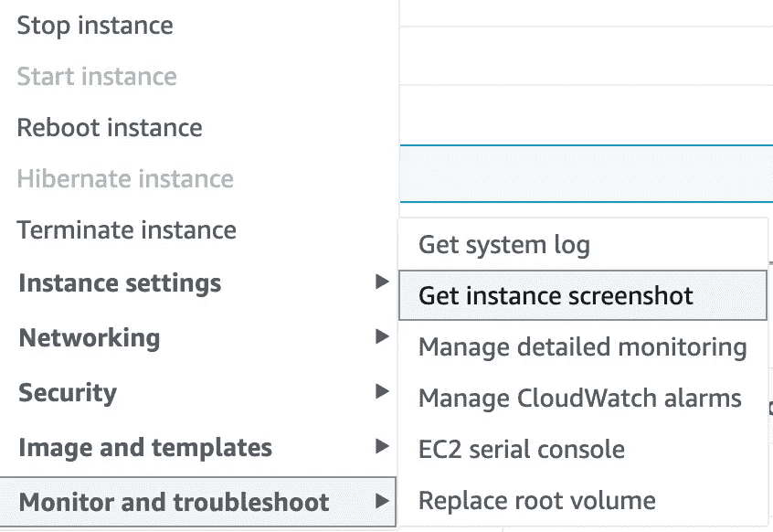
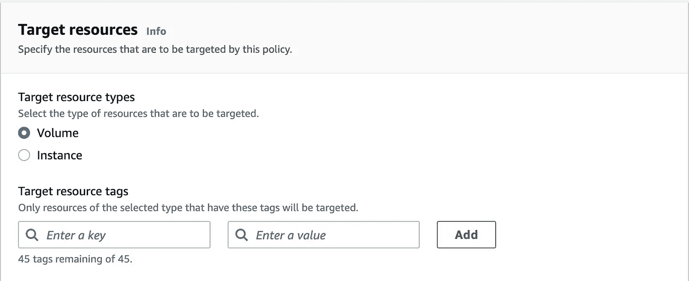

# 你可能忽略了的 AWS EC2 的强大功能

> 原文：<https://betterprogramming.pub/awesome-aws-ec2-features-you-may-have-overlooked-7bb8d8c55af3>

## 一些简单但聪明的宝石


由 [ThisisEngineering RAEng](https://unsplash.com/@thisisengineering?utm_source=unsplash&utm_medium=referral&utm_content=creditCopyText) 在 [Unsplash](https://unsplash.com/s/photos/servers?utm_source=unsplash&utm_medium=referral&utm_content=creditCopyText) 拍摄的照片

AWS 生态系统是功能和服务的绝对庞然大物。要掌握 AWS 提供的所有东西需要好几辈子。弄清楚如何有效地使用最流行的产品之一 EC2，这本身仍然是一个相当大的挑战。部署虚拟机、捕获和使用映像以及构建云基础架构的方式多种多样。

由于 EC2 的复杂性，有一些经常被忽略的金块提供了一套很好的工具来简化您的工作流程。在本文中，我们将探索一些隐藏的瑰宝，它们使得使用 EC2 更加灵活和有趣。

# 使用实例元数据

如果您没有使用过 EC2 实例元数据，那么您就错过了一些关于实例的非常丰富的信息。实例元数据 API 是一个有趣的特性。默认情况下，这在大多数实例类型上运行，并为获取大量主机数据提供了一个简单的接口。

实例元数据端点在实例操作系统内的本地地址上可用。这意味着，只有当您实际连接到机器时，才能够到它:

```
[http://169.254.169.254/latest/meta-data](http://169.254.169.254/latest/meta-data)
```

使用类似于`curl`的实用程序在命令行上对这个地址执行 web 请求会让您看到一些非常重要的数据点:

```
$ curl [http://169.254.169.254/latest/meta-data](http://169.254.169.254/latest/meta-data)ami-id
ami-launch-index
ami-manifest-path
block-device-mapping/
events/
hibernation/
hostname
identity-credentials/
instance-action
instance-id
instance-life-cycle
instance-type
local-hostname
local-ipv4
mac
metrics/
network/
placement/
profile
public-hostname
public-ipv4
public-keys/
reservation-id
security-groups
services
```

使用上面的列表，我们可以快速获取一些信息，比如我们的网络 IP 地址。如果我们想找到我们的公共 IPv4 地址，我们可以执行:

```
curl [http://169.254.169.254/latest/meta-data](http://169.254.169.254/latest/meta-data)/public-ipv4> 1.2.3.4
```

这可以用在脚本、配置管理系统或任何你能想到的可能需要本地实例信息的地方。

这个 API 只能从机器本地获得。除了主机本身之外，您无法从任何地方访问这个地址。这很好，因为服务是未加密的，不提供任何类型的身份验证。因为它确实提供了大量关于实例的标识信息，所以在实例之外公开这些信息时要小心。

有关实例元数据的更多细节，请查看这里提供的官方[文档](https://docs.aws.amazon.com/AWSEC2/latest/UserGuide/ec2-instance-metadata.html)。

# 获取截图

你有没有想过你的实例在做什么？由于 EC2 是所有运行在云中某处的虚拟机，我们不能直接访问它们。我们不能走过去插上显示器，看看发生了什么。那么，当主机对我们的远程连接没有反应时，我们该如何排除故障呢？

当然有截图了。

如果你一直在努力找出为什么一个本应在线且健康的实例不会回复你，这是揭示问题的最快方法。截图将显示实例的原始控制台输出，您将能够检查引导过程中的任何错误。



从 AWS 控制台捕获实例屏幕截图。

如果您想获取正在运行的虚拟机的截图，只需右键单击实例，将鼠标悬停在*监视器上并对*进行故障排除，然后单击*获取实例截图*。

使用屏幕截图进行故障诊断对于诊断网络问题、磁盘安装问题和许多其他在启动时可能发生的与设备相关的错误非常有帮助。

# 按区域检查实例类型可用性

您是否曾经尝试在一个区域中启动一个新的实例，结果却收到一条可怕的消息，如下所示:

当前不支持请求的配置。

虽然这个错误非常隐晦，并且没有提供真正有价值的故障排除数据，但是有一种方法可以找到更多信息。

在某些情况下，当您试图将特定实例类型启动到某些区域中时，它们对于该特定区域将不可用。如果您正在利用[本地区域](https://aws.amazon.com/about-aws/global-infrastructure/localzones/)、[波长区域](https://aws.amazon.com/wavelength/)或 AWS 发布的任何新兴区域，就会发生这种情况。专业区域通常提供有限的实例类型，尤其是在早期推广阶段。

那么，如何确定可用的实例类型呢？好吧，与其在堆积如山的文档中寻找答案，您可以简单地使用`aws-cli`来找出在任何给定的时刻某个区域有哪些类型可用:

```
aws ec2 describe-instance-type-offerings --location-type "availability-zone" --filters Name=location,Values=us-east-1a --region us-east-1
```

运行上面的命令将在`us-east-1a`区域中显示所有可用的实例类型。如果您对另一个特定的区域感兴趣，您所要做的就是更新该区域和相应的区域，您将能够看到受支持的实例类型的列表。

通过这个列表来`grep`并确认您想要的实例类型在那个区域中是否可用是非常简单的。

# 使用数据生命周期管理器滚动快照

您是否想过如何备份您的所有实例？超过一定数量后，拍摄一次性快照是不可持续的，保留大量旧版本会迅速增加存储成本。那么，确保所有实例卷安全可靠的最简单方法是什么呢？

使用[数据生命周期管理器](https://docs.aws.amazon.com/AWSEC2/latest/UserGuide/snapshot-lifecycle.html)。

EC2 中的数据生命周期管理器允许您为某些实例卷(使用标记)创建策略，以自动拍摄快照，然后只保留一定数量的快照。



使用 Data Lifecycle Manager 策略定位卷。

这项服务解决了一些紧迫的问题，其中最大的问题是自动创建快照和保持快照滚动窗口的能力。您不再需要手动创建或删除卷快照。只需相应地标记您的实例，它们的卷就会收到滚动快照。

现在，如果您遇到问题，您可以放心，您的数据得到了很好的保护，并且就在您需要的地方。

关于 DLM 的详细实施指南，请查看我之前的帖子: [*用 AWS 数据生命周期管理器*](/easy-disk-snapshots-with-aws-data-lifecycle-manager-9e36bf66019b) 创建简易磁盘快照。

如果你想了解更多，可以看看下面的几篇文章:

*   [*你应该知道的基本 TLS 证书命令*](/fundamental-tls-certificate-commands-you-should-know-88ac321f5274)
*   [*5 你应该使用的云 API 开发工具*](https://medium.com/geekculture/5-cloud-api-development-tools-you-should-use-a3f89d8a6076)