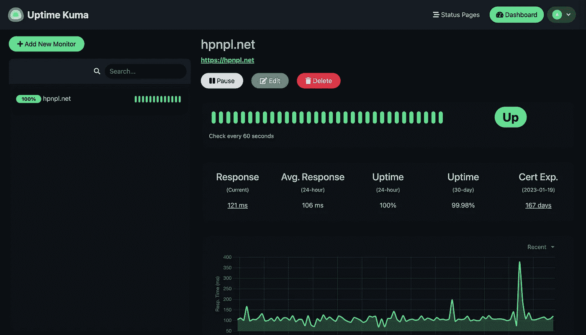
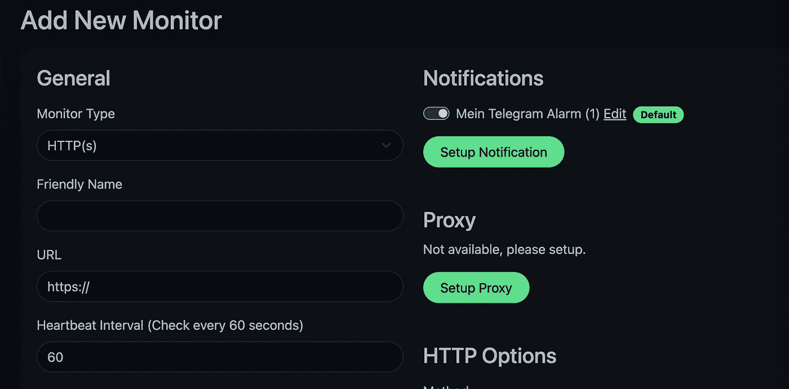
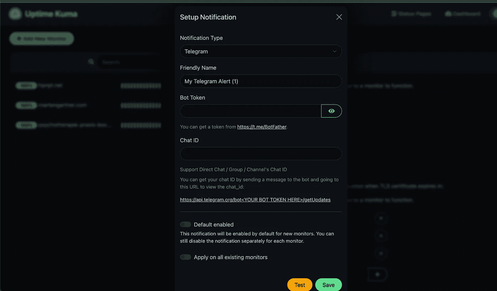

# 真棒网站监测与正常运行时间库马

> 原文：<https://betterprogramming.pub/awesome-website-monitoring-with-uptime-kuma-736dfebc1dd3>

## 用这个直观、轻量级的程序检查你的网站

在这篇文章中，我想分享我为我的网站设置监控的经验。虽然其他监视堆栈，如使用 prometheus、node-exporter 和 graphana 结合警报提供了大量很酷的功能，但我想介绍一个轻量级的简单堆栈。这个堆栈的核心组件是一个名为 [uptime-kuma](https://github.com/louislam/uptime-kuma) 的项目。它是用 node.js 和 vue 编写的，带有一个非常漂亮的用户界面。说服我运行 uptime-kuma 的主要理由是:

*   超级简单的设置和配置
*   超赞的用户界面
*   电报通知的简单集成
*   一组用于检查网站的简洁配置

所以让我们开始部署 uptime-kuma。我喜欢使用 [traefik](https://doc.traefik.io/traefik/) 作为反向代理，使用 [docker-compose](https://docs.docker.com/compose/) 部署。这个简单的单主机设置允许您自动为域颁发 LetsEncrypt 证书。

因此，这里是设置所需的全部内容:一个具有公共 IP 地址的主机，一个可以访问您的监控的域，以及一个将该域指向相应主机的 A 记录。在主机上，需要安装 docker 和 docker-compose。有几个关于为不同操作系统安装这两个工具的指南，例如 [docker](https://docs.docker.com/engine/install/ubuntu/) 和 [docker-compose](https://docs.docker.com/compose/install/) 。就是这样。

# traefik Docker-撰写部署

对于 traefik，只有大量不同的合成文件，因此您可以选择您喜欢的任何文件。如果你只是想遵循这个指南，让我给你看看我的。我喜欢将 docker-compose 部署放在`/usr/docker`下。所以对于 traefik，我们在`/usr/docker/traefik`下有以下文件。首先，需要将以下内容放入`docker-compose.yml`:

合成文件包含一个服务和一个网络。该服务是带有一些命令行标志的 traefik 容器。主要是，你只要换个邮箱就行了。如果您想避免在使用您的设置进行测试时遇到 LetsEncrypt 的速率限制，您可以将 acme resolver 更改为 staging(参见要点中的注释)。您可以申请任意多的证书，没有速率限制，但是会得到浏览器不自动信任的证书。

所以不是生产用的。traefik 服务为 HTTPS 流量转发`ports 80`和`443`，为仪表板转发`127.0.0.1:8080`，仪表板只能从本地主机访问。此外，还有一个名为`reverseproxy`的外部 docker 网络。我们将把 traefik 作为反向代理的所有容器连接到该网络。我们需要放入该文件夹的第二个文件是`traefik.toml`:

此配置为 HTTP 和 HTTPS 流量以及日志设置入口点。对特蕾菲克来说就是这样。

您现在可以在`/usr/docker/traefik`文件夹中运行以下命令:
-`docker network create -d bridge reverseproxy`-
-`touch access.log`-
-`docker-compose up -d`

# 正常运行时间-库马码头-撰写部署

对于 uptime-kuma，作者提供了一个开箱即用的 [docker-compose](https://github.com/louislam/uptime-kuma/blob/master/docker/docker-compose.yml) 文件。要使用 LetsEncrypt 证书在 traefik 后面运行它，我们只需将它更改为下面的`/usr/docker/uptime-kuma/docker-compose.yml`文件:

我们需要配置一些 traefik 标签，让 traefik 获得域的正确证书。此外，需要将 uptime-kuma 容器添加到反向代理网络中，以便 traefik 可以将传入流量转发给它。最后，只需在 uptime-kuma 文件夹中运行以下命令来启动容器:`docker-compose up -d`

# 配置正常运行时间-库马

第一次访问 uptime-kuma 实例时，必须配置一个安全的管理员密码。完成后，您可以开始添加端点。用户界面是这样的。你可以定义特定的行为，例如 HTTP 返回码，证书验证等。太棒了。

一旦您添加了第一个端点，我建议您配置电报通知。这样，每当一个或多个终端不按预期工作时，您都会收到通知。设置电报通知非常容易。您需要创建一个组、一个 bot，并在 uptime-kuma 中配置组的聊天 ID 和 bot 令牌。

所以，我们一步一步来。要创建一个机器人，你需要编写[机器人父亲](https://core.telegram.org/bots#6-botfather)。进入 telegram(或 web telegram)，打开与 Botfather 的聊天(按照 doc 中的链接)，然后编写`/newbot`作为对 bot 的命令。您需要按照要求给它一个名称和用户名。您可以看到您的令牌，这是 uptime-kuma 所需配置的第一部分。

现在，创建一个新的电报组，并将机器人添加到其中。您现在可以按照这里的指示[获取聊天 id](https://stackoverflow.com/questions/32423837/telegram-bot-how-to-get-a-group-chat-id)。基本上你需要在群聊里写一条消息，用你喜欢的任何工具向`https://api.telegram.org/bot<YourBOTToken>/getUpdates`发出 get 请求，然后寻找聊天字段。有时候这个数字是负数。别担心，那很好。

使用 chatId，您可以完成配置。您可以使用设置对话框中的按钮测试电报通知。

# 摘要

本文向您展示了如何将 uptime-kuma 与 traefik 反向代理结合安装，以及如何配置电报通知。在我看来，这是一个伟大的工具，监测网站，有许多有用的设置。如果你只需要确保你的网站正常运行，我绝对推荐你使用它。

请随时分享任何反馈。我很乐意把它加到这篇文章里。