# AWK 入门—面向数据科学家和工程师

> 原文：<https://betterprogramming.pub/awk-tutorial-for-data-scientists-and-engineers-predictive-hacks-848548888dd7>

## 通过真实世界的例子利用 AWK 的力量


康斯坦丁诺·卡斯卡尼斯在 [Unsplash](https://unsplash.com?utm_source=medium&utm_medium=referral) 上拍摄的照片

[](https://jorgepit-14189.medium.com/membership) [## 用我的推荐链接加入媒体-乔治皮皮斯

### 阅读乔治·皮皮斯(以及媒体上成千上万的其他作家)的每一个故事。您的会员费直接支持…

jorgepit-14189.medium.com](https://jorgepit-14189.medium.com/membership) 

AWK 出现在 1977 年，是一种为文本处理设计的编程语言，主要用于数据处理。在数据科学和数据工程领域，AWK 语言是一个很好的数据管理工具。在本帖中，我们将通过例子来尝试释放 AWK 的力量。

出于演示的目的，我们将使用下面的简单文件，您可以跟着做！

一个示例 csv:

```
ID,Name,Dept,Gender
1,George,DS,M
2,Billy,DS,M
3,Nick,IT,M
4,George,IT,M
5,Nikki,HR,F
6,Claudia,HR,F
7,Maria,Sales,F
8,Jimmy,Sales,M
9,Jane,Marketing,F
10,George,DS,M
```

# AWK 的记录和字段

AWK 处理文本文件。默认的字段分隔符是空白，默认的记录分隔符是换行符`\n`。但是，我们能够定义记录和字段。在我们提供一些具体的例子之前，让我们先关注一下最重要的内置变量:

*   `NR`:保存当前输入记录的数量
*   `NF`:保存当前记录的字段数
*   `FS`:输入字段分隔符，默认为空格
*   `RS`:输入记录分隔符，默认为换行符
*   `OFS`:输出字段分隔符
*   `ORS`:输出记录分隔符

通过下面的例子，您将对内置变量有一个清晰的了解。

# 如何返回文件的第一行

当我们得到一个文件时，我们要做的第一件事是什么？简单地说，就是运行“head”命令来了解数据。让我们看看如何用 AWK 返回前 5 行。注意，我们使用 NR 选项(NR <=5).

```
awk 'NR<=5 {print}' eg.csv
```

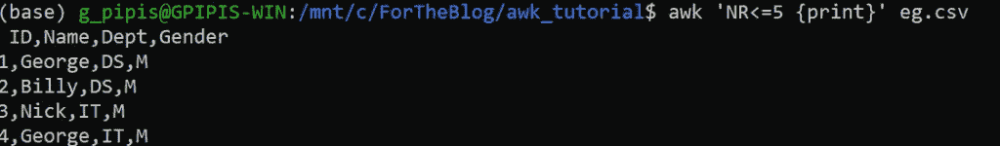

Let’s say what we want to return the 6th to 10th row, we can easily do it as follows:

```
awk 'NR<=10 && NR>=6 {print}' eg.csv
```

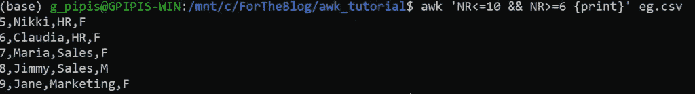

Finally, let’s say that we want to return the 6th to 10th row plus the header, which is the first row.

```
awk '(NR<=10 && NR>=6)||(NR==1) {print}' eg.csv
```


# How to Filter Rows

We can easily filter lines based on some conditions. In the next example, we will return all the rows that contain the string 【 .

```
awk '/Sales/ {print}' eg.csv
```

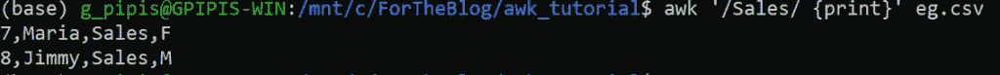

Similarly, we can return all the rows that contain the “ **HR"** 或 **"Sales"** 字符串。

```
awk '/HR|Sales/ {print}' eg.csv
```

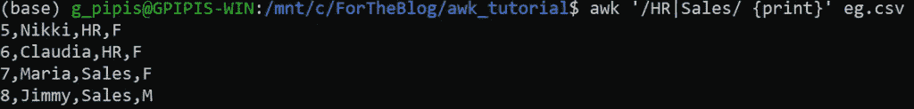

我们可以使用其他正则表达式。例如，我们正在寻找包含后跟某物的`Geo`字符串和后跟`IT`的行:

```
awk '/Geo.*IT/ {print}' eg.csv
```

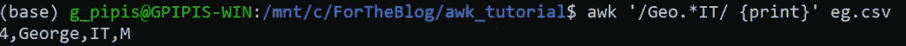

此外，我们可以返回不包含所需字符串的行。例如，我们希望返回不包含`HR` 或`Sales`的行。

```
awk '!/HR|Sales/ {print}' eg.csv
```

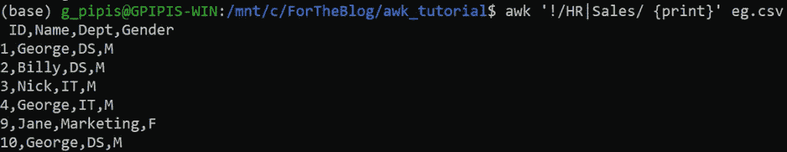

# 如何选择列

我们可以学习的第一件事是如何在 AWK 选择列。但是在我们开始之前，让我们看看如何打印文件。命令是:

```
awk '{print}' eg.csv
```

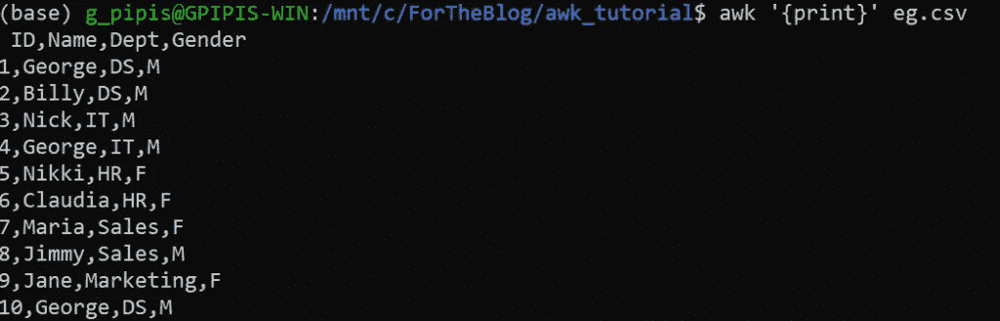

请注意，我们可以通过运行以下命令来打印所有行:

```
awk '{print $0}' eg.csv
```

如果我们想要返回特定的列，我们可以使用`$`符号和所需列的编号。请注意，默认分隔符是“空白”，但是我们可以使用“F”选项或“FS”变量来更改它。假设我们要返回第 2 列和第 4 列。

```
awk -F ',' '{print $2, $4}' eg.csv
```

或者

```
awk '{print $2, $4}' FS=',' eg.csv
```

或者

```
awk 'BEGIN{FS=","} {print $2, $4}' eg.csv
```


如您所见，我们成功地返回了所需的列。

提示:除非是正则表达式，否则分隔符不必用引号括起来。最后，如果分隔符是制表符，可以用`\t`指定。

# 如何根据列条件筛选行

我们已经看到了如何通过在一行中搜索一个字符串来过滤行，以及如何选择列。现在，我们可以看到如何根据特定列中的某些条件来筛选行。

例如，假设我们想要所有`department` 为`**DS**`的行。

```
awk -F"," '$3=="DS" {print $0}' eg.csv
```


请注意，部门是第三列。

假设我们想要返回 ID 大于 5 的所有行。

```
awk -F"," '$1>5{print $0}' eg.csv
```

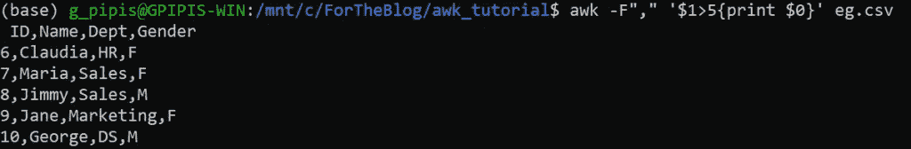

我们还可以获得特定列包含子字符串的行。在这种情况下，我们需要使用“~”符号加上斜线“/”作为正则表达式。例如，让我们获取第二列中包含子字符串`Ge` 的所有行。

```
awk -F"," '$2~/Ge/{print $0}' eg.csv
```

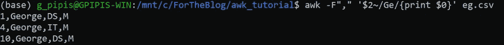

如果我们需要反转表达式，即列名不包含子串`Ge`的行，我们可以运行:

```
awk -F"," '$2!~/Ge/{print $0}' eg.csv
```

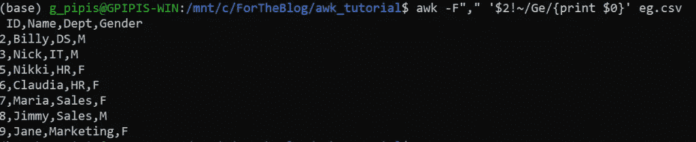

最后，如果我们想要精确的匹配，比如获取名称为`George`的所有行:

```
awk -F"," '$2=="George"{print $0}' eg.csv
```

对于反转表达式是:

```
awk -F"," '$2!="George"{print $0}' eg.csv
```

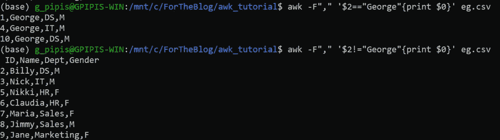

# 如何更改分隔符

至少有两种不同的方法来改变文件的文件分隔符。假设我想将 CSV 文件转换成 TSV 文件。

```
awk -F "," '{print $1 "\t" $2 "\t" $3 "\t" $4}' eg.csv
```

或者

```
awk 'BEGIN{FS=",";OFS="\t"} {print $1, $2, $3, $4}' eg.csv
```

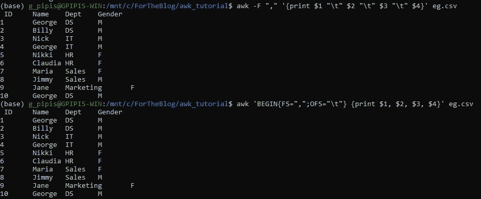

我们也可以保存 TSV 文件，如下所示:

```
awk 'BEGIN{FS=",";OFS="\t"} {print $1, $2, $3, $4}' eg.csv > eg.tsv
```

# 如何连接字段

我们可以很容易地将字段与打印语句连接起来。假设我们想在`Name` 和`Gender`之间添加`-->`。

```
awk -F "," '{print $2 "-->" $4}' eg.csv
```

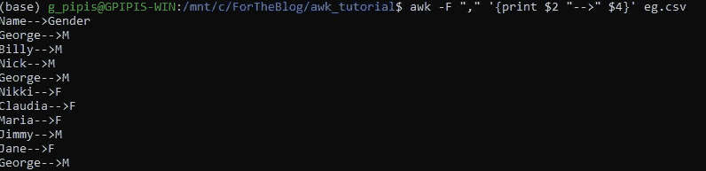

# 如何按记录打印字段数

正如我们前面提到的，我们可以指定字段分隔符。有了 AWK，我们可以按行得到字段的数量。例如:

```
awk -F "," '{print NF, $0}' eg.csv
```

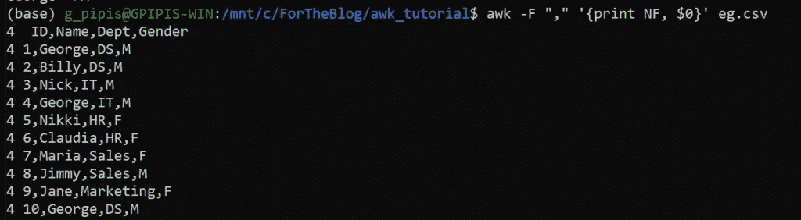

正如我们所看到的，由于我们有四个字段，我们得到了每条记录的 **4** 。

# 如何计算文件的行数

另一个非常常见的任务是获取文件的行数。在 Unix 中，我们可以如下得到它:

```
cat eg.csv | wc -l
```

使用 AWK，我们可以运行如下等效命令:

```
awk 'END {print NR}' eg.csv
```

毫不奇怪，在这两种情况下，我们都得到了`11`。

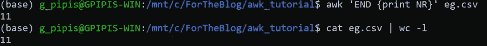

# 如何得到一列的和

假设我们想得到 ID 列的总和。我们可以很容易地做到如下:

```
awk -F "," '{mysum+= $1} END {print mysum}' eg.csv
```

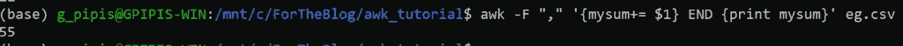

正如我们所见，我们得到了`55 (=1+2+3+4+5+6+7+8+9+10)`。在上面的命令中，我们定义了一个名为`mysum`的变量，其中我们为每一行添加第一列的相应记录( **$1** )。

# 如何连接多个 CSV 文件

假设我们有许多相同格式的 CSV 文件，我们想[将它们合并成一个文件](https://predictivehacks.com/?all-tips=how-to-concatenate-multiple-csv-files-in-linux)，但是我们只想保留第一个文件的头！我们可以对 AWK 这样做:

```
awk '(NR == 1) || (FNR > 1)' my_file_*.csv > merged.csv
```

FNR 指的是单个文件中已处理记录的数量，NR 指的是所有文件，所以我们保留第一行，即文件头，忽略每个文件的第一行。

最后，如果您想删除所有文件的标题:

```
awk 'FNR > 1' my_file_*.csv > merged.csv
```

# 结束语

我坚信，数据科学家和数据工程师应该具有相对较好的 UNIX 背景，以便主要用于文本处理和数据管道任务。对于数据清理任务来说，AWK 是一个非常强大的工具，也是一个很好的技能。

本教程的目标是向你介绍 AWK 世界。我们可以在 AWK 做很多其他的事情，如果你想了解更多，那么你唯一需要做的就是保持关注！

*原载于*[*https://predictivehacks.com*](https://predictivehacks.com/awk-tutorial-for-data-scientists-and-engineers/)*。*