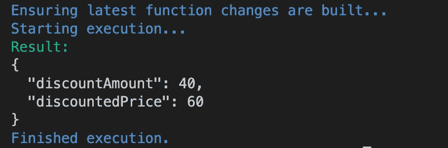

# AWS Amplify:模拟 Lambda 函数、S3 存储和 GraphQL API

> 原文：<https://betterprogramming.pub/aws-amplify-mocking-lambda-function-s3-storage-and-graphql-api-31e1f3cd0a0>

## 模仿服务并将它们部署到 Amplify 服务器上


亚历克斯·丘马克在 [Unsplash](https://unsplash.com?utm_source=medium&utm_medium=referral) 上的照片

我已经开始研究 AWS Amplify，并决定写下我的研究和实验将有助于我更好地理解和记住它，如果它也能帮助你，我会很高兴的！

AWS Amplify 是亚马逊网络服务(AWS)提供的一个完整的解决方案，特别是针对前端开发人员，提供工具来构建、交付和托管全栈应用程序，而无需深入了解开发运营、云工程和后端，也不会影响应用程序的安全性、可扩展性和质量。

在本文中，我们将创建一个简单的项目来尝试 mocking 服务。什么是嘲讽服务，你为什么要把它添加到你的 Amplify 项目中？

您编写所有代码，然后在 Amplify 命令的帮助下，通过终端将 Amplify 服务添加到您的项目中，或者您在 Amplify 控制台中创建这些服务。无论哪种方式，你都必须将你生成的代码进行放大，以构建数据库、lambda 函数、存储空间等。这需要时间和资源，而这些时间和资源本可以用得更有成效。Mocking 允许您在将所有内容发送到服务器之前，在本地应用程序中测试这些服务。

官方的[文档](https://docs.amplify.aws/cli/usage/mock/)非常清晰易懂，我强烈建议在开始应用之前，根据我或任何其他第三方写的内容通读一遍。

我们将创建一个迷你商店应用程序，不太关注前端，而是测试模仿本身。我有时会详细讲述这些步骤。如果你有信心，一定要进行下一步。[项目](https://github.com/RMoriarty4/storeapp)中使用的技术堆栈如下:

*   反应
*   以打字打的文件
*   AWS 放大器

如果你想看如何做下面提到的所有事情，看看 Nader Dabit 的这个[综合例子。看完文档，我用这个视频作为主要参考来创建项目，和视频里的差不多。主要的区别在于，这些年来一些命令已经发生了变化，所以本文是一个更新的版本。](https://www.youtube.com/watch?v=OxrHplxZ8BA&t=803s)

## 1.使用 TypeScript 模板安装 React 应用程序

```
npx create-react-app storeapp --template typescript
```

## 2.通过控制台初始化 Amplify 项目

```
amplify init
```

**注意**:如果命令不起作用，检查是否全局安装了 Amplify CLI。如果不是，安装[非常简单。](https://docs.amplify.aws/cli/start/install/)

该命令将提示一系列可能会让初学者感到困惑的问题，以避免以后出现任何错误。我将提供我在本文所有步骤中所做的选择。他们中的大多数都是有目的地为项目选择的，有些是为了简化问题。

*   项目名称:`storeapp` —该名称将被用作 Amplify 控制台中的项目名称
*   Amplify 将自动检测机器、代码编辑器、语言、框架和环境，并为您提供配置细节。如果您愿意，可以更改它们，但是我接受了默认设置，因为对于这个项目来说，更改它们没有任何意义
*   身份验证方法:AWS 配置文件
*   配置文件:默认

## 3.创建并模仿 Lambda 函数

现在，让我们创建一个 Lambda 函数，用于计算商店产品的折扣。在我们的项目中，我们提供与用户年龄成比例的折扣，因此我们的函数将接收用户的年龄和产品价格，并用折扣金额和折扣价格进行响应。

```
amplify add function
```

运行此命令将提示问题:

*   功能:Lambda 函数
*   函数名:`providediscount`
*   运行时:NodeJS
*   功能模板:Hello World
*   高级设置:否
*   立即编辑:是

这将在您的项目文件夹(`amplify/backend/function/src`)的 amplify 目录中打开一个新文件夹。自动创建一个`index.js`文件，其中包含模板代码。删除该代码并添加提供的代码:

```
/**
 * @type {import('@types/aws-lambda').APIGatewayProxyHandler}
 */
// eslint-disable-next-line no-undef
exports.handler = async (event) => {
  let price;
  let age;
  if (event.arguments) {
    price = event.arguments.price;
    age = event.arguments.age;
  } else {
    price = event.price;
    age = event.age;
  }

  const discountAmount = price * (age / 100);
  const discountedPrice = price - discountAmount;

  const response = {
    discountAmount,
    discountedPrice,
  };
  return response;
};
```

我们检查`event.arguments`的原因是为了能够通过 GraphQL API 模拟该函数，这将在接下来的步骤中创建。

因为我们的函数需要参数作为模拟数据输入，所以我们必须在某个地方提供该数据，以便 amplify 知道在哪里引用。为此，`events.json`文件在功能安装过程中自动创建在同一个文件夹中。我们需要年龄和价格作为模拟数据，所以我们向文件中添加一个 JSON 对象(在添加事件之前，确保文件为空):

```
{
  "age": 40,
  "price": 100
}
```

现在我们嘲笑:

```
amplify mock function providediscount
```

该命令将询问引用哪个文件，默认为我们已经更新的`events.json`文件。然后，将在终端中执行该功能并显示结果。因此，我们在终端中得到响应:



结果满足了我们的需求，现在我们的功能已经准备好进行放大、构建并交付生产。

## 4.创建和模拟存储

我们希望能够作为用户上传图像，然后尝试从存储中获取图像。这将证明存储服务按预期工作，并为生产做好准备。

默认情况下，Amplify 使用身份验证与 S3 存储服务进行交互。为了能够将这个服务添加到我们的项目中，我们首先必须添加 AWS Cognito 认证服务。

```
amplify add auth
```

运行此命令将提示问题:

*   配置:默认
*   登录方式:用户名
*   高级设置:否

为了能够使用它，我们必须推动身份认证服务进行扩展:

```
amplify push auth
```

现在我们可以添加存储服务:

```
amplify add storage
```

运行此命令将提示问题:

*   选择服务:内容
*   为资源提供一个名称作为标签:`userimages`
*   存储桶名称:默认
*   谁应该有访问权限:来宾和经过身份验证的用户
*   对于认证用户:创建、更新、读取、删除
*   对于客人:阅读
*   λ触发器:否

我们现在需要做的就是创建一个小页面来与两件事情进行交互:与用户进行交互，这样他们就可以登录并上传图像；与存储服务进行交互，将文件存储到某个位置，然后取回文件并显示给用户。

为了这两个目的，我们将安装两个 Amplify 包来更新我们的前端:

```
npm i @aws-amplify/ui-react aws-amplify
```

安装完成后，移动到`index.tsx`文件或任何包含 React 项目根元素的文件。我们需要配置 Amplify，这样我们使用的对象和方法将在整个项目中可用。
从`aws-exports.js`文件导入`awsConfig`，安装时方便放在同一个文件夹中。从`aws-amplify`导入放大，增加`awsConfig`放大对象的配置方式:

```
import awsConfig from './aws-exports';
import { Amplify } from 'aws-amplify';

Amplify.configure(awsConfig);
```

让我们转到我们的`app.tsx`文件，在那里实际的页面被编码。

```
import React from 'react';
import './App.css';

import { Button, Flex, Image, withAuthenticator } from '@aws-amplify/ui-react';
import { Storage } from 'aws-amplify';
import '@aws-amplify/ui-react/styles.css';

const App: React.FC = () => {
  const [image, updateImage] = React.useState<{
    key: string | null;
    signedUrl: string | null;
  }>({ key: null, signedUrl: null });

  async function getImage() {
    if (!image.key) return;
    const signedUrl = await Storage.get(image.key);
    updateImage({ ...image, signedUrl });
  }

  async function onChange(e: React.ChangeEvent<HTMLInputElement>) {
    const file = e.target.files?.[0];
    if (!file) return;
    const imageInfo = await Storage.put(file.name, file);
    updateImage({ ...image, key: imageInfo.key });
    console.log('image updated,', imageInfo);
  }

  return (
    <div className="App">
      <header className="App-header">
        <Flex direction={'column'} maxWidth="900px">
          <input type="file" accept="image/png" onChange={(e) => onChange(e)} />
          <Button variation="primary" size="large" onClick={getImage}>
            Get Image
          </Button>
          {image.signedUrl && (
            <Image src={image.signedUrl} alt={image.key as string} />
          )}
        </Flex>
      </header>
    </div>
  );
};

export default withAuthenticator(App);
```

我们必须检查这个文件中创建和使用的函数。首先，上传文件 S3 存储放大器提供了现成的方法对象。一旦用户上传文件，该事件将触发异步存储方法将文件“放”在存储器中。当用户点击查看图像时，从存储器中调用另一个异步的“get”方法。在这两个事件中，我们相应地更新状态，以便能够重新呈现 DOM。`key`和`signedUrl`是两个键值对，表示文件在存储器中的存储方式。

为什么我们要在导入的`withAuthenticator`函数中导出我们的`App`组件？

当你运行`npm start`时，你会看到在能够上传之前，你必须登录/注册。这个导入的函数为我们提供了一个函数中的整个 auth 组件和过程，一旦包装在其中，未经授权的用户就无法到达上传部分。请确保也导入这些样式。否则，整个事情看起来就像我们一直在做的一切都是徒劳的(我们也可以定制我们喜欢看到的 auth 组件，添加社交登录等。，不过那是后话了)。

测试存储的一切准备就绪！运行`amplify mock`在本地启动存储，并在单独的终端运行`npm start`。您可以注册并上传文件，然后单击“获取图像”按钮。如果图片出现在您的屏幕上，您的存储服务就已经准备好了。

## 5.创建和模仿 GraphQL API

```
amplify add api
```

运行此命令将提示问题:

*   服务:GraphQL
*   授权类型:Amazon Cognito 用户池(我们之前在 auth 安装过程中创建了这个用户池)
*   其他授权类型:是
*   附加授权类型:API 密钥(我们希望客人能够在没有授权的情况下看到产品)
*   描述:公共访问
*   到期:默认
*   模式模板:ToDo(这是最简单的一个)

一旦安装完成，我们将在 amplify 目录的后端文件夹中创建一个新的 API 文件夹。在该文件夹中，我们可以找到准备更新的`schema.graphql`文件。删除里面的所有代码，并添加以下内容:

```
type ProductType
  @model(subscriptions: null)
  @auth(
    rules: [
      { allow: groups, groups: ["Admin"], operations: [create, update, delete] }
      { allow: public, operations: [read] }
    ]
  ) {
  id: ID!
  name: String!
  products: [Product] @hasMany
}

type Product
  @model(subscriptions: null)
  @auth(
    rules: [
      { allow: groups, groups: ["Admin"], operations: [create, update, delete] }
      { allow: public, operations: [read] }
    ]
  ) {
  id: ID!
  name: String!
  price: Float!
}

type Query {
  provideDiscount(price: Float!, age: Float!): PriceInfo
    @function(name: "providediscount-${env}")
}

type PriceInfo {
  discountAmount: Float!
  discountedPrice: Float!
}
```

这个模式告诉我们什么？第一种类型的`ProductType` 将让管理员创建一个产品类别，他们希望在其中出售的商品。用户将能够从数据库中读取。如果您查看该类型和产品类型中的授权规则，您会发现只有标签为“Admin”的组可以控制数据。公众只能阅读这些数据。

`DiscountQuery`类型将让我们触发我们通过 GraphQL 创建的 Lambda 函数，用类型`PriceInfo`进行响应。

模式已经准备好了，现在我们可以通过使用 Amplify 提供的`codegen`来创建现成的查询、类型和订阅，从而节省更多的时间。运行`amplify add codegen`并回答提示的问题:

*   语言:打字稿
*   文件名模式:默认
*   生成代码？:是的
*   深度:默认
*   生成代码的文件:默认
*   立即生成？:是的

Amplify 将生成可供客户端(前端)使用的所有必要代码，并将其放在我们项目的 src 目录中。基于我们的模式和模式中的关系，所有读取、写入和更新数据的代码都将成为我们在 React 组件中使用的现成函数，无论我们在哪里需要它们。现在，我们不会真正使用它们，但我们会嘲笑它们。代码生成后，运行`amplify mock`并等待终端提供 AppSync 模拟端点。

单击模拟端点，GraphQL explorer 将在一个新的选项卡中打开，侧栏中显示所有可用的请求查询。我们可以继续从请求中检查我们的项目需要的一切。创建产品类型，检查对未授权用户的响应，通过请求模仿功能，等等。

我们已经成功地模拟了我们的服务，并准备好部署代码。运行`amplify push`来部署代码以放大服务器，然后将所有更改推送到您的 GitHub 帐户，因为在下一步，您将想要将您的 GitHub 文件夹连接到 Amplify 以配置 CI/CD 等等。

如果你想检查代码或者对它有什么意见，请随时查看 [GitHub 源代码](https://github.com/RMoriarty4/storeapp)。