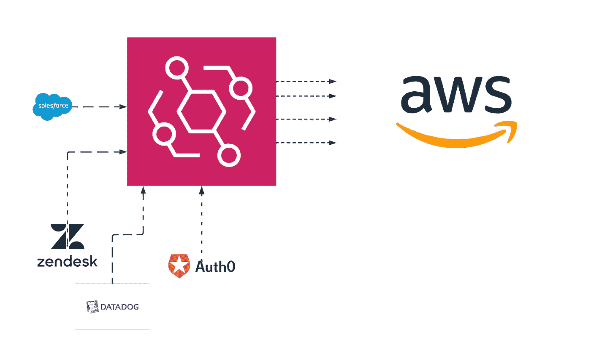

# AWS 和 Salesforce —使用 Eventbridge！

> 原文：<https://betterprogramming.pub/aws-and-salesforce-using-eventbridge-1e4aabd75500>

## 从 Salesforce 获取事件，就是这样！

AWS Eventbridge 如何工作！

如今，事件源、无服务器产品和微服务是大多数开发人员至少听说过的时髦词汇。有时候流行语只是针对销售人员的，试图让对方相信他们是在跟随当前的技术趋势。

其他时候，这些流行语背后有实际的技术创新。在本文中，我将举例说明我们如何使用这些新服务之一来实现以前非常困难和繁琐的事情。

## 一个 WS 事件桥和事件源来拯救

我不会详细讨论什么是事件采购以及它对你有什么帮助。我要说的是，它可以帮助你跟踪你的系统是如何达到某一状态的。这一切都是为了捕捉其他系统也可以监听的事件中的状态变化。

记住这一点，我们可以继续想象我们目前有一些由 AWS 托管的后端基础设施。在 AWS 环境中，我们有许多现成的事件可以使用。AWS 中已经提供了一些有用的事件

*   例如，我们可以安排 lambda 每小时执行一次(这是通过每小时向 lambda 发送一个事件来完成的)。
*   我们可以让 DynamoDB 在每次项目发生变化(删除、插入或更改)时向 lambda 函数发送一个事件
*   我们可以让 Cloudfront 从下载特定 S3 对象的用户那里收集事件。

这些只是你已经可以得到的一些例子。通过这几个事件，我们已经可以创建一些非常高级的工作流了。但是有一个但是。这些东西可以顺畅地一起工作，但这只是因为我们是在 AWS 环境中工作，所以这些服务被设计为本机连接。

很难想象如果 Azure 帐户中发生了什么事情，或者有人更新了我们 Dropbox 帐户中的文件，或者销售人员更改了我们 Salesforce 帐户中的内容，我们将如何轻松地捕捉事件。

> 进入 Eventbridge！

## 情况

具体用例如下。我们有一些 AWS 基础架构(AWS Lambda ),我们有一个 Salesforce 帐户。出于历史原因，Salesforce 将包含一些我们认为是唯一真实来源的数据。这一切都很好，直到我们想从 Salesforce 中提取一些数据并保存在 AWS 中。一个天真的思维过程可能是这样的。

> -让我们创建一个使用 Salesforce API 并将数据存储在 AWS 中的 ETL 作业。
> 
> -这管用！哦，等等，数据不是这样保持同步的。
> 
> -然后让我们按计划运行我们的 ETL 作业！
> 
> -好了，现在至少每小时同步一次！
> 
> -感觉不太对+组织中的人可能会抱怨部分同步。
> 
> -如果我们可以在每次 Salesforce 中的某些内容发生变化时获得一个事件，然后更新我们的 AWS 数据库，会怎么样
> 
> -哇，这感觉太棒了+我们可以一直同步！！！

## AWS 事件桥

在与自己进行了上述对话后，您现在决定使用 AWS Eventbridge 来实现这一点。该服务只是一个事件总线，它统一了第三方系统向 AWS 环境交付事件的方式。
这意味着您拥有的任何集成或第三方系统(Salesforce)只需将事件发送到 Eventbridge，然后我们就可以将它们重定向到我们的 AWS 环境中进行处理。

例如，我们可以设置 Salesforce 在对象发生变化时向 Eventbridge 发送一个事件。
在 AWS Lambda 中，您会得到一个这样构造的事件:

现在，只要我们感兴趣的数据发生变化，我们就可以做出反应。现在，我们可以创建不仅仅是保持两个数据源同步的流。
我们可以想象将 Salesforce 中的数据部分保存在另一个数据库中，同时发送一些数据已被更改的通知。

Salesforce 只是一个例子，AWS Eventbridge 允许您连接到以前很难集成的数据源。现在，这些系统中生成的事件可以原生集成到您的 AWS 帐户中，并按照您认为合适的方式进行处理。

# 结论

AWS Eventbridge 服务作为发布者和订阅者之间的一个额外的层是非常强大的。这样你可以保持系统的解耦，这通常是可取的。这项服务很便宜，并且使用与许多其他 AWS 服务相同的模式(你为你所使用的付费)，在这里是按事件付费。
您还可以使用该服务来实现一些额外的调试功能，比如回放旧事件，否则这可能会很棘手。