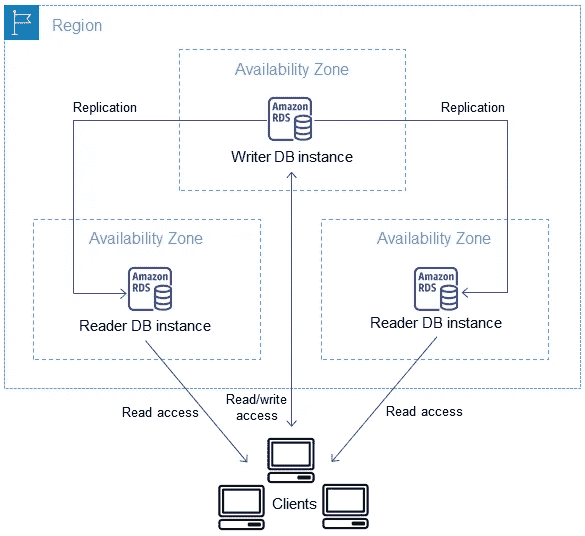
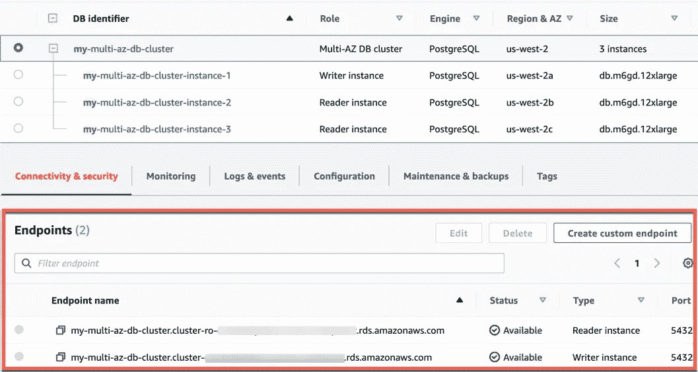
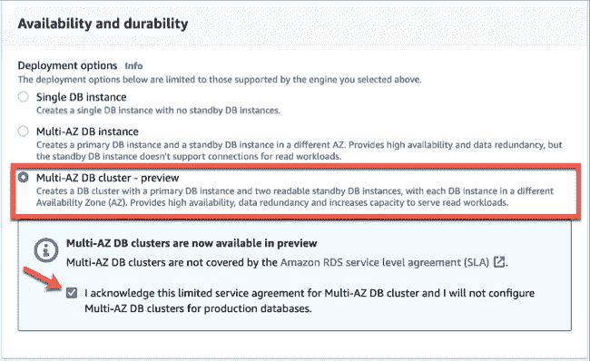

# AWS 2022 年的新功能 RDS 中的可读备用实例介绍

> 原文：<https://betterprogramming.pub/aws-big-announcement-just-before-2022-introduction-of-rds-readable-standby-instances-in-multi-az-7657ed96e48c>

## 就在 2021 年圣诞节的节日气氛之前，AWS 宣布了亚马逊 RDS 多 AZ 部署中的可读备用实例


由[新美乐股份公司·塞尔吉](https://unsplash.com/@i_am_simoesse?utm_source=medium&utm_medium=referral)在 [Unsplash](https://unsplash.com?utm_source=medium&utm_medium=referral) 拍摄的照片

Amazon RDS 现在在 preview 中提供了带有可读备用实例的多 AZ 部署(也称为 [*多 AZ DB 集群部署*](https://docs.aws.amazon.com/AmazonRDS/latest/UserGuide/multi-az-db-clusters-concepts.html) )。要了解什么是亚马逊 RDS，请查看[该文档](https://aws.amazon.com/rds/)或 AWS 的 YouTube 视频:

演职员表:[https://aws.amazon.com/rds/](https://aws.amazon.com/rds/)

# **好的，问题陈述是什么？**

Amazon RDS 使得在云中设置、操作和扩展关系数据库变得很容易。

它提供经济高效且可调整大小的容量，同时自动执行耗时的管理任务，如硬件配置、数据库设置、修补和备份。

这使您能够专注于您的应用程序，从而为它们提供所需的快速性能、高可用性、安全性和兼容性。关系数据库是许多类型应用程序的核心。

为了让您构建在生产环境中高度可用的应用程序，Amazon RDS 从 2010 年开始提供多 AZ 支持

[Amazon RDS 多 AZ 部署](https://aws.amazon.com/rds/features/multi-az/)非常适合生产数据库工作负载。当您进行多 AZ 部署时， [Amazon 关系数据库服务](https://aws.amazon.com/rds/) (Amazon RDS)提供一个主数据库实例和一个备用数据库实例，并对 [Amazon 弹性块存储](http://aws.amazon.com/ebs) (Amazon EBS)存储进行同步物理复制，以实现高可用性和无数据丢失的故障转移。

> 但是，您不能从备用数据库实例中读取数据。如果应用程序需要更多的读取容量，您应该创建或添加额外的[读取副本](https://aws.amazon.com/rds/features/read-replicas/)。

# **Hmmm，还有来自 AWS 的解决方案？**

这种新方法解决了传统 RDS multi-AZ 部署的一个限制，即同步复制的备用实例不能接受连接。

AWS 的数据库解决方案架构师 Vijay Karumajji 解释了可读备用实例的工作原理:

> *一个多 AZ 数据库集群由三个不同可用性区域中的一个主数据库和两个可读备用数据库组成。主(编写器)数据库实例提供读写操作，并执行所有数据修改。备用(reader)数据库实例充当主数据库的故障转移目标，并为读取流量提供服务。因此，应用程序可以将读取流量从主数据库实例转移到读取数据库实例，以提高应用程序读取吞吐量*



[*来源*](https://aws.amazon.com/blogs/database/readable-standby-instances-in-amazon-rds-multi-az-deployments-a-new-high-availability-option/)

与 [Amazon Aurora](https://aws.amazon.com/rds/aurora/) 类似，应用程序不需要处理主机名、负载平衡或重新路由连接，multi-AZ 数据库集群依靠端点机制来抽象连接:每个集群都有一个集群(读/写)端点、一个读取器端点以及与集群中每个 DB 实例相关联的实例端点。

由于群集在不同的可用性分区中有一个编写器实例和两个读取器实例，因此 VPC 必须在三个不同的分区中至少有一个子网。



[来源](https://aws.amazon.com/blogs/database/readable-standby-instances-in-amazon-rds-multi-az-deployments-a-new-high-availability-option/)

# **如何设置？**

通过控制台创建多 AZ 数据库集群时有两种主要配置:

*   确保选择合适的数据库引擎版本。只能使用 MySQL 版本 8.0.26 和 PostgreSQL 版本 13.4 创建多 AZ DB 集群。
*   在“可用性和持久性”部分选择“Multi-AZ DB cluster ”,并确认此预览版的有限服务协议。有关更多信息，请访问[创建多 AZ 数据库集群。](https://docs.aws.amazon.com/AmazonRDS/latest/UserGuide/multi-az-db-clusters-concepts.html#create-multi-az-db-cluster)



要使用 AWS CLI 创建多 AZ DB 集群，调用 [create-db-cluster](https://docs.aws.amazon.com/cli/latest/reference/rds/create-db-cluster.html) 命令。指定`--db-cluster-identifier` *。*对于`--engine`选项，指定`mysql`或`postgres`。

`create-db-cluster`命令为您的数据库集群创建一个写数据库实例和两个读数据库实例。每个数据库实例位于不同的可用性区域。例如，以下命令创建一个名为 aps `-multi-az-db-cluster`的 PostgreSQL 13.4 多 AZ 数据库集群:

```
aws rds create-db-cluster \
   --db-cluster-identifier aps-multi-az-db-cluster \
   --engine postgres \
   --engine-version 13.4  \
   --master-user-password password \
   --master-username postgres \
   --port 5432 \
   --backup-retention-period 1  \
   --db-subnet-group-name default \
   --allocated-storage 1000 \
   --storage-type io1 \
   --iops 10000 \
   --db-cluster-instance-class db.r6gd.xlarge
```

# **最后的话**

Multi-AZ DB 集群选项提供需要更多读取容量的工作负载，同时提供高可用性和耐用性。