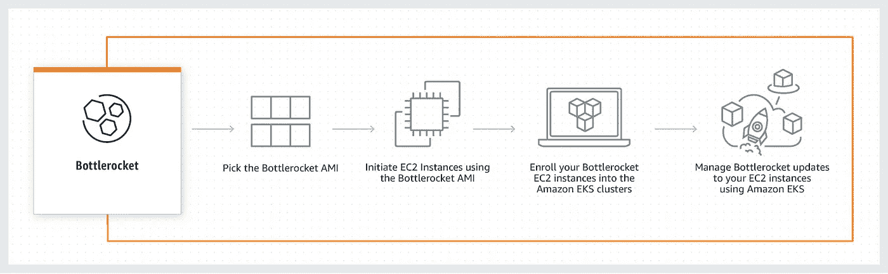

# 如何使用 EKS 的 AWS Bottlerocket 并从中受益

> 原文：<https://betterprogramming.pub/aws-bottlerocket-in-eks-16d44a0f7dfc>

## 优化您的 EKS 节点以运行容器


照片由[你好我是尼克](https://unsplash.com/@helloimnik?utm_source=ghost&utm_medium=referral&utm_campaign=api-credit) / [Unsplash](https://unsplash.com/?utm_source=ghost&utm_medium=referral&utm_campaign=api-credit)

自发布以来，AWS Bottlerocket 越来越受欢迎。拥有运行容器的最有效的操作系统是很容易实现的。Bottlerocket 专注于安全性和与 AWS 管理的服务的集成，使用的容器有亚马逊 [EKS](https://aws.amazon.com/fr/eks/) ( *弹性 Kubernetes 服务*)和 [ECS](https://aws.amazon.com/ecs/#:~:text=Amazon%20ECS%20is%20a%20fully,manage%2C%20and%20scale%20containerized%20applications.&text=to%20Amazon%20ECS-,Amazon%20ECS%20is%20a%20fully%20managed%20container%20orchestration%20service%20that,manage%2C%20and%20scale%20containerized%20applications.) ( *弹性容器服务*)。

在本文中，我们将了解什么是 Bottlerocket 及其组件，以及使用它有什么好处。然后，我们将使用 [eksctl](https://eksctl.io/) 创建一个亚马逊 EKS 集群，并探索它。

# 什么是 AWS Bottlerocket？

AWS Bottlerocket 是一个基于 Linux 的开源操作系统，针对在 Amazon Web Services 上运行容器进行了优化。它的灵感来自传统的通用 Linux 发行版以及一些以容器为中心的操作系统，如 [CoreOS Container Linux](https://getfedora.org/coreos?stream=stable) 、 [RancherOS](https://rancher.com/docs/os/v1.x/en/) 和 [Project Atomic](https://projectatomic.io/) 。

它只包括运行容器的基本软件，并带有事务更新机制。此功能允许用户减少维护需求，提高安全性并提高资源利用率。Bottlerocket 的根文件系统是只读的，由 [dm-verity](https://www.kernel.org/doc/html/latest/admin-guide/device-mapper/verity.html) 支持。它配置了安全增强的 Linux (SELinux)隔离策略。

Kubernetes 操作员负责集群中主机的更新。当一个新的 Kubernetes 节点在集群中启动时，Bottlerocket update 操作符启动一个 [DaemonSet](https://kubernetes.io/docs/concepts/workloads/controllers/daemonset/) 作为这个节点的代理。Bottlerocket 节点负责清空节点，管理定期查询更新，并在需要时执行它们。

# AWS Bottlerocket 的主要组成部分是什么？

*   Bottlerocket 通过与容器编排器(如亚马逊 EKS 服务)集成来管理和编排更新。
*   允许应用和回滚系统更新的单步原子更新机制。
*   容器化所需的最少组件，包括 Linux 内核和系统软件。
*   用于高级故障排除和调试的管理容器。

# AWS Bottlerocket 有什么好处？

*   Bottlerocket 提高了正常运行时间，降低了运营成本。可以同时应用数千个操作系统更新，对应用程序的中断最小。如果需要排除出错的风险，回滚会自动完成。
*   Bottlerocket 提高了安全性，确保了更好的资源利用率。所有文件都是只读的，不能被用户空间进程直接修改。使用加密摘要检查交换容器的完整性。任何异常或损坏都可能重新开始整个过程。
*   一旦有更新，就可以很容易地实现自动化。Bottlerocket 使用基于图像的更新。AWS 声称更新过程就像更新你的手机一样简单。



https://aws.amazon.com/fr/bottlerocket/的“它是如何工作的”

*   Bottlerocket 是开源的，可以普遍获得，因此任何感兴趣的人都可以对它进行代码、设计和数据集更改。由于亚马逊 EKR、亚马逊 EKS、亚马逊 EC2 等 AWS 的出色支持，用户还可以获得所需的一切。

[](https://github.com/bottlerocket-os/bottlerocket) [## GitHub-bottle rocket-OS/bottle rocket:为托管容器而设计的操作系统

### 欢迎来到 Bottlerocket！Bottlerocket 是一个基于 Linux 的免费开源操作系统，旨在托管…

github.com](https://github.com/bottlerocket-os/bottlerocket) 

# 探索亚马逊 EKS 上的 AWS Bottlerocket

## 创建 EKS 集群

安装`[eksctl](https://github.com/weaveworks/eksctl)`:

以下是创建 EKS 集群的 YAML 文件:

```
---
apiVersion: eksctl.io/v1alpha5
kind: ClusterConfig

metadata:
  name: bottlerocket-cluster
  region: us-east-1
```

应用文件创建集群:

```
$ eksctl create cluster -f cluster.yml
```

## 创建 Bottlerocket EKS 节点组

创建 SSH 密钥对以连接到 Bottlerocket 主机:

```
$ aws ec2 create-key-pair \
    --key-name my-key-pair \
    --key-type rsa \
    --query "KeyMaterial" \
    --output text > eks_bottlerocket.pem
```

以下是用于创建 Bottlerocket 节点组的 YAML 文件:

```
---
apiVersion: eksctl.io/v1alpha5
kind: ClusterConfig

metadata:
  name: bottlerocket-cluster
  region: us-east-1
  version: 1.20

managedNodeGroups:
  - name: bottlerocket-nodegroup
    instanceType: t3.medium
    minSize: 2
    maxSize: 4
    desiredCapacity: 2
    amiFamily: Bottlerocket
    tags:
      nodegroup-type: Bottlerocket
```

应用文件创建节点组:

```
$ eksctl create nodegroup --cluster bottlerocket-cluster -f node-group.yml
```

## 连接到 EKS 集群

使用 AWS CLI，生成 kubeconfig 以连接到集群:

```
$ aws --region us-east-1 eks update-kubeconfig --name bottlerocket-cluster
```

通过使用`kubectl`命令列出节点，您可以获得关于节点的操作系统映像的信息:

```
$ kubectl get nodes -o=custom-columns=NODE:.metadata.name,ARCH:.status.nodeInfo.architecture,OS-Image:.status.nodeInfo.osImage,OS:.status.nodeInfo.operatingSystem
NODE                             ARCH    OS-Image                               OS
ip-192-168-18-242.ec2.internal   amd64   Bottlerocket OS 1.5.2 (aws-k8s-1.21)   linux
ip-192-168-53-240.ec2.internal   amd64   Bottlerocket OS 1.5.2 (aws-k8s-1.21)   linux
```

## 连接到 SSM 的 EKS 节点

使用以下 AWS 命令列出实例 ID:

```
$ aws ec2 describe-instances --query 'Reservations[*].Instances[*].[InstanceId]' --output text
```

使用 SSM，您可以启动一个会话来连接到 Bottlerocket 实例:

```
$ aws ssm start-session --target i-0551208f375cbbec1
```

您可以通过 API 请求查看当前设置:

```
$ apiclient get settings
```

您可以像这样更改设置:

```
$ apiclient set motd="hi there" kubernetes.node-labels.environment=test
```

## 使用 SSH 连接到 Bottlerocket EKS 节点

重用保存的用于创建 SSH 密钥对的私有 PEM 密钥。您将连接到**管理容器:**

```
$ ssh -i ~/.ssh/eks_bottlerocket.pem ec2-user@BottlerocketElasticIP
```

您可以运行`sheltie`命令在 Bottlerocket 主机中获得一个完整的根 shell。要小心；而作为 root 用户，您可以检查和更改更多内容。

```
$ sudo sheltie
```

您可以通过[管理容器](https://github.com/bottlerocket-os/bottlerocket#admin-container)使用`logdog`从您的 Bottlerocket 主机获得日志文件的归档:

```
# logdog
```

## 测试升级

```
$ eksctl upgrade nodegroup --name=bottlerocket-nodegroup --cluster=bottlerocket-cluster --kubernetes-version=1.21
```

## 打扫

执行以下命令来清理节点组和集群:

```
$ eksctl delete nodegroup --cluster bottlerocket-cluster --name bottlerocket-nodegroup
$ eksctl delete cluster --name=bottlerocket-cluster
```

# 结论

Bottlerocket 是亚马逊在大规模运营容器方面的经验和知识的结晶。它有助于高效运行集装箱，提高安全性并确保卓越运营。

我们已经看到了一个用`eksctl`在 EKS orchestrator 上探索 Bottlerocket 的快速教程。您也可以通过以下示例将它与 Terraform 一起使用:

[](https://github.com/terraform-aws-modules/terraform-aws-eks/tree/v17.0.3/examples/bottlerocket) [## terra form-AWS-eks/examples/bottle rocket at v 17 . 0 . 3 terra form-AWS-modules/terra form-AWS-eks

### 这是一个简单的例子，展示了如何使用这个模块的功能来部署基于 AWS 的节点…

github.com](https://github.com/terraform-aws-modules/terraform-aws-eks/tree/v17.0.3/examples/bottlerocket)