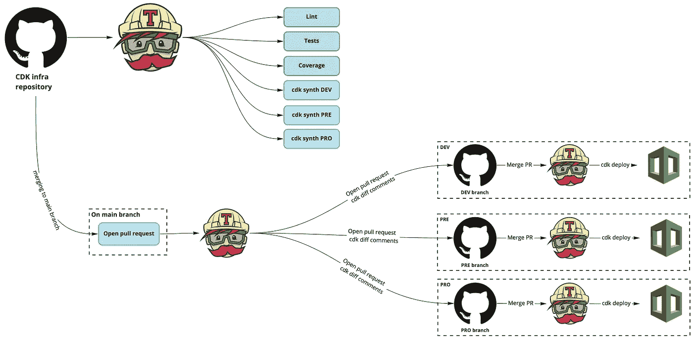
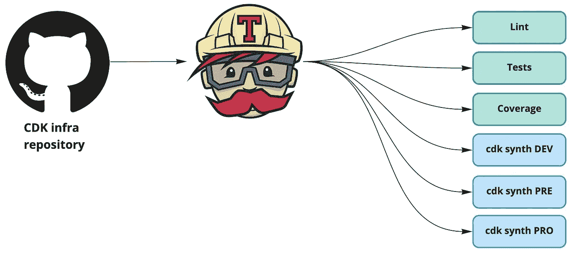
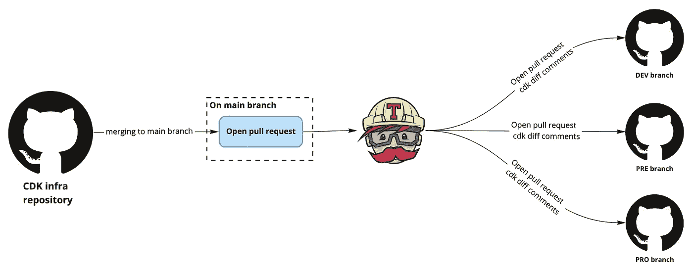
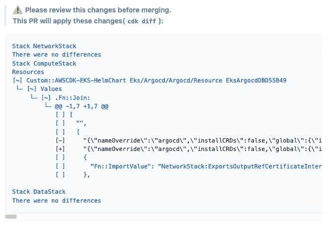
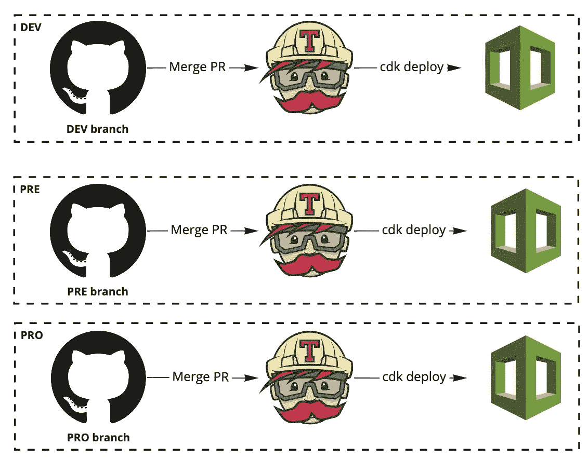

# 使用 Travis CI 的 AWS CDK 持续集成和交付

> 原文：<https://betterprogramming.pub/aws-cdk-continuous-integration-and-delivery-using-travis-ci-ee5dd7549434>

## 像运送代码一样运送基础设施

照片由[EJ·斯特拉特](https://unsplash.com/@xoforoct?utm_source=medium&utm_medium=referral)在 [Unsplash](https://unsplash.com?utm_source=medium&utm_medium=referral) 上拍摄

[AWS Cloud Development Kit](https://aws.amazon.com/cdk/) ，更广为人知的名字是 CDK，正在通过使用适当的编程语言来构建您的基础设施，改变我们将基础设施作为代码的方式。

因为我们正在用开发工具构建 infra，所以我们应该为我们的 CDK 堆栈代码准备一个 CI/CD，就像其他项目一样。如果你在网上看，AWS 解释了如何使用[代码构建/代码管道](https://docs.aws.amazon.com/cdk/latest/guide/cdk_pipeline.html)进行 CI/CD，但是这些可能不是你日常使用的工具。

在本文中，我将向您展示我用来部署基于 GitHub 和 [TravisCI](https://travis-ci.org/) 的 CDK 堆栈的部署管道。

全球部署 CI/CD 渠道

# 连续累计

持续集成看起来像任何代码项目配置项。我们验证代码，运行测试，并尝试查看构建是否失败。

这将在每次提交时运行，以确保我们有尽可能最短的反馈循环。

CI 流程

因此，在 Travis 配置中，它将看起来像下面这样(这里，我们有一个 CDK Python 堆栈):

这首词很经典。我们 lint 代码，测试它，并导出覆盖率。我们在每次提交时为每个`stage`运行`cdk synth`,以确保配置不会中断某个特定的阶段。

如您所见，我们还使用多个 Travis CI `stages`来并行运行一切，以便尽可能缩短反馈周期。

# 打开拉请求以验证您的部署

我发现将代码部署到 AWS 的最佳策略是每个阶段有一个分支(`dev`、`pre`、`pro`)，因此每次新的提交到达这些分支之一时，我们都在部署实际的堆栈。是的，它看起来像 GitOps！

但是我们不想盲目地在 AWS 帐户上部署我们的 CDK 堆栈。因此，当有东西被合并到`main`分支时，我有一个自动打开拉请求的方法:

打开拉式请求的流程

每次有东西被合并到主分支时，我们都有一个特定的作业运行`cdk diff -c stage=<STAGE>`并向目标分支发出一个拉请求。

为此，我们使用下面的脚本。如您所见，它运行`cdk diff`并使用 GitHub CLI 打开一个 pull 请求:

现在我们必须在 Travis 内部调用这个脚本，因此我们的`.travis.yaml`文件将如下所示:

如你所见，除了 GitHub 令牌之外，我们现在使用一些`env`变量来指定我们的 AWS 凭证。请确保[加密](https://docs.travis-ci.com/user/encryption-keys/)后再提交给你的回购。

GitHub 拉取请求中的 cdk 差异

# 持续部署

既然您已经为所有阶段打开了 pull 请求，那么是时候将更改部署到您的堆栈中了！

在您的公关评论中，您可以看到`diff`、**、**，这样当需要部署特定的`stage`时，您将不再盲目。

CD 过程

CD 的下一步是部署堆栈。每当我们在一个发布分支中有一个变更时，我们想要运行`cdk deploy -c stage=<STAGE>`。

完整的`.travis.yaml`文件将如下所示。如您所见，每个`stage`都使用一个部署条件，以确保仅将其应用于特定的`AWS stage`:

# 结论

使用这种 GitOps 方法，很容易理解您在堆栈中部署了什么，并且您的所有更改都在 Git 中。

它还有助于对`CDK`了解较少的工程师对基础设施的部署充满信心，因为部署到“真实的”`AWS stage`不需要手动步骤。主要的优点是，您使用的工具与您在其他项目中使用的工具相同。