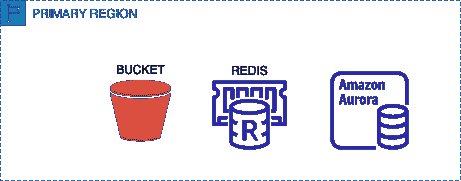
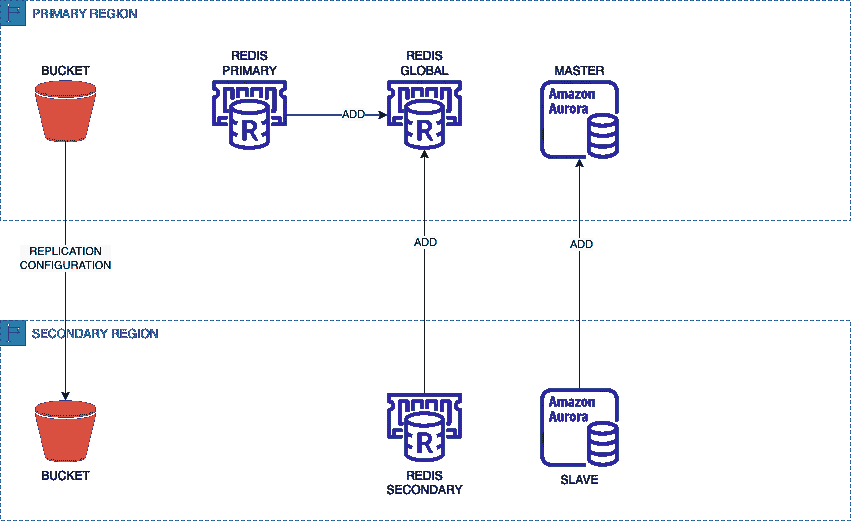
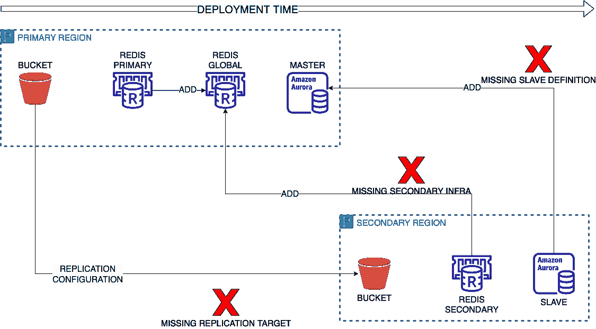
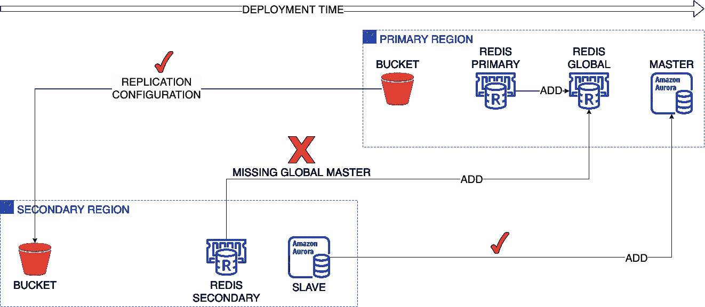
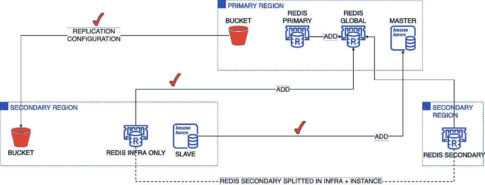

# 探索 AWS CDK 管道和灾难恢复设置

> 原文：<https://betterprogramming.pub/aws-cdk-pipeline-and-dr-setup-d85920ee635c>

## 想了解有关 CDK 跨区域部署的更多信息吗？请便！


《云中雷雨》，来自[杰夫·沙利文](https://www.flickr.com/photos/jeffreysullivan/)在 [Flickr](https://www.flickr.com/photos/jeffreysullivan/11466953306) 上。

# 介绍

AWS CDK 是将 AWS 基础设施作为代码进行管理的一个很好的工具，尤其是在复杂的环境中，构建在多个堆栈上。

这种部署的复杂性可以通过 CDK 管道轻松管理，在 AWS 服务(如 CodePipeline 和 CodeBuild)之上实现。

然而，当涉及到跨多个地区、可能跨多个账户的弹性基础设施时，使用 CDK(以及云形成，就此而言)会面临一些挑战，这些挑战可能不是那么容易克服的。

# 方案

为了展示使用 CDK 实现这种弹性基础设施的可能方式，我将介绍一个我最近参与的真实用例场景。

让我们考虑部署的主要单元包括:

*   一个 S3 桶
*   Redis 集群的弹性缓存
*   极光 RDS 星团



场景资源

这些资源作为 CDK 堆栈的一部分一起部署。

# 环境

让我们还考虑一下，部署由跨越两个区域的几个客户(即开发、测试和生产)的 CDK 管道管理，这两个区域旨在作为主区域和灾难恢复区域。

因为每一对客户和区域都被称为 CDK 的环境，所以我们的场景总共包括:

```
3 (accounts) x 2 (regions) = 6 (environments)
```

# 预期目标状态

考虑到我们打算跨区域部署的主要资源，整体部署的目标状态应该是:



目标部署状态

上面考虑的资源类型(S3 存储桶、Redis 集群的 Elasticache 和 Aurora RDS 实例)在跨区域设置中部署时，会在主服务器和从服务器之间引入一组依赖关系，不一定总是按照这个顺序。

例如，S3 跨区域复制配置要求在创建配置本身之前存在复制副本存储桶，通常作为主存储桶创建的一部分。

相反，在为 Redis 创建 elastic cache 全局集群之前，必须为 Redis 创建一个辅助 elastic cache 集群基础设施。

同样，Aurora RDS 从配置只能添加到现有的 Aurora RDS 主集群中。

# 可能的排序

考虑到上面介绍的依赖性，最初有三种可能的部署顺序:

*   并行部署
*   主要优先
*   次要优先

让我们看一下每个单独的序列，以了解哪一个可以成功实现。

# 并行部署

这种部署方式可以表示如下:


并行部署

在并行部署中，两个区域中的资源可以以任何速度部署，从而导致不可预测的结果，因为一些排序可能碰巧是正确的，而其他排序可能是错误的。

例如，可能会出现这样的情况:辅助存储桶实际上是在主存储桶之前创建的，而辅助 Redis 紧随其后，而主 Redis 全局集群尚未创建。

更糟糕的是，不同的运行会导致不同的结果，增加了解决方案的不可预测性。

总而言之，尽管并行部署看起来是执行跨区域部署的最直接、最自然的方式，但是它的不可预测性使它完全不适合。

# 主要优先

由于并行运行通常会失败，因为当辅助区域中的资源引用主区域中的资源时，主区域中的资源不可用，所以可能会尝试首先在主区域中部署资源。

这将导致如下所示的部署序列:



尽管这种部署顺序背后有逻辑推理，但它失败有多种原因:

1.  主复制存储桶创建失败，因为它引用了辅助区域中尚不存在的存储桶
2.  主 Redis 集群被创建。但是，全局集群定义依赖于必须已经存在的辅助区域配置。
3.  从属 Aurora 基础结构必须添加到主要主节点的 CDK 对象中。在创建主节点时，还不存在辅助节点，因此无法添加辅助节点。

上面的一些限制是由于 CDK 码看起来像明码，但是间接涉及跨越多个区域的资源的事实。

另外，请记住，在不同的环境中，不允许跨栈传递对象引用。

例如，让我们考虑创建极光跨区域集群的片段(感谢 CDK 极光全球数据库插件[这里](https://github.com/neilkuan/cdk-aurora-globaldatabase)，来自 Neil Kuan)。

原则上，您应该在辅助区域上创建从属基础结构:

然后将其链接到主全局数据库:

变量`subnetname`在次要区域中创建，在主要区域中使用，因此它不能在您的 CDK 代码中通过引用传递，因为每个堆栈都是一个独立的部署，变量不能跨区域。

# SSM 参数

为了克服这一限制，您可以在跨区域设置中使用 SSM 参数，我在另一篇文章中详细介绍了这种方法:

[](https://cmorgia.medium.com/cdk-and-the-sharing-of-cross-region-data-955925685e57) [## CDK 与跨区域数据共享

### 如何使用 CDK 跨地区共享数据

cmorgia.medium.com](https://cmorgia.medium.com/cdk-and-the-sharing-of-cross-region-data-955925685e57) 

看一下前面的例子，您可以将子网名称存储到 SSM 参数中

并在主区域中创建全局主节点时读取该值:

# 次要优先

正如我们在主服务器优先部署的案例中所看到的，大多数资源都需要预先定义辅助区域中的对应资源，因此让我们来评估在主服务器之前部署辅助服务器的场景:



在这个部署场景中，除了 Redis 部署之外，一切都正常，Redis 部署首先需要全局主服务器。

# 无解？

对于这种部署顺序，似乎没有适用的解决方案。

但是，通过查看 Redis 集群创建代码，可以清楚地看到，辅助集群的创建可以分为两个部分:

*   创建辅助支持基础架构，主集群需要它来定义全局基础架构
*   创建第二个集群作为现有全局集群的一部分

# 解决方案

诀窍是将此阶段分成两个子阶段，一个在主阶段之前运行，另一个在主阶段之后运行:



使用这种方法，所有的内部依赖关系都得到满足，跨区域部署也可以进行。

从代码的角度来看，在主服务器之前部署 Redis 的初始阶段如下所示:

而在主服务器创建 Redis 全局集群之后，辅助服务器阶段看起来会像这样:

这里的关键属性是`globalReplicationGroupId`，用于引用在主区域中创建的 Redis 全局集群，类似于它的次区域。

# 经验教训

在这场漫长的讨论中，需要记住的要点是:

*   跨区域部署可能需要拆分部署单元，以满足订单依赖性
*   假设实现了以跨区域方式读取 SSM 参数值的机制，则跨区域场景中的信息片段共享可以通过 SSM 参数来实现。

这个解决方案的完整代码可以在 [GitHub 库](https://github.com/cmorgia/xregionCDK)中找到。