# 如何将 AWS Cognito 与 DotNet MAUI 配合使用

> 原文：<https://betterprogramming.pub/aws-cognito-and-dotnet-maui-498f9591ffd5>

## 如何在混合 MAUI 应用程序中使用 AWS Cognito 和 Google OAuth2 进行用户认证

照片由[粘土堤](https://unsplash.com/@claybanks?utm_source=unsplash&utm_medium=referral&utm_content=creditCopyText)在 [Unsplash](https://unsplash.com/s/photos/stop-signal?utm_source=unsplash&utm_medium=referral&utm_content=creditCopyText) 上拍摄

我不会讨论如何设置 Cognito 和 Google，因为很多文章已经在讨论这个问题了。但是，如果你是从零开始，我最喜欢的参考是这篇关于 AWS 知识中心的文章[设置 Google 为联合身份提供者](https://aws.amazon.com/premiumsupport/knowledge-center/cognito-google-social-identity-provider/)。

值得一提的是，这篇文章没有提到在您的 Google 控制台中，您必须向 OAuth 同意屏幕添加范围。

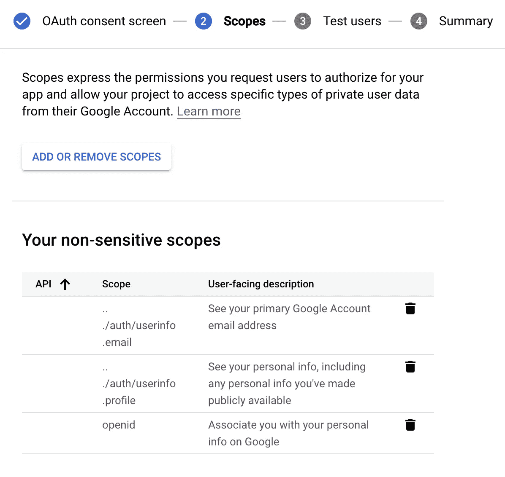

# 创建示例应用程序

对于这个例子，我使用的是毛伊岛混合 Blazor 应用程序，这是一个混合应用程序。

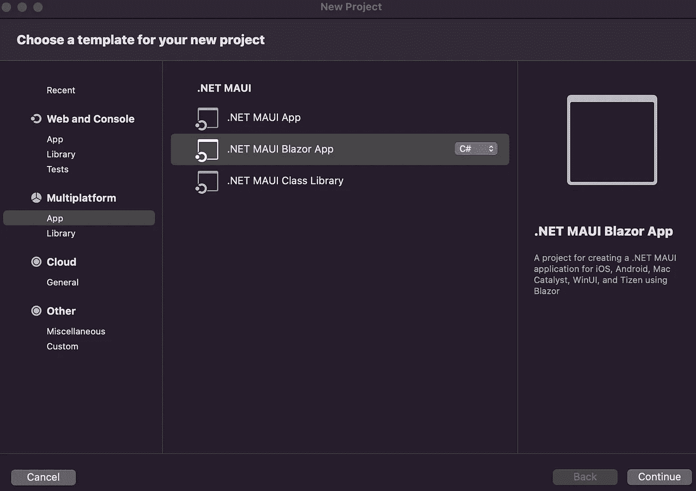

Mac 版 Visual Studio

在 Visual Studio 中创建项目后，您应该能够单击播放按钮:

如果你在 Mac 上运行你的应用有问题，看看这个 [GitHub 问题](https://github.com/dotnet/maui/issues/8894#event-7126988004)。我不得不去安装所有与移动开发相关的东西。希望在你尝试这个的时候这个问题已经解决了。

我们已经将默认的 Blazor 应用程序作为 Mac 应用程序开箱即用。

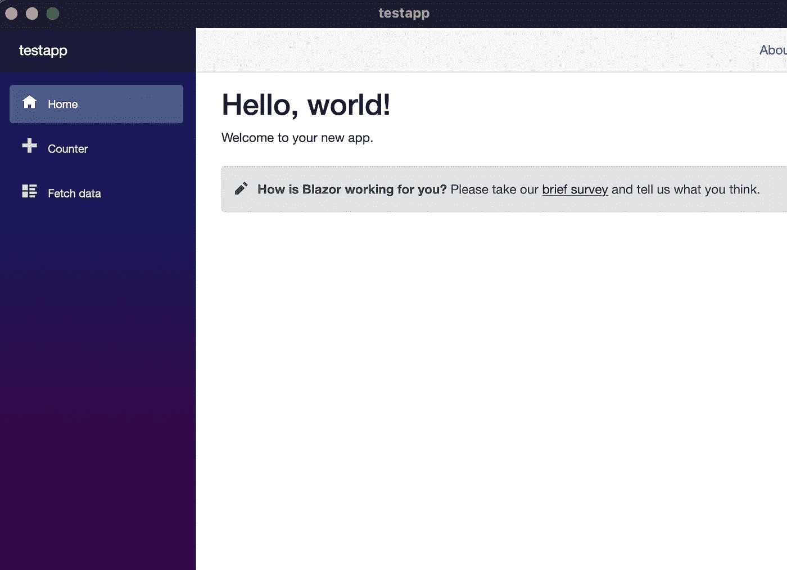

让我们在左侧窗格中添加一个按钮。在测试应用程序的共享文件夹中，创建一个名为`LogInComponent.razor`和`LogInComponent.razor.css`的文件:

对于我们的按钮，我们需要一小段 CSS 来显示/隐藏 HTML 组件，我们将在用户登录或未登录时添加逻辑。

现在在 razor 组件中，让我们添加两个按钮。第一个按钮将触发登录操作；第二个将负责注销操作。

要做到这一点，关键是要在应用程序中添加这个新组件来展示它。打开`NavMenu.razor`并将它添加到切换按钮组件之后。

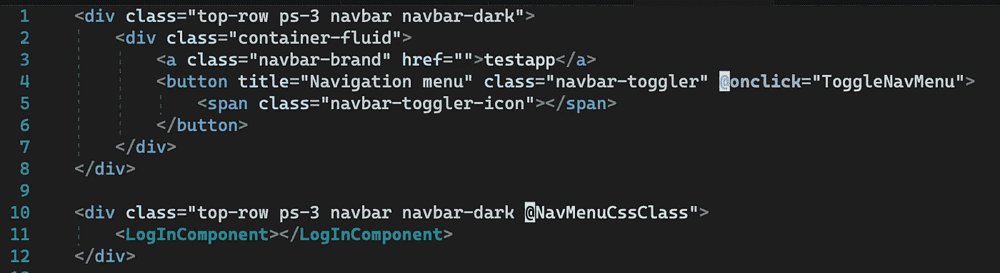

导航菜单.剃刀

有了这些按钮，我们就可以创建一个服务来处理这些动作。在项目级别，让我们像在 BusinessLogic 中一样创建一个名为`BL`的文件夹来保存从 UI 触发的动作。然后是一个`CognitoAuth`文件夹来存放科宁托的逻辑。

先说科宁托的逻辑。为了简单起见，我将把所有需要的对象写在一个名为`CognitoClient.cs`的文件中。

开箱即用，毛伊为你的应用配置一个`ServiceCollection`。你可以在`MauiProgram.cs`里找到。我们将配置由 DI 容器实例化的 Cognito 客户端，并在需要的地方注入它。我们可以从 Cognito 的界面开始。

然后是调用 Cognito 服务所需的参数:

域:你的应用程序的认知域前缀。
ClientId:您的应用程序的 Cognito ClientId。
RedirectUri:你的应用程序的重定向 Uri。

你可以去你的 AWS 控制台> Cognito >用户池> <你的池> > App 集成找到你的`Domain`和`ClientId`。在那里，你可以找到一个领域部分和应用客户端和分析部分。

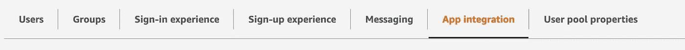

`RedirectUri`是认证过程完成后，认证服务如何返回到您的应用程序。这很重要，我们将在后面处理这个配置。

来保存 Cognito 调用的结果。

接下来，实际的`CognitoClient`你可以看到 auth config 被注入到构造函数中，以及它是如何在`BuildCognitoEndpoint()`中被使用的。

正如[微软推荐的](https://docs.microsoft.com/en-us/xamarin/essentials/web-authenticator?tabs=ios)，我们使用`WebAuthenticator`来调用我们的认证服务，在本例中是 Cognito。我们传递 Cognito 的端点和重定向 URI 作为这个动作的参数。

需要注意的重要事项。我将我的地区硬编码到`us-west-2`中，你可能使用了不同的东西。或者您可能希望它作为一个参数。只需在 AuthConfiguration 类中配置即可。

构建端点的结果是具有以下格式的 URI:

> [https://yourdomainprefix . auth . region . Amazon cognito . com/log in？response _ type = token&client _ id = your clientid&redirect _ uri = redirectUrl](https://yourDomainPrefix.auth.region.amazoncognito.com/login?response_type=token&client_id=yourClientId&redirect_uri=redirectUrl)

至此，我们已经了解了 Cognito。让我们现在使用这项服务。回到 BL 文件夹，创建一个名为`AuthenticationActions.cs`的文件。这里我们将把 UI 中的按钮动作连接到 Cognito 的调用。

由于 Cognito 服务已经就绪，我们可以请求直接从 DI 容器注入它，我们不必担心它或它的参数。

对于我们发送回 UI 的结果，创建一个类来保存这些值。

对于`OnLoginClicked`事件，我们简单地调用 Cognito 的客户端，然后进行一些简单的验证。

此时，我们几乎已经准备好测试我们的代码了。我们缺少一些管道。让我们配置 DI 容器，以便在需要时为这些对象服务。

如你所见，这里我正在设置`RedirectUri`。让我们为 Mac 应用程序修改一下`Info.plist`。在这里，我们配置我们的应用程序使用的 URL 方案，它用于这个回调。

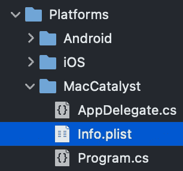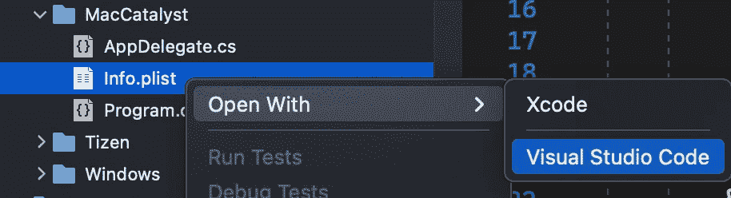

看一下第 30 到 44 行。

此`RedirectUri`必须在您的 Cognito 配置中配置为回叫 URI。您可以在 AWS 的控制台上验证这一点。打开 Cognito 后，切换到旧界面*(我在新界面找不到这个 config 如果你知道它在哪里，请告诉我！)*。

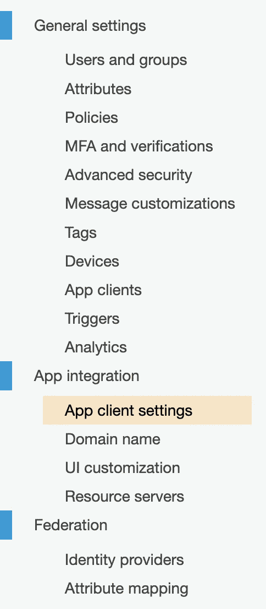

打开 Cognito 的“旧”界面。

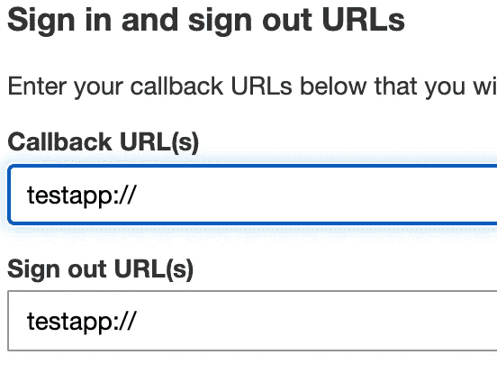

好吧！那是一件作品！

现在，让我们尝试运行我们的应用程序。在点击播放按钮之前，让我们在`AuthenticationActions.cs`上设置一个断点，以便我们可以分析我们的认证过程的结果。

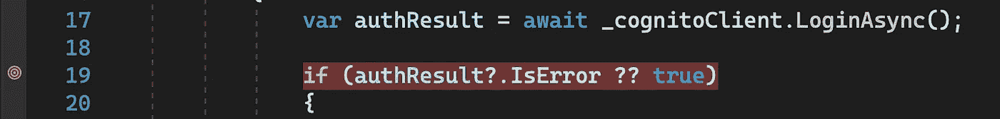

点击 Visual Studio 的播放按钮。您的应用程序应该如下所示:

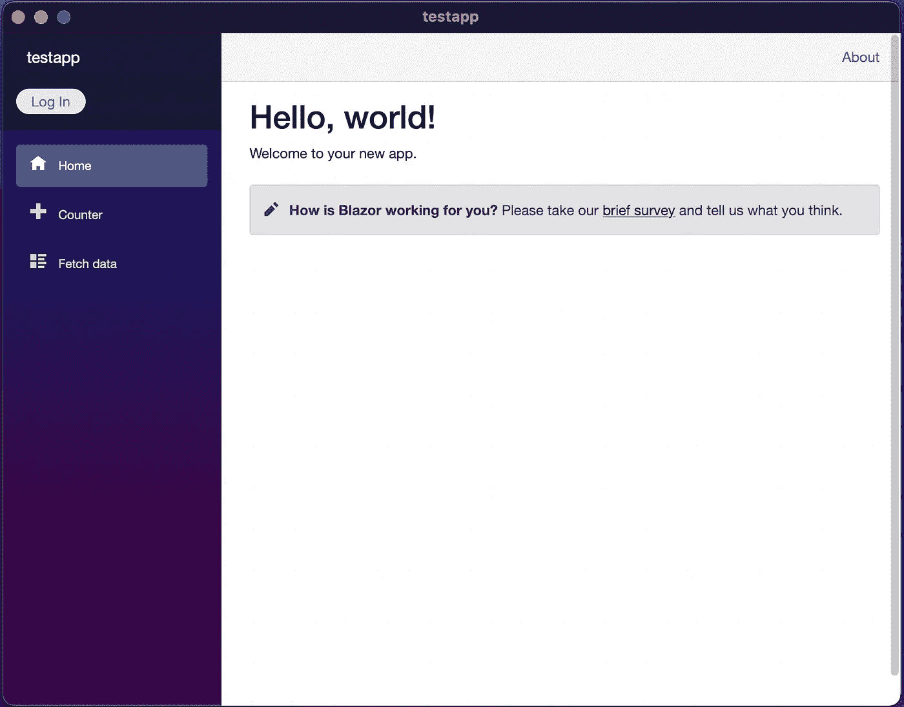

现在是神奇的时刻，让我们尝试登录！点击登录按钮，您的典型登录屏幕应该会打开。多亏了 Cognito，这是现成的。

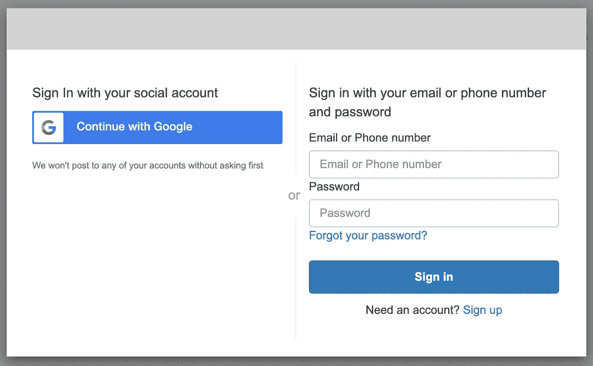

这里需要注意的是，谷歌将只接受你配置为可以登录的测试邮件。如果您使用用户名和密码登录，您可以使用任何电子邮件。

在结束这个过程后，我们应该命中断点，我们可以检查`LoginResult`对象中的内容:

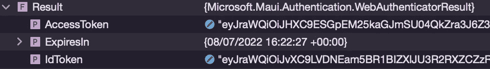

让程序运行后，UI 应该显示注销按钮。

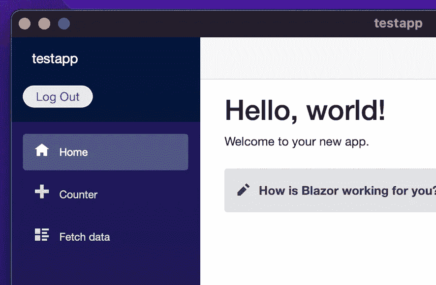

此时，您已经有了 Access/Id/Refresh 令牌，可以前所未有地识别您的用户了！

我将为本文创建第 2 部分来描述注销过程。

# 参考

*   [https://AWS . Amazon . com/premium support/knowledge-center/cogn ITO-Google-social-identity-provider/](https://aws.amazon.com/premiumsupport/knowledge-center/cognito-google-social-identity-provider/)
*   [https://docs . Microsoft . com/en-us/dot net/maui/platform-integration/communication/authentic ation？tabs=ios](https://docs.microsoft.com/en-us/dotnet/maui/platform-integration/communication/authentication?tabs=ios)