# 使用 AWS 控制台设计、绘制和部署 3 层架构

> 原文：<https://betterprogramming.pub/aws-console-creating-a-3-tier-architecture-f44e226e5842>

## 创建高度可扩展的架构

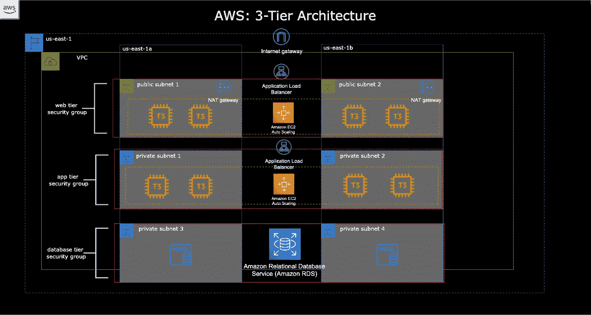

# 三层架构

作为客户机-服务器软件设计的一种流行实现，三层体系结构包括表示层(客户机的 web 层)、逻辑层(应用层)和数据层(包含数据库层)。

## 好处:

*   可伸缩性—每一项都可以水平伸缩，应用服务器可以部署在多台机器上
*   数据库完整性和安全性—客户端不能通过它们和数据库之间的应用层直接访问数据
*   改进的性能—表示层可以缓存请求，最大限度地减少网络使用和负载
*   更易于维护和修改——一个层的修改或替换不会影响其他层(解耦),多个开发人员可以在不同的层上工作，减少了集成更改所需的成本和时间

# **步骤概述**

1.  创建 VPC、子网、互联网网关，并编辑路由表。
2.  为 web 层(面向互联网)和应用层创建应用程序负载平衡器。
3.  使用 EC2 自动扩展组创建应用程序和 web 层。配置安全组，使 web 层只接受来自 ALB(应用程序负载平衡器)的流量，应用层只接受来自 web 层安全组的流量。
4.  使用 RDS 创建数据库层(自由层)。
5.  验证 web 层可以从 Internet 访问，并且可以 ping 应用层。

# 创造一个 VPC

1.  在 AWS 管理控制台中，导航到 **VPC** → **创建 VPC →VPC 设置** → **创建资源** →仅 VPC(包括名称) **IPV4 CIDR 块** → `10.0.0.0/16` → **创建 VPC**
2.  **子网→创建子网→ VPC → VPC ID →** 选择上一步创建的 VPC。命名每个子网，并为每个子网提供一个 CIDR。** **提示**:使用类似[这个](https://www.site24x7.com/tools/ipv4-subnetcalculator.html)的在线子网计算器来确定每个子网的 CIDRs。

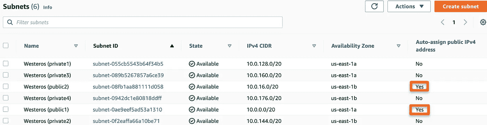

为了能够将每个层包含在其自己的子网中，我为每个可用性分区创建了一组 1 个公共子网和 3 个私有子网。对于公共子网，我选择使用操作→“编辑子网设置”自动分配一个公共 IPV4 ip。

4.**互联网网关** →创建并命名以允许 VPC 的公共子网流量接入互联网。

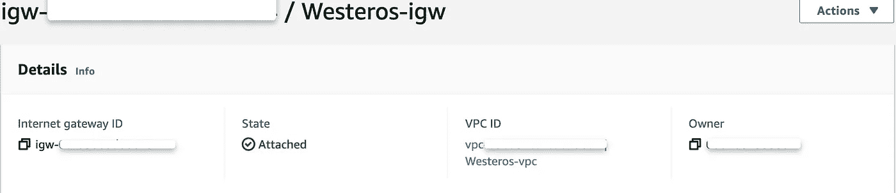

确保附上在第一步中创建的 VPC。

5. **NAT 网关:**在本练习中，使用具有公共访问权限的网络地址转换(NAT)网关将允许私有子网中的实例连接到互联网，但不允许未经请求的入站连接。因为应用层将包含私有子网中的实例，所以 NAT 网关是必要的，以确保这些实例可以与 web 层通信。从 **VPC 仪表板中选择 **NAT 网关****→**创建 NAT 网关→** 提供名称(可选)，指定一个公共子网，并选择 **Public** 作为**连接类型**。选择“**分配弹性 IP** ”以生成一个 IP 地址，作为实例的源 IP 的替换，并将地址转换回源 IP。

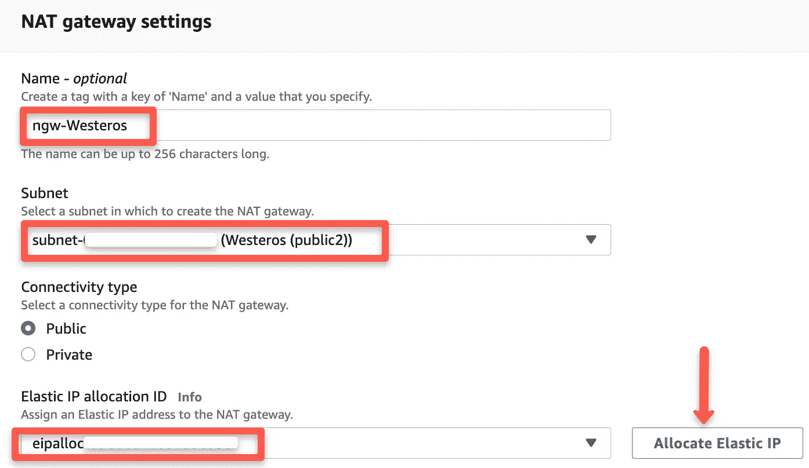

6.**路由表** →创建两个路由表，一个用于公共子网，一个用于私有子网。使用公共路由表的**路线**选项卡→“编辑路线”,确保路线**目的地**设置为我们的 CIDR 区块(`10.0.0.0/16`)和互联网网关(`0.0.0.0/0`)。对于私有路由表，目的地应该设置为我们的 CIDR 块(`10.0.0.0/16`)，并且**目标**指向我们创建的 NAT 网关。

# **创建应用负载平衡器**

面向 Internet 的应用程序负载平衡器提供了额外的安全层，防止客户端直接访问 web 层中的 EC2 实例。内部 ALB 将允许 web 层与部署在私有子网中的应用层进行通信。

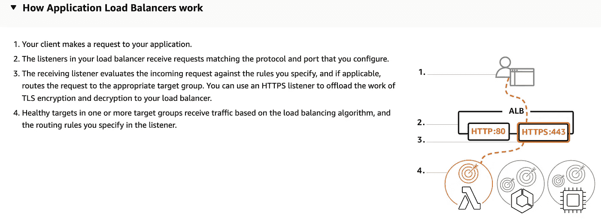

ALB 至少需要两个 az，允许客户端通过 ALB 访问应用程序

1.  导航至`**EC2** in the **AWS Management Console. Load Balancing → Load Balancers → Create Load Balancer**`T30。
2.  `**Basic Configuration** → **Load balancer name** (CityWatch) , **Scheme** →select “**Internet-facing**”, **IP address typ**e → select **IPV4**` **。**
3.  `**Network mapping** → **VPC** (select the one created in the previous section), **Mappings** → select each AZ and the public subnets associated with each`。

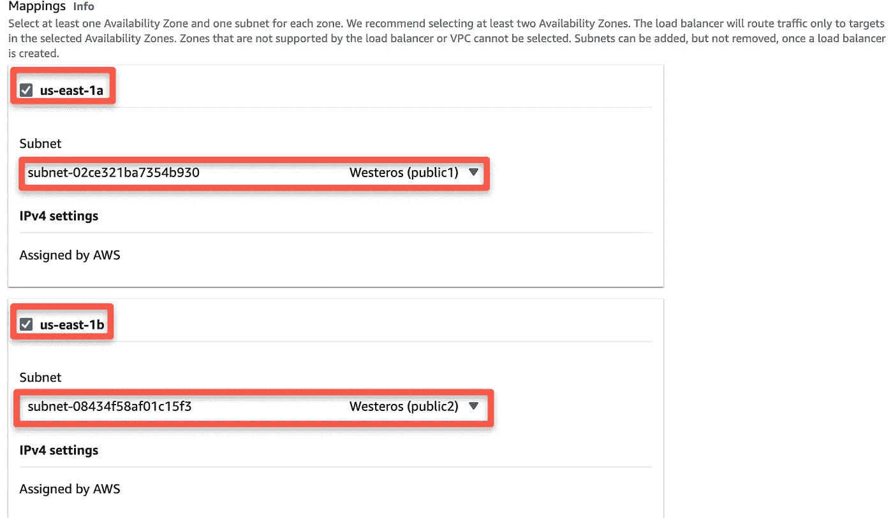

4. `**Security groups** → **Create new security group** (this will open a new tab)**→ Basic details →** Create a **Security group name** (KingsGuard)**, Description** (allow public traffic to Internet)and select the **VPC** (Westeros)created earlier. **Inbound rules** must be configured to allow any IPV4 traffic through **ports 80** (http) → **Create security group**`

5.**监听器和路由** →监听器应该在**端口 80** **上使用 **HTTP** 协议→创建目标组**(这将打开一个新标签)→ **选择目标类型** →选择**实例→** 创建**目标组名称** (Andals) →接受所有其他默认设置，然后单击**下一步**。由于我们在这个阶段还没有创建 EC2 实例，我们现在将跳过**注册目标**和**创建目标组**。* *确保返回负载平衡器页面，选择新的目标组并**创建负载平衡器**。

**对于**内部 ALB** (学士)，使用每个可用性分区中的私有子网(维斯特洛(私有 1)和维斯特洛(私有 2))重复上述步骤。内部负载平衡器将在 web 层和应用层之间进行通信，只接收来自面向 internet 的 ALB 的流量。必须先创建应用层，然后才能向此 ALB 注册目标实例组。

## 为 Web 和应用程序层配置启动模板和自动扩展组

1.  **Web Tier: EC2** → `Instances → Launch Templates → Create launch template → create a Launch template name (MotherofDragons), Template version description (app tier)`，选择`Auto Scaling guidance. AMI → Amazon Linux 2 Kernel 5.10 with a t2.micro Instance type`下的框。创建新的密钥对或选择现有的密钥对。`Network Settings → do not specify a subnet in this template`。`Security groups → Create security group → Create a Security group name (TheUnsullied)`，描述(web-sg)，VPC(维斯特洛)，规则允许流量通过端口 80 (HTTP)和 22 (SSH)。在“高级网络配置”下，我还选择了“自动分配公共 IP”。为了轻松地更新所有包并安装“Apache”web 服务器，我还在单击“创建启动模板”之前，在启动模板的“高级详细信息”下的“用户数据”下添加了以下引导。

```
**#!/bin/bash
yum update -y
yum install httpd -y
systemctl start httpd
systemctl enable httpd**
```

2.`Auto Scaling group for Web Tier: EC2 → Auto Scaling groups → Create Autoscaling group (Dothraki)`使用为 web 层创建的“启动模板”(MotherofDragons)。继续为 web 层创建“自动缩放组”(参见我的另一篇文章[来看看我是如何完成的！).](/aws-creating-a-vpc-with-an-auto-scaling-group-using-t2-micro-instances-4ac2c5c7795b)

然而，在第 3 步:“配置高级选项”中，我选择了将这个组连接到我的“面向 Internet 的应用程序 Web 平衡器”的可选步骤。

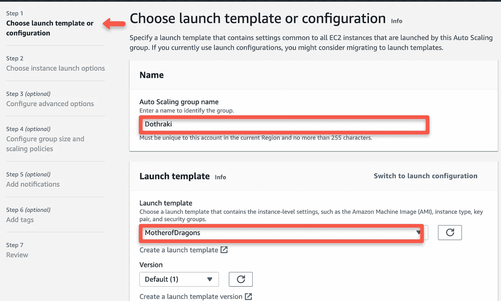

我将这个**自动缩放组**附加到我为 web 层(MotherofDragons)创建的模板上。

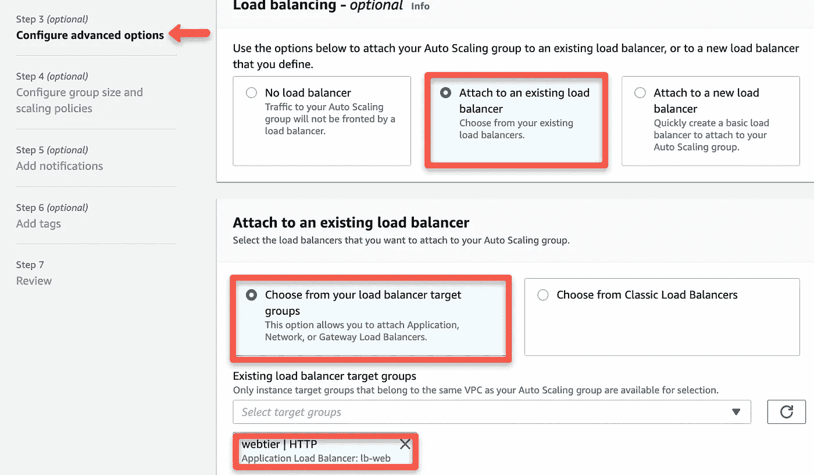

因为我在这个练习中使用了一个 ALB，所以我配置了这个选项。

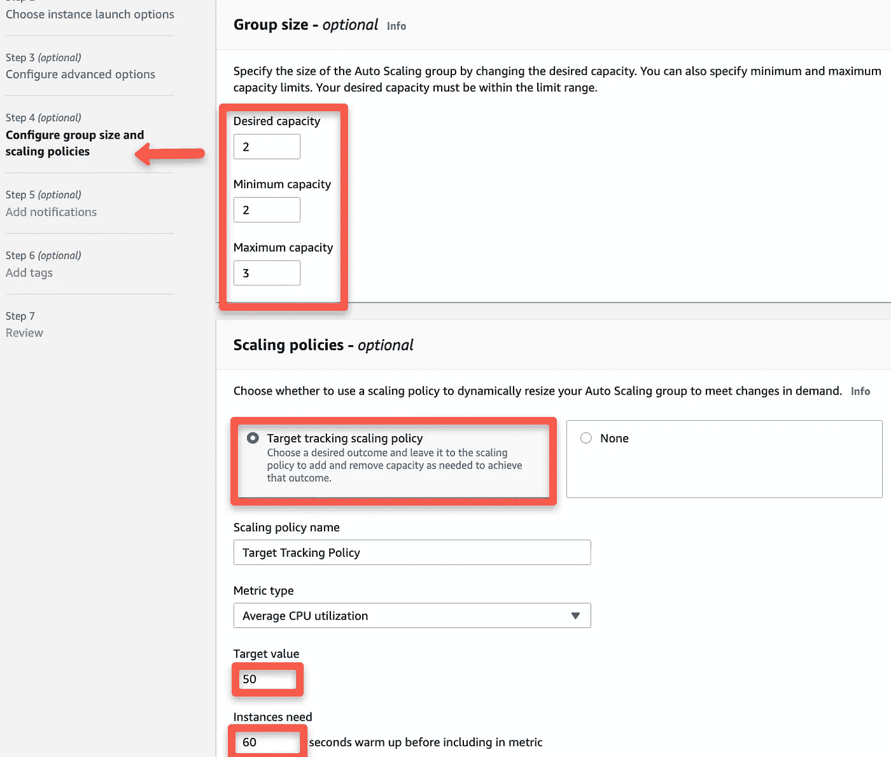

我还启用了使用目标跟踪比例策略的可选特性，这将允许在平均 CPU 使用率达到 50%或更高时创建另一个实例。我将我的度量保持在相对较低的水平，因为我不打算将实例留到本练习之后。

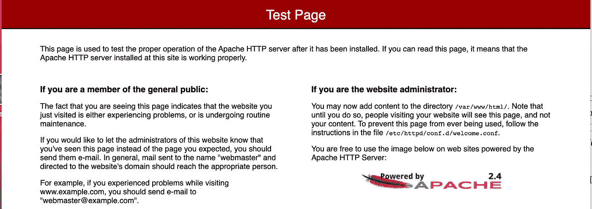

使用 web 层中运行的一个实例的公共 IP，我确认 Apache 安装成功。

3.**应用层**:对于这一层，因为我没有任何代码来运行真正的应用程序，所以我重复了 web 层的步骤，但是使用了自动扩展组的私有子网。我还通过只允许 web 层的安全组访问来配置应用程序安全组。

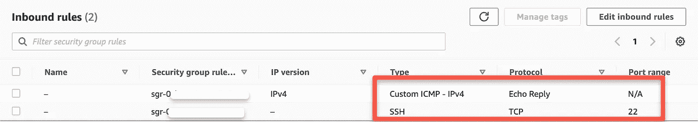

通常，自定义 ICMP-IPV4“回应回复”将被禁用，以使设备不太可能被未授权用户发现；但是，我在这里包含了允许我从 web 层 ping(测试)连接。

## 创建数据库层并验证与应用层的连接

1.  在“AWS 管理控制台**”→“**创建数据库**”→**中导航至“RDS**”**，选择“标准创建”并选择以下选项来配置数据库层:`MySQL → Free tier → DB cluster identifier (FreeCities) → Master username (defaulted to admin) → Master password (specify and confirm) → Instance configuration → Burstable classes (db.t3.micro) → (continue with defaults until Connectivity)`。选择正确的 VPC(维斯特洛)并创建一个新的 VPC 安全组(无面人),注意 3306 端口已添加。保留所有其他默认设置，然后单击“创建数据库”。创建数据库后，需要修改 VPC 安全组，方法是删除默认规则，选择数据库端口 3306，并将应用程序层的安全组标识为源→ `Create rule`。

*   注意:要启用“RDS**”**实例的“多 AZ 部署”，请选择一个正在运行的 RDS 实例，然后单击“修改”→“启用多 AZ 部署”，并确定是否需要备用实例(用于生产)，以及何时要安排修改。

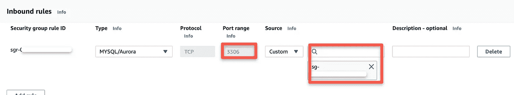

此配置将允许从应用层访问，但不允许从 web 层访问。

2.返回到“EC2**”**并找到一个公共实例(这些实例已经被确认具有 Internet 连接，如本文前面部分的步骤 2 所示)。在您的本地终端中，使用`$ cd <name_of_directory>`更改目录以确保您与密钥对在同一个目录中。pem 文件。如有必要，使用命令`$chmod 400 <nameofkeypair>.pem`保护其不被看到。然后，使用以下命令登录到一个正在运行的公共 EC2 实例:

```
$ ssh -i "<nameofkeypair>.pem" ec2-user@<public_ip_of_instance>
```

使用以下命令测试网络连接:

```
$ ping <ip_of_instance>
```

我首先使用我的另一个 web 层实例的公共 IP 测试了这个命令，收到了以下输出:

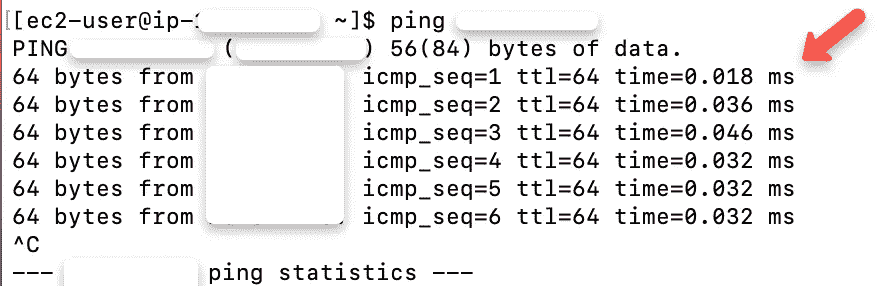

因为我知道这个 IP 具有网络连接性，所以我想看看成功的结果是什么样的。

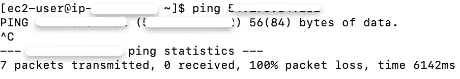

上面的例子发生在没有网络连接的时候。

确保通过禁用“EC2”中的自动扩展组来终止实例，终止“RDS”实例，并删除为“VPC”创建的“NAT 网关”,以避免产生费用。