# AWS 成本分配标签和成本降低

> 原文：<https://betterprogramming.pub/aws-cost-allocation-tags-and-cost-reduction-8a0e46e39e75>

## 使用成本分摊标签优化您的 AWS 服务，每月支付更少的费用


克里斯汀·罗伊在 [Unsplash](https://unsplash.com?utm_source=medium&utm_medium=referral) 上的照片

Bob 刚到办公室开始新聘用的首席技术官的第一天工作，就被总裁 Martha 叫进了一间会议室，总裁马上把他介绍给了会计主管 Amanda。他们相互寒暄了几句，然后玛莎开始了正题:

“Bob，我们有几个团队在亚马逊上开发软件应用程序，我们的费用非常高。我们认为这是不必要的高，我们希望你调查一下，并加以控制。”

玛莎把亚马逊网络服务(AWS)账单报告的截图放在桌子上，指着它。

“这对我们来说是个问题:我们不知道这笔钱花在了什么地方，我们需要看到更多细节。”

Amanda 插话说，“Bob，看，我们有用于报告目的的财务维度，我可以为你提供一些关于我们真正希望看到的一些信息的指导，以便最终生成的报告反映这些维度—如果你能做到这一点，这将真正帮助我们内部。”

“鲍勃，我们不能强调这是多么重要。这些项目对我们的业务来说变得非常昂贵，”玛莎重申道。

“我们有多少个项目？”鲍勃问道。

“我们总共有四个项目:两个在航空部门，两个在能源部门。如果有关系的话，航空部门有 75 名开发人员，能源部门有 25 名开发人员，”这位首席执行官回应道。

鲍勃明白了这个问题，并回答说:“我会看看我能做些什么，并有一些想法。我可能无法为您提供回顾性的见解，但展望未来，我们应该能够更好地了解正在发生的事情，并开始降低成本。”

会议以鲍勃走向他的办公桌而结束。*成本分配标签应该对我们有帮助*，他一边寻找可能知道他办公室在哪里的人，一边心想。

# 成本分配标签介绍

在这个虚构的故事中，Bob 需要弄清楚这些费用来自哪里，以便他可以开始降低成本。AWS cost explorer 虽然很有帮助，但在这种情况下它本身是不够的。Bob 需要更多的细节，而这正是成本分配标签(cat)有用的地方。AWS 中还有其他工具可以帮助 Bob 完成这项任务，我们将在本文后面简要介绍这些工具。

一般来说，标签有一些我们应该知道的特征(如果我错过了什么，请添加您的评论):

*   标签有助于展示资源之间的关系。
*   标签是关于资源的元数据，这些简单的键值对可以添加到 AWS 中的任何资源中。
*   标签理想上是一个键和一个值，并置着一个键和多个值。
*   标签被限制为每个资源 50 个。
*   标签上可以实施规则，这有助于确保一致性并满足合规性要求。
*   有些标签也是由 AWS 自动生成的(例如`aws:createdBy`)——这些标签是不可变的。
*   除了成本分配，标签还可用于自动化、操作和访问，以及安全风险管理。
*   由于与 cat 相关，标签可用于识别成本中心、业务单位、部门、项目、产品、地理区域或目的，以便进行财务报告。
*   标记仅在标记创建时出现在报告中，没有回溯。

在下一节中，我们将查看 AWS billing dashboard，在这里我们可以激活一个标记，还可以查看根据该标记过滤的报告。

# 开单控制板中的成本分配标签

在本节中，我们将查看 AWS 计费仪表板，该仪表板可供帐户持有人使用，它有两个感兴趣的项目:成本浏览器[和成本分配标签](https://aws.amazon.com/aws-cost-management/aws-cost-explorer/)和。我们可以在下一张图中看到这两者。

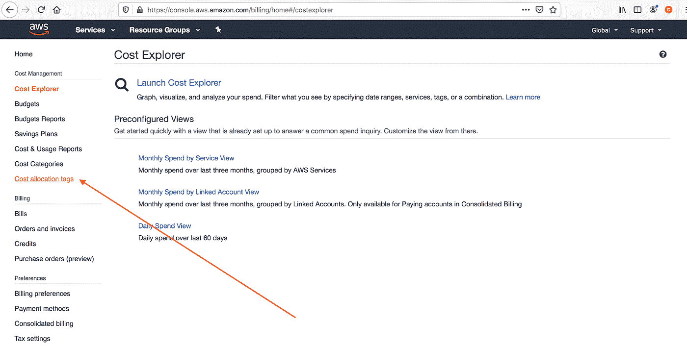

AWS 我的开单控制板->成本分配标签

在下图中，一个非活动的成本分配标记将被激活，然后将执行一个刷新请求。图像中的注释提到了标记 S3 桶——我们可以标记 AWS 中的任何资源。

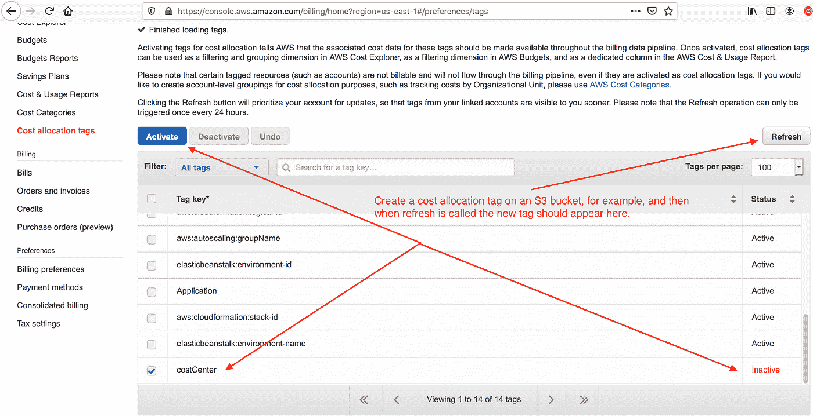

激活`costCenter`成本分配标签，然后发出刷新请求。

下图展示了我们如何在 AWS cost management cost explorer AWS web UI 中按标签进行过滤。

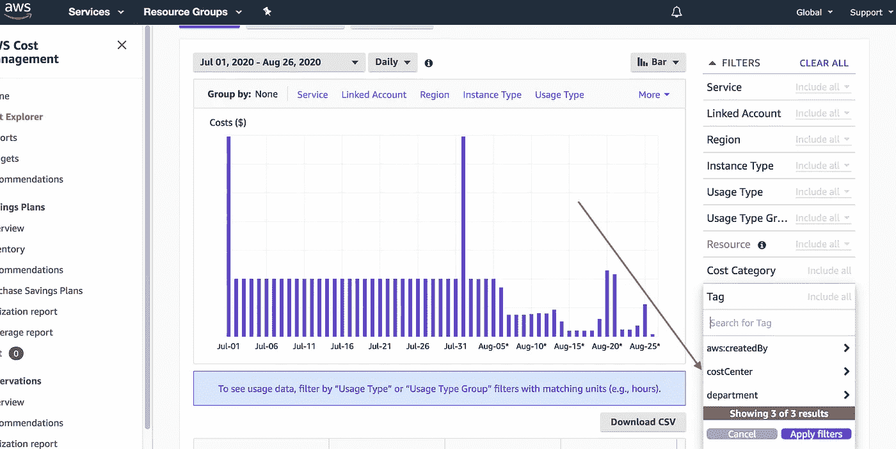

如果我们通过`costCenter`标签 12345 过滤，我们可以得到一个概念，具体来说，这个键和值的相关成本是多少。

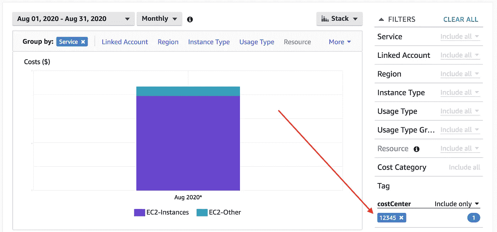

在下一节中，我们将查看三个示例，这些示例涉及如何通过 web 界面、命令行(CLI)和编程方式用两个标记来标记资源，比如本例中的 EC2 实例。

# 标签示例(用户界面、命令行界面、代码)

在这一节中，我们将回顾如何在创建时将 cat 应用到 AWS EC2 实例的三个例子。我们将通过 web 用户界面(UI)和 AWS 命令行进行标记，最后，我们将演示如何在创建时使用 [Node.js](https://nodejs.org/) 标记 EC2 实例。

## 通过 web 用户界面(UI)标记 EC2 实例

通过 AWS web 界面创建 EC2 实例非常简单。我们可以在下面看到，我们可以在第五步中添加标签。

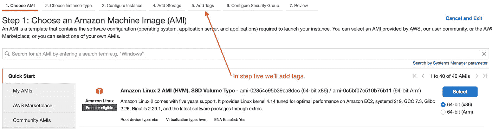

在这个例子中，我们已经跳过了，下面你可以看到第五步，我们已经为这个实例分配了`costCenter`和`department`键值对(kvp)。

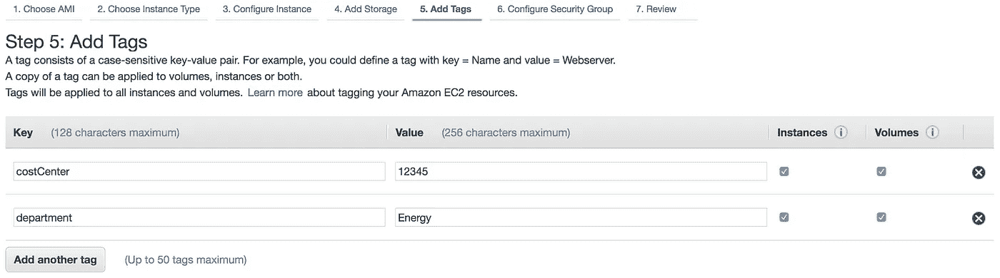

将成本中心和部门标记添加到 EC2 实例配置中。

一旦实例启动，我们可以看到我们上面分配的标签被分配给了实例本身。

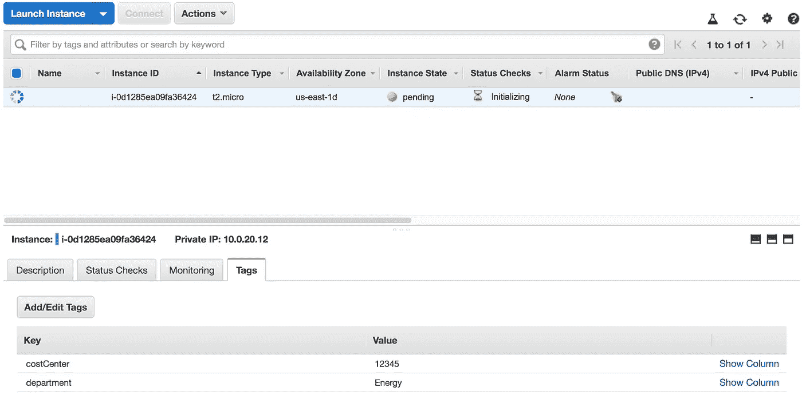

实例正在启动，我们可以在这里看到`costCenter`和`department`标记。

## 通过命令行界面(CLI)标记 EC2 实例

这个例子相当简单。此处未包括的步骤涉及设置配置文件，这需要创建用户并分配适当的权限，以及创建 VPC。

我们还需要在`/Users/[user]/.aws/credentials`文件中创建一个概要文件，它包括带有 AWS 提供的值的`aws_access_key_id`和`aws_secret_access_key`。这对于下面的示例和后面的编程示例都是必要的。

下面的脚本将在`us-east-1`区域创建一个`t2.micro`实例，并将其部署在`subnet-0969b587cc72969d2`子网中。对于这个例子来说，最重要的是 EC2 实例将被标记为`costCenter`和`department`kvp。

```
aws ec2 run-instances --image-id ami-02354e95b39ca8dec --count 1 --instance-type t2.micro --region us-east-1 --profile thospfuller-aws-cli --subnet subnet-0969b587cc72969d2 **--tag-specifications** 'ResourceType=instance,Tags=[{Key=costCenter,Value=45678}, {Key=department,Value=Energy}]'
```

上述子网值可以在 VPS 子网选项下找到，如下图所示。

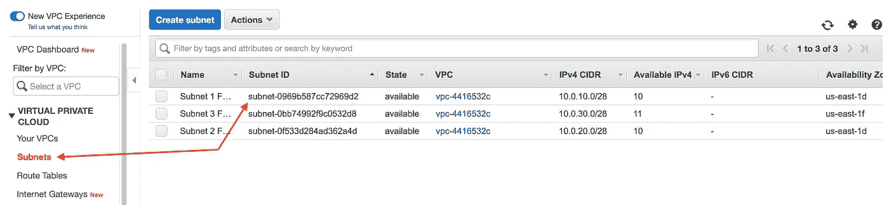

在下图中，我们可以看到 EC2 实例上出现了`costCenter`和`department`标记。

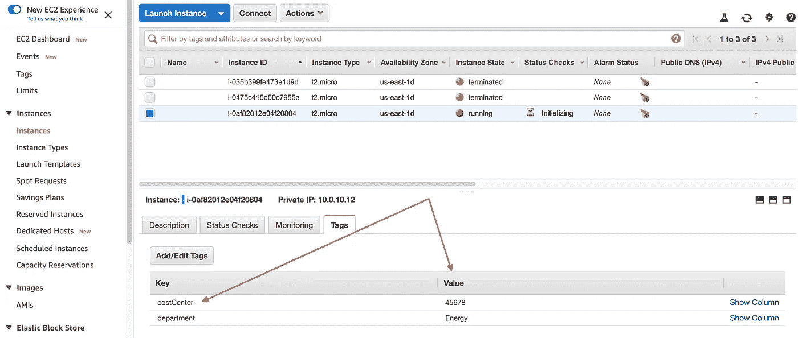

这就把我们带到了我们将在这里讨论的最后一个例子，那就是以编程方式启动一个用适当的 kvp 标记的 EC2 实例。

## 以编程方式标记 EC2 实例

与前面的例子类似，这个例子相当简单。此处未包括的步骤涉及设置配置文件，这需要创建用户并分配适当的权限，以及创建 VPC。

我们还需要在`/Users/[user]/.aws/credentials`文件中创建一个概要文件，它包括带有 AWS 提供的值的`aws_access_key_id`和`aws_secret_access_key`。

下面将在`us-east-1`区域创建一个`t2.micro instance`，将其部署在`subnet-0969b587cc72969d2`子网中，并且，对本例来说最重要的是，用`costCenter`和`department`kvp 标记它。

49 号线有`costAllocation`和`department`kvp。注意[下面的要点可以在 GitHub](https://gist.github.com/thospfuller/0a2a7809dbf75a0c7a3e2b749bed7d0b) 上找到，文件也可以在下面的库中找到[。](https://github.com/thospfuller/NodeExamples)

在下图中，我们可以看到脚本执行时的输出，以及指向`costCenter`和`department`标签的指针。注意`instance id`就在指向标签的红色箭头指针上方。

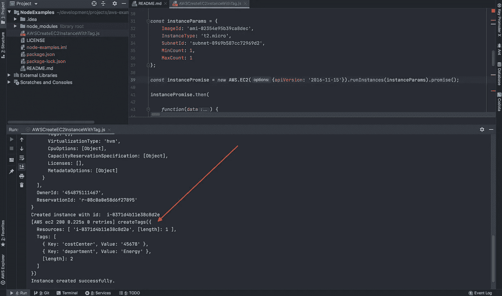

在下图中，我们可以看到 EC2 实例启动时的`instance id`。

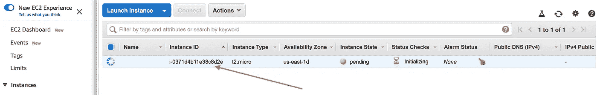

最后，我们可以在下图中看到`costCenter`和`department`标记键和值。

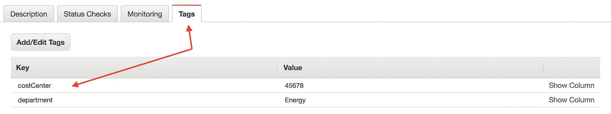

在下一节中，我们将讨论 AWS 组织、AWS 配置，以及这些服务如何帮助企业实现标签合规性。

# 服从

依赖 cat 来确保分配给资源的标签的应用和格式一致的企业有两种选择:AWS 组织和 AWS 配置*。*因为人们可以很容易地直接从源头上了解这些，我们只提供一个简短的描述，这将有助于读者看到不同之处:

*   [AWS 组织](https://aws.amazon.com/organizations/) —AWS 组织用于账户管理，可以将多个 AWS 账户合并到一个组织下进行集中管理；AWS 组织服务还有助于预算、安全性和合规性。
*   [AWS 配置](https://aws.amazon.com/blogs/devops/aws-config-checking-for-compliance-with-new-managed-rule-options/) — AWS 配置也是一项服务，可帮助用户评估、审计、评估、保护 AWS 特定资源的配置，并对其进行故障排除。如果您的企业没有使用 AWS 组织，那么 AWS Config 可以作为管理标签的替代方案；参见[标记你的 AWS 配置资源](https://docs.aws.amazon.com/config/latest/developerguide/tagging.html)。

如果没有审计和执行，业务很容易以混乱结束，因此重要的是不仅要使用可用的工具来更好地了解资金的去向，还要确保所有资源都是以适当的格式用适当的标记创建的。请记住，工程师必须应用这些变化，如果没有执行和遵从，他们根本不会这样做，或者始终如一和正确地这样做[7]。

在我们虚构的故事中，Bob 不仅想要利用 CATs，而且他还将从利用 AWS 组织或 AWS 配置中额外受益，特别是考虑到他负责监管拥有 100 名软件工程师和支持人员的两个部门。

演示这两个服务如何工作超出了本文的范围；然而，我们可能会在以后的文章中对此进行深入研究。

# 使用成本分配标签时的策略

到目前为止，我们已经介绍了标记和成本分配标记，演示了如何将标记添加到资源(如 EC2 图像)中，并回顾了如何确保合规性措施到位，以确保标记键和值符合预期的格式。

我们将在本文中讨论的最后一个难题涉及标记策略。仅仅允许工程师和经理向他们正在使用的 AWS 资源添加具有已知值的标签是不够的。事实上，在 Bob 经营的这种规模的组织中，这正是您想要避免的，因为企业有多个部门和许多软件工程师和支持人员。在这种情况下，需要根据管理这些部门的人员的意见来制定标记策略，由最高级别的 CTO 来确保标记在整个企业中是统一的，并且定义了一个最小的标记集，以及应用于整个企业中使用的每个可标记资源的可选标记。

最后，当谈到成本分配标记(cat)时，我们的 CTO Bob 将希望确保定义必需和可选标记的最小集合，并确保适当的键值对与财务报告维度相结合，这将由会计主管 Amanda 提供。

# 结论

在本文中，我们介绍了成本分配标记，演示了它们是如何工作的，并回顾了两个服务，AWS Organizations 和 AWS Config，它们可用于在所有 AWS 资源中实现标记遵从性。这些并不是 Bob 控制 AWS 使用成本的唯一工具。事实上，添加以下任何一项都会有所帮助:

*   [成本管理](https://aws.amazon.com/aws-cost-management/)
*   [预算](https://aws.amazon.com/aws-cost-management/aws-budgets/)
*   [计费告警](https://docs.aws.amazon.com/AmazonCloudWatch/latest/monitoring/monitor_estimated_charges_with_cloudwatch.html)
*   [值得信赖的顾问](https://aws.amazon.com/premiumsupport/technology/trusted-advisor/)
*   第三方成本优化软件
*   持续改进战略[15，16，17，18]
*   开发[性能优化的架构](https://d1.awsstatic.com/whitepapers/architecture/AWS-Performance-Efficiency-Pillar.pdf)【13】

我们以对标记策略的基本讨论结束了本文，标记策略非常重要，在定义一组用于整个企业和成本分配目的的必需和可选标记时，需要在整个企业范围内给予关注。

我们崭露头角的 CTO Bob 将在业务中实施标签策略方面有一个良好的开端，但你会怎么做呢？完成下面的测试后，请在评论中告诉我。

# 恶作剧

你以为你完了，是吗？

没错，拿出一张白纸和一支笔，因为我已经包括了一个突击测验。如果你没有纸和笔，把你的答案放在评论区进行讨论。

1.  找到另外三个可以标记的资源。(这很容易)
2.  哪些资源不能被标记？(这个比较难，见[10]，不要假设它是正确的或者完整的。)
3.  开发成本优化的架构是[填空]的五大支柱之一。(提示“AWS[后接三个字]。”) [8]
4.  说出 2 中的其他四个支柱。不用看笔记。
5.  AWS 组织和 AWS 配置有什么区别？
6.  在我们上面虚构的故事中，对他工作的企业来说，什么是更合适的服务(AWS 组织、AWS 配置或两者都有)？为什么？
7.  企业可以同时使用 AWS 组织和 AWS 配置吗？
8.  成本优化支柱的补充是什么？(有一个具体的支柱，有一个非常具体的原因。)

# 推荐阅读

1.  [标记最佳实践:实施有效的 AWS 资源标记策略](https://d1.awsstatic.com/whitepapers/aws-tagging-best-practices.pdf)
2.  [AWS 标记最佳实践指南:第 1 部分，共 3 部分](https://www.cloudforecast.io/blog/aws-tagging-best-practices?utm_source=Medium_TPF_AWSCostReduxCAT)
3.  [AWS 标签最佳实践指南:第 2 部分，共 3 部分](https://www.cloudforecast.io/blog/aws-tagging-best-practices-guide-part-2?utm_source=Medium_TPF_AWSCostReduxCAT)
4.  [停用 AWS 生成的成本分配标签](https://docs.aws.amazon.com/awsaccountbilling/latest/aboutv2/deactivate-built-in-tags.html)
5.  [如何降低您的 AWS 成本？根据这些指南，节省高达 50 万美元！](https://medium.com/@george_51059/reduce-aws-costs-74ef79f4f348)
6.  [基于 AWS 的 Kubernetes 成本优化](https://aws.amazon.com/blogs/containers/cost-optimization-for-kubernetes-on-aws/)
7.  [AWS 标记最佳实践—终极指南](https://www.metricly.com/aws-tagging-best-practices/)
8.  [拥有 AWS 组织的组织单位的最佳实践](https://aws.amazon.com/blogs/mt/best-practices-for-organizational-units-with-aws-organizations/)
9.  [AWS 良好架构框架的 5 大支柱](https://aws.amazon.com/blogs/apn/the-5-pillars-of-the-aws-well-architected-framework/)
10.  [无法标记的 AWS 支出](https://support.cloudability.com/hc/en-us/articles/205005327-AWS-spending-that-can-t-be-tagged)
11.  [AWS 配置和 AWS 组织](https://docs.aws.amazon.com/organizations/latest/userguide/services-that-can-integrate-config.html)
12.  [使用 AWS 配置和 AWS 云信息堆栈集管理 AWS 组织账户](https://aws.amazon.com/blogs/mt/managing-aws-organizations-accounts-using-aws-config-and-aws-cloudformation-stacksets/)
13.  [性能效率](https://wa.aws.amazon.com/wat.pillar.performance.en.html)
14.  [通过合理调整建议优化您的成本](https://docs.aws.amazon.com/awsaccountbilling/latest/aboutv2/ce-rightsizing.html)
15.  [(仍)向丰田学习](https://www.mckinsey.com/industries/automotive-and-assembly/our-insights/still-learning-from-toyota#)
16.  [创造持续改进的文化](https://hbr.org/2019/05/creating-a-culture-of-continuous-improvement)
17.  [软件开发的改善方法](https://www.tothenew.com/blog/the-kaizen-approach-to-software-development/)
18.  [为什么持续改进是值得的？](https://www.petrikainulainen.net/software-development/processes/why-continuous-improvement-is-worth-it/)