# AWS:使用 T2.micro 实例创建带有自动缩放组的 VPC

> 原文：<https://betterprogramming.pub/aws-creating-a-vpc-with-an-auto-scaling-group-using-t2-micro-instances-4ac2c5c7795b>

## 维护自我修复架构

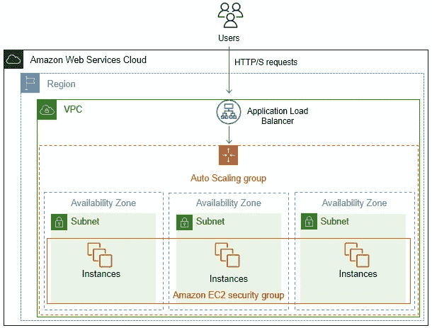

**Credit**:[AWS Auto Scaling](https://docs.aws.amazon.com/autoscaling/ec2/userguide/as-register-lbs-with-asg.html)[*注意:尽管该图描述了应用程序负载平衡器的使用，但本练习不会使用负载平衡器，而是侧重于实例的 CPU 压力。]

在本演练中，我们将讨论 AWS ( *Amazon Web Services* )中的 VPCs 架构，以及在 EC2 中使用自动伸缩组来帮助维护自修复架构。

# ***目标***

1.  使用 CIDR 10.10.0.0/16 创建自定义 VPC
2.  在 EC2 中，创建启动配置，以便定义包含自定义 VPC 的启动规范——每个实例还需要安装 Apache webserver，该服务器能够检查随机 IP 地址并生成测试页面
3.  在 EC2 中，为实例配置一个自动缩放组，最小实例数为 2，最大实例数为 5。在 CPU 利用率超过 80%后，扩展策略将使用 CloudWatch 进行扩展
4.  创建自动扩展组后，将使用压力工具对 CPU 利用率超过 80%的实例进行压力测试，以确保上述扩展策略有效。

> ***注意:*** 出于本练习的目的，我还使用了新的 AWS 管理控制台。我将配置一个自定义的 VPC，而不是使用 AWS 创建的默认。我的地区设置为*美国东部-1* 。

## 用 *10.10.0.0/16* 的 **CIDR** 创建自定义 **VPC**

1.  从 AWS 管理控制台，使用搜索栏导航到 VPC。*在此页面中，您可以从控制面板选项中配置 VPC 和所有网络设置，或者使用启动向导引导您一次性完成所有设置的创建。*
2.  使用启动向导:选择 VPC、子网等。，命名 VPC，并确保 CIDR 设置为 *10.10.0.0/16。*保留所有其他默认设置，并点击*创建 VPC。*

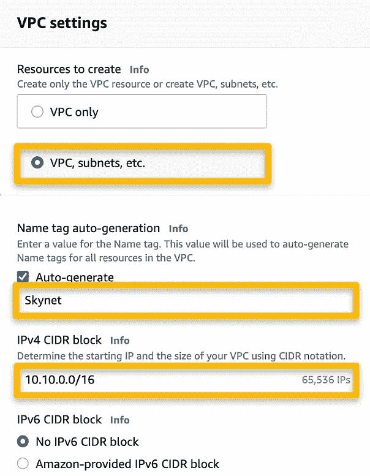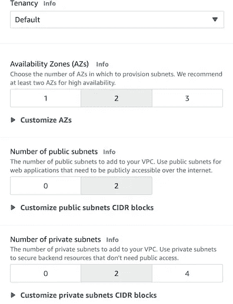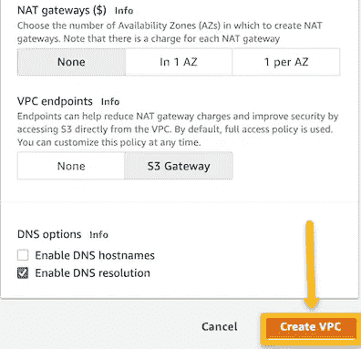

VPC 设置

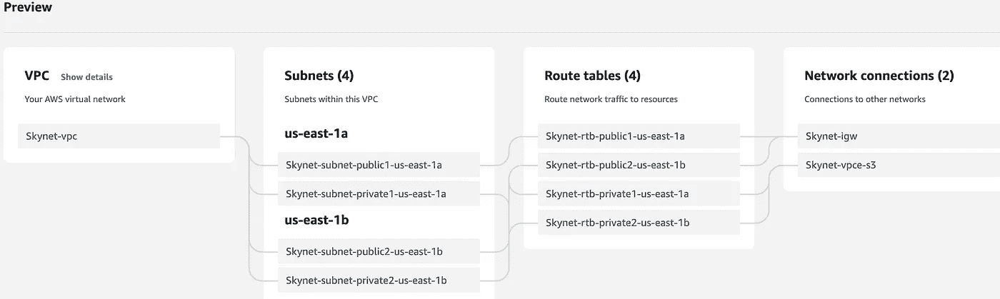

配置设置时自动创建 VPC 建筑的预览

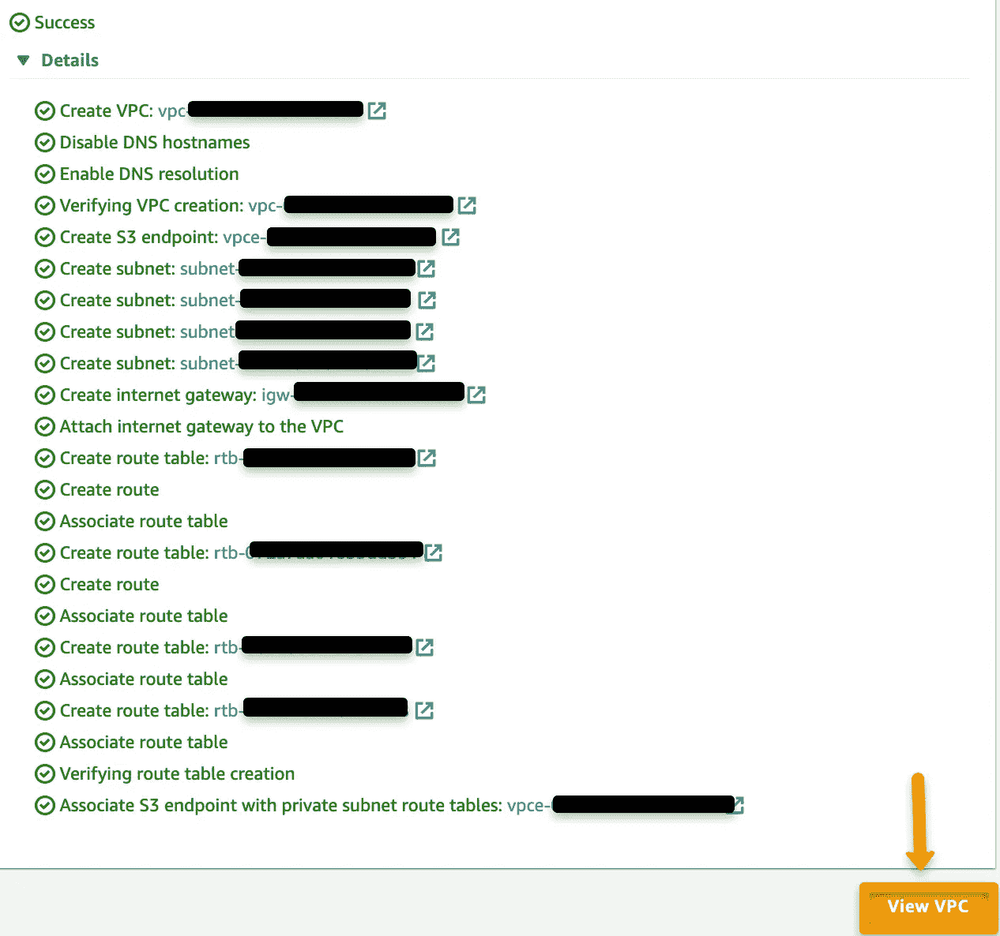

将使用所有必需的组件和 id 创建 VPC。观看 VPC 也能让你看到这一点。

## 安装 Apache 时的 EC2 和启动配置

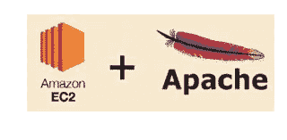

AWS EC2 和 Apache Webserver

1.  从 AWS 管理控制台，使用搜索栏导航到 EC2。在仪表板中，向下滚动到实例，然后选择启动模板。
2.  为模板的每个部分包括以下设置:

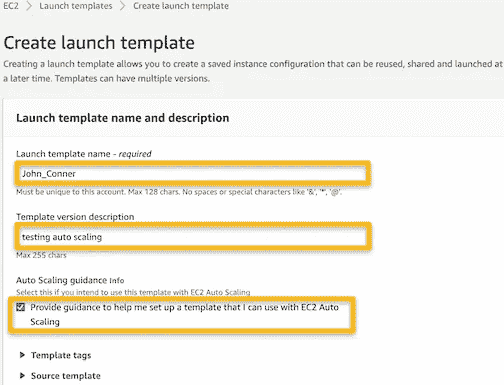

创建一个**启动模板 name |** check " **提供指导，帮助我设置一个可以与 EC2 自动缩放**一起使用的模板

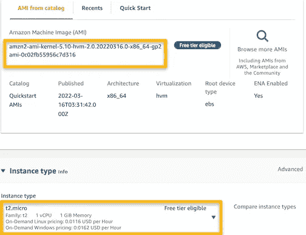

**AMI** —选择**亚马逊 Linux 2** (从*目录*或使用*最近* ) | **实例类型** →t2.micro ( *自由层*)

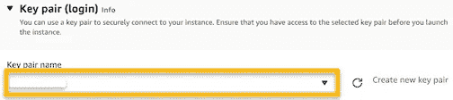

**密钥对(登录)** →创建**新的密钥对** *或*选择**现有的密钥对**

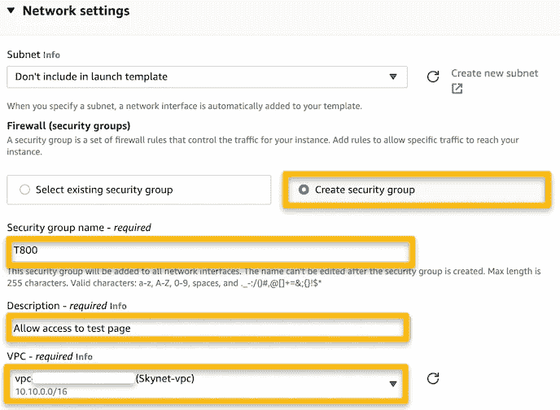

**网络设置** →创建安全组(这样我们可以附加新创建的 VPC)

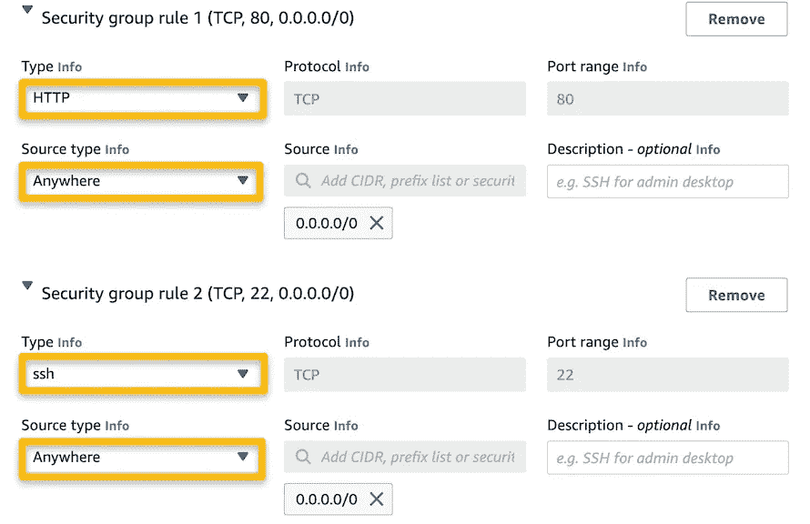

**安全组规则**:在现实场景中，我不会允许所有的 IP 地址访问，但是出于这个练习的目的，我不会限制访问。

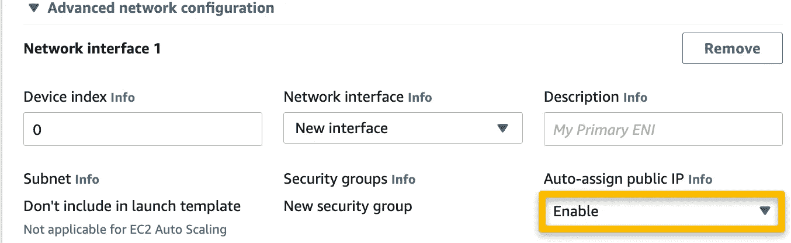

**高级网络配置** →选择**Enable****自动分配公共 IP** 以允许我们稍后在浏览器中查看实例的 Apache 测试页面。


**高级详情:**选择**启用**进行详细的 CloudWatch 监控

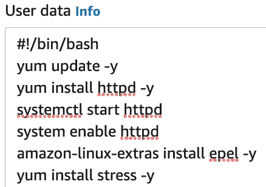

**高级细节** → **用户数据** —包括将更新软件包、安装 Apache 的引导程序，还包括我们将使用的压力工具。

```
#!/bin/bash
yum update -y
yum install httpd -y
systemctl start httpd
systemctl enable httpd
amazon-linux-extras install epel -y
yum install stress -y
```

3.配置完所有设置后，单击“启动模板”。在下一个屏幕中，您应该能够选择“从您的模板创建自动缩放组”选项。

## **创建自动缩放组**

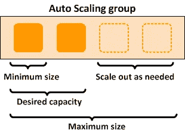

信用: [AWS 文档—亚马逊 EC2 自动缩放用户指南](https://docs.aws.amazon.com/autoscaling/ec2/userguide/what-is-amazon-ec2-auto-scaling.html)

1.  单击“从您的模板创建自动缩放组”后，按照下面列出的规范完成步骤 1-7。

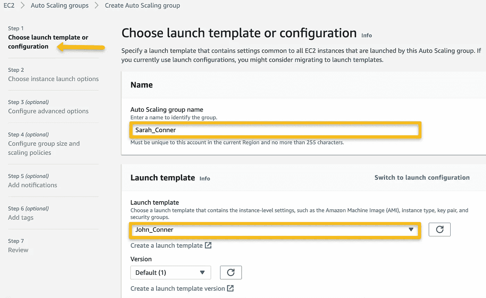

**第一步**:创建**自动缩放组名称**，选择前面创建的**启动模板**

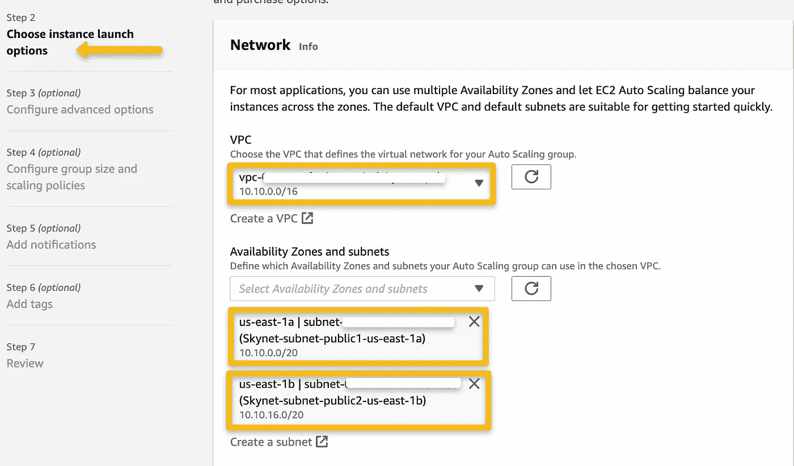

**步骤 2** : **网络** →选择在第一部分中创建的 VPC，仅选择公共子网以允许实例能够显示 Apache 测试页面。

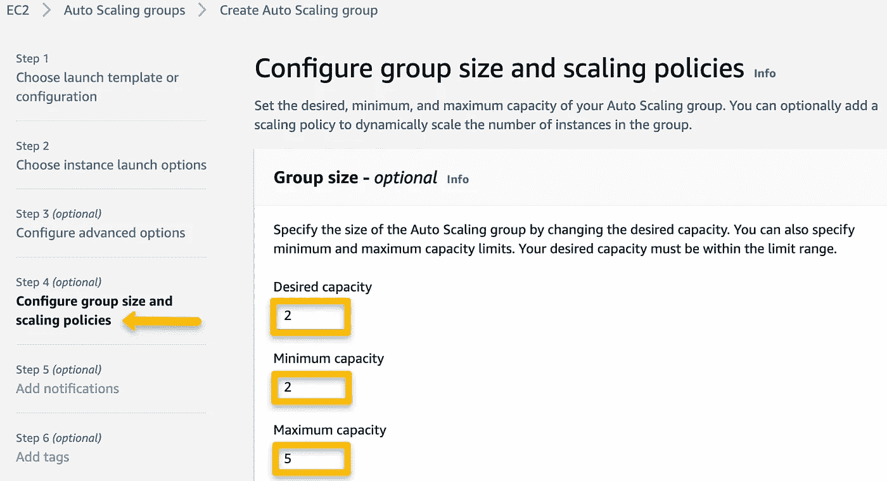

**第 4 步** - **第 1 部分**:由于本练习指定了 2 的**最小容量**和 5 的**最大容量**，我选择了 2 的**期望容量**进行测试。

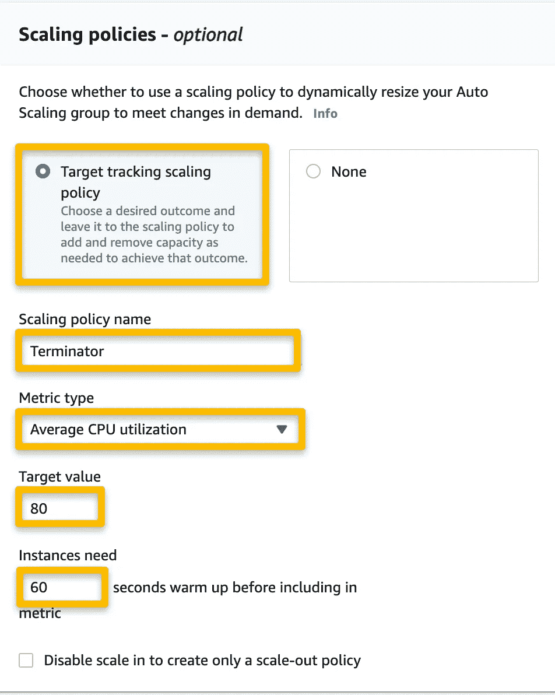

**第四步** — **第二部分**:添加(和名字！)一个**目标跟踪缩放策略**，能够指定将由自动缩放组使用的指标。对于本练习，指标包括一个 80 的**目标值**，如果超过 **CPU 利用率**，将允许创建更多实例。

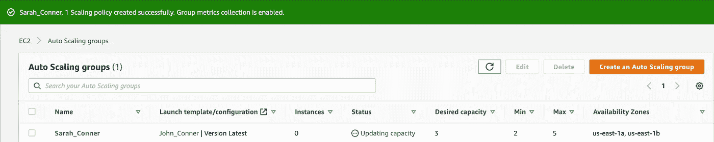

自动缩放组已成功创建

## 确认自动缩放组的成功并使用压力工具

1.  确认 Apache 已经安装在每个实例上:启动自动伸缩组几分钟后，实例将开始初始化和启动。实例运行并通过两种状态检查后，选择实例 id 以查看详细信息并复制公共 ip。在浏览器的搜索栏中，键入`http://<public_ip>`并点击“回车”。如果您到达 Apache 测试页面，那么从引导安装是成功的。

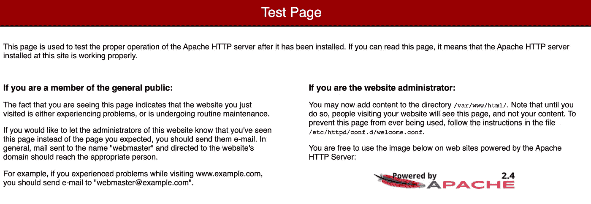

Apache 测试页面

2.从 AWS 管理控制台，使用搜索栏导航到 CloudWatch。因为我们在流程的早期检查了选项以跟踪 CloudWatch 中的 CPU 利用率指标，所以应该已经为 CloudWatch 仪表板中的 Auto Scaling 组创建了警报。

3.要运行我们引导到自动缩放组实例中的压力工具，打开终端，使用`$ cd <name_of_directory>`更改目录以确保您与 keypair 在同一个目录中。pem 文件。如有必要，使用命令`$chmod 400 <*nameofkeypair*>.pem`来保护它不被看到。然后，使用以下代码登录到正在运行的 EC2 实例之一:

```
$ ssh -i "<*nameofkeypair*>.pem" ec2-user@<*public_ip_of_instance*>$ sudo stress --cpu 1 --timeout 300
```

*   由于我的实例将需要 60 秒来预热(如 Auto Scaling 组中所配置的)，压力工具将需要对 CPU 施加足够的压力，以达到最大限度并触发目标跟踪策略中配置的 CloudWatch 警报。`--timeout`值代表压力测试的长度。压力测试将结束并产生以下结果:

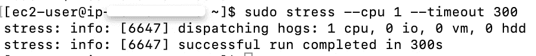

在本地终端中，压力工具将对我选择的实例施加 300 秒(5 分钟)的压力，允许 **CloudWatch** 跟踪指定的指标( **CPU 利用率**)。

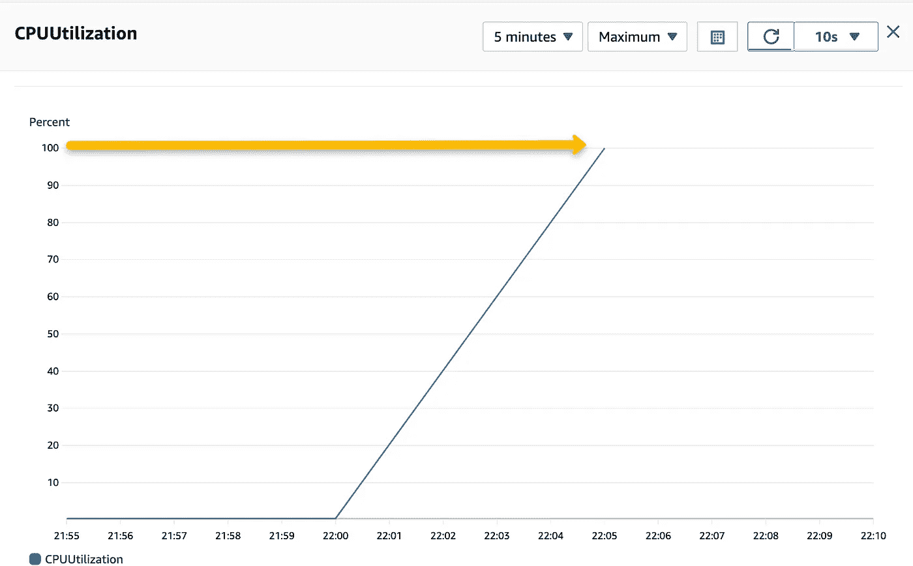

**cloud watch**→**Widget**带有 **CPU 利用率**指标集，跟踪 5 分钟内的最大值。压力测试得出 **100%的 CPU 利用率**，这意味着压力测试是成功的。(这可以在 **CloudWatch** 中查看，或者在 **EC2** 中选择一个正在运行的实例时查看)。

**我花了很多时间用不同的值调整压力测试，看看 CloudWatch 是如何调整图形的。出于同样的目的，我还试验了用于监控的值。在练习的这个阶段，了解这些调整如何影响结果是很有帮助的。