# 在移动设备上使用 AWS 设备群的好处

> 原文：<https://betterprogramming.pub/aws-device-farms-with-mobile-devices-ios-android-dec401bf65c1>

## 通过使用真正的 iOS 和 Android 设备来提高您的测试能力

# 概观

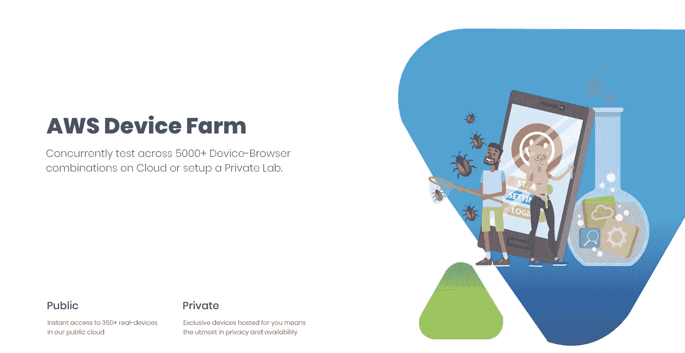

[AWS Device Farm](https://aws.amazon.com/device-farm/) 是一种测试应用程序的便捷方法，没有现场测试或测试团队在各种设备上测试应用程序的麻烦。AWS 提供了这个优秀的工具来进行多阶段的测试，而不需要或没有理由自己管理测试。下面，我试图通过从各种来源收集信息来概述 AWS Device Farm 的实现和测试移动应用程序的要求。

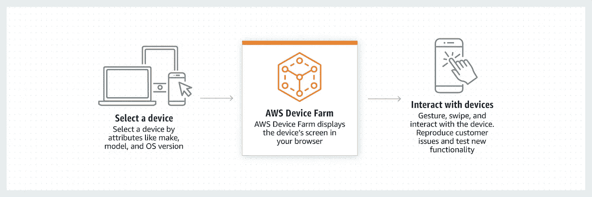

AWS 设备场创建项目，这些项目是一个或多个设备测试运行的容器。也就是说，如果您想要在多个设备上运行测试脚本，您可以创建一个包含测试运行的项目，而测试运行又包含同时在多个设备上运行的测试脚本。

这包括:

*   自动化测试
*   远程访问测试

要做到这一点，你只需要三样东西:

*   应用程序框架
*   像 iOS 和 Android 的 XCTest(AWS 支持多种类型的测试，如 Fuzz、UI Automation、Appium Junit 和 Python 等。)
*   运行它们的设备

您可以从 AWS 设备场获得您自己的测试类型所不能获得的东西。正如您将看到的，您的 SDK 将受益于 AWS Device Farm。

# 可以实现的测试目标

**多地点实时测试:**可以在多台设备上进行多地点测试。

**网络配置文件更改:**您可以通过有损连接、不良连接(使用预先填充的网络配置文件)、3G 有损、良好 Wi-Fi、不良 Wi-Fi，或者通过创建自己的网络配置文件来测试框架。

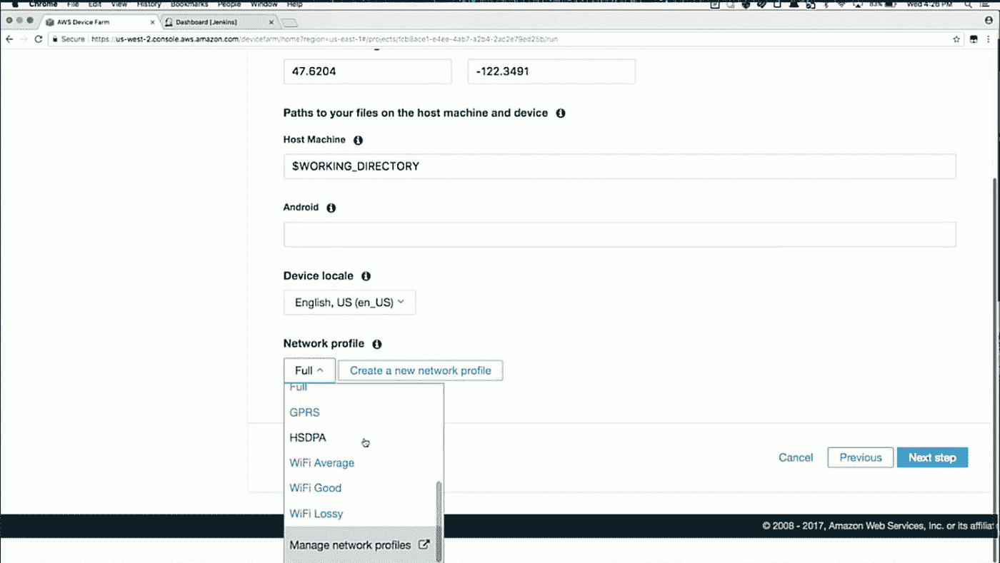

您可以创建自己的网络配置文件并进行相应的编辑。

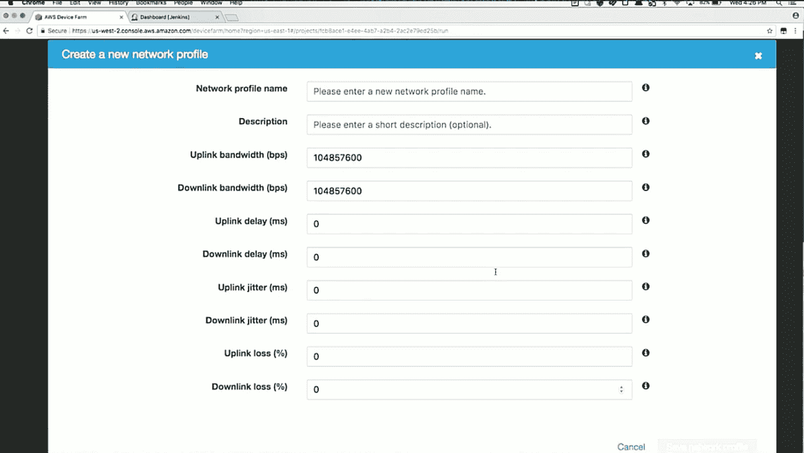

**测试执行运行时间:**设置测试在每个设备上运行的任意时间。

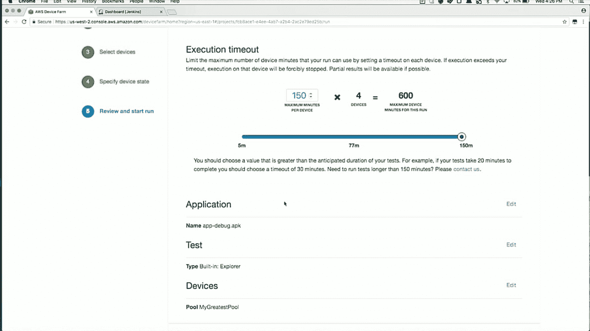

**多个设备的测试结果:**查看在不同设备上同时运行的多个测试，并实时比较设备。

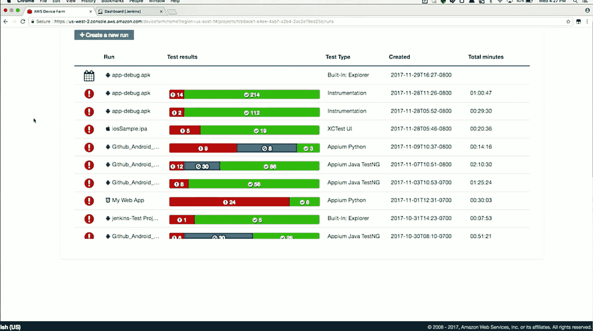

下面，一个设备没有错误，而其他三个设备有错误。

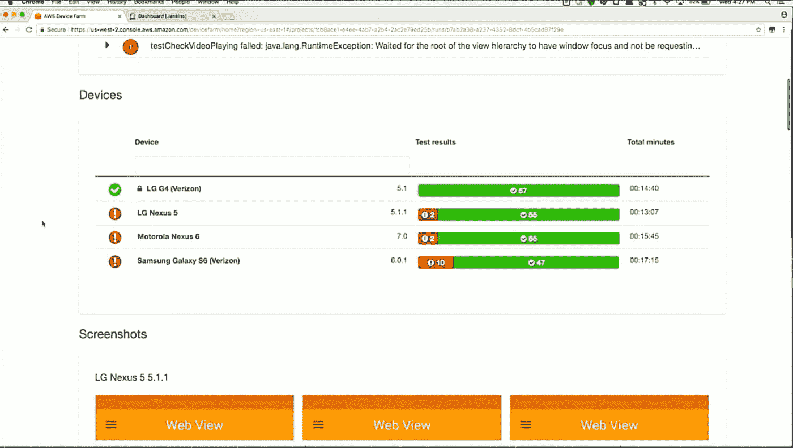

**多个设备上的多个错误:**查看多个设备上的多个错误，并同时比较这些设备上的错误。

**日志查看:**多种类型的设备日志可用。

*   线束日志

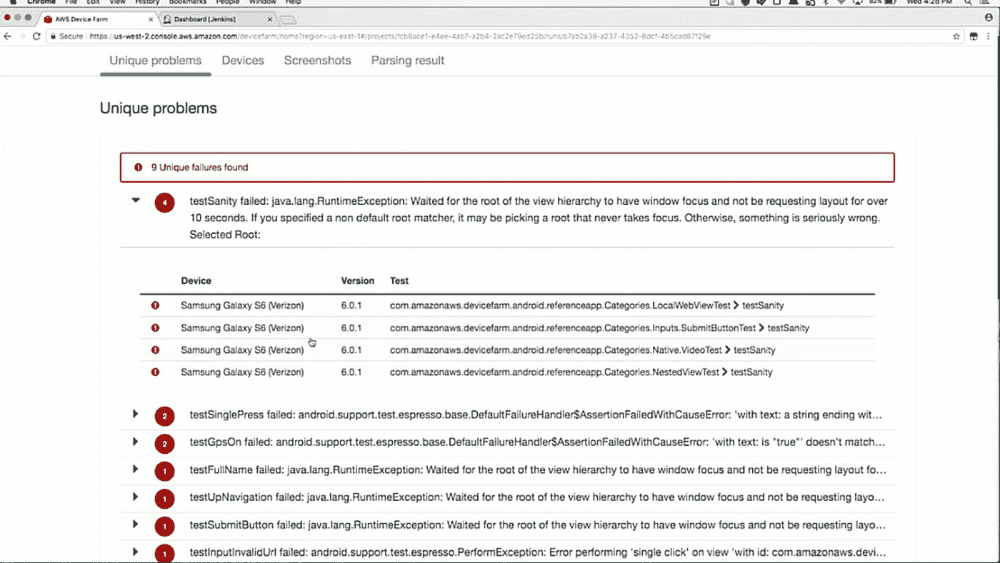

*   设备日志

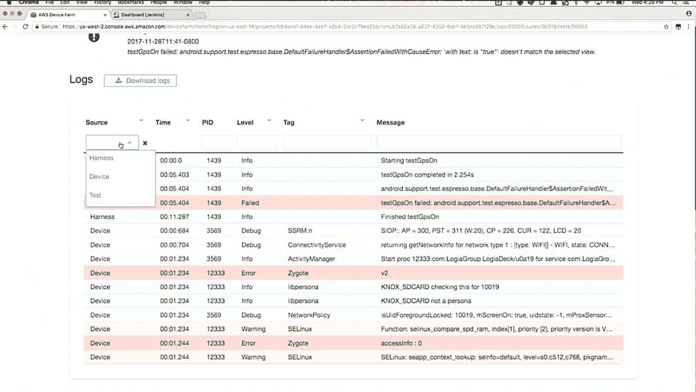

*   测试日志

**在多个设备上并行运行:**查看在不同设备上同时并行运行的多个测试。

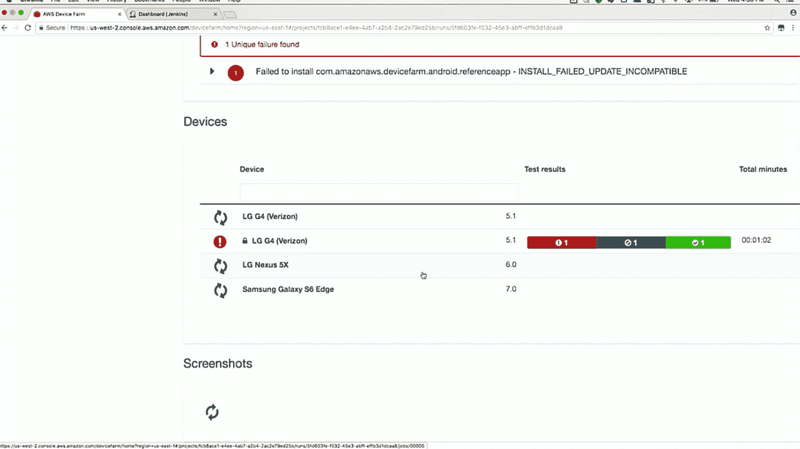

**配置项集成:**使用一个插件分三步将设备群与配置项连接起来。

1.  在 AWS 帐户中创建一个角色，为 AWS 设备场创建一个角色，并授予访问权限和密钥。
2.  在 GitHub Actions 中创建一个项目，配置它，构建测试，并在设备场上运行测试。
3.  如上面的屏幕截图所示，使用每个设备的日志检查测试结果。

# 可以涵盖的里程碑

*   良好性能:显示设备的高性能和低性能

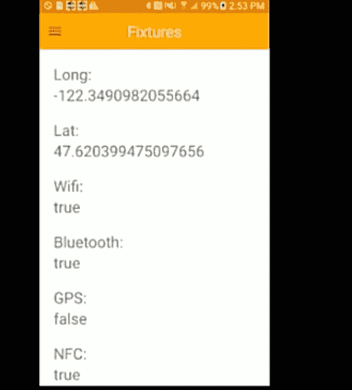

*   构建摘要生成器
*   与 DevOps 的联系
*   来自发行商的更快的调试和错误解决
*   向出版商和 SDK 团队提供丰富的报告