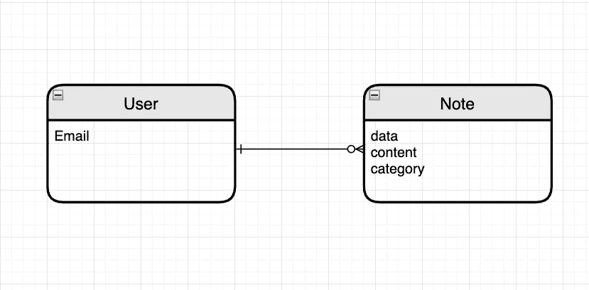
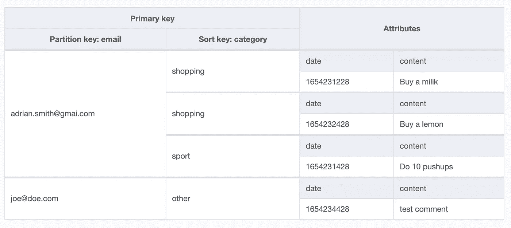

# AWS DynamoDB 全局辅助索引

> 原文：<https://betterprogramming.pub/aws-dynamodb-global-secondary-indexes-3ee7f6d8da0>

## 轻松扩展您的访问模式

照片由[Cookie Pom](https://unsplash.com/@cookiethepom?utm_source=medium&utm_medium=referral)在 [Unsplash](https://unsplash.com?utm_source=medium&utm_medium=referral) 上拍摄

我们都非常熟悉关系数据库系统。我们知道如何与他们合作。最佳实践是什么，我们知道如何利用它们。但是当负载变大时，RDBMS 就有问题了。对于高数据负载，查询可能需要很长时间才能完成。尤其是当查询使用`join` s 时。

出于这个原因，NoSQL 数据库今天正在崛起。他们正在解决缩放问题。然而，就像 IT 世界中的一切一样，这不是一个理想的解决方案。这是一种权衡。NoSQL 数据库通常比传统的关系数据库占用更多的空间，因为数据没有被规范化。学习曲线也可能是一个问题。

如果我们来自关系世界，学习 DynamoDB 会非常头疼。DynamoDB 有一些特性需要解释。这就是为什么在本教程中我将向您解释什么是全局二级索引，为什么它是有用的，以及如何创建一个。

在直接讨论索引之前，让我们简单地讨论一下 DynamoDB 的数据建模和单表设计。我将对 DynamoDB 和 RDBMS 进行广泛的比较，向您展示它们的不同之处。

在对关系数据建模时，您需要遵循规范化的规则。你知道该怎么做。通常，您不关心如何查询您的数据。建模只是关于拥有一个最优的，而不是冗余的数据模型。如果您的应用程序需要来自几个表的数据？没问题，一个简单的`JOIN`操作就可以了。您可以在表上调用的操作数量几乎是无限的。使用 SQL，您拥有完全的灵活性。但是在 DynamoDB 的世界里，以上都不适用。说真的，你可以把那些知识扔进垃圾箱。

你必须重塑你的思维来使用 DynamoDB。首先，为了对数据建模，你必须从考虑应用程序的访问模式开始。我的意思是，在拥有表之前，您必须知道您将触发的确切查询！

为了理解这一点，让我们看一个例子。假设，我们在开发一个简单的笔记 app:)。会有用户保存他们的笔记。便笺将包含日期、内容和类别。在 RDBMS 中，我们可能会以这样的关系结束:

用户和注释关系

如何在 DynamoDB 中保存相同的关系？如我所说，我们必须先知道访问模式。最初，我们将做三两个操作:

*   添加新注释
*   查找用户笔记
*   删除用户的注释

保存项目不是访问模式，所以我们只需要考虑两种情况。为了找到用户的笔记，我们可以使用用户电子邮件。这是一个很好的起点。然后，要删除一个笔记，我们必须确定确切的笔记。带有创建时间戳的用户电子邮件应该可以完成这项工作。因此，有了这样的标准，我们可以对表进行建模，将用户的电子邮件作为散列键，将日期时间戳作为排序键。这样，我们将满足我们的要求。

至少有四种方法可以在 DynamoDB 中实现一对多关系。我们刚刚使用了一种模式:复合主键和查询 API 动作。在下面，您可以看到包含示例数据的表格:

注释表 DynamoDB 中一对多关系的示例

我们有一个用户，它的所有注释都按项目集合分组。要创建与我相同的表，可以使用 AWS CLI 和以下查询:

要创建、查询和删除注释，您可以使用以下功能:

太好了。在这个有点长的介绍之后，我们终于准备好谈论全球二级指数(简称 GSI)。现在您知道 DynamoDB 中的数据建模完全是关于访问模式的。如果我们的访问模式发生变化或者出现新的访问模式，会发生什么？或者仅仅在建模的第一次迭代中，我们发现我们不能用一个组合键覆盖所有的访问模式？

这是很常见的情况。我们的例子很简单。在更复杂的表中，几乎可以肯定我们会遇到这样的问题。

GSI 扩展了新访问模式的 DynamoDB 表。它与主键具有相同的结构。您可以定义一个散列关键字，并可以选择添加一个排序关键字，但是您可以使用另一个项目的属性。在引擎盖下，迪纳摩复制你的项目，并保存在一个重塑的公式，让你以同样的速度查询它们。

重要的是，GSI 只能用于读操作。您不能使用 GSI 保存任何数据。每个 DynamoDB 表最多可以有 20 个全局二级索引。尽管如此，如果你有更多的访问模式，这不是一件大事。有一种索引重载的模式，但是这是一个很大的话题，我不会在本教程中讨论。

回到我们的例子。让我们想象一下，在我们的应用程序中，用户可以用类别来标记笔记。然后，用户可以从特定类别中获取所有笔记。使用当前键，我们只能获取所有用户的笔记，然后按类别过滤它们。肯定不是理想的解决方案。要添加按类别搜索的功能，我们必须定义一个新的 GSI。访问模式如下:

*   获取用户笔记的子集，分配到 XYZ 类别

GSI 将类似于我们的主键。哈希键将是相同的；我们将有用户的电子邮件的字符串字段。范围键会有所不同。这一次，我们将把 category 属性设置为范围键。事实上，如果我们知道这些访问模式，在第一次迭代中，我们可以创建本地二级索引，而不是全局二级索引(我们只能在创建表的过程中创建 LSI)。在下面，您可以看到具有以下索引的重新成形的表格:

注释表— GSI 视图

要创建 GSI，您可以在 AWS 控制台中完成，也可以键入以下命令:

为了更好的可读性，我把非字符串化的 JSON 放在下面。这是一样的，但是以更好的格式查看它是至关重要的。

要创建 GSI，您必须使用`update-table` API。在更新表时，我们可以选择几个选项，其中之一就是创建索引。然后，您必须设置正在更新的表的名称和表的区域。`attribute-definitions`选项设置索引的主键。最后，对于`global-secondary-index-updates`，您必须向 JSON 提供索引公式。您可以在一次操作中创建、更新或删除多个索引。在我们的例子中，我们只创建一个索引。

提供的索引 JSON 必须包含一些参数。首先是索引名。下一个是一个`IndexName`，它是索引的主键定义。一个有趣的是`Projection`参数。为 DynamoDB 表创建索引时，可以决定在索引中保存哪些属性。你不必拯救所有人。在我们的例子中，拥有它们是很有用的，所以我使用了`All`属性。

最后，对于 GSI，我们必须设置自己的`ProvisionedThroughput`。索引可能比原始主键多或少地被占用，因此有一个设置不同值的选项。

最后，您可以测试新索引，查询数据:

这个查询和上一个查询的一个区别是提供了`index-name`标志。

这就是关于 GSI 的全部故事。我希望你已经发现这个解释简单而有用。使用 DynamoDB 时，GSI 是开发人员手中最重要的资产之一。所以，花点时间好好学习它们，你会收获很大的成果。

祝你有美好的一天，下次再见！