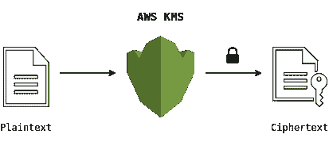
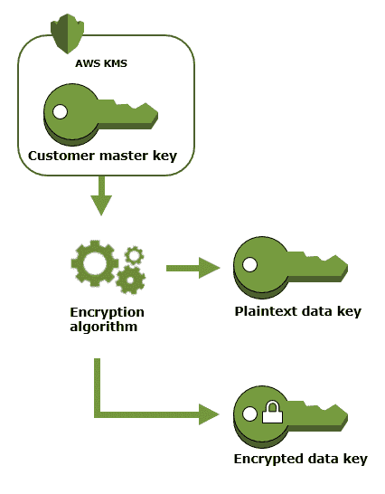
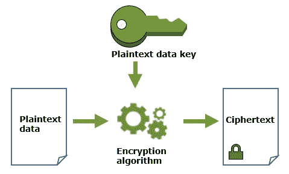
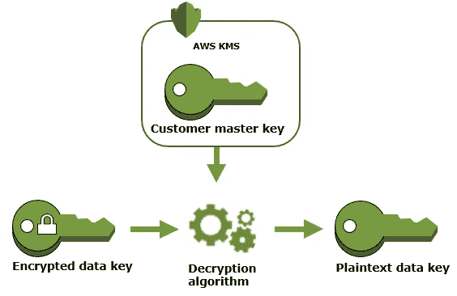

# AWS 密钥管理服务:您需要知道的一切

> 原文：<https://betterprogramming.pub/aws-key-management-service-all-you-need-to-know-8c6b0e17a2d0>

## 存储和控制您最重要的应用和服务的加密密钥

图片来自 [EaseTech](https://www.easetech.com/) 。

# **什么是 AWS KMS？**

AWS 密钥管理服务(KMS)是一项全面管理的服务，用于创建、存储和控制加密密钥，以便对您的数据进行加密。

一些要点:

1.  KMS 是一种非常耐用且可用的服务。
2.  KMS 加密密钥是区域性的。
3.  该服务利用了幕后的[硬件安全模块(HSM)](https://aws.amazon.com/cloudhsm/) ，这反过来保证了生成的密钥的安全性和完整性。
4.  它提供了简单的密钥轮换，并将所有与密钥相关的事件记录到 AWS CloudTrail。

# **关键概念**

## 客户主密钥(cmk)

客户主密钥绝不会让 AWS KMS 服务处于未加密状态。它们包含元数据，如密钥 id、创建日期等。它们可用于加密/解密不超过 4 KB 的任意数据块。
通常，您使用 CMKs 生成、加密和解密在 AWS KMS 之外用于加密数据的数据密钥。这就是所谓的信封加密。

cmk 可以是:

1.  客户管理—由 AWS 用户创建和管理。可以使用 AWS IAM 服务来控制对它的访问。
2.  AWS-managed —由 AWS 代表您创建和管理。它们可以通过格式 aws/service-name 来标识。
3.  AWS 所有—这些不在您的 AWS 帐户中。它们是 AWS 拥有和管理的 cmk 集合的一部分，用于多个 AWS 帐户。用户无法查看或管理它们。

## 数据键

这些是由 AWS KMS 生成的对称密钥，可以加密/解密大量数据。AWS KMS 不存储、管理或跟踪数据密钥，也不使用数据密钥执行加密操作。您必须在 AWS KMS 之外使用和管理数据密钥。

# **使用 AWS KMS 的基本加密**

这是一种使用 AWS CMKs 加密/解密数据的简单方法。

图片来自 [DEV](https://dev.to/) 。

局限性:

1.  CMKs 一次最多只能加密/解密 4 KB 的数据。
2.  每次需要加密/解密时，向亚马逊服务发送大量数据的成本会很高。此外，它可能涉及安全问题，如中间人攻击等。

# **信封加密**

这同时利用了数据密钥和 cmk。它使用数据密钥来加密纯文本，使用 CMKs 来加密数据密钥。

1.  使用 AWS 的[generated takey 操作](https://docs.aws.amazon.com/kms/latest/APIReference/API_GenerateDataKey.html)生成数据密钥。AWS KMS 使用 cmk 生成数据密钥。它将返回数据密钥的明文副本和使用 CMK 加密的数据密钥。

来自 [AWS 文档](https://docs.aws.amazon.com/)的照片。

2.用明文数据密钥加密数据。AWS KMS 不能使用数据密钥加密数据，但是您可以在 AWS KMS 之外使用数据密钥加密/解密您的数据。使用数据密钥的明文副本加密明文数据后，为了安全起见，请尽快从内存中删除该数据密钥。存储数据密钥的加密副本用于解密。

图片来自 [AWS 文档](https://docs.aws.amazon.com/)。

3.使用加密的数据密钥解密数据。要解密数据，使用 AWS KMS 的[解密操作](https://docs.aws.amazon.com/kms/latest/APIReference/API_Decrypt.html)来解密加密的数据密钥，以获得数据密钥的明文副本(使用 CMK 解密)。然后使用这个明文数据密钥在 AWS KMS 之外解密密文。

图片来自 [AWS 文档](https://docs.aws.amazon.com/)。

以下是使用信封加密的优点:

1.  你不需要保护数据键。您可以简单地将加密的数据密钥与加密的数据一起存储。
2.  它使您能够结合对称密钥加密算法和公钥加密算法的优点。
3.  您获得了性能提升，因为您不需要向 Amazon 服务器发送大量数据。
4.  您可以重新加密您的数据密钥，而不是用多个数据密钥重新加密您的原始数据。

# **一些好的资源**

 [## AWS 关键管理服务概念

### 了解 AWS 密钥管理服务(AWS KMS)中的基本术语和概念，以及它们如何协同工作来帮助保护…

docs.aws.amazon.com](https://docs.aws.amazon.com/kms/latest/developerguide/concepts.html)