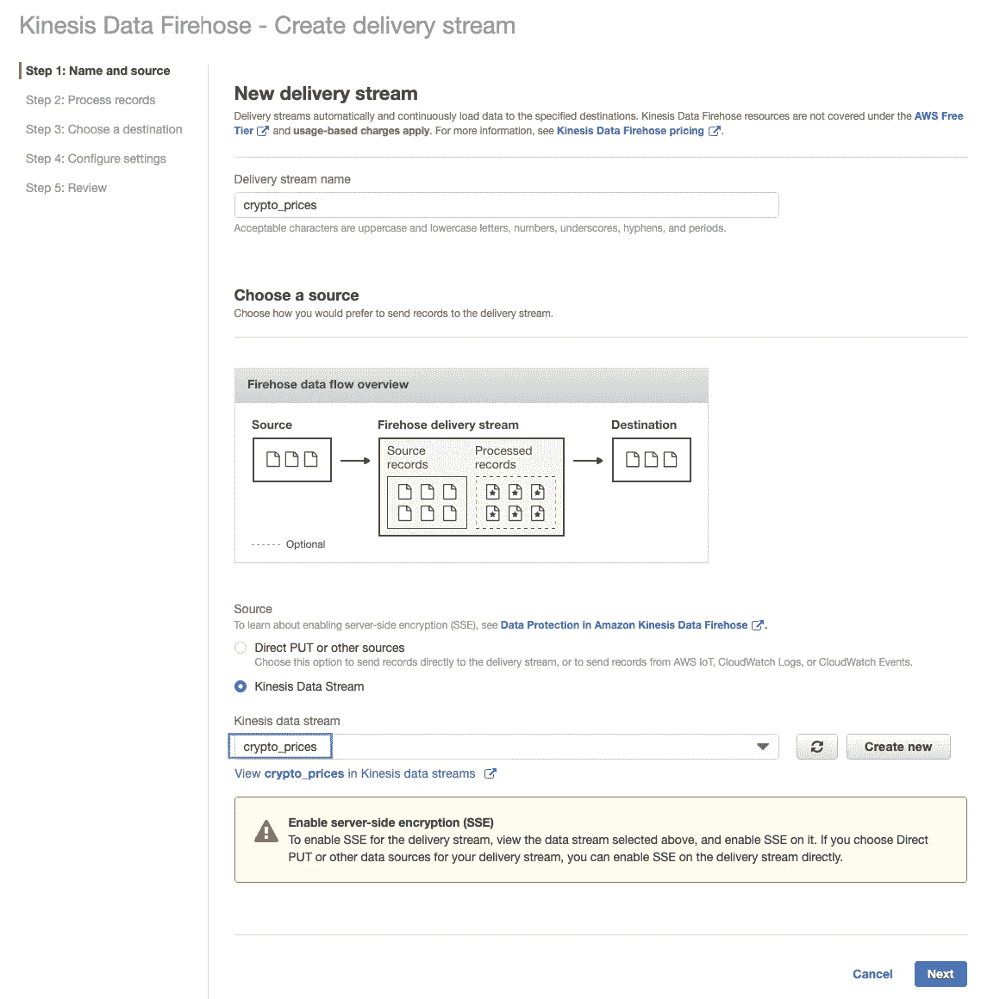
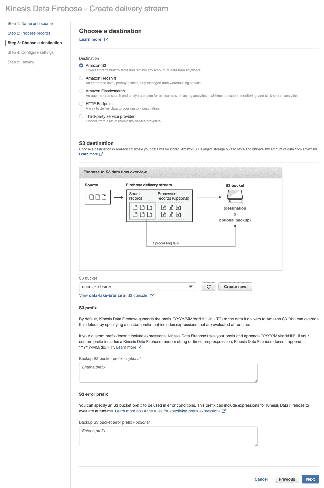
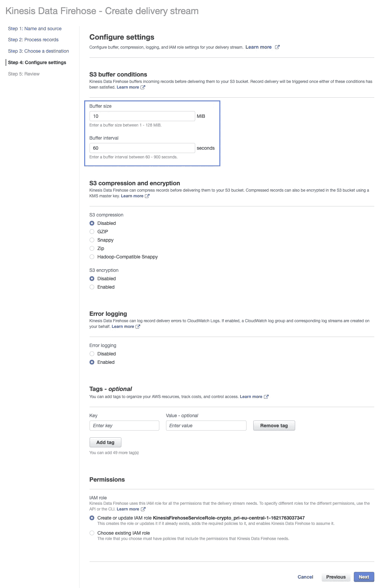
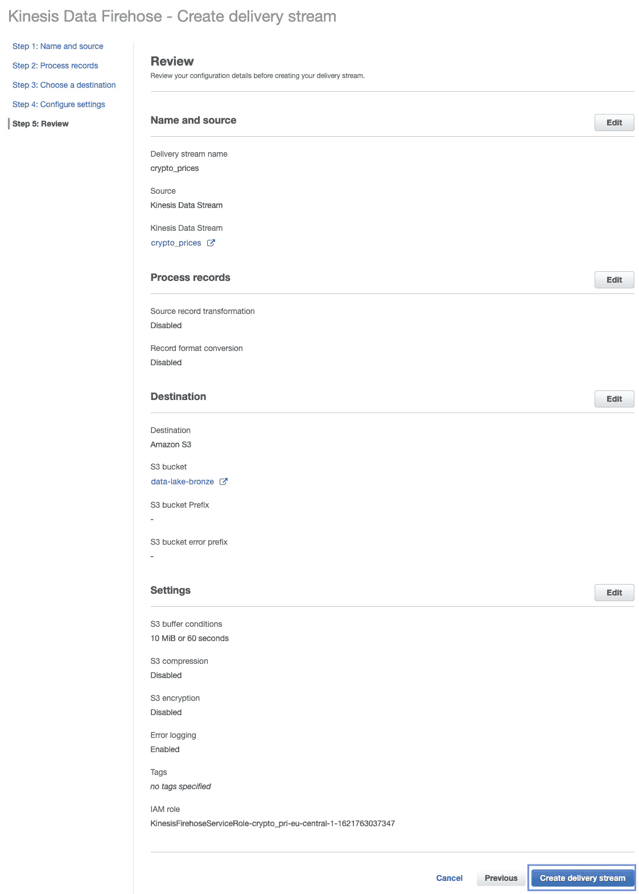
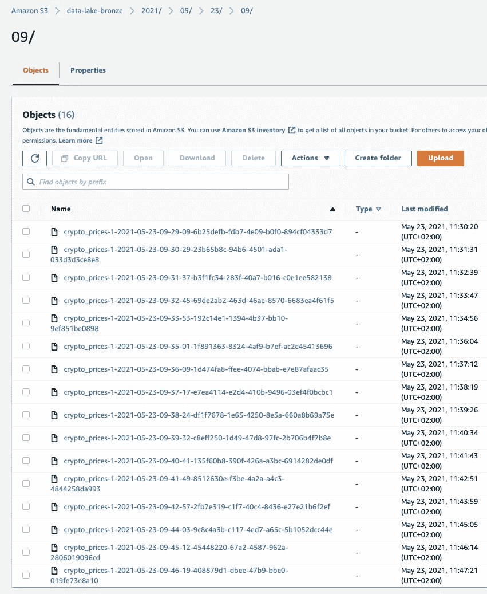
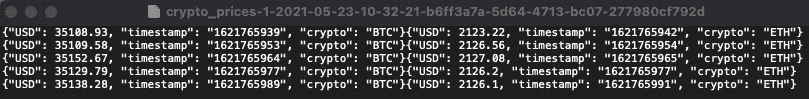
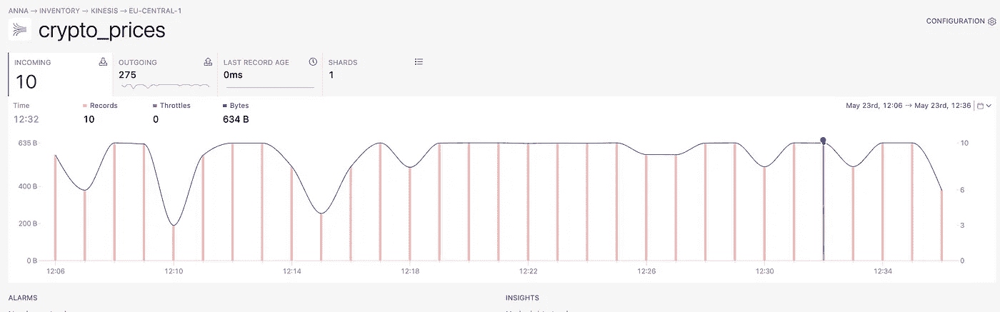
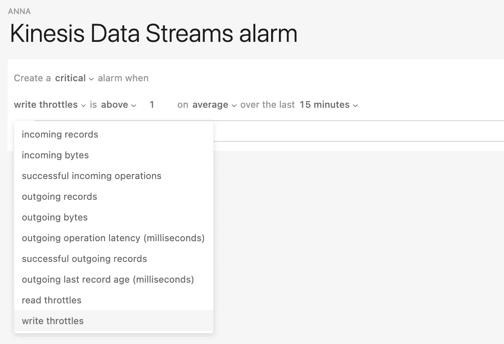
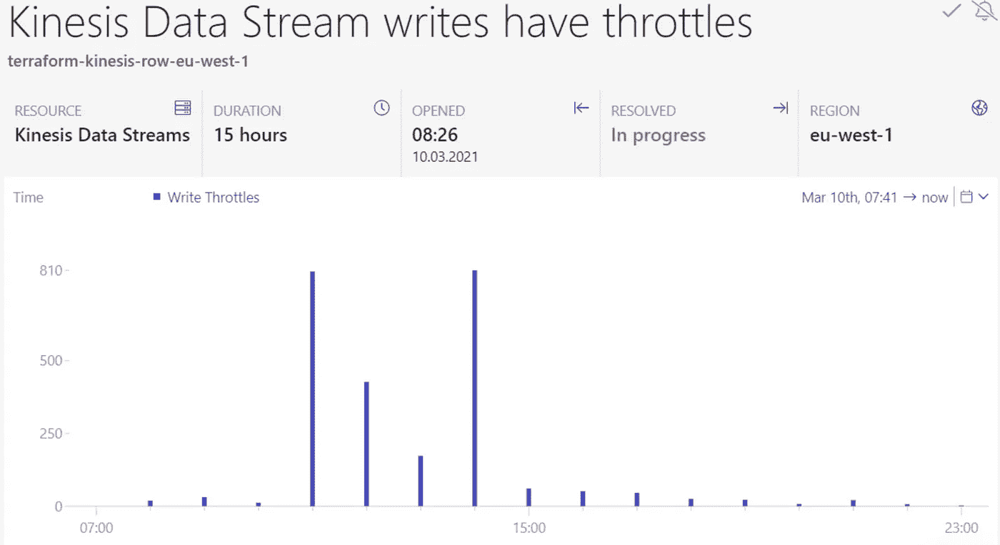
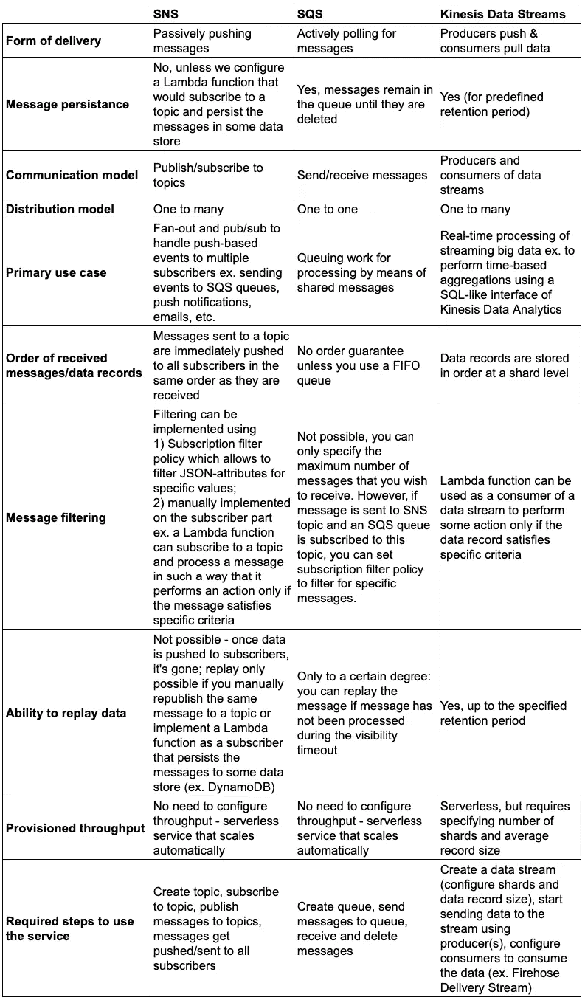

# AWS kine sis vs . SNS vs . SQS——与 Python 示例的比较

> 原文：<https://betterprogramming.pub/aws-kinesis-vs-sns-vs-sqs-a-comparison-with-python-examples-6fc688bfd244>

## 如何选择适合您的用例的解耦服务


Wil Stewart 在 [Unsplash](https://unsplash.com?utm_source=medium&utm_medium=referral) | [品牌内容披露](https://www.annageller.com/disclosure)上的照片。

解耦提供了无数的优势，但是为这项工作选择正确的工具可能具有挑战性。仅 AWS 就提供了几种服务，允许我们分离发送和接收数据。虽然这些服务表面上看起来提供了相似的功能，但它们是为不同的用例设计的，如果恰当地应用于手头的问题，它们中的每一个都是有用的。

# AWS SQS

作为历史最悠久的 AWS 服务之一，SQS 在提供极其简单有效的解耦机制方面有着良好的记录。整个服务基于向队列发送消息，并允许应用程序(例如 ECS 容器、Lambda 函数)轮询消息并处理它们。消息会一直留在队列中，直到某个应用程序获取它，处理它，并在完成后删除消息。

SQS 和其他去耦服务之间最重要的区别是它不是发布-订阅服务。SQS 没有生产者、消费者、主题或订阅者的概念。它所做的只是提供一个分布式队列，允许:

*   向队列发送消息。
*   轮询队列中的消息。
*   从队列中提取消息。
*   成功处理消息后，从队列中删除消息。

SQS 不向任何应用程序推送消息。相反，一旦消息被发送到 SQS，应用程序必须主动轮询消息以接收和处理它们。此外，从队列中提取消息并使其消失是不够的。消息会一直留在队列中，直到:

*   它已被成功处理并从队列中删除。
*   可见性超时已过期。想象一下，一个容器化的应用程序获得了一条消息，但是在处理它的时候，它陷入了一个僵死的进程。为了确保此消息将被处理，一旦可见性超时过期，它将对其他工作人员可见。该超时可以设置为从 0 秒到 12 小时，默认值为 30 秒。

下面的代码片段演示了如何:

*   创建一个队列。
*   向队列发送消息。
*   接收、处理和删除消息。

默认情况下，SQS 不保证消息将按照发送到队列的顺序进行处理，除非您选择 FIFO 队列。这可以在创建队列时轻松配置:

```
sqs.create_queue(*QueueName*=queue_name,
      *Attributes*={'VisibilityTimeout': '3600', 'FifoQueue': 'true'})
```

# 社交网站（Social Network Site 的缩写）

尽管 SNS 代表简单通知服务，但它提供的功能远不止发送推送通知(电子邮件、短信和移动推送)的能力。事实上，它是一个无服务器的发布-订阅消息系统，允许您同时向多个应用程序(订阅者)发送事件(扇出)，包括 SQS 队列、Lambda 函数、Kinesis 数据流和通用 HTTP 端点。

为了使用该服务，我们只需:

*   创建一个主题。
*   订阅一个话题。
*   确认订阅。
*   开始向一个主题发送事件，以便将它们传递给所有订阅者(可能是多个应用程序和人员)。

你如何决定是否需要使用 SQS vs. SNS？任何时候多个服务需要接收同一个事件，你应该考虑 SNS 而不是 SQS。来自 SQS 队列的消息只能由单个工作节点或进程成功处理。因此，如果需要扇出机制，就需要创建一个 SNS 主题，以及一个或多个 SQS 队列，用于需要从 SNS 接收特定事件或数据的所有应用程序。然后，多个 SQS 队列可以订阅这个 SNS 主题并同时接收消息。

例如，想象一个简单的场景，有可能将同一个事件(消息)发布到开发(登台)和生产环境中:


使用 SNS 实施扇出机制，以区分开发和生产资源。图片由作者提供。

以下 Python 脚本演示了如何:

*   创建一个社交网络话题。
*   订阅社交网络话题。
*   向 SNS 主题发布消息。

# AWS Kinesis 数据流

AWS 在 Kinesis 家族下提供一整套服务。当人们提到 Kinesis 时，他们通常指的是 Kinesis 数据流——一种允许你通过利用生产者和消费者对数据记录碎片进行操作来几乎实时地处理大量流数据的服务。

*   生产者是由 Kinesis 代理、生产者库或 AWS SDKs 生成的脚本，它们将数据发送到数据流。
*   消费者是客户端库或 AWS 服务(AWS Lambda，Kinesis Data Firehose，Kinesis Data Analytics)，它们处理来自这些数据流的数据。
*   每个数据流由一个或多个碎片组成。
*   碎片是由序列号唯一标识的数据记录的集合。
*   每个数据记录都有一个分区键，用于确定哪个碎片将存储特定的数据记录。这应该有助于将经常一起访问的数据记录分组到同一个碎片中。
*   每个数据记录还有一个保存实际数据的数据 blob。这些数据可以以各种形式存储，只要它适合一个 1 MB 的 blob 对象。
*   一旦数据记录被发送到数据流，它就可以在数据流中保留指定的保留期，从 24 小时到 7 天不等。

除了 Kinesis 数据流，“Kinesis 系列”还包括:

*   Kinesis Data Firehose —一种通过通用 HTTP 端点将数据记录自动传送到 S3、红移、Datadog、New Relic、MongoDB 或 Splunk 等服务提供商以及其他来源的服务。这项服务背后的警告是，它不是实时提供数据，而是以微批处理的方式提供数据。数据以 60-900 秒的速度或在预定义的缓冲区大小(1-128 MB)填满后被传送到选定的目的地。
*   Kinesis 数据分析—一种允许我们在数据进入数据流时对其进行转换和分析的服务。我们可以使用类似 SQL 的接口进行转换(例如，使用 regex 解析来自 JSON 或流日志的信息)，并通过滑动窗口聚合将流数据聚合到及时的时段(例如，15 分钟时段)来收集见解。

## 一个使用 Python 的 Kinesis 数据流的简单演示

为了演示如何使用 Kinesis 数据流，我们将请求当前的加密货币市场价格(数据生产者)，并使用 Python 生产者将它们摄取到 Kinesis 数据流中。

要在 AWS 控制台中创建数据流，我们需要提供一个流名称并配置碎片的数量:


创建数据流。图片由作者提供。

然后，我们可以开始向流中发送实时市场价格。在下面的示例中，我们每十秒钟发送一次:

该脚本将无限期运行，直到我们手动停止它。

## 使用 Kinesis 数据消防水带来消耗数据

到目前为止，我们配置了一个 Kinesis 数据生成器，向数据流发送实时市场价格。有许多方法可以实现 Kinesis 消费者。对于这个演示，我们将实现最简单的方法，即利用一个消防软管交付流。

我们可以在 AWS 控制台中配置 Kinesis Data Firehose 直接向 S3 发送数据。我们需要选择之前创建的数据流，对于其他所有东西，我们可以应用默认值。



创建交付流。图片由作者提供。

最重要的部分是配置目的地。对于我们的用例，我们选择 S3，并选择一个特定的存储桶:



创建交付流。图片由作者提供。

我们需要配置微批量数据发送到 S3 的频率:



创建交付流。图片由作者提供。

然后，我们可以确认创建一个交付流:



创建交付流。图片由作者提供。

在交付流创建后不久，我们应该能够看到每分钟都有新数据到达我们的 S3 桶(假设您的 Python 生成器代码仍在运行):



来自 S3 交付流的数据。图片由作者提供。

为了查看这些数据，我们可以从 S3 下载一个文件并检查其内容:



来自传递流的数据。图片由作者提供。

## 如何监控数据流的健康状况

尽管 Kinesis 数据流是无服务器的，但它需要跨分片的适当数据分配。跟踪任何写限制的一种可能方式是使用 [Dashbird](https://dashbird.io/) 。在下图中，我们可以看到每分钟有多少记录被发送到流中。这表明我们并不总是每分钟收到十条记录。



[仪表板](https://dashbird.io/)中的 Kinesis 数据流。图片由作者提供。

Dashbird 允许您配置读取或写入限制的警报:



[Dashbird](https://dashbird.io/) 中的 Kinesis 数据流警报。图片由作者提供。

这是警报触发后的样子:



[Dashbird](https://dashbird.io/) 中的 Kinesis 数据流警报。图片由作者提供。

# 您应该为您的用例选择哪种服务？

在这三个服务中，Kinesis 是最难使用和规模化运营的一个。最好从一个 SNS 主题和一个或多个订阅它的 SQS 队列开始。当你需要对流数据执行类似于`map-reduce`的操作时，Kinesis 大放异彩，因为它允许你聚合类似的记录并构建实时分析应用程序。但与此同时，监控碎片和 Kinesis 流吞吐量增加了一些额外的复杂性，并增加了可能出错的错误空间。随着数据的增长或缩减，您需要注意重新分片(当通过向上扩展添加新分片时，`shard split`当通过向下扩展删除分片时)，以确保您有足够的吞吐量，并且您不会为空闲分片付费。

如果你对 Kinesis 数据流的唯一论点是重放数据的能力，那么你可以通过引入一个 Lambda 函数来达到同样的目的，该函数订阅 SNS 主题并将所有收到的消息加载到某个数据库，如 Timestream、DynamoDB 或 Aurora。通过利用数据插入的时间戳，您将确切地知道特定消息是何时收到的，这简化了出错时的调试。

为了更容易地为您的用例选择解耦服务，请查看下表，比较这三种服务的特征:



社交网络对 SQS 对 Kinesis 数据流。图片由作者提供。

# 结论

在本文中，我们研究了 SNS、SQS 和 Kinesis 数据流之间的差异。我们构建了一个简单的演示，展示如何将数据从数据生产者发送到 Kinesis，交付流如何消费数据，以及如何监控任何潜在的写节流。对于每个服务，我们演示了如何在 Python 中使用它，并以一个比较服务特征的表格结束。

感谢您的阅读。

# **参考文献**

*   [亚马逊 Kinesis 数据流术语和概念](https://docs.aws.amazon.com/streams/latest/dev/key-concepts.html)
*   [为什么我应该使用亚马逊 Kinesis 而不是 SNS-SQS？](https://stackoverflow.com/questions/26623673/why-should-i-use-amazon-kinesis-and-not-sns-sqs)