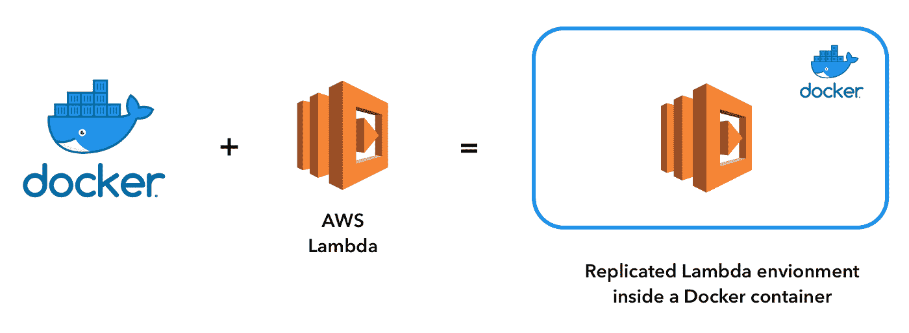
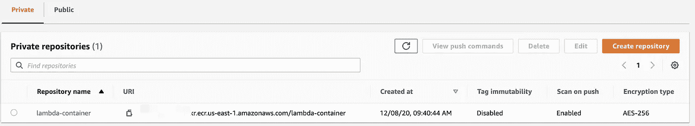
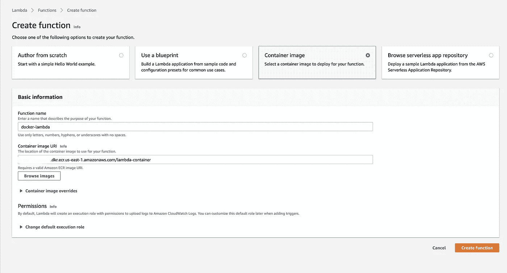

# AWS Lambda 现在支持容器图像

> 原文：<https://betterprogramming.pub/aws-lambda-now-supports-container-images-bff86b0f62b1>

## 如何使用容器图像支持，这对我们意味着什么

阿伦·罗拉尼的照片。

最近，AWS 宣布他们现在为 Lambda 函数提供容器图像支持。

以前，部署 Lambda 函数的唯一方法是压缩代码。这种新的支持意味着我们现在可以使用容器化的映像作为部署和本地开发的源。

在本文中，我将对更新进行简要总结，并给出一个为 Node.js Lambda 创建和部署映像的简单示例。我也会分享一些好处和坏处。

# 一些关键点

在我们开始之前，我想列出更新的一些要点，以提供更多的背景知识。

现在，您可以使用包含代码的容器映像作为 Lambda 函数的源。容器映像可以从 AWS 提供的的[基础映像之一创建，它已经实现了不同的运行时。](https://docs.aws.amazon.com/lambda/latest/dg/runtimes-images.html)

你也可以创建自己的自定义映像，但是它必须实现 [Lambda 运行时 API](https://docs.aws.amazon.com/lambda/latest/dg/runtimes-api.html) 才能工作。

这种支持允许您部署大小高达 10 GB 的映像。还可以使用 Lambda 扩展 API 与 Datadog 或 CloudWatch 等工具集成进行监控。

AWS 的所有基本映像都附带了 [Lambda 运行时接口仿真器](https://github.com/aws/aws-lambda-runtime-interface-emulator/)，它为您提供了一个 URL 来本地测试 Lambda。

# 创建 Lambda 容器

这里，我用依赖文件`package.json`创建了一个名为`lambda.js`的基本 Lambda 函数:

lambda.js

package.json

Lambda 本身只有一个简单的控制台日志，输出一个字符串和有效负载。但是在现实世界中，你会有更复杂的代码和更多的依赖于`package.json`。

为了创建图像，我们有一个 Dockerfile 文件:

第一行是提取 AWS 提供的基础映像。我们希望使用`node:12`运行时来运行 Lambda。您还可以使用其他基本图像，它们都位于 Docker Hub 或 [ECR 公共图库](https://gallery.ecr.aws/)中。

然后，我们将`package.json`和`lambda.js`复制到容器中并运行`npm install`。这将安装 Lambda 需要的所有依赖项。

第 5 行将把图像的命令设置给函数处理程序。这可以在配置功能时作为一个参数被覆盖。要打开这个容器，在同一个目录中创建另一个`docker-compose.yaml`文件:

这个文件用我们刚刚创建的 Dockerfile 构建了一个 Lambda 服务，它将公开端口 9000 供我们使用。运行`docker-compose up --build`现在将构建映像并为本地开发旋转一个容器。

要触发这个函数，您可以通过向:`http://localhost:9000/2015-03-31/functions/function/invocations`发送一个带有任何 JSON 有效负载的 HTTP post 请求来使用 Lambda 运行时 API。您应该看到您的 Lambda 函数被触发，并且可以看到日志输出。

现在，您可以开始在其他服务中使用这个 Lambda，并在本地测试它。

# 部署功能

要部署一个功能，我们必须将我们的映像推入 AWS ECR，然后在配置 Lambda 时可以选择它。让我们创建一个 shell 脚本来处理所有这些。

这段代码使用了 [AWS-CLI v2](https://docs.aws.amazon.com/cli/latest/userguide/install-cliv2.html) 。如果您想继续操作，请确保您已经安装了它并配置了 AWS 凭证。

deploy.sh

第一个命令构建我们创建的图像，并用名称`lambda-container`标记它。

第二个命令用于在 ECR 中创建存储库。在这里，我们可以指定 repo 的名称和图像扫描配置。我将`scanOnPush`设置为`true`，这将迫使 ECR 在被推送已知漏洞时扫描图像。

第三个命令遵循[文档，用于推送 Docker 图像](https://docs.aws.amazon.com/AmazonECR/latest/userguide/docker-push-ecr-image.html)。我们需要用 ECR 注册表标记我们想要推送的 Docker 图像。斜杠后面的名称应该跟在我们刚刚创建的存储库的名称之后，即`lambda-container`。

然后我们需要使用`get-login-password`函数向 ECR 认证。然后，结果将通过管道传输到 Docker 登录的下一个命令中。这在文档中有详细的概述[。](https://docs.aws.amazon.com/AmazonECR/latest/userguide/Registries.html#registry_auth)

最后一个命令将把图像推送到 ECR repo:

运行脚本后，您的映像应该被推送到 ECR，您应该能够在管理控制台上看到它。现在我们准备创建函数。

# 创建函数

使用我们构建的映像作为源来创建 Lambda 可以在控制台上完成，也可以使用 AWS-CLI 来完成。

控制台方式非常简单。导航至`Lambda -> Create Function`并选择“容器图像”选项。然后，您可以输入 Lambda 的名称。点击“浏览图像”在 ECR 中找到上传的图像:

您还可以覆盖容器映像配置或更改执行角色。

最后，你可以点击“创建函数”按钮，你的 lambda 将在云上运行。

# 利弊

现在我们来谈谈优点:

1.  将 Lambdas 部署为容器映像使得部署更加干净——特别是如果您的组织已经在管道中使用了大量容器服务。
2.  现在，您可以拥有一个集中的存储库来存储所有 Lambda 图像，以便执行特定的“一次性”任务，比如发送电子邮件。任何时候需要这个函数，您都可以直接提取图像并在开发中使用它。
3.  你现在可以把你的 lambda 和更复杂更大的依赖项捆绑在一起，比如机器学习模块。

然而，也有一个很大的缺点:许多开发人员在本地开发时依赖于`localstack`来模拟 AWS 环境。

将 Lambda 放在与`localstack`不同的容器中意味着失去从其他来源(如 SQS 或 SNS)触发功能的能力。因此，对于某些用例，使用容器映像可能对您的本地开发体验没有帮助。

但是从好的方面来看，这种额外的支持对于任何只依赖 Lambdas 的项目来说仍然是很棒的。

# 结论

简而言之，这是对 Lambdas 的新容器图像支持，我对此发表了自己的看法。

我希望你觉得这有用！