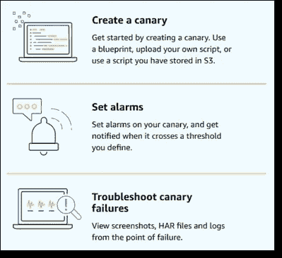
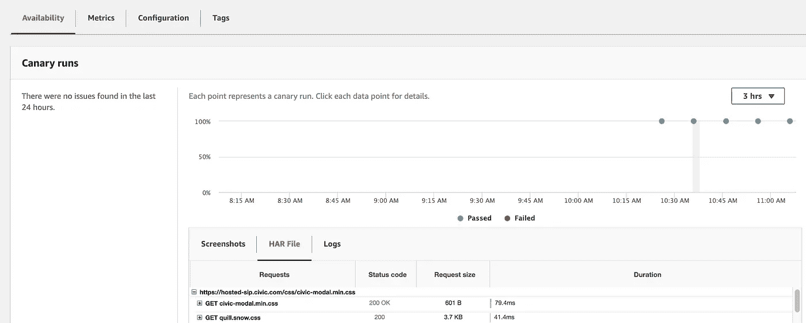

# AWS 的新 cloud watch Synthetic–服务介绍和快速提示

> 原文：<https://betterprogramming.pub/aws-new-cloudwatch-synthetic-service-introduction-and-quick-tips-294e975b7460>

## 开始使用 CloudWatch Synthetic

AWS 前几天刚刚发布了 [CloudWatch 合成](https://docs.aws.amazon.com/AmazonCloudWatch/latest/monitoring/CloudWatch_Synthetics_Canaries.html)服务。

该工具旨在帮助您建立一个监控工具，可以加载网页，截图或发送带有 auth 令牌的 API 调用等。它是整个 CloudWatch 工具集的一部分，因此您可以获得所有关于指标和日志的漂亮的 web UIs。

这项新服务基于谷歌的[木偶师](https://github.com/puppeteer/puppeteer)工具。这很容易设置，详情可以在 [AWS 网站](https://aws.amazon.com/blogs/aws/new-use-cloudwatch-synthetics-to-monitor-sites-api-endpoints-web-workflows-and-more/)上找到。

 [## 使用 Amazon CloudWatch Synthetics 和 AWS X-Ray 进行调试| Amazon Web Services

### 今天，AWS X-Ray 推出了对亚马逊 CloudWatch Synthetics 的支持，使开发人员能够跟踪端到端的请求…

aws.amazon.com](https://aws.amazon.com/blogs/devops/debugging-with-amazon-cloudwatch-synthetics-and-aws-x-ray/) 

根据我的经验，这些天，当我试图为我的一个客户设置它时，我发现这项服务非常容易使用，而且非常强大。以下是我的一些发现:

*   每个测试都被称为“金丝雀”，它只是一个 Node.js (Puppeteer) Lambda 函数脚本。
*   您可以设置“金丝雀”每隔几分钟运行一次，以生成良好的时间序列数据。每一次成功的运行会留下一个蓝点，失败的运行会留下一个红点

*   如果你点击这些点，你可以查看截图，HAR 文件(每个 JS/CSS/assets 文件的性能)，以及 Lambda 脚本当时的日志。
*   您可以设置数据保留天数来保留指标。例如，我将它设置为成功的保留一天，失败的保留七天。
*   它是整个 CloudWatch 服务的一部分，所以很容易配置发送到 SNS 的警报，然后你可以将其发送到[page duty](https://www.pagerduty.com/)或电子邮件订阅。

这是我用来监控客户网站的一个脚本。它模拟了登录过程，并在登录前后截图。

我每 10 分钟运行一次这只金丝雀，这样我们就有了一个很好的方法来衡量他们的网站在一天中的表现。

最后要说的是它的[定价](https://aws.amazon.com/cloudwatch/pricing/)。目前，每只金丝雀的价格是 0.0012 美元。所以，我们设置的金丝雀每月大约要花费 5 美元(0.0012 * 6 * 24 * 30 美元)。不算太差！

我希望这有所帮助。感谢阅读！